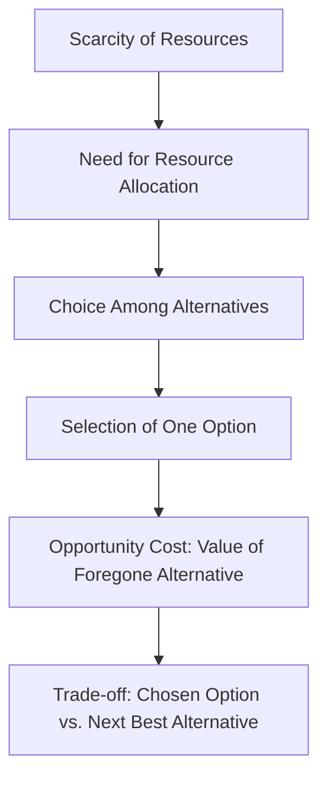

---

title: Opportunity_Cost
course: "Economics"
unit: '1'
semester: "Winter 2026"
mode: ECON-MICRO
type: atomic_note
hub: "[[1_Basics_Of_Economics_Hub]]"
source: "[[5-Pdf Store/note generated/Winter 2026/Economics/Chapter_1.pdf]]"
date: '2026-05-08'
prerequisites:
- "[[Scarcity_And_Choice]]"
source_pages:
- 10
generated: true

---

## 1. Mental Model

In the aviation industry, specifically at a major airline like Emirates, opportunity cost plays a crucial role in decision-making. For instance, when Emirates considers adding a new route to its network, it must weigh the benefits of doing so against the costs of allocating resources, such as aircraft and crew, to that route. Two specific components of opportunity cost in this scenario are: (1) **the alternative routes that could have been added**, which would have generated potentially higher revenues, and (2) **the additional cargo capacity that could have been allocated**, which would have earned extra income from freight operations. By choosing to allocate resources to the new route, Emirates incurs an opportunity cost equal to the foregone benefits of these alternative uses of its resources.

## 2. Micro Theory

The concept of opportunity cost is a fundamental principle in microeconomics, which stems from the study of [[Scarcity_And_Choice]] and the allocation of [[Economic_Resources]]. Given that economics examines the allocation of scarce resources, it inherently involves [[Scarcity]], which necessitates [[Resource_Allocation]] to achieve an [[Efficient_Allocation]]. The efficient allocation of resources implies that choices must be made about how to utilize these limited resources to satisfy Human Wants, which are unlimited.

The process of making choices and allocating resources efficiently leads to the concept of opportunity cost. Opportunity cost can be technically defined as the value of the next best alternative that is foregone as a result of making a decision. This concept arises because the allocation of resources to one particular use implies that those resources cannot be used for another purpose. In other words, when resources are scarce and their allocation is being considered, choosing one option precludes the possibility of choosing another.

The mechanism of opportunity cost is deeply rooted in Economic Analysis, which involves both Positive Economics and Normative Economics. Positive Economics provides a factual analysis of economic phenomena, including how resources are allocated, while Normative Economics deals with what ought to be, involving value judgments about how resources should be allocated. The concept of opportunity cost falls under Positive Economics as it describes an objective consequence of resource allocation decisions.

The foundational ideas of economics, as outlined by Adam Smith and developed through various Branches Of Economics, emphasize the importance of understanding how economies allocate scarce resources to meet Human Wants. This understanding is crucial in both Microeconomics and Macroeconomics, as it underpins the analysis of individual economic units and the economy as a whole, respectively.

The determination of opportunity costs involves both Inductive Reasoning and Deductive Reasoning. Inductive Reasoning is used to observe specific instances of resource allocation and their outcomes, while Deductive Reasoning applies general principles of economics to predict the opportunity costs of different allocation decisions.

In addressing the Basic Economic Questions of what, how, and for whom to produce, economies must consider the opportunity costs of their choices. Different Economic Systems approach these questions differently, but all must contend with the reality of Scarcity and the need for efficient Resource Allocation.

In conclusion, the opportunity cost is a critical concept that emerges from the study of economics, particularly in the context of Scarcity And Choice and the efficient allocation of Economic Resources. It serves

## 3. Limitations & Edge Cases

The concept of opportunity cost is limited in that it assumes rational decision-making and complete knowledge of alternatives, which may not always be the case. Additionally, opportunity cost is only relevant in situations where resources are scarce and have alternative uses, and it may not be applicable in situations where resources are abundant or have no viable alternatives. Furthermore, opportunity cost is often difficult to quantify, particularly when the alternatives are complex or uncertain, and it may not account for intangible or non-monetary factors that influence decision-making. Moreover, the concept of opportunity cost relies on the assumption that the decision-maker can make a choice between mutually exclusive alternatives, which may not always be possible, and it may not be relevant in situations where multiple alternatives can be pursued simultaneously. Overall, while opportunity cost is a useful tool for analyzing trade-offs and making decisions, it has limitations and edge cases that must be considered in its application.

## 4. Market Graph



The provided Mermaid flowchart illustrates the concept of opportunity cost in the context of resource allocation under scarcity. It shows how the scarcity of resources leads to the need for allocation, which in turn requires making choices among alternatives, ultimately resulting in the concept of opportunity cost as the value of the next best alternative that is foregone.

## 5. Walkthrough

## Step 1: Define Scarcity and Resource Allocation

Given that economics examines the allocation of scarce resources, we acknowledge that scarcity necessitates efficient resource allocation. For example, consider the scarcity of wheat in a region. Let's assume there are 100 units of wheat available for allocation.

## Step 2: Identify Human Wants and Unlimited Demand

Human wants are unlimited. For simplicity, let's consider two wants: baking bread and producing pasta. Assume the demand for bread is 60 units and for pasta is 50 units, but there's only 100 units of wheat available.

## Step 3: Determine Efficient Allocation

For an efficient allocation, resources (wheat) must be allocated to satisfy human wants maximally. If 60 units of wheat are used for bread, then 40 units remain for pasta, assuming each unit of wheat can produce one unit of bread or one unit of pasta.

## Step 4: Calculate Opportunity Cost

The opportunity cost of choosing to produce 60 units of bread (using 60 units of wheat) is the 40 units of pasta that could have been produced with the remaining wheat if it weren't used for bread. Thus, the opportunity cost of producing 60 units of bread is 40 units of pasta.

## Step 5: Apply Opportunity Cost Concept

Conversely, if the decision is made to allocate 50 units of wheat to produce pasta, the opportunity cost would be the 50 units of bread that could have been produced. This demonstrates that the allocation of scarce resources (wheat) to one use (pasta) means those resources cannot be used for another (bread), directly illustrating the concept of opportunity cost.

---

## Review & Practice

```interactive-quiz

[
  {
    "type": "mcq",
    "difficulty": "L1",
    "question": "What is the technical definition of opportunity cost in the context of Game Theory Application and microeconomics?",
    "options": {
      "A": "The value of the best alternative that is chosen as a result of making a decision.",
      "B": "The value of the next best alternative that is foregone as a result of making a decision.",
      "C": "The total cost of all alternatives that are foregone as a result of making a decision.",
      "D": "The average value of all possible alternatives that are not chosen."
    },
    "answer": "B",
    "explanation": "The concept of opportunity cost is defined as the value of the next best alternative that is foregone as a result of making a decision. This concept is fundamental in microeconomics and Game Theory Application, as it highlights the trade-offs involved in choosing one option over another due to the scarcity of resources."
  },
  {
    "type": "fill_in",
    "difficulty": "L2",
    "question": "Fill in the blank.",
    "textWithBlanks": "The Blank is the value of the next best alternative that is foregone as a result of making a decision.",
    "answer": [
      "opportunity cost"
    ],
    "explanation": "The concept of opportunity cost can be technically defined as the value of the next best alternative that is foregone as a result of making a decision. This concept arises because the allocation of resources to one particular use implies that those resources cannot be used for another purpose."
  },
  {
    "type": "true_false",
    "difficulty": "L1",
    "question": "The concept of opportunity cost can be technically defined as the value of the next best alternative that is chosen as a result of making a decision.",
    "answer": false,
    "explanation": "The concept of opportunity cost is defined as the value of the next best alternative that is foregone, not chosen, as a result of making a decision. This concept is fundamental in microeconomics and is crucial for understanding the allocation of scarce resources."
  }
]

```