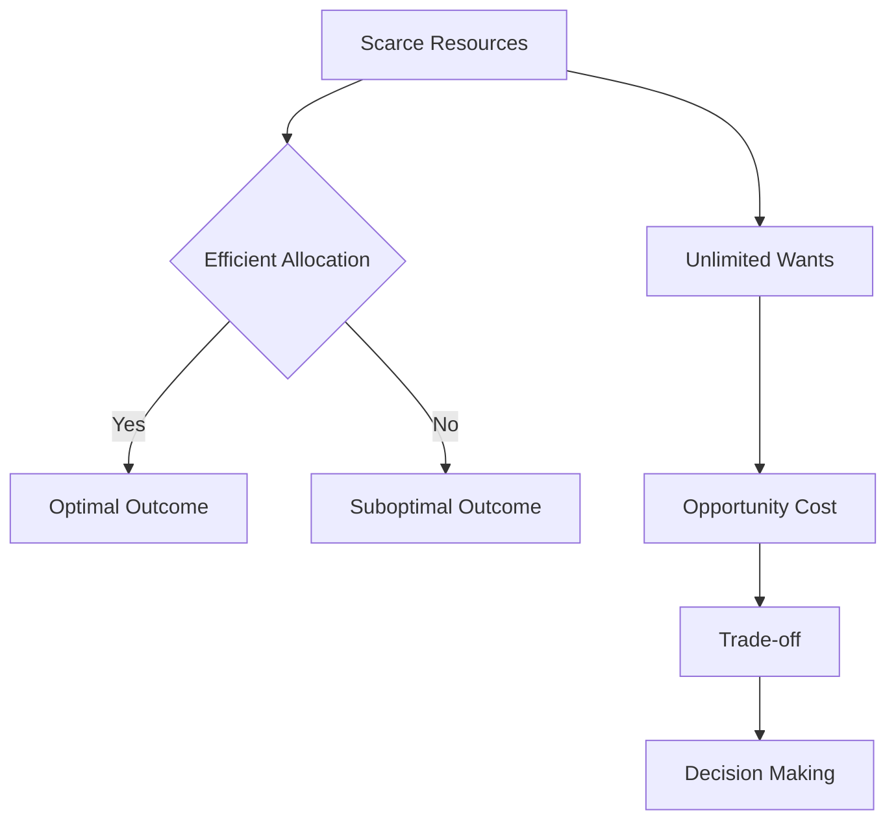

## 1. Mental Model
Imagine you have a big chocolate cake and a yummy ice cream cone in front of you, and you can only choose one. If you choose to eat the ice cream cone, the opportunity cost is the chocolate cake you're giving up. You can't have both, so by picking the ice cream, you're using your "resource" (your stomach's space) for one treat, and that means you can't have the other treat. In economics, this is like allocating scarce resources - you have to make choices, and when you choose one thing, you're giving up the opportunity to have something else. Just like choosing between cake and ice cream, grown-ups have to make similar choices with money and resources, and that's why opportunity cost is important!

## 2. Micro Theory
The concept of Opportunity Cost is a fundamental principle in microeconomics, which stems from the definition of economics as the study of how societies manage their [[Scarce_Resources]] to produce valuable goods and services, given the constraints of [[Unlimited_Wants]]. At its core, economics seeks to understand how [[Decision_Making_Units]], such as consumers and firms, make choices about how to allocate resources in a world where resources are limited, and wants are unlimited.

The [[Definition_Of_Economics]] implies that the study of economics revolves around the efficient allocation of [[Scarce_Resources]] to meet the [[Unlimited_Wants]] of individuals. This involves examining how resources are distributed among various uses to achieve the most valuable outcomes. The notion of [[Scarcity_And_Choice]] is pivotal here, as it underscores the reality that choices must be made due to the scarcity of resources.

The concept of Opportunity Cost emerges as a critical tool in understanding the implications of these choices. Opportunity Cost refers to the value of the next best alternative that is given up when a choice is made. It represents the benefits that could have been realized if a different choice had been made. In essence, whenever resources are allocated to one use, the opportunity cost is the value of the alternative use that is forgone.

The [[Production_Possibilities_Frontier]] (PPF) model illustrates this concept graphically. The PPF shows the various combinations of two goods or services that can be produced given the available resources and technology. Points on the frontier represent efficient allocations of resources, where the opportunity cost of producing more of one good is the amount of the other good that must be given up. Points inside the frontier are inefficient, as resources are not being fully utilized.

The [[Law_Of_Increasing_Opportunity_Cost]] further explains that as more of one good is produced, the opportunity cost of producing additional units of that good increases. This is because resources are being shifted from the production of one good to another, and the resources are not perfectly adaptable to the production of both goods.

In the context of [[Economic_Analysis]], understanding opportunity costs is essential for making informed decisions about resource allocation. It involves evaluating the trade-offs involved in choosing one option over another, which is a critical aspect of both [[Positive_Economics]] and [[Normative_Economics]]. [[Positive_Economics]] focuses on what is, while [[Normative_Economics]] focuses on what ought to be, both rely on the concept of opportunity cost to assess the implications of different economic policies and decisions.

The study of opportunity cost also relates to the [[Branches_Of_Economics]], particularly [[Microeconomics]], which examines the behavior and decision-making of individual economic units. [[Macroeconomics]], on the other hand, looks at the economy as a whole, but the concept of opportunity cost can also be applied at the macroeconomic level to understand the trade-offs involved in different policy choices.

The reasoning processes of [[Inductive_Reasoning]] and [[Deductive_Reasoning]] are both employed in analyzing opportunity costs. Inductive reasoning involves making generalizations from specific observations, while deductive reasoning involves drawing specific conclusions from general principles. Both are useful in understanding how opportunity costs influence economic decisions.

The efficient allocation of resources, taking into account the [[Efficient_Allocation]] of resources, is a key goal of economic systems. [[Economic_Growth]] can be influenced by how well resources are allocated, as it affects the productivity of resources and the overall performance of the economy.

The [[Basic_Economic_Questions]]—[[What_To_Produce]], [[How_To_Produce]], and [[For_Whom_To_Produce]]—are all influenced by the concept of opportunity cost. These questions are answered differently in various [[Economic_Systems]], such as a [[Capitalist_Economy]], and the role of government can impact market outcomes, particularly in cases of [[Market_Failure]].

In conclusion, the concept of Opportunity Cost is integral to understanding economics, as it underlines the fundamental problem of [[Scarcity_And_Choice]] and the need for efficient [[Resource_Allocation]]. It provides a framework for evaluating the trade-offs involved in economic decisions, which is crucial for both [[Decision_Making_Units]] and policymakers.

## 3. Limitations & Edge Cases
The concept of opportunity cost is limited in that it assumes rational decision-making and complete knowledge of alternatives, which may not always be the case. Moreover, opportunity cost analysis is predicated on the idea that resources are scarce and can be allocated efficiently, but it may not account for situations where resources are not fully utilized or where there are indivisible resources that cannot be easily reallocated. Additionally, opportunity cost may not capture the complexity of real-world decisions, where multiple goals and objectives are pursued simultaneously, and where the evaluation of alternatives is subject to uncertainty and ambiguity. Furthermore, the concept of opportunity cost relies on the assumption that choices are reversible, which may not be true in situations where investments are irreversible or where sunk costs are significant, rendering opportunity cost analysis less relevant or reliable in such cases.

## 4. Market Graph


The provided Mermaid flowchart illustrates the concept of Opportunity Cost in the context of microeconomics, highlighting the efficient allocation of scarce resources to meet unlimited wants and the trade-offs involved in decision-making. The flowchart shows how the scarcity of resources leads to the consideration of opportunity cost, which is a crucial factor in making optimal decisions.

## 5. Walkthrough
Here is the 5-step technical walkthrough of how 'Opportunity Cost' operates:

**Step 1: Identify Scarcity and Unlimited Wants**
Economics studies scarce resources and unlimited wants. This implies that there are limited resources available to meet the unlimited wants of individuals.

**Step 2: Recognize the Need for Allocation**
The study of economics involves the allocation of scarce resources to meet unlimited wants. This means that resources must be distributed among various uses to achieve valuable outcomes.

**Step 3: Determine the Goal of Efficient Allocation**
The allocation of resources should be efficient. This means that resources should be used in a way that maximizes the value of the outcomes.

**Step 4: Acknowledge the Reality of Scarcity and Choice**
Due to scarcity, choices must be made about how to allocate resources. This implies that every choice involves giving up something else.

**Step 5: Calculate Opportunity Cost**
When a choice is made, the opportunity cost is the value of the next best alternative that is given up. For example, is not provided in the source, thus no numerical example can be given. However based on the definition we can say that if a society chooses to produce more of one good, the opportunity cost is the production of another good that is given up.

---

## Review & Practice
```interactive-quiz
[
  {
    "type": "mcq",
    "difficulty": "L1",
    "question": "In the context of Game Theory Application and microeconomics, how does the concept of opportunity cost relate to elasticity calculations and the law of demand/supply, particularly when evaluating the impact of a price change on consumer behavior and market equilibrium?",
    "options": {
      "A": "The elasticity of demand is perfectly inelastic if the opportunity cost of consuming a good is zero.",
      "B": "The opportunity cost of consuming a good is reflected in its price; hence, when the price of a good increases, the opportunity cost of consuming it also increases, leading to a decrease in the quantity demanded, assuming the good is normal and the income effect dominates.",
      "C": "The law of demand is an exception to the concept of opportunity cost, as it only applies to inferior goods.",
      "D": "The elasticity of supply is directly proportional to the opportunity cost of producing a good, as higher opportunity costs lead to more elastic supply curves."
    },
    "answer": "B",
    "explanation": "The concept of opportunity cost is deeply intertwined with the principles of microeconomics, including the law of demand and supply, and elasticity calculations. When evaluating the impact of a price change on consumer behavior and market equilibrium, the opportunity cost plays a crucial role. The opportunity cost of consuming a good is essentially the value of the next best alternative that is given up. When the price of a good increases, the opportunity cost of consuming it also increases because consumers must forego more of other goods to purchase it. This increase in opportunity cost leads to a decrease in the quantity demanded, assuming the good is normal and the income effect dominates. This relationship is captured by the law of demand, which states that, ceteris paribus, as the price of a good increases, the quantity demanded decreases. The elasticity of demand measures how responsive the quantity demanded is to a change in price. For normal goods, an increase in price leads to a decrease in quantity demanded, reflecting a higher opportunity cost. Mathematically, this can be represented as $\\frac{\\partial Q}{\\partial P} < 0$ for a normal good, where $Q$ is the quantity demanded and $P$ is the price. Therefore, option B accurately describes the relationship between opportunity cost, elasticity calculations, and the law of demand/supply."
  },
  {
    "type": "fill_in",
    "difficulty": "L2",
    "question": "Fill in the blank.",
    "textWithBlanks": "The [[blank]] is the value of the next best alternative that is given up when a choice is made.",
    "answer": [
      "opportunity cost"
    ],
    "explanation": "The concept of Opportunity Cost emerges as a critical tool in understanding the implications of these choices. Opportunity Cost refers to the value of the next best alternative that is given up when a choice is made. It represents the benefits that could have been realized if a different choice had been made. In essence, whenever resources are allocated to one use, the opportunity cost is the value of the alternative use that is forgone. This can be represented by the equation: $OC = \\max(\\sum_{i=1}^{n} x_i \\cdot p_i)$ where $OC$ is the opportunity cost, $x_i$ is the quantity of the $i^{th}$ alternative, $p_i$ is the price of the $i^{th}$ alternative, and $n$ is the number of alternatives."
  },
  {
    "type": "debug",
    "difficulty": "L2",
    "question": "Find the bug in the calculation of opportunity cost in the following scenario: A farmer has 100 acres of land to allocate between wheat and corn production. The revenue from wheat is $200 per acre and from corn is $150 per acre. If the farmer allocates 60 acres to wheat and 40 acres to corn, what is the opportunity cost of choosing wheat over corn?",
    "content": "The opportunity cost of choosing wheat over corn can be calculated as: 40 acres * ($200 - $150) = $2000. However, this calculation seems incorrect.",
    "answer": "The correct calculation for opportunity cost should consider the revenue forgone from the alternative use of land. The correct formula should be: 40 acres * $150 = $6000, which is the revenue forgone from corn production.",
    "required_keywords": [
      "fix_syntax",
      "opportunity_cost"
    ],
    "explanation": "The opportunity cost of choosing wheat over corn is the revenue forgone from corn production. This can be represented as $\\Delta TC = P_c \\cdot \\Delta Q_c$, where $\\Delta TC$ is the opportunity cost, $P_c$ is the price of corn per acre, and $\\Delta Q_c$ is the change in acres allocated to corn. In LaTeX, the opportunity cost can be expressed as: $OC = 40 \\cdot 150 = 6000$. The initial calculation incorrectly applied the revenue difference instead of the revenue from the forgone alternative."
  },
  {
    "type": "trace",
    "difficulty": "L2",
    "question": "What is the exact output of the impact of a cost increase on the supply curve to equilibrium price and total revenue in a Game Theory Application?",
    "content": "Let's consider a scenario where a firm, SpaceX, is producing launch vehicles for space exploration. The initial supply curve is given by $Q_s = 100 + 2P$, where $Q_s$ is the quantity supplied and $P$ is the price. The demand curve is given by $Q_d = 500 - 3P$. The initial equilibrium price and quantity are found by setting $Q_s = Q_d$, which yields $100 + 2P = 500 - 3P$. Solving for $P$, we get $P = 80$. Substituting $P$ into either the supply or demand curve, we find $Q = 260$. The total revenue is $TR = P \\times Q = 80 \\times 260 = 20800$. Now, suppose the cost of production increases due to higher wages, causing the supply curve to shift leftward to $Q_s = 80 + 2P$. The new equilibrium is found by setting $80 + 2P = 500 - 3P$, which yields $P = 84$. Substituting $P$ into either curve, we find $Q = 248$. The new total revenue is $TR = 84 \\times 248 = 20832$.",
    "answer": "The exact output is: Initial Equilibrium Price = 80, Initial Equilibrium Quantity = 260, Initial Total Revenue = 20800, New Equilibrium Price = 84, New Equilibrium Quantity = 248, New Total Revenue = 20832",
    "explanation": "The impact of a cost increase on the supply curve to equilibrium price and total revenue can be traced using the LaTeX representation of the supply and demand curves: $Q_s = 100 + 2P$ and $Q_d = 500 - 3P$. The initial equilibrium is at $P = 80$ and $Q = 260$, yielding a total revenue of $TR = 80 \\times 260 = 20800$. After the cost increase, the new supply curve becomes $Q_s = 80 + 2P$, leading to a new equilibrium at $P = 84$ and $Q = 248$, with a total revenue of $TR = 84 \\times 248 = 20832$. The change in total revenue can be attributed to the change in equilibrium price and quantity."
  }
]
```