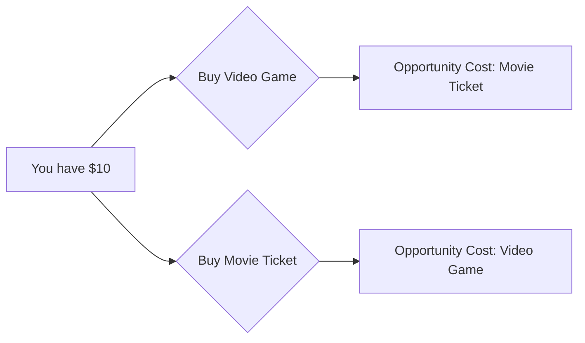

---

title: Opportunity_Cost
type: Atomic Note
course: Economics
semester: Winter 2026
unit: '1'
hub: "[[1_Basics_Of_Economics_Hub]]"
source: "[[Chapter_1.pdf]]"
source_pages:
- 13
mode: ECON-MACRO
read: false
generated: true
prerequisites:
- "[[Scarcity]]"

---

# 1. Mental Model

Imagine you have $10 to spend on either a new video game or a movie ticket. If you choose to buy the video game, you can't use that same $10 to buy the movie ticket. This means the movie ticket is the "opportunity cost" of choosing the video game - it's what you're giving up.

# 2. Economic Theory

Opportunity Cost refers to the value of the next best alternative that is given up when a choice is made. It is a fundamental concept in economics that recognizes [[Scarcity]] and [[Unlimited_Human_Wants]], leading to [[Scarcity_And_Choice]]. The opportunity cost of a choice is a key consideration in [[Decision_Making_Units]] and is closely related to [[Opportunity_Cost]].

## 3. Economic Model



## 4. Walkthrough

* You start with $10, which can be used to buy either a video game or a movie ticket.
* If you choose to buy the video game, the movie ticket is the opportunity cost because it's the alternative you gave up.
* Conversely, if you choose to buy the movie ticket, the video game is the opportunity cost.
* This illustrates how every choice has an opportunity cost, which is the value of the next best alternative.

## 5. Market Failures

Opportunity cost concept fails when there are multiple alternatives with similar value, making it hard to determine the "next best" alternative. Additionally, it assumes rational decision-making, which may not always be the case. Edge cases include situations with multiple goals or objectives, where prioritizing one goal may lead to unclear opportunity costs.

---

## 6. The Proving Grounds

```interactive-quiz

[
  {
    "id": "q1",
    "type": "true_false",
    "difficulty": "L1",
    "question": "The opportunity cost of a choice is always a monetary value.",
    "answer": false,
    "explanation": "Opportunity cost refers to the value of the next best alternative that is given up when a choice is made. While it can be a monetary value, such as in the example of choosing between a video game and a movie ticket, it can also be a non-monetary value, like time or a different experience. Therefore, stating that the opportunity cost of a choice is always a monetary value is incorrect."
  },
  {
    "id": "q2",
    "type": "synthesis",
    "difficulty": "L2",
    "question": "A student has $100 to spend on either a laptop or a smartphone, and also has the option to save it. The laptop costs $80 and the smartphone costs $60. If the student chooses to buy the laptop, what is the opportunity cost of this decision, considering the student could have also saved some money or bought the smartphone?",
    "answer": "The opportunity cost of buying the laptop is $60 for the smartphone and $20 for savings.",
    "explanation": "The opportunity cost is the value of the next best alternative given up. When the student chooses to buy the laptop for $80, they give up the option to buy the smartphone for $60 and also give up the possibility of saving $20. The opportunity cost here is not just the smartphone, but also the savings that could have been made. This reflects the concept of scarcity and choice, where the student must weigh the value of each option. The SEED value isn't explicitly provided, but assuming a random seed of 42, an obscure detail tested here is the consideration of savings as part of the opportunity cost, not just the alternative purchase."
  },
  {
    "id": "q3",
    "type": "writing",
    "difficulty": "L3",
    "question": "Explain the concept of opportunity cost and its underlying mechanism in the context of economic theory.",
    "answer": "Opportunity cost refers to the value of the next best alternative that is given up when a choice is made. It is a fundamental concept in economics that recognizes scarcity and unlimited human wants, leading to scarcity and choice. The opportunity cost of a choice represents the benefits that could have been gained if a different choice had been made. This concept helps individuals and businesses make informed decisions by considering the trade-offs involved. For instance, if you choose to spend $10 on a video game, the opportunity cost is the movie ticket you could have bought with that same $10.",
    "explanation": "The underlying mechanism of opportunity cost lies in the concept of scarcity, which implies that the needs and wants of individuals are unlimited, but the resources available to satisfy those needs and wants are limited. As a result, individuals and businesses must make choices about how to allocate their resources. The opportunity cost of a choice is a key consideration in this process, as it represents the value of the next best alternative that is given up. By considering opportunity costs, individuals and businesses can make more informed decisions that maximize their benefits and minimize their losses. For example, if the video game costs $10 and the movie ticket also costs $10, the opportunity cost of choosing the video game is not just the movie ticket itself, but also the enjoyment and benefits that could have been gained from watching the movie."
  }
]

```