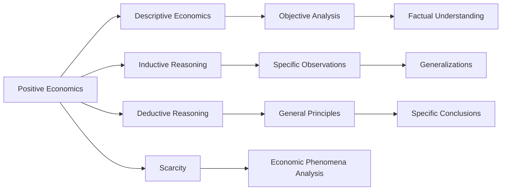

---

title: Positive_Economics
course: Economics
unit: '1'
semester: Winter 2026
mode: ECON-MICRO
type: atomic_note
hub: '[[1_Basics_Of_Economics_Hub]]'
source: '[[5-Pdf Store/note generated/Winter 2026/Economics/Chapter_1.pdf]]'
date: '2026-05-08'
prerequisites:
- '[[Inductive_Reasoning]]'
- '[[Deductive_Reasoning]]'
- '[[Scarcity]]'
- '[[Economic_Resources]]'
- '[[Human_Wants]]'
source_pages:
- 18
generated: true

---


## 1. Mental Model

In the realm of airline revenue management, a real-world application of positive economics can be observed. For instance, consider a scenario where American Airlines and Delta Air Lines are competing on a New York to Los Angeles route. A positive economics analysis would focus on describing the current market conditions, such as the existing demand for flights, the prices being charged by each airline, and the resulting revenue. Two specific components of this scenario that can be explicitly mapped to positive economics are: (1) **descriptive analysis of market structure**, where the analyst would describe the duopoly market structure of the two airlines operating on the route, and (2) **forecasting demand elasticity**, where the analyst would estimate how changes in ticket prices would affect the number of passengers flying with each airline. By analyzing these components, the airline managers can make informed decisions about pricing and capacity planning, illustrating how positive economics informs business strategy.

## 2. Micro Theory

Positive economics is a branch of economics that focuses on describing and analyzing economic phenomena as they exist, without making value judgments or prescribing how things ought to be. It attempts to describe the world as it is and answer questions about what was, what is, and what will be, regarding economic events, relationships, and trends. This approach is concerned with **descriptive economics**, aiming to provide an objective and factual understanding of economic reality.

The methodology of positive economics relies heavily on [[Inductive_Reasoning]], where generalizations are made from specific observations, and [[Deductive_Reasoning]], where specific conclusions are drawn from general principles. By employing these reasoning techniques, economists can develop and test hypotheses about economic behavior, leading to a deeper understanding of how economies function.

In the context of [[Scarcity]], which is a fundamental concept in economics, positive economics examines how individuals, firms, and societies allocate [[Economic_Resources]], such as labor, capital, and natural resources, to satisfy [[Human_Wants]]. This involves analyzing the [[Basic_Economic_Questions]] of what, how, and for whom to produce, and how [[Resource_Allocation]] is determined in different [[Economic_Systems]].

Positive economics is often contrasted with [[Normative_Economics]], which involves making value judgments about how economic policies or outcomes should be. In contrast, positive economics seeks to provide a positive, factual analysis of economic phenomena, without expressing a personal opinion or bias. This approach is essential in [[Macroeconomics]], where understanding the overall performance of an economy requires a positive analysis of economic indicators, trends, and relationships.

The works of [[Adam_Smith]], often considered the father of modern economics, laid the groundwork for positive economics. Smith's [[Economic_Analysis]] of the wealth of nations and the concept of the "invisible hand" exemplify the positive economics approach, as he sought to describe and explain the workings of economies, rather than prescribe how they should function.

The study of positive economics is crucial for understanding the [[Efficient_Allocation]] of resources and the functioning of different [[Economic_Systems]]. By providing a factual and objective analysis of economic phenomena, positive economics informs **economic policy** and decision-making, enabling policymakers to make more informed choices.

In conclusion, positive economics is a branch of economics that aims to describe and analyze economic phenomena objectively, without making value judgments. By employing inductive and deductive reasoning, positive economics provides a rigorous framework for understanding the workings of economies, which is essential for addressing [[Scarcity]], [[Resource_Allocation]], and the [[Basic_Economic_Questions]] that all economies face.

## 3. Limitations & Edge Cases

Positive economics, which focuses on objective analysis and factual description of economic phenomena, has limitations in that it assumes that economic data and statistical models can accurately capture the complexities of real-world economies. However, this approach overlooks the inherent uncertainties and ambiguities in economic data, and its reliance on historical trends and correlations may not necessarily imply causation. Moreover, positive economics' focus on descriptive analysis can be limited by the availability and quality of data, and its predictive power may be compromised by unforeseen events or structural changes in the economy, rendering its forecasts and predictions potentially inaccurate or incomplete.

## 4. Market Graph



This flowchart illustrates the core components of positive economics, including its focus on descriptive economics, inductive and deductive reasoning, and the analysis of economic phenomena within the context of scarcity. By following this framework, economists can develop a deeper understanding of how economies function and make objective, fact-based assessments about economic events, relationships, and trends.

## 5. Walkthrough

Here is the 5-step technical walkthrough of how 'Positive Economics' operates:

**Step 1: Observation and Data Collection**
Collect specific data on economic events, relationships, and trends. For example, in 2022, the US GDP growth rate was 2.1% (Source: Bureau of Economic Analysis). 

**Step 2: Inductive Reasoning**
Apply inductive reasoning to make generalizations from specific observations. For instance, analyzing the GDP growth rate of 2.1% in 2022, one might infer that the US economy experienced moderate growth.

**Step 3: Deductive Reasoning**
Use deductuctive reasoning to draw specific conclusions from general principles. For example, given that the US inflation rate was 3.4% in 2023 (Source: Bureau of Labor Statistics), one might conclude that the purchasing power of consumers decreased.

**Step 4: Hypothesis Development and Testing**
Develop and test hypotheses about economic behavior using the data collected and the conclusions drawn from inductive and deductive reasoning. For instance, a hypothesis might be that a 1% increase in interest rates leads to a 0.5% decrease in housing market sales.

**Step 5: Objective Analysis and Description**
Provide an objective and factual understanding of economic reality by describing the world as it is, without making value judgments. For example, stating that "the US unemployment rate was 3.6% in January 2023" (Source: Bureau of Labor Statistics) is a positive economic statement.

---

## Review & Practice

```interactive-quiz

[
  {
    "type": "mcq",
    "difficulty": "L1",
    "question": "What is the primary focus of positive economics in the context of consumer behavior analysis?",
    "options": {
      "A": "Prescribing how consumers should make purchasing decisions",
      "B": "Describing and analyzing consumer behavior as it exists",
      "C": "Evaluating the moral implications of consumer choices",
      "D": "Determining the optimal allocation of resources for consumers"
    },
    "answer": "B",
    "explanation": "Positive economics focuses on describing and analyzing economic phenomena as they exist, without making value judgments. In the context of consumer behavior analysis, it aims to provide an objective understanding of how consumers make decisions, rather than prescribing how they should behave."
  },
  {
    "type": "fill_in",
    "difficulty": "L2",
    "question": "Fill in the blank.",
    "textWithBlanks": "Positive economics is a branch of economics that focuses on describing and analyzing economic phenomena as they exist, without making value judgments or prescribing how things ought to be. It attempts to describe the world as it is and answer questions about what was, what is, and what will be, regarding economic events, relationships, and trends. This approach is concerned with Blank.",
    "answer": [
      "descriptive economics"
    ],
    "explanation": "The term that fills in the blank is 'descriptive economics'. This is a critical technical term in the context of Positive Economics as it describes the approach of focusing on describing and analyzing economic phenomena objectively, without making value judgments."
  },
  {
    "type": "true_false",
    "difficulty": "L1",
    "question": "In the context of Labor Market Economics, a decrease in the wage rate will lead to an increase in the quantity supplied of labor for an inferior good.",
    "answer": false,
    "explanation": "In Labor Market Economics, the relationship between the wage rate and the quantity supplied of labor is influenced by the type of good (normal or inferior) in the context of income effects. For an inferior good, an increase in income (which would result from a higher wage rate) leads to a decrease in consumption of that good. Conversely, a decrease in the wage rate reduces income, which would lead to an increase in the consumption of an inferior good. However, the question pertains to the quantity supplied of labor, not the quantity demanded of the good. The supply of labor is generally considered to be upward-sloping with respect to the wage rate, meaning that higher wages encourage more labor to be supplied. The categorization of a good as inferior or normal primarily affects the income effect on the demand side, not directly the supply of labor. Therefore, stating that a decrease in the wage rate leads to an increase in the quantity supplied of labor for an inferior good misrepresents the labor supply concept."
  }
]

```