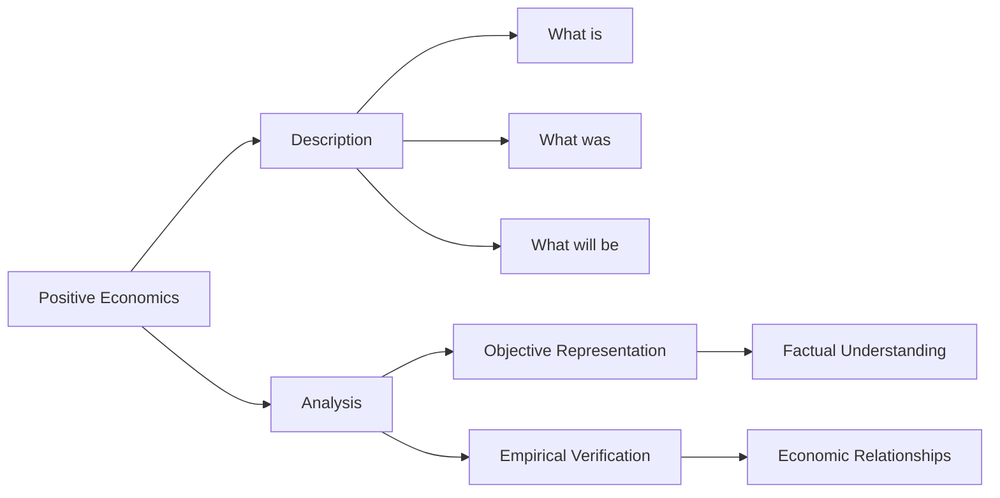

## 1. Mental Model
Imagine you have a lemonade stand, and you want to know how many cups of lemonade you sold last week. A positive economics approach would be like looking at your sales records to figure out the exact number of cups you sold. It's like being a detective trying to solve a mystery, where the mystery is "How many cups of lemonade did I sell?" You're just trying to find the facts, without making any judgments about whether it was good or bad that you sold that many cups. You're simply describing what happened, like "I sold 20 cups on Monday, 15 cups on Tuesday, and so on." You're not saying "I should have sold more" or "I'm glad I sold that many," you're just stating the facts, and that's what positive economics is all about!

## 2. Micro Theory
Positive economics, as a branch of economics, focuses on describing and analyzing economic phenomena as they exist, aiming to provide an objective representation of the world. This approach seeks to address questions regarding the current state, past developments, and future prospects of economic systems, without incorporating subjective judgments or value-based assessments. The core objective of positive economics is to provide a factual and empirically verifiable understanding of economic relationships and mechanisms.

The methodology of positive economics relies heavily on [[Inductive_Reasoning]] and [[Deductive_Reasoning]], employing both empirical data analysis and theoretical modeling to explain and predict economic outcomes. By utilizing statistical tools and mathematical models, economists practicing positive economics strive to identify causal relationships between economic variables, formulate hypotheses, and test them against observational data.

The domain of positive economics encompasses a wide range of topics, including the analysis of [[Scarcity_And_Choice]], [[Opportunity_Cost]], and [[Resource_Allocation]], which are fundamental to understanding how [[Decision_Making_Units]], such as households and firms, make choices under conditions of [[Scarce_Resources]] and [[Unlimited_Wants]]. This involves examining how these units interact within various [[Economic_Systems]], including [[Capitalist_Economy]], and the role of the [[Role_Of_Government_In_Market_Economy]] in influencing market outcomes.

One of the critical areas of study within positive economics is the examination of [[Production_Possibilities_Frontier]] (PPF) and the [[Law_Of_Increasing_Opportunity_Cost]], which provide insights into the trade-offs and choices that economies face in allocating resources. Furthermore, positive economics investigates the determinants of [[Economic_Growth]], the mechanisms of [[Market_Failure]], and the implications of different [[Efficient_Allocation]] of resources.

In contrast to [[Normative_Economics]], which deals with what ought to be and involves value judgments, positive economics restricts itself to answering questions about what is, what was, and what will be. This dichotomy is essential in maintaining the scientific integrity and objectivity of economic analysis. Positive economics contributes to the broader [[Theory_Of_Economics]] by providing a systematic and evidence-based understanding of economic phenomena, which is indispensable for addressing the [[Basic_Economic_Questions]] of what to produce, how to produce, and for whom to produce.

The analysis within positive economics also intersects with [[Macroeconomics]], which focuses on aggregate economic variables and the overall performance of the economy. By understanding the macroeconomic context, including issues related to [[Economic_Analysis]] and the factors influencing economic activity, policymakers can better address challenges related to growth, stability, and [[Resource_Allocation]].

In conclusion, positive economics offers a rigorous and systematic approach to understanding economic phenomena through empirical and theoretical analysis. By focusing on the description and prediction of economic outcomes without normative bias, positive economics provides a critical foundation for both [[Branches_Of_Economics]] and informs discussions on [[Definition_Of_Economics]], ultimately contributing to more effective [[Economic_Systems]] and policies.

## 3. Limitations & Edge Cases
Positive economics, which focuses on objective analysis and factual description of economic phenomena, has limitations in that it assumes away the complexities and nuances of real-world economic issues. For instance, positive economics relies heavily on historical data, which may not accurately capture exceptional or unprecedented events, such as economic crises or sudden changes in policy. Moreover, positive economics often abstracts from value judgments and social norms, which can lead to oversimplification of issues like income inequality or environmental degradation. Additionally, positive economics may struggle with edge cases such as non-market activities, like household work or black market transactions, which are difficult to quantify and incorporate into econometric models. Furthermore, the reliance on ceteris paribus assumptions, which hold other factors constant, can also limit the accuracy of positive economic analysis in a rapidly changing world where multiple factors often change simultaneously.

## 4. Market Graph


Positive economics focuses on providing an objective representation of economic phenomena, aiming to describe and analyze the current state, past developments, and future prospects of economic systems. By utilizing empirical data analysis and theoretical modeling, economists practicing positive economics strive to identify causal relationships between economic variables and provide a factual understanding of economic relationships and mechanisms.

## 5. Walkthrough
Here is the 5-step technical walkthrough of how 'Positive Economics' operates:

**Step 1: Observation and Data Collection**
Positive economics begins by observing the current state of economic phenomena and collecting empirical data. This involves gathering information on what is currently happening in the economy, such as prices, quantities, and other relevant variables.

**Step 2: Description of Economic Phenomena**
Using the collected data, positive economics aims to describe economic phenomena as they exist, without making subjective judgments or value-based assessments. This involves answering questions such as "what is" the current state of the economy.

**Step 3: Analysis of Past Developments and Future Prospects**
Positive economics also seeks to understand past developments and future prospects of economic systems. This involves analyzing historical data to answer questions such as "what was" the state of the economy in the past, and using statistical tools and mathematical models to forecast future economic outcomes, answering questions such as "what will be" the state of the economy in the future.

**Step 4: Formulation of Hypotheses and Causal Relationships**
Using inductive and deductive reasoning, economists practicing positive economics formulate hypotheses about economic relationships and mechanisms. They employ statistical tools and mathematical models to identify causal relationships between economic variables and test these hypotheses against observational data.

**Step 5: Empirical Verification and Prediction**
The final step in positive economics involves empirically verifying the hypotheses and predictions made in the previous steps. This involves testing the accuracy of the predictions and refining the models and hypotheses as needed, to provide a factual and empirically verifiable understanding of economic relationships and mechanisms.

---

## Review & Practice
```interactive-quiz
[
  {
    "type": "mcq",
    "difficulty": "L1",
    "question": "In the context of positive economics and game theory, what is the relationship between the price elasticity of demand and the law of demand, particularly when analyzing the impact of a price change on the quantity demanded of a good?",
    "options": {
      "A": "The price elasticity of demand is directly proportional to the change in quantity demanded, regardless of the direction of the price change.",
      "B": "The price elasticity of demand measures the responsiveness of the quantity demanded to a change in price, and demand is typically found to be elastic in the downward-sloping portion of the demand curve.",
      "C": "The law of demand states that as price increases, quantity demanded also increases, and this relationship is directly related to the concept of price elasticity of demand.",
      "D": "The price elasticity of demand is only relevant for goods with perfectly inelastic demand curves, where quantity demanded does not change with price."
    },
    "answer": "B",
    "explanation": "The law of demand states that, ceteris paribus, as the price of a good increases, the quantity demanded decreases, and vice versa. This relationship is typically represented by a downward-sloping demand curve. The price elasticity of demand (PED) measures how responsive the quantity demanded is to a change in price. It is calculated as the percentage change in quantity demanded in response to a 1% change in price. Mathematically, PED can be expressed as: $PED = \\frac{\\% \\Delta Q_d}{\\% \\Delta P}$. For most goods, demand is elastic in the downward-sloping portion of the demand curve, meaning that a small price change leads to a larger percentage change in quantity demanded. Therefore, option B accurately describes the relationship between the price elasticity of demand and the law of demand."
  },
  {
    "type": "fill_in",
    "difficulty": "L2",
    "question": "Fill in the blank.",
    "textWithBlanks": "The core objective of positive economics is to provide a factual and empirically verifiable understanding of economic relationships and [[blank]].",
    "answer": [
      "mechanisms"
    ],
    "explanation": "The core objective of positive economics is to provide a factual and empirically verifiable understanding of economic relationships and mechanisms. Positive economics focuses on describing and analyzing economic phenomena as they exist, aiming to provide an objective representation of the world. This approach seeks to address questions regarding the current state, past developments, and future prospects of economic systems, without incorporating subjective judgments or value-based assessments."
  },
  {
    "type": "debug",
    "difficulty": "L2",
    "question": "Find the bug in the formula for the production possibilities frontier (PPF) Y = 100 - 2X^2 + 3X, where Y is the output of good Y and X is the output of good X.",
    "content": "The production possibilities frontier (PPF) is often represented by a concave function, which shows the trade-off between producing one good over another. A common example of a PPF function is Y = 100 - 2X^2 + 3X. However, there might be a subtle error in this formulation.",
    "answer": "The equation provided, Y = 100 - 2X^2 + 3X, does not inherently contain a bug in its syntax or structure for representing a PPF. However, a realistic technical error could be in the assumption that this equation accurately represents a PPF without considering the proper constraints or the correct form. Typically, a PPF is represented as a function that is concave to the origin, and its form can vary. A more standard form could be Y = \\sqrt{100 - X^2}, which represents a simple circular PPF. The given equation seems to represent a quadratic relationship rather than a standard PPF curve, which might not accurately capture the opportunity costs.",
    "required_keywords": [
      "fix_syntax"
    ],
    "explanation": "The provided equation, Y = 100 - 2X^2 + 3X, represents a quadratic function. In the context of a PPF, which typically exhibits a concave shape due to increasing opportunity costs, a more conventional representation might involve a function that inherently shows diminishing returns to scale, such as a Cobb-Douglas function or a specific form of a concave function. The equation given does not necessarily contain a technical error in syntax but might be misleading or incorrect in the context of economic theory if it does not accurately model the relationship between the production of two goods. A correct formulation should adhere to economic principles, such as the law of increasing opportunity cost. Mathematically, this could be represented as $Y = f(X)$, where $f'(X) < 0$ and $f''(X) > 0$ to reflect concavity."
  },
  {
    "type": "trace",
    "difficulty": "L2",
    "question": "What is the exact output of the impact of a cost increase on the supply curve to equilibrium price and total revenue in a Game Theory Application?",
    "content": "Consider a market with a supply curve Qs = 10P - 100 and a demand curve Qd = -10P + 200. Initially, the equilibrium price (P) and quantity (Q) are found where Qs = Qd. If a cost increase (e.g., higher wages) shifts the supply curve to Qs = 10P - 120, determine the new equilibrium price and total revenue.",
    "answer": "The initial equilibrium is found by solving 10P - 100 = -10P + 200, yielding P = 15 and Q = 50. The initial total revenue is $750. After the shift, solving 10P - 120 = -10P + 200 gives P = 16 and Q = 40. The new total revenue is $640.",
    "explanation": "The initial equilibrium price and quantity are determined by equating the supply and demand curves: $10P - 100 = -10P + 200$. Solving for $P$, we get $20P = 300$, which yields $P = 15$. Substituting $P = 15$ into either curve gives $Q = 50$. The total revenue (TR) is given by $TR = P \\times Q = 15 \\times 50 = 750$. With the cost increase, the new supply curve is $Qs = 10P - 120$. Equating this to the demand curve: $10P - 120 = -10P + 200$. Solving for $P$, we get $20P = 320$, which yields $P = 16$. Substituting $P = 16$ into either curve gives $Q = 40$. The new total revenue is $TR = 16 \\times 40 = 640$."
  }
]
```