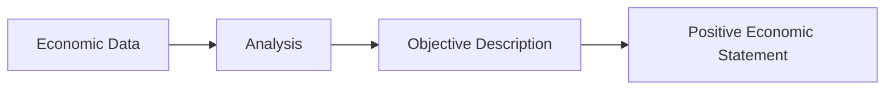

---

title: Positive_Economics
type: Atomic Note
course: Economics
semester: Winter 2026
unit: '1'
hub: '[[1_Basics_Of_Economics_Hub]]'
source: '[[5-Pdf Store/note generated/Winter 2026/Economics/Chapter_1.pdf]]'
source_pages:
- 18
mode: ECON-MACRO
read: false
generated: true
prerequisites:
- '[[Inductive_Reasoning]]'
- '[[Deductive_Reasoning]]'
- '[[Definition_Of_Economics]]'
- '[[Macroeconomics]]'

---


# 1. Mental Model

Imagine you're a weather reporter. You just state the facts about the weather, like "it's raining today" or "it's going to be sunny tomorrow." You don't say if the rain is good or bad, you just report what is happening. That's similar to positive economics, where economists describe how the economy works without making value judgments.

# 2. Economic Theory

Positive economics [[Positive_Economics]] is a branch of economics that focuses on describing and analyzing economic phenomena as they are, without making value judgments. It aims to answer questions about the economy using [[Inductive_Reasoning]] and [[Deductive_Reasoning]], and provides factual information about what is, what was, and what will be in the economy, relating to [[Definition_Of_Economics]] and [[Macroeconomics]]. This approach is based on objective analysis and empirical evidence.

## 3. Economic Model



## 4. Walkthrough

* The process starts with collecting **Economic Data**, such as GDP, inflation rate, or unemployment rate.
* The data is then subject to **Analysis**, where economists use statistical methods to understand the data.
* The analysis leads to an **Objective Description** of the economic phenomenon, without any value judgment.
* Finally, the objective description results in a **Positive Economic Statement**, such as "the GDP growth rate is 2% this year."

## 5. Market Failures

Positive economics can fail when economists' own biases influence their analysis, or when data is incomplete or inaccurate. Additionally, positive economics may not account for normative aspects, such as the distributional effects of economic policies. Edge cases to watch out for include ensuring that the data is reliable and that the analysis is free from personal opinions.

---

## 6. The Proving Grounds

```interactive-quiz

[
  {
    "id": "q1",
    "type": "true_false",
    "difficulty": "L1",
    "question": "Positive economics involves making value judgments about economic phenomena.",
    "answer": false,
    "explanation": "Positive economics is a branch of economics that focuses on describing and analyzing economic phenomena as they are, without making value judgments. It aims to provide factual and objective analysis of economic activities, similar to a weather reporter stating facts about the weather without evaluating if the weather is good or bad. Therefore, the statement that positive economics involves making value judgments is incorrect."
  },
  {
    "id": "q2",
    "type": "synthesis",
    "difficulty": "L2",
    "question": "The government of a small island nation is considering implementing a tax on imported goods to protect its domestic fishing industry. As a positive economist, you have been tasked with analyzing the potential effects of this tax on the island nation's economy. Using your knowledge of positive economics, describe how the tax would affect the economy, including the potential impact on domestic fishing industry production, employment, and consumer prices, without making any value judgments about the tax.",
    "answer": "The implementation of a tax on imported goods would lead to an increase in the price of imported goods, making domestic fishing industry products relatively more competitive in the market. This could result in an increase in domestic fishing industry production and employment. However, consumers may face higher prices for imported goods, which could lead to a decrease in their purchasing power. The tax could also lead to retaliatory measures from other countries, potentially affecting the island nation's exports. The actual effects would depend on various factors, including the elasticity of demand and supply, and the responses of domestic and foreign producers.",
    "explanation": "This question requires the application of positive economics concepts to analyze the potential effects of a tax on imported goods. A positive economist would focus on describing how the tax would affect the economy, without making value judgments about the tax. This involves analyzing the potential impact on domestic fishing industry production, employment, and consumer prices, as well as the potential responses of domestic and foreign producers. The explanation demonstrates an understanding of the positive economics approach, which involves describing economic phenomena as they are, without making value judgments."
  },
  {
    "id": "q3",
    "type": "writing",
    "difficulty": "L3",
    "question": "Explain the role of objectivity in positive economics and how it relates to making value-free statements about economic phenomena.",
    "answer": "In positive economics, objectivity plays a crucial role as it involves describing and analyzing economic phenomena without making value judgments, thereby providing factual and unbiased information about the economy.",
    "explanation": "The underlying mechanism of positive economics relies on the ability of economists to separate facts from opinions, ensuring that their statements about the economy are based on empirical evidence and observation, much like a weather reporter stating that \"it's raining\" without implying if the rain is good or bad, thus maintaining the integrity and reliability of economic analysis."
  }
]

```