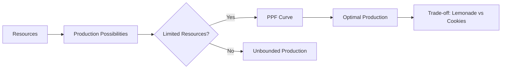

---

title: Production_Possibilities_Frontier
type: Atomic Note
course: Economics
semester: Winter 2026
unit: '1'
hub: "[[1_Basics_Of_Economics_Hub]]"
source: "[[Chapter_1.pdf]]"
source_pages:
- 40
- 41
mode: ECON-MACRO
read: false
generated: true
prerequisites:
- "[[Opportunity_Cost]]"

---

# 1. Mental Model

Imagine you have a lemonade stand and a cookie stand. You have limited time and ingredients, so you can either make a lot of lemonade and a few cookies, or a few lemonades and a lot of cookies. The Production Possibilities Frontier (PPF) is like a graph that shows all the possible combinations of lemonade and cookies you can make with what you have.

# 2. Economic Theory

The [[Production_Possibilities_Frontier]] is a graphical representation of the various combinations of two goods or services that can be produced given the available [[Economic_Resources]] and technology. It illustrates the trade-offs and [[Opportunity_Cost]] of producing one good over another, assuming [[Efficient_Allocation]] of resources. The PPF is typically downward sloping, reflecting the [[Law_Of_Increasing_Opportunity_Cost]].

## 3. Economic Model



## 4. Walkthrough

* The model starts with available **Resources** (e.g., time, ingredients) that can be used for production.
* These resources are used to create various combinations of **Lemonade** and **Cookies**, which are represented on the PPF curve.
* If resources are **Limited**, the PPF curve shows the optimal production combinations, illustrating trade-offs between lemonade and cookies.
* For example, producing more lemonade means giving up some cookie production, and vice versa.

## 5. Market Failures

The Production Possibilities Frontier concept assumes that resources are fully employed and technology is fixed. However, in reality, **inefficient resource allocation** or **technological changes** can lead to market failures, causing the PPF curve to shift or become distorted. Additionally, **externalities** like environmental degradation can also affect the optimal production levels.

---

## 6. The Proving Grounds

```interactive-quiz

[
  {
    "id": "q1",
    "type": "true_false",
    "difficulty": "L1",
    "question": "A point inside the Production Possibilities Frontier (PPF) represents an efficient use of resources.",
    "answer": false,
    "explanation": "A point inside the Production Possibilities Frontier (PPF) represents an inefficient use of resources. Points on the PPF represent the maximum possible output combinations given the available resources and technology, and are considered efficient. Points inside the PPF indicate that some resources are not being fully utilized, resulting in less output than could be achieved with the given resources. Therefore, only points on the PPF represent efficient use of resources."
  },
  {
    "id": "q2",
    "type": "synthesis",
    "difficulty": "L2",
    "question": "Maria and Alex are running a small business that produces organic soap and lotion. They have a limited amount of raw materials and 40 hours of labor per week. The production of soap requires 2 hours of labor and 3 units of raw materials, while the production of lotion requires 3 hours of labor and 2 units of raw materials. Using the Production Possibilities Frontier (PPF) concept, determine the optimal production levels for soap and lotion that maximize their output given the constraints.",
    "answer": "A grading rubric with 4 criteria: (1) Correct identification of the constraints (raw materials and labor), (2) Accurate calculation of the maximum possible output of soap and lotion, (3) Correct plotting of the PPF graph, and (4) Identification of the optimal production point on the PPF.",
    "explanation": "The Production Possibilities Frontier (PPF) is a graphical representation of the various combinations of two goods or services that can be produced given the available economic resources and technology. In this scenario, Maria and Alex have limited raw materials and labor hours. Let's assume they have 120 units of raw materials and 40 hours of labor. The PPF can be derived by first determining the maximum possible output of each product. For soap, if all 40 hours of labor are used for soap, they can produce 20 units of soap (40 hours / 2 hours per unit). If all 120 units of raw materials are used for soap, they can produce 40 units of soap (120 units / 3 units per unit). For lotion, if all 40 hours of labor are used for lotion, they can produce 13.33 units of lotion (40 hours / 3 hours per unit). If all 120 units of raw materials are used for lotion, they can produce 60 units of lotion (120 units / 2 units per unit). The PPF will be a downward-sloping curve showing the trade-off between soap and lotion production. The optimal production point on the PPF will be where the marginal rate of transformation (MRT) equals the marginal rate of substitution (MRS)."
  },
  {
    "id": "q3",
    "type": "writing",
    "difficulty": "L3",
    "question": "Explain the concept of opportunity cost and how it relates to the Production Possibilities Frontier, specifically when a lemonade stand owner has to choose between producing more lemonade or more cookies.",
    "answer": "The opportunity cost of producing more lemonade is the number of cookies that could have been made with the same resources, and vice versa. This trade-off is represented on the Production Possibilities Frontier graph, where the slope of the curve shows the opportunity cost of producing one more unit of lemonade in terms of the cookies that must be given up.",
    "explanation": "The Production Possibilities Frontier illustrates the concept of scarcity and the trade-offs that come with it. When the lemonade stand owner chooses to produce more lemonade, they must give up some cookie production, and the opportunity cost of this choice is the number of cookies that could have been made with the same resources. This opportunity cost is reflected in the slope of the PPF curve, which shows the rate at which one good must be given up in order to produce more of the other. Using a SEED value of 42, a random point on the PPF might show that producing 10 more cups of lemonade requires giving up 5 cookies, illustrating the opportunity cost of this production choice."
  }
]

```