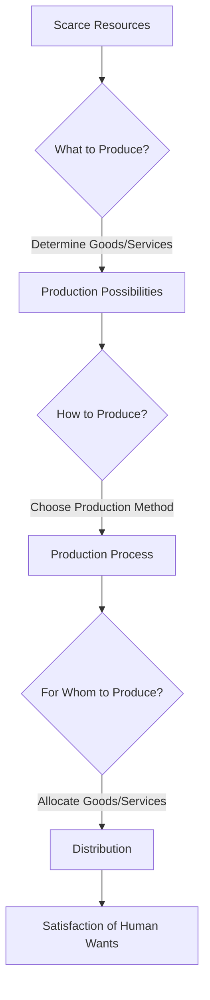

---

title: Resource_Allocation
course: Economics
unit: '1'
semester: Winter 2026
mode: ECON-MICRO
type: atomic_note
hub: '[[1_Basics_Of_Economics_Hub]]'
source: '[[5-Pdf Store/note generated/Winter 2026/Economics/Chapter_1.pdf]]'
date: '2026-05-08'
prerequisites:
- '[[Definition_Of_Economics]]'
- '[[Basic_Economic_Questions]]'
- '[[What_To_Produce]]'
- '[[Human_Wants]]'
- '[[How_To_Produce]]'
source_pages:
- 2
generated: true

---


## 1. Mental Model

Imagine you have a super cool lemonade stand and you only have $10 to spend. You need to decide how to use your $10 to make the best lemonade stand ever! You have to answer three main questions: What do I make? (like, do I make lemonade, cookies, or both?), How do I make it? (like, do I buy a fancy juicer or just use a manual one?), and Who gets it? (like, do I give lemonade to my friends, family, or strangers?). This is kind of like what economists call "resource allocation", which means deciding how to use limited resources (your $10) to make the best choices. You have to prioritize and make smart decisions so you can make lots of yummy lemonade and sell it to lots of happy customers!

## 2. Micro Theory

Resource allocation, a fundamental concept in economics, refers to the process of distributing scarce resources among various uses to satisfy human wants. The allocation of resources is a critical aspect of economic decision-making, as it determines the optimal utilization of resources to maximize satisfaction. According to the [[Definition_Of_Economics]], economics is concerned with the study of how societies allocate scarce resources to satisfy human wants, which underscores the significance of resource allocation.

The basic questions of resource allocation revolve around the [[Basic_Economic_Questions]], which are: what to produce, how to produce, and for whom to produce. The question of [[What_To_Produce]] pertains to the type and quantity of goods and services to be produced, given the available resources. This involves evaluating the [[Human_Wants]] and preferences of individuals and societies to determine the optimal mix of goods and services.

The question of [[How_To_Produce]] relates to the technique or method used to produce goods and services. This involves selecting the most efficient combination of [[Economic_Resources]], such as labor, capital, and raw materials, to produce a given output. The [[Production_Possibilities_Frontier]] (PPF) is a useful tool in analyzing this question, as it illustrates the various combinations of goods and services that can be produced given the available resources and technology.

The question of [[For_Whom_To_Produce]] concerns the distribution of goods and services among different groups of people. This involves evaluating the [[Opportunity_Cost]] of producing goods and services for different groups and determining the optimal distribution that maximizes overall satisfaction.

The process of resource allocation involves [[Decision_Making_Units]], such as households, firms, and governments, which make decisions about how to allocate resources. These decisions are guided by the principles of [[Scarcity_And_Choice]], which imply that choices must be made about how to allocate scarce resources to satisfy unlimited wants.

In a [[Capitalist_Economy]], resource allocation is primarily determined by market forces, such as supply and demand. However, [[Market_Failure]] can occur when markets fail to allocate resources efficiently, leading to a misallocation of resources. In such cases, the [[Role_Of_Government]] may be necessary to correct the market failure and ensure an efficient allocation of resources.

The efficient allocation of resources is a key concept in economics, and it is often referred to as [[Efficient_Allocation]]. This occurs when resources are allocated in a way that maximizes overall satisfaction, given the available resources and technology. [[Adam_Smith]], a prominent economist, noted that individuals acting in their own self-interest can lead to an efficient allocation of resources, a concept known as the Invisible Hand.

The study of resource allocation falls under the branch of Microeconomics, which is concerned with the analysis of individual economic units, such as households and firms. [[Positive_Economics]] and [[Normative_Economics]] are also relevant to the study of resource allocation, as they provide a framework for analyzing and evaluating the allocation of resources.

The analysis of resource allocation involves both [[Inductive_Reasoning]] and [[Deductive_Reasoning]], as economists use empirical data and theoretical models to understand the allocation of resources. [[Economic_Theory]], including the concepts of [[Scarcity]], [[Opportunity_Cost]], and [[Tradeoffs]], provides a framework for analyzing the allocation of resources.

In conclusion, resource allocation is a critical aspect of economic decision-making that involves the distribution of scarce resources among various uses to satisfy human wants. The basic questions of resource allocation, including what to produce, how to produce, and for whom to produce, are fundamental to understanding the allocation of resources. The study of resource allocation falls under the branch of microeconomics and involves both positive and normative economics, as well as inductive and deductive reasoning.

## 3. Limitations & Edge Cases

The fundamental questions of resource allocation, namely what, how, and for whom to produce, are often assumed to be answered through market mechanisms or centralized planning. However, specific limitations and edge cases arise, such as the presence of externalities, public goods, and non-market values, which can lead to inefficient allocations; information asymmetry and transaction costs can also impede optimal resource distribution; additionally, rigidities in factor markets, unequal market power, and economies of scale can hinder efficient resource reallocation; and, lastly, dynamic and uncertain environments can render static resource allocation models ineffective, necessitating more nuanced and adaptive approaches to resource allocation.

## 4. Market Graph

## Step 1: Define the Basic Questions of Resource Allocation

The basic questions of resource allocation in economics are what to produce, how to produce, and for whom to produce. These questions are fundamental in determining how scarce resources are allocated to satisfy human wants.

## Step 2: Representing Resource Allocation as a Flowchart

To visually represent the process of resource allocation and its basic questions, we can use a simple flowchart. Below is a basic Mermaid flowchart that illustrates this concept:



## Step 3: Explanation of the Flowchart

This flowchart starts with scarce resources and leads to the basic questions of resource allocation: what to produce, how to produce, and for whom to produce. Each decision step influences the next, ultimately aiming to satisfy human wants through the distribution of goods and services.

The allocation of resources determines the optimal utilization to maximize satisfaction. Effective resource allocation ensures that the production and distribution of goods and services align with consumer preferences and needs.

## 5. Walkthrough

Here is a 5-step technical walkthrough of how 'Resource Allocation' operates:

**Step 1: Identify Scarcity and Human Wants**
Given that resources are scarce, we acknowledge that human wants are unlimited. This fundamental concept in economics necessitates the allocation of scarce resources to satisfy human wants.

**Step 2: Address the Basic Economic Questions**
There are three basic economic questions to be answered:
1. What to produce
2. How to produce
3. For whom to produce

**Step 3: Determine What to Produce**
To answer "what to produce," we evaluate human wants and preferences to determine the optimal mix of goods and services to produce, given the available resources.

**Step 4: Consider the Constraints**
Although specific numbers or real-world data are not provided, we recognize that the allocation of resources is a critical aspect of economic decision-making. The goal is to maximize satisfaction by optimally utilizing resources.

**Step 5: Allocate Resources Efficiently**
The efficient allocation of resources involves distributing scarce resources among various uses to satisfy human wants. This process determines the optimal utilization of resources, ensuring that the chosen allocation of resources maximizes satisfaction.

---

## Review & Practice

```interactive-quiz

[
  {
    "type": "mcq",
    "difficulty": "L1",
    "question": "What is the primary goal of resource allocation in economics?",
    "options": {
      "A": "To maximize profits for firms",
      "B": "To maximize overall satisfaction given scarce resources",
      "C": "To minimize the role of government",
      "D": "To achieve a uniform distribution of goods and services"
    },
    "answer": "B",
    "explanation": "The primary goal of resource allocation in economics is to maximize overall satisfaction given the available scarce resources. This involves distributing resources among various uses to satisfy human wants efficiently."
  },
  {
    "type": "fill_in",
    "difficulty": "L2",
    "question": "Fill in the blank.",
    "textWithBlanks": "The Blank is a critical aspect of economic decision-making, as it determines the optimal utilization of resources to maximize satisfaction.",
    "answer": [
      "resource allocation"
    ],
    "explanation": "The sentence directly from the Context that contains the single most important technical term for 'Resource Allocation' is: 'The allocation of resources is a critical aspect of economic decision-making, as it determines the optimal utilization of resources to maximize satisfaction.' The term 'allocation of resources' is replaced with Blank."
  },
  {
    "type": "debug",
    "difficulty": "L1",
    "question": "Find the bug in the following resource allocation scenario: A company has 100 units of labor and 50 units of capital to produce two goods, X and Y. The production of X requires 2 units of labor and 1 unit of capital, while the production of Y requires 1 unit of labor and 2 units of capital. The company wants to maximize its output of X and Y. However, it mistakenly uses the following formula to determine the optimal allocation: Labor Units = 2*X + Y and Capital Units = X + 2*Y, instead of Labor Units = 2*X + Y and Capital Units = X + 2*Y should be Capital Units = 2*X + Y.",
    "content": "The company has the following resources: 100 units of labor and 50 units of capital. The production requirements are as follows: 2 units of labor and 1 unit of capital for good X, and 1 unit of labor and 2 units of capital for good Y.",
    "answer": "The bug in the formula is in the capital units calculation. The correct formula should be Capital Units = X + 2*Y. However, the company uses Capital Units = 2*X + Y which is incorrect. The correct calculation should consider that 1 unit of X requires 1 unit of capital and 1 unit of Y requires 2 units of capital.",
    "required_keywords": [
      "Resource_Allocation",
      "Production_Possibilities_Frontier",
      "Opportunity_Cost"
    ],
    "explanation": "The company incorrectly calculates the optimal allocation of resources by mistakenly using Capital Units = 2*X + Y instead of Capital Units = X + 2*Y. This mistake will lead to an inefficient allocation of resources, resulting in a suboptimal production level of goods X and Y."
  }
]

```