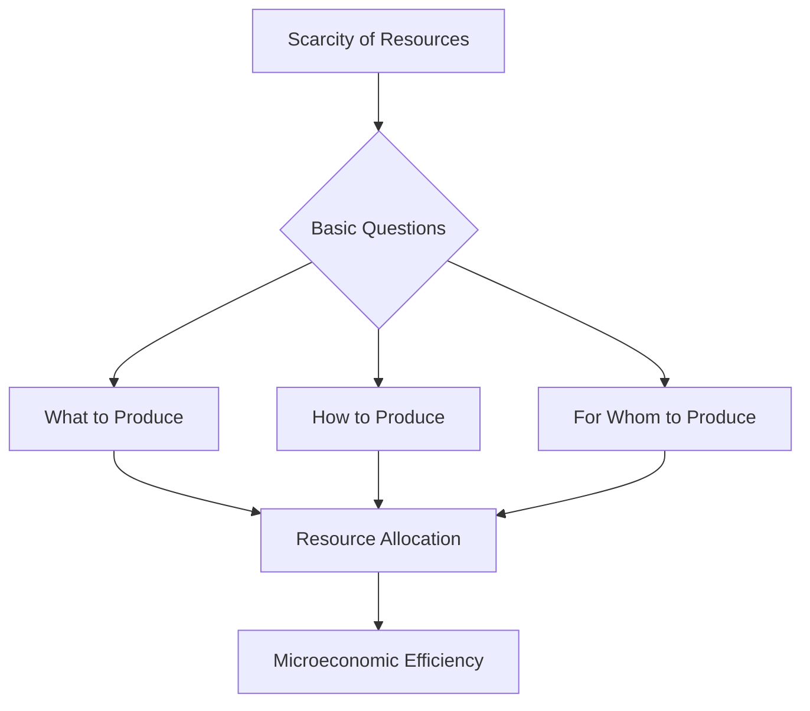

---

title: Resource_Allocation
course: Economics
unit: '1'
semester: Winter 2026
mode: ECON-MICRO
type: atomic_note
hub: '[[1_Basics_Of_Economics_Hub]]'
source: '[[5-Pdf Store/note generated/Winter 2026/Economics/Chapter_1.pdf]]'
date: '2026-05-08'
prerequisites:
- '[[Opportunity_Cost]]'
- '[[Economic_Resources]]'
- '[[Basic_Economic_Questions]]'
- '[[Scarcity]]'
- '[[Human_Wants]]'
source_pages:
- 2
generated: true

---


## 1. Mental Model

In the midst of optimizing production, a manufacturing plant like Airbus must address resource allocation to meet its commercial aircraft demands. For instance, when allocating resources to produce the A350 XWB, Airbus needs to determine how to distribute its resources - such as specialized labor, advanced machinery, and composite materials - to efficiently produce the aircraft's various components, like the fuselage and wings. Two specific components of resource allocation at play here are: (1) [[Opportunity_Cost]], which arises when choosing to allocate resources to produce one component, say the fuselage, means forgoing the production of another, such

## 2. Micro Theory

Resource allocation, a fundamental concept in economics, refers to the process of assigning and distributing [[Economic_Resources]], such as labor, capital, and raw materials, to various uses in an economy. This process is crucial in addressing the [[Basic_Economic_Questions]] of what, how, and for whom to produce, which arise due to the inherent [[Scarcity]] of resources. The essence of resource allocation lies in its ability to facilitate the efficient distribution of resources, ensuring that the needs and wants of individuals, stemming from their [[Human_Wants]], are satisfied to the greatest extent possible given the available resources.

The study of resource allocation falls under the purview of Microeconomics, a branch of economics that focuses on the behaviors and decision-making processes of individual economic units, such as households and firms. Microeconomists employ Positive Economics to analyze and describe the mechanisms of resource allocation without making value judgments. This approach allows for an objective examination of how resources are allocated and the implications of different allocation methods.

The efficient allocation of resources is a central goal in economics, often achieved through market mechanisms, as described by Adam Smith in his concept of the "invisible hand." In a market economy, prices serve as signals that guide the allocation of resources. Resources flow towards their most valuable uses as consumers and producers make decisions based on price signals. This process can lead to an Efficient Allocation of resources, where resources are distributed in a manner that maximizes the satisfaction of human wants.

However, the actual process of resource allocation can be influenced by various factors, including government interventions, institutional frameworks, and the structure of markets. Economists use Economic Analysis, which encompasses both Inductive Reasoning and Deductive Reasoning, to study these factors and their impact on resource allocation. 

The study of resource allocation also intersects with Normative Economics, which involves making value judgments about how resources should be allocated. Normative economics provides a framework for evaluating the desirability of different allocation outcomes and for considering how policy interventions might improve these outcomes.

In contrast to Macroeconomics, which focuses on aggregate economic phenomena, the analysis of resource allocation is fundamentally concerned with the detailed distribution of resources at the micro level. Understanding resource allocation is essential for evaluating the performance of different Economic Systems and for designing policies that promote more efficient and equitable outcomes.

In conclusion, resource allocation is a critical concept in economics that deals with the distribution of scarce resources among competing uses. It is a foundational aspect of Branches Of Economics, particularly Microeconomics, and is closely related to the study of Scarcity, Efficient Allocation, and Economic Resources. Through the lens of Resource Allocation, economists can better understand how economies function and how they might be improved.

## 3. Limitations & Edge Cases

The fundamental questions of resource allocation, namely what, how, and for whom to produce, are often assumed to be answered through market mechanisms or centralized planning. However, specific limitations and edge cases arise, such as the presence of externalities, public goods, and non-market values, which can lead to inefficient allocations; information asymmetry and transaction costs can also impede optimal resource distribution; additionally, rigidities in factor markets, unequal market power, and economies of scale can hinder efficient resource reallocation; and, lastly, dynamic and uncertain environments can render static resource allocation models ineffective, necessitating more nuanced and adaptive approaches to resource allocation.

## 4. Market Graph

## Step 1: Define the Basic Questions of Resource Allocation

The basic questions of resource allocation in economics are what to produce, how to produce, and for whom to produce. These questions arise due to the scarcity of resources.

## 2: Create a Mermaid Flowchart for Resource Allocation



## Explanation

The provided Mermaid flowchart illustrates the process of resource allocation in addressing the basic economic questions that arise from the scarcity of resources. By determining what to produce, how to produce, and for whom to produce, economies can achieve efficient resource allocation, which is a core objective of microeconomics.

## 5. Walkthrough

Here is a 5-step technical walkthrough of how 'Resource Allocation' operates:

**Step 1: Identify Scarcity and Human Wants**
The process begins with acknowledging the existence of [[Scarcity]] of resources and [[Human_Wants]]. Scarcity implies that the availability of resources (e.g., labor, capital, and raw materials) is limited. Human wants, stemming from individual needs and desires, are unlimited.

**Step 2: Formulate Basic Economic Questions**
The scarcity of resources gives rise to the [[Basic_Economic_Questions]]:

## Step 1: **What** to produce: Which goods and services to produce given the limited resources?

## Step 2: **How** to produce: What methods and techniques to use in producing the chosen goods and services?

## Step 3: **For whom** to produce: Who will receive the produced goods and services?

**Step 3: Apply Microeconomic Analysis**
The study of resource allocation falls under Microeconomics, which focuses on individual economic units, such as households and firms. Microeconomists use [[Positive_Economics]] to analyze and describe the mechanisms of resource allocation.

**Step 4: Allocate Resources Efficiently**
The goal of resource allocation is to distribute resources efficiently, ensuring that the needs and wants of individuals are satisfied to the greatest extent possible given the available resources. This involves assigning and distributing Economic Resources (labor, capital, and raw materials) to various uses in the economy.

**Step 5: Evaluate Resource Distribution**
The final step involves evaluating the distribution of resources to en

---

## Review & Practice

```interactive-quiz

[
  {
    "type": "mcq",
    "difficulty": "L1",
    "question": "What serves as a signal to guide the allocation of resources in a market economy?",
    "options": {
      "A": "Government regulations",
      "B": "Prices",
      "C": "Technological advancements",
      "D": "Institutional frameworks"
    },
    "answer": "B",
    "explanation": "In a market economy, prices serve as signals that guide the allocation of resources. Resources flow towards their most valuable uses as consumers and producers make decisions based on price signals."
  },
  {
    "type": "fill_in",
    "difficulty": "L2",
    "question": "Fill in the blank.",
    "textWithBlanks": "In a market economy, prices serve as signals that guide the allocation of Blank.",
    "answer": [
      "resources"
    ],
    "explanation": "The concept of resource allocation in economics involves the distribution of resources such as labor, capital, and raw materials. Prices play a crucial role in guiding this allocation in a market economy."
  },
  {
    "type": "true_false",
    "difficulty": "L1",
    "question": "In a market economy, prices do not serve as signals that guide the allocation of resources.",
    "answer": false,
    "explanation": "In a market economy, prices indeed serve as signals that guide the allocation of resources. Resources flow towards their most valuable uses as consumers and producers make decisions based on price signals, leading to an efficient allocation of resources where resources are distributed in a manner that maximizes the satisfaction of human wants."
  }
]

```