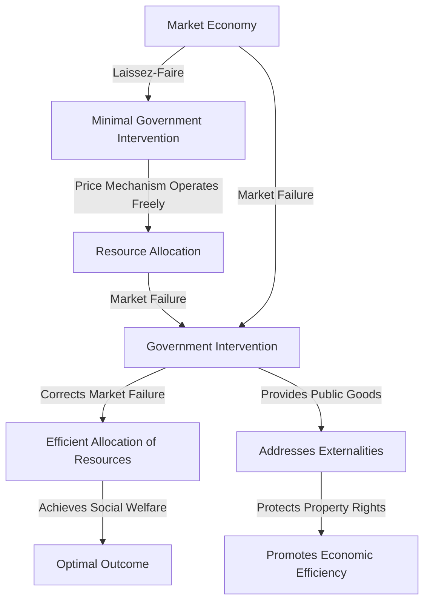

---

title: Role_Of_Government
course: "Economics"
unit: '1'
semester: "Winter 2026"
mode: ECON-MICRO
type: atomic_note
hub: "[[1_Basics_Of_Economics_Hub]]"
source: "[[5-Pdf Store/note generated/Winter 2026/Economics/Chapter_1.pdf]]"
date: '2026-05-08'
prerequisites:
- "[[Capitalist_Economy]]"
source_pages:
- 60
generated: true

---

## 1. Mental Model

Imagine you're playing a game of tag with your friends in a big park. The game is like the market economy, where everyone runs around and makes their own choices about who to tag or avoid. The government is like the referee, but instead of telling you who to tag or how to play, they make sure everyone follows the basic rules of the game, like taking turns and not pushing. They also make sure the game is fair by preventing cheating and keeping the playing field safe. But, they shouldn't get too involved and start telling you exactly who to tag or where to run, because that would ruin the fun and make the game less exciting. The referee's job is to let the game play out on its own, making sure everyone has a chance to succeed or fail on their own, and only stepping in when someone breaks the rules.

## 2. Micro Theory

The role of government in a market economy is a critical concept in [[Macroeconomics]], a branch of [[Branches_Of_Economics]] that examines the economy as a whole. The fundamental principle of laissez-faire economics, as advocated by [[Adam_Smith]], posits that the government should have a minimal role in the workings of the market economy, allowing the Price Mechanism to operate freely. However, in practice, governments often intervene in the economy to address [[Market_Failure]] and ensure an [[Efficient_Allocation]] of [[Economic_Resources]].

The [[Definition_Of_Economics]] highlights the problem of [[Scarcity]] and the need for [[Scarcity_And_Choice]], which necessitates the allocation of limited resources to meet unlimited [[Human_Wants]]. In a market economy, the [[Decision_Making_Units]], comprising consumers and firms, interact through the price mechanism to allocate resources. However, the presence of [[Market_Failure]], such as externalities, public goods, and information asymmetry, can lead to inefficient outcomes, warranting government intervention.

The [[Role_Of_Government]] can be defined as the set of actions taken by the government to correct [[Market_Failure]], promote [[Economic_Growth]], and ensure a more efficient allocation of resources. This involves addressing the [[Basic_Economic_Questions]] of [[What_To_Produce]], [[How_To_Produce]], and [[For_Whom_To_Produce]], which are typically resolved through the interactions of decision-making units in the market.

Government intervention can take various forms, including the provision of public goods, regulation of externalities, and redistribution of income. However, such interventions are subject to [[Opportunity_Cost]], as they often involve tradeoffs between competing objectives, such as efficiency and equity. The [[Law_Of_Increasing_Opportunity_Cost]] suggests that as the government increases its intervention in the economy, the opportunity costs of such actions may rise.

The evaluation of government intervention in the economy is often based on [[Positive_Economics]], which focuses on the factual analysis of economic phenomena, and [[Normative_Economics]], which involves value judgments about what ought to be. The use of [[Inductive_Reasoning]] and [[Deductive_Reasoning]] enables economists to analyze the effects of government policies and make informed decisions about the optimal level of intervention.

In a [[Capitalist_Economy]], the government plays a crucial role in establishing and enforcing the rules of the game, protecting property rights, and providing public goods. However, excessive government intervention can lead to inefficiencies and stifle [[Economic_Growth]]. Therefore, the optimal [[Role_Of_Government]] involves striking a balance between allowing the market mechanism to operate freely and correcting [[Market_Failure]] to promote a more efficient allocation of resources.

The analysis of government intervention in the economy is closely related to the study of [[Economic_Systems]], which examines the different ways in which societies organize their [[Economic_Resources]] to produce and distribute goods and services. The [[Production_Possibilities_Frontier]] and the concept of [[Efficiency]] provide useful tools for evaluating the impact of government policies on the allocation of resources and the overall performance of the economy.

Ultimately, the [[Role_Of_Government]] in a market economy is to create an environment in which decision-making units can interact efficiently, and the economy can achieve a more efficient allocation of resources, while minimizing [[Tradeoffs]] and [[Scarcity]].

## 3. Limitations & Edge Cases

The government's role in the market economy is limited by the assumption of perfect information, rational behavior, and well-defined property rights, which often do not hold in reality. For instance, in the presence of market failures such as externalities, asymmetric information, and public goods, government intervention may be necessary to correct inefficiencies. Additionally, the government's ability to correct these market failures is hindered by its own limitations, including bureaucratic inefficiencies, regulatory capture, and the challenge of making optimal decisions with imperfect information. Furthermore, government intervention can also lead to unintended consequences, such as rent-seeking behavior, moral hazard, and distortions in market incentives, which can ultimately undermine the efficiency of the market economy.

## 4. Market Graph



The role of government in the labor market is to intervene in cases of market failure, such as information asymmetry, externalities, and public goods, to ensure an efficient allocation of resources. By doing so, the government aims to achieve a socially optimal outcome, promoting economic efficiency and protecting property rights, while also addressing issues like labor market imperfections and unequal distribution of income.

## 5. Walkthrough

## Step 1: Understand Laissez-Faire Economics Principle

The fundamental principle of laissez-faire economics, as advocated by Adam Smith, posits that the government should have a minimal role in the workings of the market economy. This principle suggests that the government should not interfere in the operation of the price mechanism.

## Step 2: Identify the Role of Price Mechanism

In a market economy, the price mechanism allows for the free operation of market forces to allocate resources. The interaction between consumers and firms through the price mechanism enables the efficient allocation of economic resources.

## Step 3: Recognize the Need for Government Intervention

However, in practice, governments often intervene in the economy to address market failures. Market failures can occur due to externalities, public goods, and information asymmetry, which can lead to an inefficient allocation of resources.

## Step 4: Analyze Market Failure

Market failure refers to a situation where the price mechanism fails to allocate resources efficiently. This can happen when there are externalities, such as pollution, or public goods, such as national defense, that are not provided by the market.

## 5: Determine Government's Role in Addressing Market Failure

The government's role is to intervene in the economy to address market failures and ensure an efficient allocation of economic resources. This can be achieved through policies and regulations that correct market failures and promote economic efficiency.

---

## Review & Practice

```interactive-quiz

[
  {
    "type": "mcq",
    "difficulty": "L1",
    "question": "What is the primary role of the government in a market economy, according to the concept of [[Role_Of_Government]] in Game Theory Application?",
    "options": {
      "A": "To maximize profits for firms",
      "B": "To correct [[Market_Failure]] and promote [[Efficient_Allocation]] of [[Economic_Resources]]",
      "C": "To set prices for goods and services",
      "D": "To act as a sole consumer in the market"
    },
    "answer": "B",
    "explanation": "The role of government in a market economy is to correct market failures and promote an efficient allocation of economic resources. This involves addressing issues such as externalities, public goods, and information asymmetry, which can lead to inefficient outcomes if left unaddressed by the market mechanism."
  },
  {
    "type": "fill_in",
    "difficulty": "L2",
    "question": "Fill in the blank.",
    "textWithBlanks": "The Blank is a critical concept in understanding the Role Of Government.",
    "answer": [
      "Market Failure"
    ],
    "explanation": "The term 'Market Failure' is a critical concept in understanding the Role Of Government as it refers to situations where the market mechanism fails to allocate resources efficiently, warranting government intervention."
  },
  {
    "type": "debug",
    "difficulty": "L1",
    "question": "Find the bug in the following scenario: The government of a country decides to impose a tax on carbon emissions to correct a [[Market_Failure]] caused by Negative Externalities. However, the tax rate is set at a level that is Lower than the marginal social cost of carbon emissions, resulting in an Inefficient Allocation of resources.",
    "content": "The government of a country decides to impose a tax on carbon emissions to correct a [[Market_Failure]] caused by Negative Externalities. However, the tax rate is set at a level that is Lower than the marginal social cost of carbon emissions, resulting in an Inefficient Allocation of resources.",
    "answer": "The bug is that the tax rate should be set at a level equal to the marginal social cost of carbon emissions, not lower. Setting the tax rate lower than the marginal social cost will not fully internalize the externality, leading to continued overproduction of carbon-intensive goods and services.",
    "required_keywords": [
      "Pigouvian Tax",
      "Marginal Social Cost",
      "Negative Externalities",
      "Efficient Allocation"
    ],
    "explanation": "The scenario describes a situation where the government attempts to correct a market failure caused by negative externalities from carbon emissions by imposing a tax. However, by setting the tax rate lower than the marginal social cost of carbon emissions, the government does not fully internalize the externality. This results in an inefficient allocation of resources, as firms and consumers are not incentivized to reduce their carbon emissions to the socially optimal level. The correct approach would be to set the tax rate equal to the marginal social cost of carbon emissions, which is a key concept in environmental economics and is often referred to as a Pigouvian tax."
  }
]

```