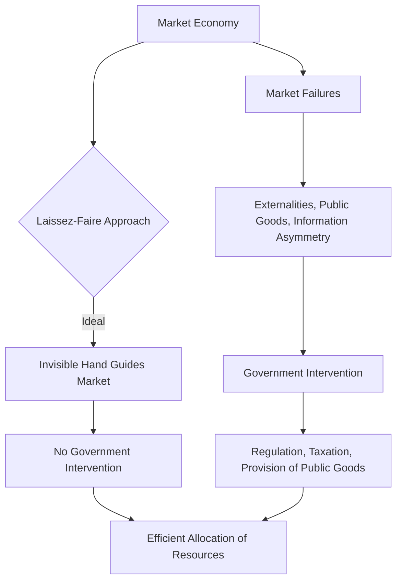

---

title: Role_Of_Government
course: "Economics"
unit: '1'
semester: "Winter 2026"
mode: ECON-MICRO
type: atomic_note
hub: "[[1_Basics_Of_Economics_Hub]]"
source: "[[5-Pdf Store/note generated/Winter 2026/Economics/Chapter_1.pdf]]"
date: '2026-05-08'
prerequisites:
- "[[Capitalist_Economy]]"
source_pages:
- 60
generated: true

---

## 1. Mental Model

In the labor market, consider the scenario of the United States' federal government intervening in the steel industry during the 1980s. The government imposed tariffs on imported steel to protect domestic steel producers, which led to higher steel prices for American consumers. This intervention exemplifies two specific components of the role of government: (1) **Market intervention**, where the government directly affects market outcomes, in this case, by altering the supply of steel through tariffs, and (2) **Regulation of trade**, where the government influences the flow of goods and services across borders, here by restricting imports to shield domestic producers. By doing so, the government impacted the labor market, as steel industry jobs were preserved, but at the cost of higher prices and potential job losses in industries that relied on steel as an input.

## 2. Micro Theory

The role of government in a market economy is a fundamental concept in microeconomics, which warrants a rigorous technical definition. In a [[Capitalist_Economy]], the government's primary function is to ensure the efficient allocation of [[Economic_Resources]], thereby facilitating the satisfaction of [[Human_Wants]]. 

According to [[Adam_Smith]], the government should ideally adopt a laissez-faire approach, allowing the market to operate freely, guided by the Invisible Hand. This implies that, in principle, the government should have no direct role in the workings of the market economy and should not interfere in the operation of the Price Mechanism. 

However, in reality, governments often intervene to address Market Failures, which arise due to the presence of Externalities, Public Goods, or Information Asymmetry. In such cases, the government can play a crucial role in correcting these failures through Regulation, taxation, or provision of public goods. 

The Efficient Allocation of resources is a key objective of economic policy, and governments can influence this process through Resource Allocation decisions. Economic Analysis, comprising both Positive Economics and Normative Economics, provides a framework for evaluating the role of government in the economy. 

In Macroeconomics, the government's policy decisions have a significant impact on the overall performance of the economy, and Inductive Reasoning and Deductive Reasoning are essential tools for analyzing these effects. The study of the role of government falls under the Branches Of Economics, specifically Microeconomics, which examines the interactions among economic agents and the Basic Economic Questions of what, how, and for whom to produce.

The fundamental problem of Scarcity necessitates the need for governments to make decisions regarding the allocation of resources. Different Economic Systems have varying degrees of government intervention, and the optimal role of government is often debated among economists. A comprehensive understanding of the role of government can be achieved through the lens of Economic Resources, which are the building blocks of economic activity.

Ultimately, the government's role is to strike a balance between allowing the market to function efficiently and intervening to address market failures or promote social welfare. A well-defined role for government is essential to ensure that the economy operates in a manner that maximizes the satisfaction of Human Wants, given the constraints of Scarcity.

## 3. Limitations & Edge Cases

The government's role in the market economy is limited by the assumption of perfect information, rational behavior, and well-defined property rights, which often do not hold in reality. For instance, in the presence of market failures such as externalities, asymmetric information, and public goods, government intervention may be necessary to correct inefficiencies. Additionally, the government's ability to correct these market failures is hindered by its own limitations, including bureaucratic inefficiencies, regulatory capture, and the challenge of making optimal decisions with imperfect information. Furthermore, government intervention can also lead to unintended consequences, such as rent-seeking behavior, moral hazard, and distortions in market incentives, which can ultimately undermine the efficiency of the market economy.

## 4. Market Graph



The provided Mermaid flowchart illustrates the role of government in a market economy, highlighting the ideal laissez-faire approach and the need for government intervention in cases of market failures. The chart shows how government intervention can correct market failures and facilitate the efficient allocation of resources, ultimately contributing to the satisfaction of human wants.

## 5. Walkthrough

## Step 1: Define the Ideal Government Role

In a capitalist economy, the government's primary function, as per Adam Smith, is to adopt a laissez-faire approach. This implies that the government should ideally have no direct role in the workings of the market economy.

## Step 2: Understand the Laissez-Faire Approach

The laissez-faire approach allows the market to operate freely, guided by the invisible hand. This approach ensures that the market self-regulates through the price mechanism.

## Step 3: Identify Market Failures

However, in reality, market failures can occur due to externalities, public goods, or information asymmetry. These failures necessitate government intervention to correct them.

## Step 4: Government Intervention Methods

The government can intervene through regulation, taxation, or the provision of public goods to address market failures.

## Step 5: Conclusion on Government Role

In conclusion, while the ideal role of the government in a market economy is to have no direct interference, in practice, governments often need to intervene to correct market failures and ensure efficient allocation of economic resources.

---

## Review & Practice

```interactive-quiz

[
  {
    "type": "mcq",
    "difficulty": "L1",
    "question": "What is the primary role of the government in a market economy when market failures occur due to externalities, public goods, or information asymmetry?",
    "options": {
      "A": "To operate businesses and control the price mechanism",
      "B": "To correct market failures through regulation, taxation, or provision of public goods",
      "C": "To allocate resources solely based on market demand",
      "D": "To set prices for all goods and services"
    },
    "answer": "B",
    "explanation": "The government's primary role in a market economy when market failures occur is to correct these failures through regulation, taxation, or provision of public goods. This intervention helps ensure the efficient allocation of economic resources and facilitates the satisfaction of human wants."
  },
  {
    "type": "fill_in",
    "difficulty": "L2",
    "question": "Fill in the blank.",
    "textWithBlanks": "The government's intervention can correct Market Failures through Regulation, taxation, or provision of public goods.",
    "answer": [
      "Market Failures"
    ],
    "explanation": "The role of government in a market economy includes correcting market failures, which can occur due to externalities, public goods, or information asymmetry. The government can intervene through regulation, taxation, or the provision of public goods to address these failures and ensure a more efficient allocation of resources.",
    "required_keywords": [
      "Market Failures",
      "Regulation",
      "Externalities",
      "Public Goods"
    ]
  },
  {
    "type": "true_false",
    "difficulty": "L1",
    "question": "The government's primary function in a capitalist economy is to directly manage the allocation of economic resources.",
    "answer": false,
    "explanation": "In a capitalist economy, the government's primary function is not to directly manage the allocation of economic resources but to ensure the efficient allocation of resources, often through a laissez-faire approach, and to correct market failures through regulation, taxation, or provision of public goods."
  }
]

```