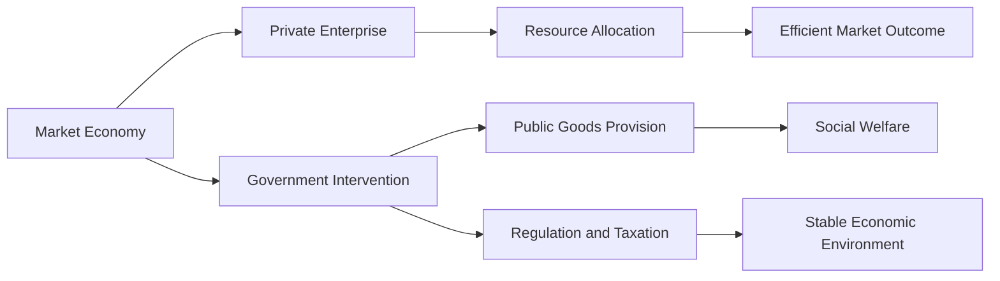

---

title: Role_Of_Government_In_Market_Economy
type: Atomic Note
course: Economics
semester: Winter 2026
unit: '1'
hub: "[[1_Basics_Of_Economics_Hub]]"
source: "[[Chapter_1.pdf]]"
source_pages:
- 59
- 60
mode: ECON-MACRO
read: false
generated: true
prerequisites:
- "[[Capitalist_Economy]]"

---

# 1. Mental Model

Imagine you're playing a game with your friends where everyone trades toys with each other. The government is like a referee who makes sure everyone plays fair and follows the rules. They don't control the game, but they help make sure it's fair and that everyone has an equal chance to trade toys.

# 2. Economic Theory

The [[Role_Of_Government_In_Market_Economy]] refers to the functions and responsibilities of a government in a [[Capitalist_Economy]], where the market is primarily driven by private enterprise and [[Scarcity]] is managed through price mechanisms. The government's role is to protect property rights, enforce contracts, and address [[Market_Failure]], while minimizing interference with the [[Efficient_Allocation]] of [[Economic_Resources]]. In a market economy, the government's role is to create an environment conducive to economic growth, not to directly control the economy.

## 3. Economic Model



## 4. Walkthrough

* The market economy (A) is driven by private enterprise (B), which allocates resources (D) to meet demand.
* The government intervenes (C) to provide public goods (E) that the private sector cannot or will not provide.
* The government also regulates markets (F) and collects taxes to fund public goods and stabilize the economy.
* The ultimate goals are efficient market outcomes (G), social welfare (H), and a stable economic environment (I).

## 5. Market Failures

The role of government in a market economy can fail when government intervention is inefficient or ineffective, leading to market distortions or unintended consequences. Common pitfalls include regulatory capture, where special interest groups influence policy to their advantage, and inefficient allocation of public goods. Additionally, excessive taxation can stifle economic growth and innovation.

---

## 6. The Proving Grounds

```interactive-quiz

[
  {
    "id": "q1",
    "type": "true_false",
    "difficulty": "L1",
    "question": "The government in a market economy controls the prices of goods and services.",
    "answer": false,
    "explanation": "In a market economy, the government acts as a referee to ensure fairness and equality, but it does not directly control the prices of goods and services. Prices are primarily determined by supply and demand through private enterprise and market mechanisms. The government's role is to establish and enforce rules that protect property rights, enforce contracts, and prevent monopolies, thereby allowing the market to operate efficiently."
  },
  {
    "id": "q2",
    "type": "synthesis",
    "difficulty": "L2",
    "question": "In a small town, a single factory provides the majority of jobs, leading to a lack of competition for workers' wages. The government must balance the need for economic growth with the need to protect workers' rights. Using the mental model of the government as a referee, propose a solution that ensures fair competition and equal opportunities for workers, while also considering the economic theory of the role of government in a market economy.",
    "answer": "A grading rubric with criteria including: (1) promotion of competition (20 points), (2) protection of workers' rights (20 points), (3) consideration of economic growth (20 points), (4) fairness and equal opportunities (20 points), and (5) effective implementation and enforcement (20 points).",
    "explanation": "The government's role in a market economy is to ensure that the market operates fairly and efficiently. In this scenario, the government must intervene to prevent the monopoly of a single factory from stifling competition and limiting workers' rights. By establishing policies that promote competition, protect workers' rights, and ensure equal opportunities, the government can create an environment that fosters economic growth while safeguarding the well-being of workers. The grading rubric assesses the effectiveness of proposed solutions in achieving these goals."
  },
  {
    "id": "q3",
    "type": "writing",
    "difficulty": "L3",
    "question": "Explain the role of government in ensuring fair competition in a market economy.",
    "answer": "The government ensures fair competition by enforcing antitrust laws and regulations, which prevent monopolies and promote equal opportunities for businesses to operate and compete.",
    "explanation": "The underlying mechanism is based on the concept of market failure, where unchecked monopolies can lead to inefficiencies and unfair market practices. By setting and enforcing rules, the government acts as a referee to maintain a level playing field, allowing businesses to innovate and compete based on merit, rather than exploiting their market power. This leads to better outcomes for consumers and promotes economic growth."
  }
]

```