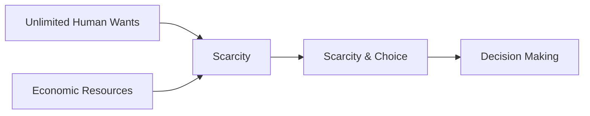

---

title: Scarcity
type: Atomic Note
course: Economics
semester: Winter 2026
unit: '1'
hub: '[[1_Basics_Of_Economics_Hub]]'
source: '[[5-Pdf Store/note generated/Winter 2026/Economics/Chapter_1.pdf]]'
source_pages:
- 12
- 27
mode: ECON-MACRO
read: false
generated: true
prerequisites:
- '[[Unlimited_Human_Wants]]'
- '[[Economic_Resources]]'
- '[[Scarcity_And_Choice]]'
- '[[Decision_Making_Units]]'
- '[[Opportunity_Cost]]'

---


# 1. Mental Model

Imagine you really want a new video game and a bike, but your parents can only buy you one thing. You have to choose between the two because you can't have both. This is like scarcity, where we don't have enough of something to satisfy our desires.

# 2. Economic Theory

[[Scarcity]] refers to the fundamental economic problem that arises because [[Unlimited_Human_Wants]] exceed the availability of [[Economic_Resources]]. This mismatch between what people want and what is available leads to [[Scarcity_And_Choice]], requiring [[Decision_Making_Units]] to make choices about how to allocate resources efficiently, considering [[Opportunity_Cost]].

## 3. Economic Model



## 4. Walkthrough

* The model starts with **Unlimited Human Wants**, representing the desires and needs of individuals that have no limit.
* These wants are constrained by the availability of **Economic Resources**, which are limited.
* The interaction between unlimited wants and limited resources leads to **Scarcity & Choice**, necessitating decisions on how to allocate resources.
* This process results in **Decision Making**, where individuals or units must choose how to best use their limited resources.

## 5. Market Failures

Scarcity can lead to market failures when the allocation of resources is not efficient, such as in the case of overconsumption or underproduction of certain goods. Common pitfalls include misallocation of resources due to imperfect information or externalities. Additionally, scarcity can exacerbate issues like inequality if certain groups have less access to resources.

---

## 6. The Proving Grounds

```interactive-quiz

[
  {
    "id": "q1",
    "type": "true_false",
    "difficulty": "L1",
    "question": "The concept of scarcity arises because people have unlimited wants and needs that can always be fulfilled by readily available resources.",
    "answer": false,
    "explanation": "The concept of scarcity is rooted in the fundamental economic problem that arises because unlimited human wants exceed the availability of economic resources. This means that the resources available are not sufficient to satisfy all the desires and needs of individuals, leading to a situation where choices must be made about how to allocate these limited resources. The statement in question is false because it inaccurately suggests that scarcity arises when wants and needs can be fulfilled by readily available resources, which is the opposite of the actual relationship between unlimited wants and the limited availability of resources."
  },
  {
    "id": "q2",
    "type": "synthesis",
    "difficulty": "L2",
    "question": "A small town, hit by a severe drought, faces a critical water shortage. The town has a limited water supply of 1000 gallons per day, and there are three main users: a hospital (needing 300 gallons/day for patient care), a school (needing 200 gallons/day for sanitation and drinking), and 500 residents (each needing 2 gallons/day for household use). Given the scarcity of water, how should the town allocate its water supply to meet the needs of its residents, school, and hospital?",
    "answer": "Prioritize the hospital's 300 gallons/day, allocate 200 gallons/day to the school, and distribute the remaining 500 gallons/day among the 500 residents (1 gallon/resident/day).",
    "explanation": "The scenario illustrates the concept of scarcity, where the town's water supply (1000 gallons/day) is insufficient to meet the demands of its residents, school, and hospital. To address this, the town must make difficult choices about how to allocate its limited water supply. The hospital's need for 300 gallons/day takes priority due to the critical nature of its operations. Next, the school's 200 gallons/day requirement is addressed. The remaining 500 gallons/day is then distributed among the 500 residents, resulting in 1 gallon/resident/day. This allocation decision reflects the principles of scarcity and choice, requiring the town to weigh competing demands and make tough decisions about how to utilize its limited resources."
  },
  {
    "id": "q3",
    "type": "writing",
    "difficulty": "L3",
    "question": "Explain the underlying mechanism of scarcity in the context of economic theory and its relation to decision-making.",
    "answer": "Scarcity arises from the mismatch between unlimited human wants and the limited availability of economic resources, necessitating choices about resource allocation.",
    "explanation": "The underlying mechanism of scarcity is rooted in the fundamental economic problem that human wants are unlimited, while the resources available to satisfy those wants are limited. This disparity leads to a situation where choices must be made about how to allocate resources efficiently, as decision-making units cannot fulfill all their desires simultaneously. Consequently, scarcity compels individuals and societies to prioritize their wants and make decisions that involve trade-offs, optimizing the use of available resources to maximize satisfaction."
  }
]

```