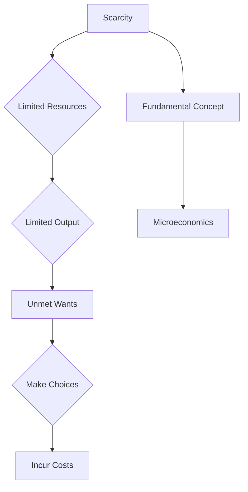

---

title: Scarcity
course: Economics
unit: '1'
semester: Winter 2026
mode: ECON-MICRO
type: atomic_note
hub: '[[1_Basics_Of_Economics_Hub]]'
source: '[[5-Pdf Store/note generated/Winter 2026/Economics/Chapter_1.pdf]]'
date: '2026-05-08'
prerequisites:
- '[[Choice]]'
source_pages:
- 37
generated: true

---


## 1. Mental Model

Imagine you have a super cool lemonade stand and you only have $10 to spend on cups, sugar, and lemons. You really want to make a lot of lemonade for all your friends, but you can't afford to buy enough supplies to make a million cups! This means you have to make a choice: do you want to make a few big jugs of lemonade with lots of sugar, or a lot of small cups with just a squeeze of lemon? Either way, you can't make as much lemonade as you want, and you have to give up something, like using less sugar or making smaller cups. This is scarcity - when you don't have enough of something, like money, to get everything you want, and you have to make choices about how to use what you have, and those choices always involve giving something up!

## 2. Micro Theory

The fundamental concept of **Scarcity**, a cornerstone in **Microeconomics**, delineates the perpetual disparity between the finite availability of **Economic Resources** and the infinite nature of **Human Wants**. This incongruity inherently necessitates **Choice**, instigating a sequence of events that underpins the discipline of economics. The **Definition Of Economics** itself revolves around the allocation of these scarce resources to satisfy unlimited wants, thereby establishing **Scarcity And Choice** as pivotal elements.

The existence of **Scarcity** implies that the **Economic Resources** available for production are limited, which in turn constrains the **Production Possibilities Frontier** (PPF) of an economy. This frontier represents the maximum possible output combinations of two goods or services that can be produced given the available resources and technology. The limitation on resources directly translates to a limitation on output, suggesting that an economy cannot produce beyond its PPF without an increase in resources or technological advancement.

The **Basic Economic Questions**—**What To Produce**, **How To Produce**, and **For Whom To Produce**—are formulated in the context of scarcity. These questions underscore the necessity for **Resource Allocation** and the inevitability of **Tradeoffs**. The pervasive presence of scarcity implies that **Decision Making Units**, including consumers and firms, must make choices, and these choices involve **Opportunity Cost**, which represents the value of the next best alternative foregone as a result of making a decision.

The pervasive influence of **Scarcity** on economic activities necessitates **Efficient Allocation** of resources to maximize the satisfaction of **Human Wants**. This efficiency is often analyzed within the framework of **Positive Economics**, which focuses on 'what is,' providing factual analysis without value judgments. Conversely, **Normative Economics**, dealing with 'what ought to be,' also plays a role in discussions of scarcity by introducing value judgments about how resources should be allocated.

The concept of **Scarcity** is also intrinsically linked to **Macroeconomics**, as aggregate economic outcomes are significantly influenced by how economies manage their scarce resources. **Economic Growth** can sometimes alleviate scarcity by increasing the availability of resources or improving technology, thus expanding the PPF. However, growth does not eliminate scarcity; it merely changes the nature of the choices that must be made.

The foundational thinkers in economics, such as **Adam Smith**, have discussed the implications of scarcity and the mechanisms of **Market Failure** and the **Role Of Government** in addressing issues stemming from it. In a **Capitalist Economy**, market mechanisms are primarily responsible for the allocation of resources, but **Market Failure** can occur, necessitating government intervention.

The **Law Of Increasing Opportunity Cost** is a direct consequence of scarcity, explaining that as more of one good is produced, the opportunity cost of producing additional units of that good increases. This law underlines the reality of **Tradeoffs** and **Efficiency** in production and consumption.

In conclusion, **Scarcity** is a fundamental concept in economics that leads to the necessity of **Choice**, which in turn involves **Opportunity Cost**. The technical analysis of scarcity reveals its pervasive impact on **Economic Theory**, **Resource Allocation**, and **Decision Making Units**. Through **Inductive Reasoning** and **Deductive Reasoning**, economists understand the implications of scarcity and strive to find the most **Efficient Allocation** of resources to meet **Human Wants** as effectively as possible.

## 3. Limitations & Edge Cases

The concept of scarcity in microeconomics is limited by several edge cases, including the assumption that resources are limited, which may not hold in cases where technological advancements or new discoveries increase the availability of resources. Additionally, scarcity assumes that wants are unlimited, but in reality, some individuals may have satiated preferences, rendering certain goods or services unnecessary. Furthermore, the concept of scarcity also relies on the idea that choices involve costs, but it may not account for cases where choices are made without incurring significant opportunity costs, such as when resources are abundant or when externalities are not considered. Moreover, scarcity may not be equally felt across different populations, as unequal distribution of resources can lead to scarcity for some groups while others experience abundance, thus highlighting the need to consider distributional effects when analyzing scarcity.

## 4. Market Graph



This flowchart illustrates the sequence of events triggered by scarcity, from the limitation of resources to the necessity of making choices and incurring costs. The diagram shows how scarcity underpins the core principles of microeconomics, emphasizing the inevitability of choice due to the finite nature of economic resources.

## 5. Walkthrough

## Step 1: Define Scarcity and Its Implications

Scarcity refers to the fundamental concept in microeconomics that describes the disparity between the finite availability of economic resources and the infinite nature of human wants. This disparity implies that the economic resources available for production are limited.

## Step 2: Identify the Limited Economic Resources

The limited economic resources include labor, capital, land, and entrepreneurship. These resources are the inputs used in the production of goods and services. Their scarcity constrains the production possibilities of an economy.

## 3: Understand the Production Possibilities Frontier (PPF)

The Production Possibilities Frontier (PPF) represents the maximum possible output combinations of two goods or services that can be produced given the available resources and technology. The PPF is a graphical representation that shows the various combinations of two goods that can be produced when all resources are fully employed.

## 4: Analyze the Impact of Scarcity on Output and Choice

Given that economic resources are limited, the output of an economy is also limited. This limitation implies that an economy cannot produce enough goods and services to satisfy all human wants. As a result, choices must be made about how to allocate the limited resources to produce the most valuable goods and services.

## 5: Recognize the Involvement of Costs in Choice

Every choice involves costs, often referred to as opportunity costs. The opportunity cost of a choice is the value of the next best alternative that is given up. For example, if an economy chooses to produce more of one good, it must produce less of another good, given the limited resources. This trade-off reflects the cost of the choice made.

---

## Review & Practice

```interactive-quiz

[
  {
    "type": "mcq",
    "difficulty": "L1",
    "question": "The concept of [[Scarcity]] in Consumer Behavior Analysis implies that:",
    "options": {
      "A": "The availability of economic resources is infinite.",
      "B": "The disparity between the finite availability of economic resources and infinite human wants necessitates [[Choice]].",
      "C": "The production possibilities frontier (PPF) of an economy is not limited by resource constraints.",
      "D": "The efficient allocation of resources is not necessary to maximize the satisfaction of human wants."
    },
    "answer": "B",
    "explanation": "The concept of scarcity in Consumer Behavior Analysis fundamentally highlights the disparity between the finite availability of economic resources and the infinite nature of human wants. This disparity necessitates choice, which is a pivotal element in economics. The correct answer reflects this core idea."
  },
  {
    "type": "fill_in",
    "difficulty": "L2",
    "question": "Fill in the blank.",
    "textWithBlanks": "The Blank is a cornerstone in Microeconomics, delineating the perpetual disparity between the finite availability of Economic Resources and the infinite nature of Human Wants.",
    "answer": [
      "Scarcity"
    ],
    "explanation": "The term 'Scarcity' is a critical concept in Labor Market Economics, specifically in Microeconomics, that describes the fundamental problem of unlimited wants and needs versus limited resources."
  },
  {
    "type": "debug",
    "difficulty": "L1",
    "question": "Find the bug in the following scenario: A consumer has $100 to spend on two goods, X and Y. The price of good X is $10 and the price of good Y is $20. The consumer's budget constraint is Budget Constraint.",
    "content": "The consumer's budget constraint is 10X + 20Y = 100.",
    "answer": "The bug is that the budget constraint should be 10X + 20Y \u2264 100, not 10X + 20Y = 100. The correct symbol to use is 'less than or equal to' (\u2264) because the consumer can choose to spend any amount up to $100, not exactly $100.",
    "required_keywords": [
      "Budget Constraint",
      "Scarcity",
      "Opportunity Cost",
      "Microeconomics"
    ],
    "explanation": "The budget constraint represents the various combinations of two goods that a consumer can purchase given their income and the prices of the goods. The correct formulation of the budget constraint is essential in understanding the consumer's choices and the concept of scarcity. The use of '=' instead of '\u2264' implies that the consumer can only spend exactly $100, which is not a realistic assumption."
  }
]

```