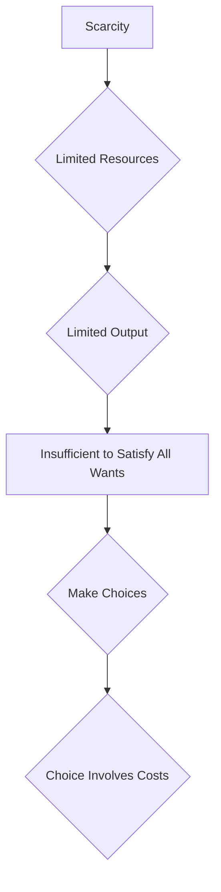

---

title: Scarcity
course: Economics
unit: '1'
semester: Winter 2026
mode: ECON-MICRO
type: atomic_note
hub: '[[1_Basics_Of_Economics_Hub]]'
source: '[[5-Pdf Store/note generated/Winter 2026/Economics/Chapter_1.pdf]]'
date: '2026-05-08'
prerequisites:
- '[[Economic_Resources]]'
- '[[Human_Wants]]'
- '[[Economic_Analysis]]'
source_pages:
- 37
generated: true

---


## 1. Mental Model

In the realm of Game Theory Application, consider a real-world scenario of spectrum allocation for telecommunications. The Federal Communications Commission (FCC) faces a scarcity of radiofrequency spectrum, a limited resource, which is essential for mobile network operators to provide 4G and 5G services. With a finite spectrum available, the FCC can only allocate a limited number of licenses to support a restricted number of wireless networks, leading to limited output in terms of network capacity. As a result, not all wireless service providers can have access to the spectrum they want, forcing the FCC to make choices about which companies to allocate spectrum to, and under what conditions. This scarcity necessitates careful consideration of the costs associated with these choices, including the potential impact on competition, innovation, and ultimately, consumer welfare. Two specific components explicitly mapped here are: (1) **limited resource** (radiofrequency spectrum) and (2) **limited output** (restricted number of wireless networks and network capacity).

## 2. Micro Theory

In the realm of microeconomics, [[Scarcity]] is a fundamental concept that underpins the discipline, influencing the allocation of [[Economic_Resources]] and the satisfaction of [[Human_Wants]]. At its core, scarcity arises from the disparity between the limited availability of resources and the unlimited nature of human desires. This disparity necessitates the making of choices, which inherently involve costs, thereby embedding the concept of scarcity within the broader framework of [[Economic_Analysis]].

The mechanism of scarcity unfolds as follows: given that resources are limited, the output that can be produced from these resources is also limited. This limited output may not be sufficient to satisfy all Human Wants, leading to a situation where choices must be made regarding the allocation of resources. The process of making choices is inextricably linked to the concept of costs, as selecting one option over another implies foregoing an alternative use of resources, thus incurring an opportunity cost. This sequence of events—limited resources leading to limited output, which may not satisfy all wants, necessitating choice, and choices involving costs—forms the essence of scarcity.

The foundational relationship, as succinctly captured by the textbook, is: Scarcity → limited resource → limited output → we might not satisfy all our wants → make choice → choice involves costs. This sequence underscores the intrinsic link between scarcity and the basic economic questions of what, how, and for whom to produce, which are central to understanding Economic Systems.

The study of scarcity falls under Positive Economics, as it seeks to describe and analyze the existing economic conditions and behaviors without making value judgments. The allocation of resources under conditions of scarcity is a critical aspect of Resource Allocation, aiming for an Efficient Allocation that maximizes the satisfaction of wants given the constraints.

The concept of scarcity also intersects with Normative Economics, as discussions about how resources should be allocated to mitigate scarcity often involve value judgments. Moreover, scarcity is a pivotal concept in Macroeconomics, as aggregate economic outcomes are significantly influenced by how economies manage their scarce resources.

The reasoning processes of Inductive Reasoning and Deductive Reasoning are both employed in the study of scarcity. Inductive reasoning is used in observing specific instances of scarcity and generalizing them into broader principles, while deductive reasoning is applied in deriving specific implications of scarcity from general economic theories.

The seminal works of Adam Smith and other foundational economists have extensively explored the implications of scarcity, laying the groundwork for understanding how markets and economies function in an environment of limited resources. The study of scarcity, therefore, is a cornerstone of Branches Of Economics, particularly within microeconomics, influencing both Basic Economic Questions and the overarching structures of Economic Systems.

## 3. Limitations & Edge Cases

The concept of scarcity in microeconomics is limited by several edge cases, including the assumption that resources are limited, which may not hold in cases where technological advancements or new discoveries increase the availability of resources. Additionally, scarcity assumes that wants are unlimited, but in reality, some individuals may have satiated preferences, rendering certain goods or services unnecessary. Furthermore, the concept of scarcity also relies on the idea that choices involve costs, but it may not account for cases where choices are made without incurring significant opportunity costs, such as when resources are abundant or when external factors, like government subsidies, alter the cost-benefit analysis. Moreover, scarcity may not be equally felt across different populations, as unequal distribution of resources can lead to scarcity for some groups while others face relative abundance, thus highlighting the need for a more nuanced understanding of scarcity in different contexts.

## 4. Market Graph



This flowchart illustrates the mechanism of scarcity in microeconomics, where limited resources lead to limited output, which may not satisfy all human wants, necessitating choices that involve costs. The diagram provides a visual representation of how scarcity underpins the fundamental principles of microeconomic analysis, particularly in the context of Game Theory applications.

## 5. Walkthrough

## Step 1: Identify the Limited Resource

The concept of scarcity begins with the acknowledgment of a limited resource. For example, consider a farmer with 10 acres of land to cultivate wheat and corn. The land is a limited resource.

## Step 2: Determine the Limited Output

Given the limited resource (10 acres of land), the output that can be produced is also limited. Suppose the farmer can produce 20 bushels of wheat or 10 bushels of corn per acre. With 10 acres, the maximum output would be 200 bushels of wheat or 100 bushels of corn.

## Step 3: Assess the Satisfaction of Human Wants

The limited output may not be sufficient to satisfy all human wants. For instance, if the farmer's goal is to produce 250 bushels of wheat and 120 bushels of corn to meet the demands of 100 consumers, but can only produce 200 bushels of wheat or 100 bushels of corn, the wants are not fully satisfied.

## Step 4: Make Choices Due to Scarcity

Due to the scarcity of resources (10 acres of land), the farmer must make choices. For example, if the farmer decides to produce 200 bushels of wheat, they must forego producing any corn, or vice versa. This choice is a direct result of the limited resource.

## Step 5: Recognize the Costs Involved in Choices

The choice involves costs, specifically opportunity costs. If the farmer chooses to produce 200 bushels of wheat, the opportunity cost is the 100 bushels of corn they could have produced instead. This cost is a direct consequence of the scarcity of resources and the unlimited nature of human wants.

---

## Review & Practice

```interactive-quiz

[
  {
    "type": "mcq",
    "difficulty": "L1",
    "question": "What is the fundamental implication of scarcity in the context of Consumer Behavior Analysis?",
    "options": {
      "A": "Consumers have unlimited resources to satisfy their wants.",
      "B": "The limited availability of resources leads to limited output, which may not satisfy all human wants.",
      "C": "Scarcity only affects producers, not consumers.",
      "D": "Human wants are limited, and resources are abundant."
    },
    "answer": "B",
    "explanation": "Scarcity arises from the disparity between the limited availability of resources and the unlimited nature of human desires. This leads to a situation where the output produced from limited resources may not be sufficient to satisfy all human wants, necessitating choices and incurring costs."
  },
  {
    "type": "fill_in",
    "difficulty": "L2",
    "question": "Fill in the blank.",
    "textWithBlanks": "The Blank is a fundamental concept that underpins the discipline, influencing the allocation of resources and the satisfaction of human wants.",
    "answer": [
      "Scarcity"
    ],
    "explanation": "The concept of scarcity is a fundamental concept in microeconomics that underpins the discipline, influencing the allocation of economic resources and the satisfaction of human wants. It arises from the disparity between the limited availability of resources and the unlimited nature of human desires."
  },
  {
    "type": "true_false",
    "difficulty": "L1",
    "question": "In the context of Labor Market Economics, when income increases, the demand for an inferior good decreases.",
    "answer": true,
    "explanation": "This statement is true. Inferior goods are those for which demand decreases as income increases. This relationship is a fundamental concept in microeconomics and is closely related to the concept of scarcity, as it influences how consumers allocate their limited resources among various goods and services."
  }
]

```