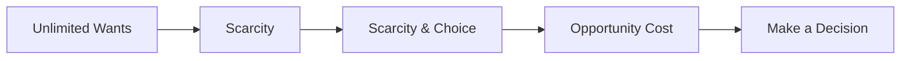

---

title: Scarcity_And_Choice
type: Atomic Note
course: Economics
semester: Winter 2026
unit: '1'
hub: '[[1_Basics_Of_Economics_Hub]]'
source: '[[5-Pdf Store/note generated/Winter 2026/Economics/Chapter_1.pdf]]'
source_pages:
- 37
- 38
mode: ECON-MACRO
read: false
generated: true
prerequisites:
- '[[Scarcity]]'
- '[[Unlimited_Human_Wants]]'
- '[[Economic_Resources]]'
- '[[Opportunity_Cost]]'

---


# 1. Mental Model

Imagine you have a lemonade stand and you only have enough cups and sugar to make 10 cups of lemonade. You want to make 15 cups, but you can't because you don't have enough supplies. This means you have to make a choice: do you want to make lemonade for your friends or for your family? You can't do both because you don't have enough resources.

# 2. Economic Theory

[[Scarcity]] leads to [[Scarcity_And_Choice]], which refers to the fundamental economic problem of having [[Unlimited_Human_Wants]] but limited [[Economic_Resources]]. This forces individuals and societies to make choices about how to allocate their resources, considering the [[Opportunity_Cost]] of each option. As a result, decision-making units face the challenge of making choices due to [[Scarcity_And_Choice]].

# 3. Economic Model



## 4. Walkthrough

* The model starts with **Unlimited Wants**, representing the numerous desires and needs of individuals.
* **Scarcity** occurs because there are not enough resources to fulfill all wants, leading to **Scarcity & Choice**.
* This forces a decision, resulting in an **Opportunity Cost**, which is the value of the next best alternative given up.
* Ultimately, a decision must be made, represented by **Make a Decision**, where an individual or society chooses how to allocate limited resources.

## 5. Market Failures

This concept can fail when individuals or societies are unaware of the scarcity of resources or when they make irrational decisions. Common pitfalls include ignoring opportunity costs or failing to consider alternative solutions, leading to inefficient allocation of resources. Additionally, unequal distribution of resources can exacerbate scarcity and choice issues.

---

## 6. The Proving Grounds

```interactive-quiz

[
  {
    "id": "q1",
    "type": "true_false",
    "difficulty": "L1",
    "question": "The scarcity of resources means that all human wants can be fulfilled.",
    "answer": false,
    "explanation": "The core mechanism of scarcity and choice is rooted in the fundamental economic problem of having unlimited human wants but limited economic resources. This implies that not all human wants can be fulfilled due to the constraints on resources. In the given context, the lemonade stand example illustrates this point: the stand owner cannot make 15 cups of lemonade because they only have enough supplies for 10 cups, forcing them to choose between fulfilling the wants of their friends or family. Therefore, the statement that the scarcity of resources means that all human wants can be fulfilled is false."
  },
  {
    "id": "q2",
    "type": "synthesis",
    "difficulty": "L2",
    "question": "Maria has a small bakery and can only bake 20 croissants per day due to limited oven space and ingredients. She has two regular customers: a local cafe that wants 10 croissants daily and a food truck that needs 12 croissants daily. However, Maria also wants to save some for her own breakfast. What should Maria do to maximize her utility given her constraints?",
    "answer": "Prioritize the customer with the most urgent or profitable order, allocate the remaining resources to the other customer and herself, considering the value of each use of her limited resources.",
    "explanation": "This problem illustrates the concept of scarcity and choice. Maria faces a scarcity of oven space and ingredients, which limits her to baking only 20 croissants per day. She has unlimited wants (supplying both customers and saving for herself), but limited resources (oven space and ingredients). To solve this, Maria must weigh the benefits of her choices. For instance, if the cafe pays more per croissant or has a stricter deadline, it might be more beneficial to prioritize them. If the food truck has a loyal customer base that will return regardless, she might prioritize them for future business. She must also consider her own needs. The optimal solution likely involves a combination of fulfilling the most critical or lucrative orders and allocating a few croissants for her personal use, ensuring she captures the most value from her limited resources."
  },
  {
    "id": "q3",
    "type": "writing",
    "difficulty": "L3",
    "question": "Explain the concept of scarcity and choice using the lemonade stand example.",
    "answer": "The lemonade stand example illustrates scarcity and choice, where limited resources, such as cups and sugar, restrict the amount of lemonade that can be made, forcing a choice between making lemonade for friends or family.",
    "explanation": "The underlying mechanism of scarcity and choice is rooted in the fundamental economic problem of unlimited human wants and limited economic resources. In the lemonade stand example, the limited resources (cups and sugar) create a scarcity, which in turn necessitates a choice between alternative uses of those resources (making lemonade for friends or family). This choice is a direct result of the scarcity, as the lemonade stand owner cannot fulfill both wants (making lemonade for friends and family) due to the limited resources available."
  }
]

```