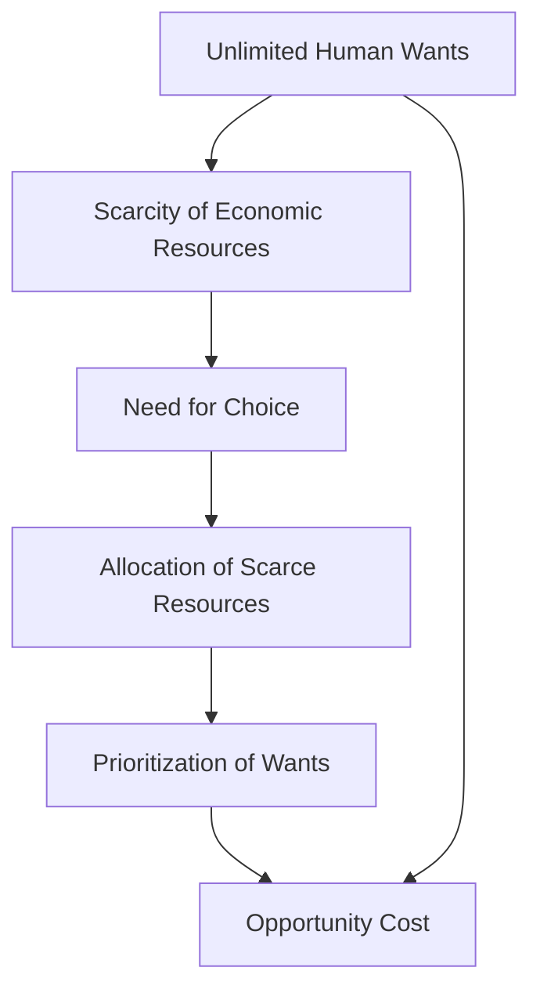

## 1. Mental Model
Imagine you have a super cool candy store in your neighborhood with an ENDLESS variety of your favorite treats, like gummies, chocolates, and lollipops. You want ALL of them, but, oh no! Your mom only gives you $5 to spend. Now, you can't buy EVERY candy you want because you don't have enough money. This is like life - we want lots of things (candy), but we don't have enough money (resources) to buy everything. This means you have to make CHOICES, like "Do I buy a yummy gummy bear or a delicious chocolate?" This everyday decision is a tiny example of Scarcity (not enough $) and Choice (picking one thing over another), which are the basic building blocks of economics!

## 2. Micro Theory
The concept of Scarcity And Choice is rooted in the foundational principles of economics, which assert that human wants are unlimited, while economic resources are limited, or scarce. This fundamental dichotomy necessitates the making of choices, as the insufficiency of resources to satisfy all desires prompts individuals, firms, and governments to prioritize and allocate these scarce resources efficiently.

The notion of [[Human_Wants]] being unlimited implies that the desires and needs of individuals are insatiable and perpetually expansive. Conversely, [[Economic_Resources]], which include labor, capital, land, and entrepreneurship, are [[Scarcity|scarce]], meaning they are available in limited quantities. This scarcity of resources creates a pervasive economic problem, as the wants of individuals cannot be fully satisfied with the available resources.

The existence of scarcity leads to the inevitability of [[Choice]]. Given that resources are limited, individuals, firms, and governments must make decisions about how to allocate these resources among competing uses. This decision-making process involves [[Opportunity_Cost]], which represents the value of the next best alternative that is foregone when a choice is made. The concept of opportunity cost is pivotal in understanding the mechanism of scarcity and choice, as it highlights the tradeoffs inherent in every economic decision.

The [[Production_Possibilities_Frontier]] (PPF) is a graphical representation of the various combinations of two goods or services that can be produced given the available resources and technology. The PPF illustrates the tradeoff between producing one good or service over another, demonstrating the [[Law_Of_Increasing_Opportunity_Cost]], which states that as the production of one good or service increases, the opportunity cost of producing an additional unit of that good or service rises.

The fundamental economic questions of [[What_To_Produce]], [[How_To_Produce]], and [[For_Whom_To_Produce]] are all influenced by the concepts of scarcity and choice. The efficient allocation of resources, which is a core objective of economics, requires that these questions be answered in a manner that maximizes the satisfaction of human wants given the available resources.

The study of scarcity and choice falls under the purview of [[Microeconomics]], a branch of economics that focuses on the decision-making units, such as households and firms, and their interactions in specific markets. [[Macroeconomics]], on the other hand, examines the economy as a whole, focusing on aggregate variables such as economic growth, inflation, and employment.

The analysis of scarcity and choice also relies on [[Positive_Economics]], which seeks to describe and explain economic phenomena without making value judgments. In contrast, [[Normative_Economics]] involves making value-based judgments about what ought to be, often with respect to economic policy.

The process of making choices under conditions of scarcity involves both [[Inductive_Reasoning]] and [[Deductive_Reasoning]], as individuals and policymakers seek to understand the consequences of their decisions and make informed choices. The study of economics, including the concepts of scarcity and choice, is built on a foundation of [[Economic_Theory]], which provides a framework for analyzing and understanding economic phenomena.

The resolution of scarcity and choice is often facilitated by [[Market_Failure]] correction and the [[Role_Of_Government]] in addressing issues related to the allocation of resources. In a [[Capitalist_Economy]], markets play a crucial role in coordinating the decisions of individual economic agents, while also providing a framework for the efficient allocation of resources.

Ultimately, the concepts of scarcity and choice are central to understanding the functioning of economies and the decision-making processes of individuals, firms, and governments. The study of economics provides valuable insights into the mechanisms of scarcity and choice, enabling a more efficient allocation of resources and a better understanding of the complex interactions within economies. [[Adam_Smith]], often regarded as the father of modern economics, laid the groundwork for the study of scarcity and choice in his seminal work, which highlighted the importance of understanding human behavior and the efficient allocation of resources in promoting economic prosperity.

## 3. Limitations & Edge Cases
The concept of Scarcity and Choice has several limitations and edge cases, particularly when dealing with non-economic or non-market based societies, where wants and resources may not be quantifiable or tradable. For instance, in a subsistence economy, households may produce their own goods and services, rendering market prices and scarcity rents irrelevant. Additionally, the assumption of unlimited wants may not hold in cases where needs are satiated or where social and cultural norms dictate consumption patterns. Furthermore, the notion of scarcity may be distorted in situations where resources are abundant but unevenly distributed, such as with public goods or natural resources subject to congestion. Lastly, the framework may struggle to accommodate non-rival and non-excludable goods, where traditional notions of scarcity and choice do not apply, highlighting the need for nuanced consideration of these edge cases.

## 4. Market Graph


This flowchart illustrates the relationship between unlimited human wants, scarcity of economic resources, and the need for choice, ultimately leading to the allocation of scarce resources, prioritization of wants, and consideration of opportunity cost. The diagram highlights the fundamental principles of economics, demonstrating how scarcity and choice are inextricably linked, and how they influence decision-making at the individual, firm, and government levels.

## 5. Walkthrough
Here is the 5-step technical walkthrough of how 'Scarcity And Choice' operates:

**Step 1: Identify Unlimited Human Wants**
Human material wants are unlimited, implying that desires and needs of individuals are insatiable and perpetually expansive.

**Step 2: Identify Limited Economic Resources**
Economic resources, which include labor, capital, land, and entrepreneurship, are limited (scarce), meaning they are available in limited quantities.

**Step 3: Recognize Scarcity and Its Implications**
The scarcity of resources creates a pervasive economic problem, as the wants of individuals cannot be fully satisfied with the available resources.

**Step 4: Necessitate Choice Due to Scarcity**
Given that resources are limited, individuals, firms, and governments must make choices about how to allocate these scarce resources efficiently, as the insufficiency of resources to satisfy all desires prompts prioritization.

**Step 5: Allocate Scarce Resources**
The inevitability of choice leads to the allocation of scarce resources, where individuals, firms, and governments must prioritize and allocate these resources to satisfy their unlimited wants, given the limited availability of economic resources.

---

## Review & Practice
```interactive-quiz
[
  {
    "type": "mcq",
    "difficulty": "L1",
    "question": "The concept of [[Scarcity]] leads to the inevitability of [[Choice]] because [[Human_Wants]] are unlimited while [[Economic_Resources]] are limited. What economic term describes the value of the next best alternative that is foregone when a choice is made?",
    "options": {
      "A": "Marginal Cost",
      "B": "Opportunity Cost",
      "C": "Sunk Cost",
      "D": "Average Cost"
    },
    "answer": "B",
    "explanation": "The concept of Opportunity Cost is pivotal in understanding the mechanism of scarcity and choice, as it highlights the tradeoffs inherent in every economic decision. Opportunity Cost represents the value of the next best alternative that is foregone when a choice is made."
  },
  {
    "type": "fill_in",
    "difficulty": "L2",
    "question": "Fill in the blank.",
    "textWithBlanks": "The [[blank]] is a graphical representation of the various combinations of two goods or services that can be produced given the available resources and technology.",
    "answer": [
      "Production_Possibilities_Frontier"
    ],
    "explanation": "The Production Possibilities Frontier (PPF) is a graphical representation of the various combinations of two goods or services that can be produced given the available resources and technology."
  },
  {
    "type": "debug",
    "difficulty": "L1",
    "question": "Find the bug in the following scenario: A consumer has $100 to spend on either food or clothing. The price of food is $10 per unit and the price of clothing is $20 per unit. The consumer chooses to buy 5 units of food and 2 units of clothing. What is the opportunity cost of this choice?",
    "content": "The consumer has a budget of $100. The price of food is $10 per unit and the price of clothing is $20 per unit. The consumer buys 5 units of food for $50 (5 x $10) and 2 units of clothing for $40 (2 x $20). The total spent is $90, leaving $10 unused. The opportunity cost of this choice is the [[Value_Of_Next_Best_Alternative]] that is foregone.",
    "answer": "The opportunity cost is the value of the alternative that is given up when the consumer chooses to buy 5 units of food and 2 units of clothing. In this case, the consumer could have bought 5 units of clothing for $100 (5 x $20), but instead chose to buy a combination of food and clothing. The correct calculation of opportunity cost involves determining the [[Marginal_Rate_Of_Substitution]] or the trade-off rate between food and clothing, and then applying it to find the value of the next best alternative.",
    "required_keywords": [
      "Opportunity_Cost",
      "Value_Of_Next_Best_Alternative",
      "Marginal_Rate_Of_Substitution"
    ],
    "explanation": "The bug in the scenario is that it incorrectly implies that the opportunity cost is simply the unused $10. However, opportunity cost is more nuanced and involves the value of the next best alternative that is foregone. The correct approach to finding the opportunity cost involves analyzing the trade-offs and using concepts like the marginal rate of substitution to evaluate the alternatives."
  }
]
```