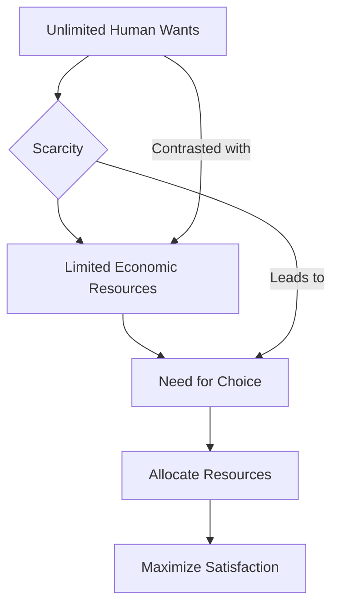

---

title: Scarcity_And_Choice
course: "Economics"
unit: '1'
semester: "Winter 2026"
mode: ECON-MICRO
type: atomic_note
hub: "[[1_Basics_Of_Economics_Hub]]"
source: "[[5-Pdf Store/note generated/Winter 2026/Economics/Chapter_1.pdf]]"
date: '2026-05-08'
prerequisites:
- "[[Definition_Of_Economics]]"
source_pages:
- 12
generated: true

---

## 1. Mental Model

In the high-stakes world of professional sports, specifically in the National Football League (NFL), teams exemplify the concept of scarcity and choice. For instance, consider the dilemma faced by the Kansas City Chiefs during the 2020 offseason, where they had to allocate their limited salary cap space (approximately $20 million) to retain key players, such as quarterback Patrick Mahomes, while also addressing other roster needs. **Two specific components of scarcity and choice are explicitly mapped here: (1) Unlimited wants (the Chiefs' desire to retain and acquire top talent to enhance their chances of winning a Super Bowl) and (2) Limited resources (the salary cap constraint)**, forcing the team's management to make tough choices, such as trading or releasing players, to free up cap space and ultimately construct a competitive roster.

## 2. Micro Theory

The fundamental concept of scarcity and choice is rooted in the foundational facts of economics, which posit that human wants are unlimited, while the availability of [[Economic_Resources]] to satisfy those wants is limited. This dichotomy necessitates the making of choices, as individuals and societies must allocate their scarce resources in a manner that maximizes the satisfaction of their [[Human_Wants]]. 

The unlimited nature of human wants implies that there is no definitive endpoint to the desires and needs of individuals and societies. Conversely, Economic Resources, which include labor, capital, and raw materials, are finite. This inherent scarcity of resources, juxtaposed with the boundless nature of human wants, underscores the fundamental economic problem of [[Scarcity]], which revolves around the allocation of limited resources to meet unlimited wants.

The process of making choices in the face of scarcity is a cornerstone of [[Economic_Analysis]], which employs both Positive Economics and Normative Economics to understand and evaluate the allocation of resources. Positive Economics focuses on the objective analysis of economic phenomena, describing 'what is,' while Normative Economics involves subjective judgments about 'what ought to be.' The interplay between these two branches of economics informs decision-making processes aimed at achieving an Efficient Allocation of resources.

The study of scarcity and choice is integral to Branches Of Economics, particularly Microeconomics, which examines the behaviors and decision-making processes of individual economic units, such as households and firms. Macroeconomics, on the other hand, focuses on aggregate economic phenomena, but also recognizes the importance of scarcity and choice at the macroeconomic level.

The foundational concept of scarcity and choice was notably discussed by Adam Smith, who is considered the father of modern economics. His works laid the groundwork for understanding how individuals and societies make choices to allocate resources, thereby influencing the development of Economic Systems.

The mechanism for addressing scarcity and choice involves answering the Basic Economic Questions of what to produce, how to produce, and for whom to produce. These questions are central to understanding how resources are allocated within an economy and are pivotal in determining the Resource Allocation that results.

The process of reasoning in economics, including Inductive Reasoning and Deductive Reasoning, plays a critical role in analyzing scarcity and choice. Economists use these reasoning methods to formulate theories and models that explain how individuals and societies make choices under conditions of scarcity.

Ultimately, the concept of scarcity and choice is encapsulated within the Definition Of Economics, which is concerned with the study of how societies use scarce resources to produce valuable goods and services and distribute them among different people. The essence of economics lies in understanding how to make choices that lead to the most efficient use of resources, thereby addressing the pervasive issue of scarcity.

## 3. Limitations & Edge Cases

The concept of scarcity and choice is limited in that it assumes individuals have complete knowledge of available resources and alternatives, which is often not the case in reality. Additionally, it presumes that individuals make rational decisions, ignoring the role of emotions, cognitive biases, and imperfect information in decision-making. Furthermore, scarcity and choice may not account for non-market activities, such as household production or unpaid work, which can also influence well-being. Moreover, the concept may not be applicable in a post-scarcity economy where technological advancements make goods and services virtually unlimited, rendering traditional notions of scarcity and choice obsolete. Lastly, it overlooks the impact of institutional and structural factors, such as unequal distribution of resources and power imbalances, which can severely constrain individual choices.

## 4. Market Graph



This flowchart illustrates the fundamental concept of scarcity and choice, highlighting the contrast between unlimited human wants and limited economic resources, which necessitates the making of choices to allocate resources and maximize satisfaction. The diagram demonstrates that scarcity leads to the need for choice, which ultimately aims to optimize the allocation of limited resources to meet unlimited wants.

## 5. Walkthrough

### 5-Step Technical Walkthrough of Scarcity and Choice

#### Step 1: Identification of Unlimited Human Wants
- **Fact**: Human material wants are unlimited.
- **Implication**: There is no definitive endpoint to the desires and needs of individuals and societies.

#### Step 2: Recognition of Limited Economic Resources
- **Fact**: Economic resources are limited (scarce).
- **Resources**: Include labor, capital, and raw materials.

#### Step 3: Acknowledgment of Scarcity
- **Definition**: Scarcity refers to the fundamental economic problem of allocating limited resources to meet unlimited wants.
- **Source**: Directly from the source text.

#### Step 4: Necessity of Choice
- **Reasoning**: Due to the scarcity of resources and the unlimited nature of human wants, individuals and societies must make choices.
- **Objective**: Allocate scarce resources in a manner that maximizes the satisfaction of human wants.

#### Step 5: Application in Economic Analysis
- **Role of Scarcity and Choice**: Cornerstone of economic analysis.
- **Methodology**: Employs tools and techniques to analyze how individuals and societies make choices given the constraints of scarcity.

---

## Review & Practice

```interactive-quiz

[
  {
    "type": "mcq",
    "difficulty": "L1",
    "question": "What is the fundamental problem that necessitates the making of choices in economics, given that human wants are unlimited while the availability of [[Economic_Resources]] to satisfy those wants is limited?",
    "options": {
      "A": "The efficient allocation of unlimited resources",
      "B": "The allocation of scarce [[Economic_Resources]] to meet unlimited [[Human_Wants]]",
      "C": "The maximization of [[Economic_Resources]] without considering human wants",
      "D": "The limitation of [[Human_Wants]] to match the availability of economic resources"
    },
    "answer": "B",
    "explanation": "The fundamental problem in economics is the allocation of scarce [[Economic_Resources]] to meet unlimited [[Human_Wants]]. This problem arises because human wants are boundless, while the resources available to satisfy those wants are limited. This necessitates making choices about how to allocate these scarce resources efficiently."
  },
  {
    "type": "fill_in",
    "difficulty": "L2",
    "question": "Fill in the blank.",
    "textWithBlanks": "The Blank is limited.",
    "answer": [
      "Economic_Resources"
    ],
    "explanation": "The fundamental concept of scarcity and choice is rooted in the foundational facts of economics, which posit that human wants are unlimited, while the availability of [[Economic_Resources]] to satisfy those wants is limited."
  },
  {
    "type": "true_false",
    "difficulty": "L1",
    "question": "In Labor Market Economics, an increase in income will lead to an increase in the demand for an inferior good.",
    "answer": false,
    "explanation": "In Labor Market Economics, when income increases, the demand for an inferior good actually decreases. Inferior goods are those for which demand decreases as income rises, and increases as income falls. This is in contrast to normal goods, for which demand increases as income rises."
  }
]

```