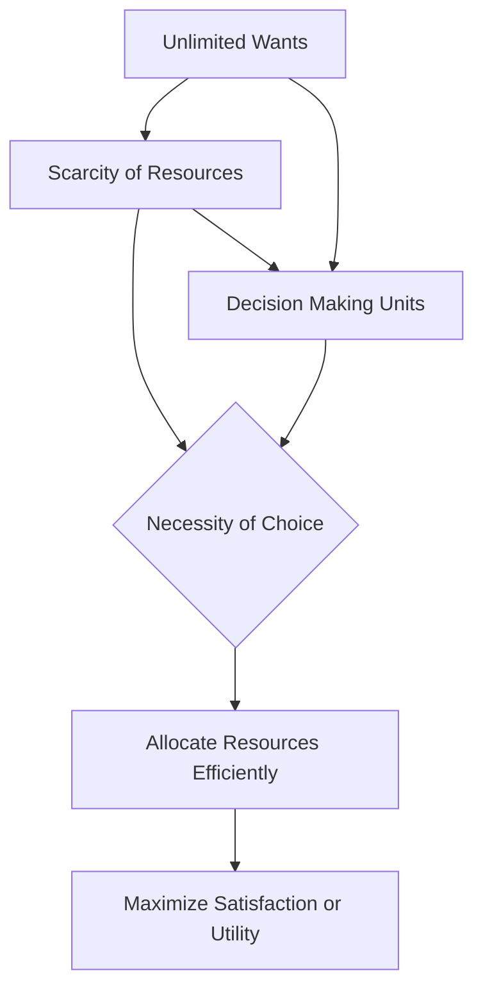

## 1. Mental Model
Imagine you have a super cool candy store in your neighborhood with an ENDLESS variety of your favorite treats, like gummies, chocolates, and lollipops. You want ALL of them, but, oh no! Your mom only gives you $5 to spend. Now, you can't buy EVERY candy you want because you don't have enough money. This is like life - we want lots of things (candy), but we don't have enough money (resources) to buy everything. This means you have to make CHOICES, like "Do I buy a yummy gummy bear or a delicious chocolate?" This everyday decision is a tiny example of Scarcity (not enough $) and Choice (picking one thing over another), which are the basic building blocks of economics!

## 2. Micro Theory
The concept of Scarcity And Choice is rooted in the foundational principles of economics, which acknowledge that human material wants are unlimited, while economic resources are limited, or scarce. This fundamental dichotomy necessitates the making of choices, as the insufficiency of resources to satisfy all desires prompts decision-making units, such as individuals, firms, and governments, to allocate resources efficiently.

The [[Definition_Of_Economics]] as a social science studying the production, distribution, and consumption of goods and services is built upon the understanding of [[Unlimited_Wants]] and [[Scarce_Resources]]. The scarcity of resources implies that not all wants can be fulfilled, leading to the necessity of choice. This scarcity is a pervasive problem that affects all [[Decision_Making_Units]], compelling them to make decisions about how to allocate resources in a manner that maximizes satisfaction or utility.

The mechanism of Scarcity And Choice operates through the concept of [[Opportunity_Cost]], which represents the value of the next best alternative that is given up when a choice is made. As resources are scarce, choosing to use a resource for one purpose means forgoing its use for another purpose. This trade-off is a direct consequence of scarcity and is a fundamental aspect of [[Economic_Analysis]].

The [[Production_Possibilities_Frontier]] (PPF) is a graphical representation of the various combinations of two goods or services that can be produced given the available resources and technology. The PPF illustrates the [[Law_Of_Increasing_Opportunity_Cost]], which states that as the production of one good increases, the opportunity cost of producing an additional unit of that good also increases. This concept highlights the constraints imposed by scarcity on production decisions.

In addressing the [[Basic_Economic_Questions]] of [[What_To_Produce]], [[How_To_Produce]], and [[For_Whom_To_Produce]], societies must make choices that reflect their values and priorities. These choices are influenced by the [[Economic_Systems]] in place, such as a [[Capitalist_Economy]], and the [[Role_Of_Government_In_Market_Economy]], which can affect the allocation of resources.

The study of Scarcity And Choice falls under [[Microeconomics]], a branch of economics that focuses on the behavior and decision-making of individual economic units. [[Positive_Economics]] and [[Normative_Economics]] both play roles in understanding scarcity and choice, with positive economics describing the economic phenomena as they are, and normative economics prescribing how they ought to be.

Theories and models in economics, such as those related to [[Efficient_Allocation]] and [[Resource_Allocation]], are developed using [[Deductive_Reasoning]] and [[Inductive_Reasoning]], providing frameworks for analyzing the implications of scarcity and choice. Moreover, the study of scarcity and choice is crucial for understanding [[Economic_Growth]] and [[Market_Failure]], as well as the potential interventions to address these issues.

In conclusion, Scarcity And Choice are foundational concepts in economics that arise from the interplay between [[Unlimited_Wants]] and [[Scarce_Resources]]. The necessity of making choices due to scarcity leads to the study of how resources are allocated, the implications of these choices, and the mechanisms by which economies attempt to achieve an efficient allocation of resources.

## 3. Limitations & Edge Cases
The concept of Scarcity and Choice has several limitations and edge cases, particularly when dealing with non-economic or non-market based societies, where wants and resources may not be quantifiable or tradable. For instance, in a subsistence economy, households may produce their own goods and services, rendering market prices and scarcity rents irrelevant. Additionally, the assumption of unlimited wants may not hold in cases where needs are satiated or where social and cultural norms dictate consumption patterns. Furthermore, the notion of scarcity may be distorted in situations where resources are abundant but unevenly distributed, such as with public goods or natural resources subject to congestion. Lastly, the framework may not account for non-rivalrous or non-excludable goods, where scarcity is not a binding constraint, and choices are not necessarily driven by market prices.

## 4. Market Graph


This flowchart illustrates the concept of Scarcity And Choice, highlighting the fundamental principles of unlimited wants and scarce resources, which necessitate the making of choices to allocate resources efficiently and maximize satisfaction or utility. The diagram shows how decision-making units, such as individuals, firms, and governments, are affected by scarcity and must make choices to optimize their outcomes.

## 5. Walkthrough
Here is the 5-step technical walkthrough of how 'Scarcity And Choice' operates:

**Step 1: Identify Unlimited Wants**
Human material wants are unlimited (Source: "Human (society‘s) material wants are unlimited"). This means that individuals, firms, and governments have insatiable desires for goods and services.

**Step 2: Identify Scarce Resources**
Economic resources are limited (scarce) (Source: "Economic resources are limited (scarce)"). This scarcity applies to all resources, implying that there is not enough to satisfy all desires.

**Step 3: Recognize the Scarcity Problem**
The unlimited nature of human wants and the scarcity of resources create a fundamental problem: not all wants can be fulfilled. This leads to a pervasive problem that affects all decision-making units.

**Step 4: Necessity of Choice**
The insufficiency of resources to satisfy all desires necessitates the making of choices (Source: "this fundamental dichotomy necessitates the making of choices"). Decision-making units, such as individuals, firms, and governments, must allocate resources efficiently.

**Step 5: Allocation of Resources**
Decision-making units must allocate resources in a manner that maximizes satisfaction or utility. This allocation is the essence of Scarcity And Choice, as it involves making decisions about how to use limited resources to fulfill unlimited wants.

---

## Review & Practice
```interactive-quiz
[
  {
    "type": "mcq",
    "difficulty": "L1",
    "question": "In the context of Game Theory Application and the principles of scarcity and choice, which of the following statements accurately describes the relationship between the price elasticity of demand and the law of demand, considering a market with a linear demand curve?",
    "options": {
      "A": "As price increases, the quantity demanded decreases, and the price elasticity of demand remains constant.",
      "B": "As price increases, the quantity demanded decreases, but the price elasticity of demand increases.",
      "C": "For a linear demand curve, the price elasticity of demand is constant along the entire curve.",
      "D": "The law of demand implies that as price increases, the quantity demanded decreases, but the price elasticity of demand is unrelated to the slope of the demand curve."
    },
    "answer": "B",
    "explanation": "The law of demand states that, ceteris paribus, as the price of a good increases, the quantity demanded decreases. The price elasticity of demand measures the responsiveness of the quantity demanded to a change in price. For a linear demand curve, the price elasticity of demand is not constant; it varies along the curve. Specifically, as you move up a linear demand curve (i.e., as price increases), the price elasticity of demand increases in absolute value, meaning demand becomes more elastic. This is because the formula for price elasticity of demand is $E_d = \\frac{\\% \\Delta Q_d}{\\% \\Delta P}$, and along a linear demand curve, the percentage change in quantity relative to the percentage change in price changes as you move along the curve. Therefore, as price increases and quantity decreases, the elasticity $|E_d| = \\left| \\frac{\\Delta Q / Q}{\\Delta P / P} \\right|$ increases, indicating that consumers are more responsive to price changes at higher prices. This relationship highlights how scarcity and choice interact through the mechanism of price elasticity, influencing consumer decisions and market outcomes."
  },
  {
    "type": "fill_in",
    "difficulty": "L2",
    "question": "The concept that represents the value of the next best alternative that is given up when a choice is made, due to scarce resources, is known as the [[blank]].",
    "textWithBlanks": "The [[blank]] is a fundamental concept in economics that arises from the scarcity of resources and the necessity of making choices.",
    "answer": [
      "Opportunity Cost"
    ],
    "explanation": "The Opportunity Cost is a direct consequence of scarcity and is a fundamental aspect of economic analysis. It can be represented as $OC = \\Delta y / \\Delta x$, where $\\Delta y$ is the change in the value of the next best alternative and $\\Delta x$ is the change in the chosen option. This concept is crucial in understanding the trade-offs involved in making economic decisions under conditions of scarcity."
  },
  {
    "type": "debug",
    "difficulty": "L2",
    "question": "Find the bug in the formula for the opportunity cost of producing one more unit of good X in terms of good Y, given by: $OC = \\frac{\\Delta Y}{\\Delta X}$ where $\\Delta Y$ is the change in production of good Y and $\\Delta X$ is the change in production of good X.",
    "content": "The formula for opportunity cost is $OC = \\frac{\\Delta Y}{\\Delta X}$. However, this formula seems to be incorrect in the context of calculating opportunity costs. The correct formula should reflect the trade-off between producing more of one good and less of another.",
    "answer": "The correct formula should be $OC = -\\frac{\\Delta Y}{\\Delta X}$",
    "required_keywords": [
      "fix_syntax"
    ],
    "explanation": "The opportunity cost of producing one more unit of good X in terms of good Y is given by the negative reciprocal of the slope of the production possibilities frontier (PPF). The formula provided, $OC = \\frac{\\Delta Y}{\\Delta X}$, does not account for the fact that an increase in the production of good X implies a decrease in the production of good Y, hence the negative sign. The correct formula should be $OC = -\\frac{\\Delta Y}{\\Delta X}$. This adjustment ensures that the opportunity cost is expressed as a positive value, reflecting the amount of good Y that must be given up to produce more of good X."
  },
  {
    "type": "trace",
    "difficulty": "L2",
    "question": "What is the exact output of the impact of a cost increase on the supply curve to equilibrium price and total revenue in a Game Theory Application?",
    "content": "Let's consider a scenario where a firm, operating in a perfectly competitive market, faces an increase in production costs due to higher wages. We will use the supply and demand model to trace the impact of this cost increase through the supply curve to the equilibrium price and total revenue.",
    "answer": "[\"The supply curve shifts to the left\", \"The equilibrium price increases\", \"The total revenue decreases\"]",
    "explanation": "Given the increase in production costs due to higher wages, we can model this situation using the supply and demand framework. The supply curve is given by $Q_s = f(P, C)$, where $Q_s$ is the quantity supplied, $P$ is the price of the good, and $C$ represents the costs of production. An increase in costs, such as higher wages, shifts the supply curve to the left, because at any given price, firms are now willing to supply less of the good due to the increased costs. This can be represented as $Q_s = f(P, C + \\Delta C)$. The new equilibrium is found where the demand curve intersects the new supply curve. The equilibrium price increases because the leftward shift of the supply curve creates a shortage at the original price, driving the price up. However, the total revenue, which is the product of the equilibrium price and quantity ($TR = P \\times Q$), decreases because the increase in price does not offset the decrease in quantity demanded and supplied."
  }
]
```