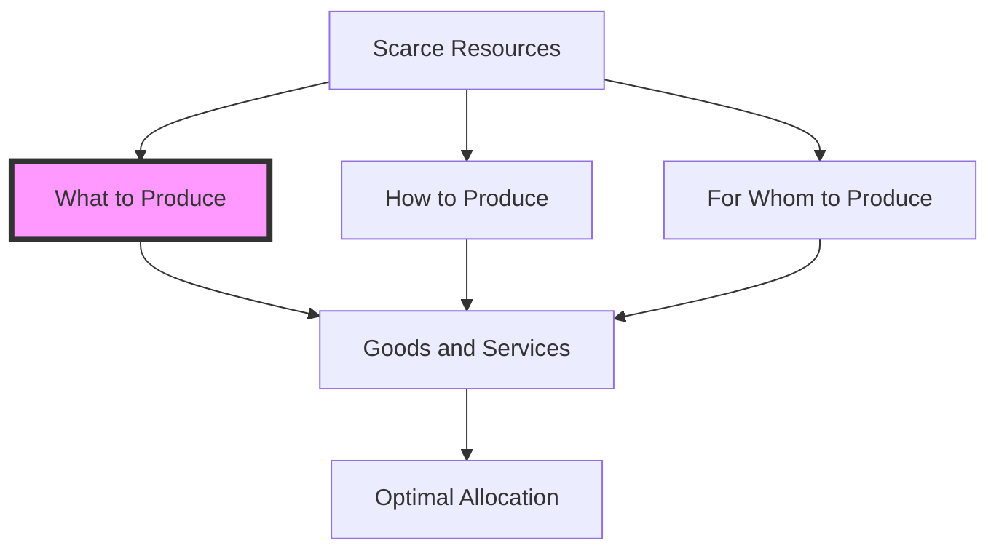

---

title: What_To_Produce
course: "Economics"
unit: '1'
semester: "Winter 2026"
mode: ECON-MICRO
type: atomic_note
hub: "[[1_Basics_Of_Economics_Hub]]"
source: "[[5-Pdf Store/note generated/Winter 2026/Economics/Chapter_1.pdf]]"
date: '2026-05-08'
prerequisites:
- "[[Basic_Economic_Questions]]"
source_pages:
- 51
generated: true

---

## 1. Mental Model

In the realm of environmental economics, a pressing issue is the production of renewable energy sources. For instance, suppose a government-owned utility company, HydroPower Inc., operates in a region with abundant water resources and aims to transition to cleaner energy. To address the question of "what to produce," HydroPower Inc. must decide how to allocate its resources to produce either more hydroelectric power or invest in emerging technologies like tidal or wave energy. Two key components in this decision are: (1) [[Opportunity_Cost]]: The company must weigh the benefits of producing more hydroelectric power, which is a proven and cost-effective technology, against the potential long-term benefits of investing in newer, yet riskier, tidal or wave energy technologies; and (2) [[Resource_Allocation]]: HydroPower Inc. needs to assess its existing infrastructure, technological capabilities, and labor force to determine the feasibility of producing a diversified energy portfolio, and whether to reallocate resources to support the production of alternative energy sources.

## 2. Micro Theory

The question of "What To Produce" is a fundamental problem in economics that arises from the scarcity of [[Economic_Resources]], which necessitates the allocation of these limited resources among competing uses. Given that economies cannot produce everything, they must decide what goods and services to produce and in what quantities, as stated in the foundational sentence: "Economies cannot produce everything, so they must decide what to produce and in what quantities." This decision is a critical component of the [[Basic_Economic_Questions]], which serve as a cornerstone for understanding how [[Economic_Systems]] function.

The process of determining what to produce involves a complex interplay of [[Human_Wants]] and the availability of resources. On one hand, Human Wants are diverse and unlimited, while on the other hand, the resources available to satisfy these wants are scarce. This disparity necessitates a mechanism for Resource Allocation that ensures an Efficient Allocation of resources, maximizing the satisfaction of wants given the constraints.

Adam Smith, often regarded as the father of modern economics, laid the groundwork for understanding how economies allocate resources in his seminal work, "The Wealth of Nations." He posited that individuals acting in their own self-interest can lead to socially beneficial outcomes, such as the efficient allocation of resources, through the mechanism of the market. This concept is central to Positive Economics, which focuses on describing and analyzing economic phenomena as they are, without making value judgments.

The technical analysis of what to produce involves both Inductive Reasoning and Deductive Reasoning. Inductive Reasoning is used to analyze data on consumer preferences, resource availability, and technological capabilities to infer what goods and services can be produced efficiently. Conversely, Deductive Reasoning applies economic theories and models, such as Microeconomics, to deduce the optimal allocation of resources given certain conditions.

This question is also deeply intertwined with Economic Analysis, which provides tools and methods to evaluate how resources are allocated to meet the demands of the market. Economic Analysis helps in understanding the implications of different production choices and in identifying the most efficient ways to produce goods and services.

Furthermore, the decision on what to produce has implications for Macroeconomics, as the aggregate output and composition of an economy's production can influence macroeconomic variables such as GDP, inflation, and employment. 

The study of what to produce falls under Branches Of Economics, specifically within Microeconomics, which examines the behavior and decision-making of individual economic units, such as households and firms, and how these decisions affect the allocation of resources.

In contrast, Normative Economics deals with what the economy should be like, or what ought to be, providing a value judgment on how resources should be allocated to produce goods and services. However, the technical definition and mechanism for determining what to produce are grounded in positive economic analysis.

Ultimately, the resolution of what to produce in an economy is a reflection of how that economy chooses to address the Scarcity of resources, through mechanisms that facilitate the efficient production of goods and services that best satisfy Human Wants. This process is guided by the principles of Efficient Allocation and is a critical aspect of answering the Basic Economic Questions that every economy must confront.

## 3. Limitations & Edge Cases

The "What to Produce" question in microeconomics is subject to limitations, particularly in assuming that resources are fully employed and efficiently allocated. A significant edge case arises when an economy faces resource constraints, such as scarcity of skilled labor or raw materials, which can limit the production of certain goods and services. Additionally, the presence of externalities, public goods, and imperfect information can also complicate the "What to Produce" decision, as market failures may lead to socially suboptimal production levels. Furthermore, economies with significant income inequality may prioritize production of essential goods and services for the less affluent, influencing the allocation of resources and the composition of output. These complexities highlight the challenges in determining the optimal production mix, underscoring that the "What to Produce" question is more nuanced than a simple allocation of resources.

## 4. Market Graph



The flowchart illustrates the central role of "What to Produce" in the broader context of basic economic questions, highlighting how the scarcity of resources influences the decisions on production and allocation. The emphasis on "What to Produce" underscores the necessity for economies to prioritize and make choices about which goods and services to create given the limitations on resources.

## 5. Walkthrough

### 5-Step Technical Walkthrough of "What To Produce"

#### Step 1: Define the Problem and Constraints
- **Problem Statement**: Economies face the issue of scarcity of economic resources.
- **Constraints**: Economies cannot produce everything; resources are limited.

#### Step 2: Identify Human Wants and Resources
- [[Human_Wants]]: Diverse and unlimited.
- **Resources**: Scarce.

#### Step 3: Determine the Objective
- **Objective**: Achieve efficient allocation of resources to satisfy human wants.

#### Step 4: Analyze Resource Allocation
- **Mechanism Needed**: For efficient allocation of scarce resources among competing uses.

#### Step 5: Decision Making
- **Decision**: Economies must decide **what goods and services to produce** and **in what quantities** given the constraints and objectives.

---

## Review & Practice

```interactive-quiz

[
  {
    "type": "mcq",
    "difficulty": "L1",
    "question": "What is the primary reason economies must decide what to produce and in what quantities?",
    "options": {
      "A": "Due to unlimited economic resources",
      "B": "Because economies cannot produce everything",
      "C": "As a result of fixed consumer preferences",
      "D": "Because of the abundance of human wants and limited resources"
    },
    "answer": "B",
    "explanation": "The fundamental problem in economics is that economies cannot produce everything, so they must decide what goods and services to produce and in what quantities. This decision is driven by the scarcity of economic resources and the need to allocate them among competing uses."
  },
  {
    "type": "fill_in",
    "difficulty": "L2",
    "question": "Fill in the blank.",
    "textWithBlanks": "The question of \"What To Produce\" is a fundamental problem in economics that arises from the scarcity of Blank, which necessitates the allocation of these limited resources among competing uses.",
    "answer": [
      "Economic Resources"
    ],
    "explanation": "The term that fits in the blank is 'Economic Resources'. This is a critical concept in economics as it relates to the fundamental problem of scarcity, which forces economies to make decisions about how to allocate limited resources among competing uses."
  },
  {
    "type": "true_false",
    "difficulty": "L1",
    "question": "For a normal good, an increase in consumer income will lead to a decrease in the quantity demanded.",
    "answer": false,
    "explanation": "For a normal good, an increase in consumer income will lead to an increase in the quantity demanded, as the good is considered a standard or desirable product that consumers want more of when their income increases. This is in contrast to an inferior good, where an increase in income leads to a decrease in quantity demanded."
  }
]

```