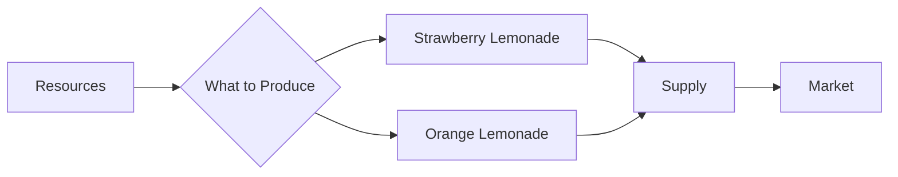

---

title: What_To_Produce
type: Atomic Note
course: Economics
semester: Winter 2026
unit: '1'
hub: "[[1_Basics_Of_Economics_Hub]]"
source: "[[Chapter_1.pdf]]"
source_pages:
- 51
- 52
mode: ECON-MACRO
read: false
generated: true
prerequisites:
- "[[Basic_Economic_Questions]]"

---

# 1. Mental Model

Imagine you have a lemonade stand and can only make two flavors: strawberry and orange. You can't make both flavors in huge quantities, so you have to choose which one to make more of. This is similar to what happens in an economy when it has to decide **what to produce**.

# 2. Economic Theory

The concept of **What To Produce** refers to one of the [[Basic_Economic_Questions]] that an economy must answer, specifically which goods and services to produce given the [[Scarcity]] of [[Economic_Resources]]. This decision involves determining the allocation of resources to produce certain goods and services over others, taking into account [[Opportunity_Cost]] and [[Unlimited_Human_Wants]]. Economies must prioritize and make choices about the types and quantities of goods and services to produce.

## 3. Economic Model



## 4. Walkthrough

* The economy starts with limited **Resources** (A), such as sugar, lemons, and labor.
* The decision **What to Produce** (B) determines how to allocate these resources.
* The economy can choose to produce **Strawberry Lemonade** (C) or **Orange Lemonade** (D), but not both in unlimited quantities.
* The produced goods are supplied to the **Market** (E, F), where consumers make purchasing decisions.

## 5. Market Failures

This concept can fail when there are **information asymmetries**, where producers don't accurately gauge consumer demand. Additionally, **externalities** like environmental costs of production or **opportunity costs** of choosing one product over another can lead to inefficient allocation of resources. Edge cases include **supply chain disruptions** that affect production capabilities.

---

## 6. The Proving Grounds

```interactive-quiz

[
  {
    "id": "q1",
    "type": "true_false",
    "difficulty": "L1",
    "question": "The decision of what to produce in an economy is solely determined by the availability of technology.",
    "answer": false,
    "explanation": "The decision of what to produce in an economy is primarily influenced by the scarcity of economic resources and the needs and wants of the society, not solely by the availability of technology. While technology can impact what can be produced and how efficiently it can be produced, the fundamental driver is the allocation of limited resources to meet unlimited wants, making technology just one of several factors."
  },
  {
    "id": "q2",
    "type": "synthesis",
    "difficulty": "L2",
    "question": "The small island nation of Azura has a limited amount of fertile land and water resources. The government must decide how to allocate these resources to produce either more coconuts or more fish for the population. The demand for coconuts is high due to their nutritional value, but the fishing industry has been growing rapidly and provides a significant source of income. Using the concept of 'What To Produce', determine the best allocation of resources for Azura's economy.",
    "answer": "A grading rubric with criteria including: (1) understanding of the concept of 'What To Produce' (20 points); (2) analysis of the pros and cons of producing coconuts versus fish (30 points); (3) consideration of the impact of scarcity on resource allocation (20 points); (4) justification of the chosen allocation of resources based on economic theory (30 points).",
    "explanation": "The concept of 'What To Produce' is crucial in economics as it deals with the allocation of scarce resources to meet the demands of a population. In Azura's case, the government must weigh the benefits of producing coconuts, which are essential for nutrition, against the benefits of producing fish, which provide a significant source of income. A good answer will demonstrate an understanding of this concept and apply it to the scenario, considering factors such as opportunity cost, resource scarcity, and the trade-offs involved in making one choice over the other. The grading rubric will assess the student's ability to analyze the situation, consider multiple perspectives, and justify their decision based on economic theory."
  },
  {
    "id": "q3",
    "type": "writing",
    "difficulty": "L3",
    "question": "Explain the concept of 'What To Produce' in the context of economics, specifically how an economy decides which goods and services to produce given the scarcity of resources.",
    "answer": "An economy must decide which goods and services to produce given the scarcity of resources, prioritizing the allocation of resources to meet the most pressing needs and wants of its society.",
    "explanation": "The decision of what to produce in an economy is fundamentally driven by the need to allocate limited resources in a way that maximizes the satisfaction of the society's needs and wants. This involves evaluating the available resources, such as labor, capital, and raw materials, and determining the most efficient way to utilize them to produce goods and services. The concept is often illustrated through simple models like the lemonade stand example, where the owner must choose to produce more of one flavor over the other due to limited capacity, reflecting the broader economic challenge of making production decisions under scarcity."
  }
]

```