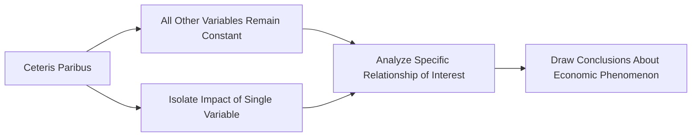

---

title: Ceteris_Paribus
course: Economics
unit: '2'
semester: Winter 2026
mode: ECON-MICRO
type: atomic_note
hub: '[[2_Basics_Of_Economics_Hub]]'
source: '[[5-Pdf Store/note generated/Winter 2026/Economics/Chapter_2.pdf]]'
date: '2026-05-08'
prerequisites:
- '[[Demand_Function]]'
- '[[Market_Demand_Curve]]'
- '[[Law_Of_Demand]]'
- '[[Substitute_Goods]]'
- '[[Complementary_Goods]]'
source_pages:
- 5
generated: true

---


## 1. Mental Model

Imagine you're at a lemonade stand, and you want to see how a price increase affects how many cups of lemonade you buy. Ceteris paribus is like saying, "Let's pretend that nothing else changes - it's still a sunny day, you're still thirsty, and your mom still has the same amount of money to spend." This way, if the lemonade stand owner raises the price from 50 cents to 75 cents, you can see how that one change affects your buying decision, without other things like the weather or your mom's wallet getting in the way. It's like holding everything else constant, so you can focus on just the impact of the price change!

## 2. Micro Theory

The concept of Ceteris Paribus, which translates to "all things being equal" or "other things being equal," is a fundamental assumption in microeconomics that enables economists to isolate the impact of a single variable or change in circumstances on a particular economic phenomenon. This assumption is crucial in the development of economic theories, models, and analyses, as it allows researchers to abstract away from the complexity of real-world situations and focus on the specific relationship of interest.

In essence, Ceteris Paribus is a methodological device that permits economists to analyze the effects of a change in one variable, while assuming that all other relevant variables remain constant. This assumption is essential in the construction of economic models, such as the [[Demand_Function]] and [[Market_Demand_Curve]], which are used to study the behavior of consumers and firms.

For instance, when analyzing the [[Law_Of_Demand]], economists assume that Ceteris Paribus holds, meaning that changes in the price of a good are the only factor affecting the quantity demanded, while other factors such as income, tastes, and prices of related goods (e.g., [[Substitute_Goods]] and [[Complementary_Goods]]) remain constant. This allows them to derive the [[Demand_Curve]], which shows the relationship between the price of a good and the quantity demanded.

Similarly, in the context of [[Market_Equilibrium]], Ceteris Paribus is assumed to hold, enabling economists to examine the interaction between the [[Demand_Curve]] and Supply Curve and determine the equilibrium price and quantity. Any changes in market conditions, such as a [[Shift_In_Supply_Curve]] or a change in Production Costs, are analyzed under the assumption that all other factors remain constant.

The Ceteris Paribus assumption also underlies the concept of elasticity, including [[Price_Elasticity_Of_Demand]], [[Income_Elasticity_Of_Demand]], and [[Cross_Price_Elasticity]], which measure the responsiveness of quantity demanded or supplied to changes in price, income, or other factors. For example, when calculating the [[Price_Elasticity_Of_Demand]], economists assume Ceteris Paribus to isolate the effect of a price change on quantity demanded.

Furthermore, Ceteris Paribus is essential in understanding the behavior of firms and consumers in response to changes in market conditions, such as [[Technological_Advancement]] or changes in [[Market_Demand]]. By assuming that all other factors remain constant, economists can analyze the impact of these changes on the behavior of economic agents and the resulting market outcomes.

The Ceteris Paribus assumption also facilitates the distinction between [[Normal_Goods]] and [[Inferior_Goods]], as well as between [[Substitute_Goods]] and [[Complementary_Goods]], by allowing economists to isolate the effects of changes in income or prices on the demand for these goods.

In conclusion, the Ceteris Paribus assumption is a powerful analytical tool in microeconomics that enables researchers to simplify complex economic situations, isolate the effects of a single change in circumstances, and develop theories and models that help us understand the behavior of economic agents and markets. By assuming that all other things are equal, economists can conduct rigorous and meaningful analyses of economic phenomena, which inform policy decisions and business strategies.

## 3. Limitations & Edge Cases

The assumption of ceteris paribus, or "all else being equal," is a crucial tool in microeconomic analysis, but it has significant limitations. In reality, it is often difficult to isolate a single change in circumstances, as multiple factors tend to change simultaneously, making it challenging to hold all else constant. Furthermore, the ceteris paribus assumption can lead to oversimplification of complex relationships, neglecting potential interactions and feedback effects between variables. Additionally, the assumption may not hold in situations where there are significant external shocks, structural changes, or non-linear relationships, rendering the analysis less reliable. As a result, economists must be cautious when interpreting results derived from ceteris paribus assumptions, recognizing that real-world outcomes may diverge from predicted outcomes due to the inevitable changes in other factors.

## 4. Market Graph



The Ceteris Paribus assumption is a crucial methodological tool in Industrial Organization, allowing economists to isolate the impact of a single variable on a particular economic phenomenon while assuming all other variables remain constant. By using Ceteris Paribus, researchers can develop and analyze economic models, such as demand functions and market demand curves, to study the behavior of consumers and firms.

## 5. Walkthrough

### 5-Step Technical Walkthrough of Ceteris Paribus

#### Step 1: Identify the Variable of Interest and the Assumption
The variable of interest is the one that economists want to analyze the effect of changing. The assumption of Ceteris Paribus (all things being equal) is made to isolate this effect.

#### Step 2: Apply the Ceteris Paribus Assumption
Assume that all other relevant variables remain constant apart from the variable of interest. This means if we are analyzing the effect of a change in the price of a good on its demand, we assume that income, prices of related goods, tastes, and population remain unchanged.

#### Step 3: Analyze the Effect of the Change
With all other variables held constant, analyze how the change in the variable of interest affects the economic phenomenon being studied. For example, if the price of wheat increases and we assume ceteris paribus, we would study how this price increase affects the quantity of wheat demanded without considering changes in other factors.

#### Step 4: Use Economic Models
Utilize economic models such as the Demand Function or Market Demand Curve to study the relationship under the assumption of Ceteris Paribus. These models help in understanding how changes in one variable (e.g., price) affect another variable (e.g., quantity demanded), holding all else constant.

#### Step 5: Interpret Results
Interpret the results of the analysis, keeping in mind that they are based on the Ceteris Paribus assumption. This means the observed effects are due to the change in the variable of interest and not due to changes in other variables. For instance, if the analysis shows that a 10% increase in the price of WTI Crude Oil leads to a 5% decrease in its quantity demanded (based on historical data where other influencing factors remained relatively constant), this relationship is understood under the assumption that all other factors were held constant.

---

## Review & Practice

```interactive-quiz

[
  {
    "type": "mcq",
    "difficulty": "L1",
    "question": "What does the term 'Ceteris Paribus' mean in the context of economic analysis?",
    "options": {
      "A": "All variables are changing simultaneously",
      "B": "All things being equal or other things being equal",
      "C": "Only one variable is changing at a time",
      "D": "Economic models are irrelevant in real-world situations"
    },
    "answer": "B",
    "explanation": "The term 'Ceteris Paribus' is a Latin phrase that translates to 'all things being equal' or 'other things being equal.' It is a fundamental assumption in economics that allows researchers to isolate the impact of a single variable or change in circumstances on a particular economic phenomenon by assuming that all other relevant variables remain constant."
  },
  {
    "type": "fill_in",
    "difficulty": "L2",
    "question": "Fill in the blank.",
    "textWithBlanks": "The concept of Ceteris Paribus, which translates to \"all things being equal\" or \"other things being equal,\" is a fundamental assumption in microeconomics that enables economists to isolate the impact of a single variable or change in circumstances on a particular economic phenomenon, using the Blank assumption.",
    "answer": [
      "Ceteris Paribus"
    ],
    "explanation": "The Ceteris Paribus assumption is crucial in the development of economic theories, models, and analyses."
  },
  {
    "type": "debug",
    "difficulty": "L1",
    "question": "Find the bug in the following Ceteris Paribus scenario: 'When analyzing the effect of a price increase on the quantity demanded of a good, we assume that Ceteris Paribus holds, meaning that changes in Blank1 and Blank2 are the only factors affecting the quantity demanded, while other factors such as income and prices of related goods remain constant.'",
    "content": "The Ceteris Paribus assumption is crucial in the development of economic theories, models, and analyses. It enables economists to isolate the impact of a single variable or change in circumstances on a particular economic phenomenon.",
    "answer": "The bug is that the statement incorrectly implies that changes in Blank1 and Blank2 are the only factors affecting the quantity demanded. Instead, Ceteris Paribus assumes that all other factors, including Blank1 = income and Blank2 = prices of related goods, remain constant, and only the price of the good changes.",
    "required_keywords": [
      "Ceteris Paribus",
      "Demand Function",
      "Market Demand Curve"
    ],
    "explanation": "The correct interpretation of Ceteris Paribus is that all other relevant variables, such as income and prices of related goods, remain constant, allowing economists to isolate the effect of a single variable, in this case, the price of the good, on the quantity demanded."
  }
]

```