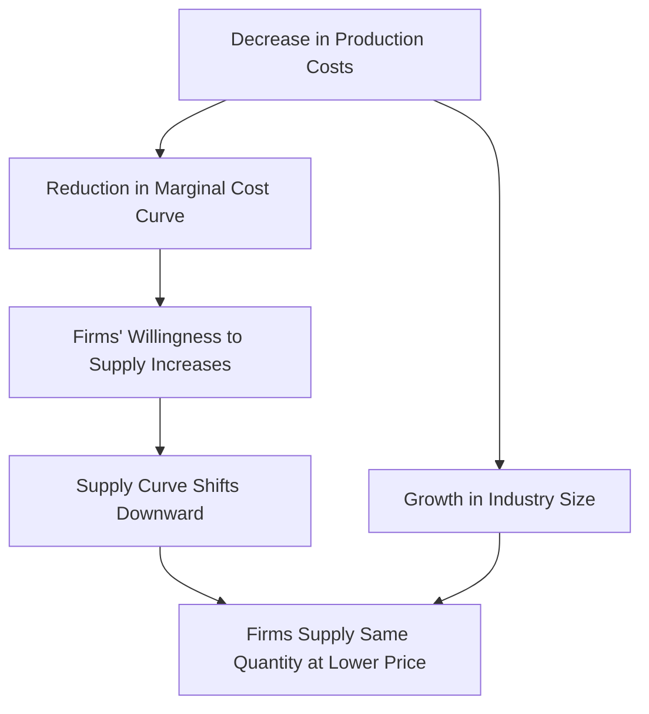

---

title: Change_In_Production_Costs
course: Economics
unit: '2'
semester: Winter 2026
mode: ECON-MICRO
type: atomic_note
hub: '[[2_Basics_Of_Economics_Hub]]'
source: '[[5-Pdf Store/note generated/Winter 2026/Economics/Chapter_2.pdf]]'
date: '2026-05-08'
prerequisites:
- '[[Law_Of_Supply]]'
- '[[Technological_Advancement]]'
- '[[Market_Demand_Curve]]'
- '[[Ceteris_Paribus]]'
- '[[Market_Equilibrium]]'
source_pages:
- 46
- 47
generated: true

---


## 1. Mental Model

Imagine you have a lemonade stand. You make yummy lemonade and sell it to people walking by. One day, your mom tells you that she found a way to make big jugs of lemonade mix at a super cheap price, so now it costs you less to make lemonade. This is like a decrease in production costs! You can now make more lemonade for the same price, or make the same amount of lemonade for less money. As more and more kids in the neighborhood hear about your yummy lemonade, they want to start their own lemonade stands too! Soon, there are many more lemonade stands, and the whole neighborhood is making lemonade. This is like growth in the size of the industry. Because there are more lemonade stands, and it's cheaper to make lemonade, you might need to sell your lemonade for a lower price to compete with the other stands. But that's okay, because you're still making a profit and getting to make lots of yummy lemonade!

## 2. Micro Theory

The concept of Change In Production Costs is a crucial determinant of a firm's supply behavior, influencing the overall market equilibrium. A change in production costs refers to a shift in the expenses incurred by a firm to produce a given quantity of output. This change can significantly impact a firm's profit-maximizing output level and, subsequently, the market supply curve.

When analyzing a decrease in production costs, it is essential to consider the [[Law_Of_Supply]], which states that, ceteris paribus, an increase in the price of a good will lead to an increase in the quantity supplied. A decrease in production costs can be viewed as a reduction in the firm's marginal cost curve, enabling the firm to produce each unit of output at a lower expense. This decrease in costs will cause the supply curve to shift downward, as firms are now willing to supply the same quantity of output at a lower price.

The growth in the size of the industry can also contribute to a decrease in production costs, as [[Technological_Advancement]] and Economies Of Scale can be achieved through increased output. As the industry expands, firms can take advantage of specialization, improved technology, and more efficient use of resources, leading to lower average costs.

The impact of a decrease in production costs on the market can be understood by examining the [[Market_Demand_Curve]] and the Market Supply Curve. Assuming a [[Ceteris_Paribus]] assumption, a decrease in production costs will lead to an increase in the supply of the good, causing the market supply curve to shift to the right. This shift will result in a new [[Market_Equilibrium]], characterized by a lower market price and a higher equilibrium quantity.

The magnitude of the change in production costs can be measured using the [[Price_Elasticity_Of_Supply_Formula]], which calculates the percentage change in quantity supplied in response to a percentage change in price. A decrease in production costs will lead to an increase in the elasticity of supply, as firms become more responsive to changes in price.

The [[Point_And_Arc_Method]] can be employed to calculate the elasticity of supply over a specific range of prices. Furthermore, the [[Types_Of_Elasticity_Of_Supply]], such as elastic and inelastic supply, can help firms and policymakers understand the responsiveness of suppliers to changes in market conditions.

The [[Length_And_Complexity_Of_Production]], [[Mobility_And_Availability_Of_Factors]], and [[Time_To_Respond]] are essential factors that influence the elasticity of supply. For instance, if a firm can quickly adjust its production process in response to changes in market conditions, its supply will be more elastic.

The [[Market_Equilibrium_Example]] illustrates how a decrease in production costs can lead to a new market equilibrium. Suppose the initial market equilibrium is characterized by a price of $10 and a quantity of 100 units. A decrease in production costs shifts the supply curve to the right, resulting in a new equilibrium price of $8 and a quantity of 120 units.

In conclusion, a decrease in production costs, accompanied by growth in the size of the industry, can lead to a shift in the supply curve, resulting in a new market equilibrium characterized by a lower price and a higher quantity. Understanding the technical aspects of Change In Production Costs is essential for firms and policymakers to make informed decisions about investments, resource allocation, and regulatory policies.

## 3. Limitations & Edge Cases

The change in production costs, specifically a decrease in costs, can be limited by factors such as diminishing returns to scale, where increased production leads to higher costs per unit, and the growth in industry size may not necessarily lead to lower costs if the industry experiences congestion and increased competition for resources, driving up costs; moreover, if the decrease in production costs is driven by reductions in input prices, such as wages or raw materials, there may be limits to how far these costs can fall, and if the industry grows rapidly, it may lead to upward pressure on wages and input prices, offsetting the initial decrease in production costs and limiting the extent of the shift in the supply curve.

## 4. Market Graph



A decrease in production costs leads to a reduction in the marginal cost curve, causing the supply curve to shift downward, and allowing firms to supply the same quantity of output at a lower price. The growth in the size of the industry can also contribute to a decrease in production costs, ultimately leading to an increase in the quantity supplied at a lower price.

## 5. Walkthrough

### 5-Step Technical Walkthrough of Change In Production Costs

#### Step 1: Understand the Initial Conditions
- **Initial Condition**: A firm is producing a certain quantity of output at a given cost.
- **Source Reference**: The concept of Change In Production Costs influencing a firm's supply behavior.

#### Step 2: Analyze the Decrease in Production Costs
- **Change in Condition**: A decrease in production costs occurs.
- **Impact**: This decrease reduces the firm's marginal cost curve.
- **Source Reference**: A decrease in production costs can be viewed as a reduction in the firm's marginal cost curve.

#### Step 3: Determine the Effect on the Supply Curve
- **Effect on Supply Curve**: The decrease in production costs causes the supply curve to shift downward.
- **Reasoning**: Firms are now willing to supply the same quantity of output at a lower price due to reduced costs.
- **Source Reference**: This decrease in costs will cause the supply curve to shift downward.

#### Step 4: Consider the Role of Industry Growth
- **Additional Factor**: Growth in the size of the industry.
- **Impact on Costs**: Contributes to a decrease in production costs.
- **Source Reference**: The growth in the size of the industry can also contribute to a decrease in production costs.

#### Step 5: Relate to the Law of Supply
- **Relevant Principle**: The Law of Supply states that, ceteris paribus, an increase in the price of a good will lead to an increase in the quantity supplied.
- **Application**: A decrease in production costs enhances the firm's ability to supply more output at any given price, aligning with the Law of Supply.
- **Source Reference**: When analyzing a decrease in production costs, it is essential to consider the Law of Supply.

---

## Review & Practice

```interactive-quiz

[
  {
    "type": "mcq",
    "difficulty": "L1",
    "question": "What is the primary effect of a decrease in production costs on a firm's supply behavior?",
    "options": {
      "A": "An increase in the price of the good will lead to a decrease in the quantity supplied.",
      "B": "The supply curve will shift downward, as firms are now willing to supply the same quantity of output at a lower price.",
      "C": "The market demand curve will shift to the left, resulting in a lower market price and a lower equilibrium quantity.",
      "D": "The firm's marginal revenue will decrease, leading to a reduction in the quantity produced."
    },
    "answer": "B",
    "explanation": "A decrease in production costs can be viewed as a reduction in the firm's marginal cost curve, enabling the firm to produce each unit of output at a lower expense. This decrease in costs will cause the supply curve to shift downward, as firms are now willing to supply the same quantity of output at a lower price."
  },
  {
    "type": "fill_in",
    "difficulty": "L2",
    "question": "Fill in the blank.",
    "textWithBlanks": "A decrease in production costs can be viewed as a reduction in the firm's marginal cost curve, enabling the firm to produce each unit of output at a lower expense, due to Blank.",
    "answer": [
      "Technological Advancement",
      "Economies of Scale"
    ],
    "explanation": "The decrease in production costs can be attributed to technological advancements and economies of scale, which enable firms to produce at a lower expense.",
    "required_keywords": [
      "Technological Advancement",
      "Economies of Scale",
      "production costs"
    ]
  },
  {
    "type": "debug",
    "difficulty": "L1",
    "question": "Find the bug in the following formula for calculating the change in production costs: TC = Fixed Costs + Variable Costs * (1 - Incorrect Variable);",
    "content": "The formula for total costs (TC) is typically represented as TC = Fixed Costs + Variable Costs * Quantity. However, in the given formula, the variable costs are adjusted by (1 - Incorrect Variable), which seems incorrect.",
    "answer": "The bug is in the term (1 - Incorrect Variable). It should be simply Variable Costs * Quantity or an adjustment factor that accurately reflects a change in variable costs, not (1 - Incorrect Variable). The correct formula should be TC = Fixed Costs + Variable Costs * Quantity.",
    "required_keywords": [
      "Fixed_Costs",
      "Variable_Costs",
      "Quantity",
      "Total_Costs"
    ],
    "explanation": "The given formula incorrectly adjusts variable costs by an undefined term (1 - Incorrect Variable), which does not accurately represent the relationship between total costs, fixed costs, and variable costs. The correct approach directly multiplies variable costs by the quantity produced."
  }
]

```