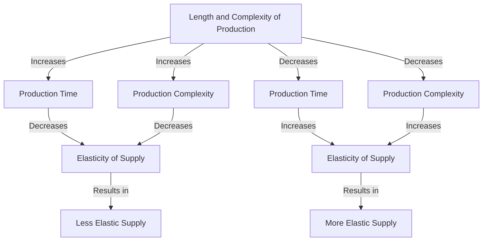

---

title: Determinants_Of_Elasticity_Of_Supply
course: Economics
unit: '2'
semester: Winter 2026
mode: ECON-MICRO
type: atomic_note
hub: '[[2_Basics_Of_Economics_Hub]]'
source: '[[5-Pdf Store/note generated/Winter 2026/Economics/Chapter_2.pdf]]'
date: '2026-05-08'
prerequisites:
- '[[Ceteris_Paribus]]'
- '[[Law_Of_Supply]]'
- '[[Price_Elasticity_Of_Supply_Formula]]'
- '[[Point_And_Arc_Method]]'
- '[[Technological_Advancement]]'
source_pages:
- 48
- 49
- 50
generated: true

---


## 1. Mental Model

Imagine you have a lemonade stand. If you can quickly make lemonade from a simple mix of lemon juice, sugar, and water, you can easily increase or decrease the amount you sell if the price changes. But, if you were making lemonade from scratch by growing lemons and sugarcane, and then harvesting, squeezing, and boiling them down to make the syrup, it would take a lot longer to change how much lemonade you sell. That's kind of like how supply elasticity works! If it's easy and quick to make or provide something (like lemonade from a mix), the supply is more elastic, meaning you can easily change how much you sell. But if it's hard and takes a long time (like making lemonade from scratch), the supply is less elastic, meaning it's harder to change how much you sell.

## 2. Micro Theory

The elasticity of supply, a fundamental concept in microeconomics, measures the responsiveness of the quantity supplied of a good to changes in its price, while holding all other influencing factors constant, as per the [[Ceteris_Paribus]] assumption. The degree of elasticity of supply is significantly influenced by several determinants, one of which is the length and complexity of production. This determinant essentially examines how the production process's intricacy and duration impact the elasticity of supply.

When analyzing the effect of the length and complexity of production on the elasticity of supply, it is crucial to understand that production processes vary significantly across different goods and services. The complexity and time required to produce a good can substantially affect a producer's ability to adjust the quantity supplied in response to price changes.

Goods with production processes that are less complex and shorter in duration tend to have a more elastic supply. This is because producers can quickly respond to changes in market conditions, such as an increase in demand signaled by a higher price. For instance, if a farmer can easily and quickly switch between producing wheat or corn based on market prices, the supply of these goods will be highly elastic. The ease and speed with which the farmer can adjust production enable a more responsive supply to price changes.

Conversely, goods with production processes that are more complex and longer in duration tend to have a less elastic supply. For example, in the case of specialized electronic equipment that requires a lengthy and intricate production process, manufacturers may find it challenging to rapidly adjust production levels in response to price fluctuations. The complexity and time required to produce such goods limit the producers' ability to quickly adapt to changing market conditions, resulting in a less elastic supply.

The relationship between the length and complexity of production and the elasticity of supply can be understood through the lens of the [[Law_Of_Supply]], which posits that, ceteris paribus, an increase in the price of a good will lead to an increase in the quantity supplied. The extent to which this occurs, however, depends on the producers' ability to adjust production. This adjustment capability is directly influenced by how quickly and easily production can be modified, which in turn is affected by the production process's length and complexity.

Furthermore, the impact of production complexity on elasticity of supply can also be related to the [[Price_Elasticity_Of_Supply_Formula]], which calculates the elasticity of supply by measuring the percentage change in quantity supplied in response to a percentage change in price. The formula essentially quantifies the responsiveness of suppliers to price changes, with the degree of responsiveness being influenced by factors such as the length and complexity of production.

The [[Point_And_Arc_Method]] can be used to calculate elasticity at different points on the supply curve, providing insights into how elasticity may change over different ranges of price and quantity. This method, combined with an understanding of production complexities, allows for a nuanced analysis of how different production processes affect the overall elasticity of supply.

In conclusion, the determinant of the elasticity of supply related to the length and complexity of production highlights the importance of production processes in influencing the responsiveness of quantity supplied to price changes. By understanding this relationship, one can better analyze how changes in market conditions, as signaled by price changes, affect the supply of goods and services with varying production complexities.

The mobility and availability of factors of production, as well as the time to respond to market changes, are also crucial determinants that interact with the complexity of production to influence the elasticity of supply. These factors collectively contribute to the overall responsiveness of suppliers to changes in market prices, underscoring the multifaceted nature of supply elasticity.

The [[Technological_Advancement]] can also play a role here, as a more advanced technology can simplify and shorten the production process, making the supply more elastic. Similarly, a [[Change_In_Production_Costs]] can affect producers' ability to supply goods at different price levels, influencing the elasticity of supply.

Understanding these dynamics within the context of [[Market_Equilibrium]], where the quantity supplied equals the quantity demanded, and how shifts in supply and demand affect this equilibrium, is essential for a comprehensive analysis of the determinants of elasticity of supply. 

The [[Types_Of_Elasticity_Of_Supply]] provide a framework for categorizing and understanding the varying degrees of supply elasticity, which are influenced by determinants such as the length and complexity of production. 

The interaction between these determinants and the resulting elasticity of supply plays a critical role in the broader analysis of [[Surplus_And_Shortage]] situations and the [[Effects_Of_Shift_In_Demand_And_Supply]], ultimately influencing market outcomes. 

The [[Market_Equilibrium_Example]] illustrates how these concepts operate in practical scenarios, demonstrating the significance of understanding the determinants of elasticity of supply in real-world markets. 

The analysis of determinants such as the length and complexity of production, therefore, not only deepens the understanding of elasticity of supply but also contributes to a more nuanced comprehension of market dynamics and the responsiveness of suppliers to changing market conditions.

## 3. Limitations & Edge Cases

The determinants of elasticity of supply have specific limitations, particularly when considering the length and complexity of production. For instance, if production involves a lengthy and intricate process, the supply may not be easily adjustable, leading to inelastic supply. Conversely, for goods with simple and short production processes, supply can be quickly adjusted, making it more elastic. However, this relationship may not hold in cases where production is subject to significant indivisibilities or lumpy investments, rendering supply relatively inelastic despite a relatively short production period, or where technological constraints limit the ability to rapidly adjust production even with simple processes.

## 4. Market Graph



The provided Mermaid flowchart illustrates how the length and complexity of production influence the elasticity of supply. A less complex and shorter production process results in a more elastic supply, while a more complex and longer production process leads to a less elastic supply.

## 5. Walkthrough

## Step 1: Define Elasticity of Supply

The elasticity of supply measures the responsiveness of the quantity supplied of a good to changes in its price, holding all other influencing factors constant (Ceteris Paribus).

## Step 2: Identify the Determinant - Length and Complexity of Production

The determinant of elasticity of supply being analyzed is the length and complexity of production. This determinant assesses how the intricacy and duration of the production process impact the elasticity of supply.

## 3: Analyze the Relationship Between Production Complexity and Elasticity of Supply

Goods with less complex production processes and shorter production durations tend to have a more elastic supply. This implies that producers can quickly adjust the quantity supplied in response to price changes.

## 4: Apply the Concept to a Real-World Scenario

Consider the production of wheat versus a complex electronic device. Wheat has a relatively simple production process and a shorter production cycle (typically several months), allowing farmers to quickly respond to price changes by adjusting the quantity of wheat they produce. In contrast, electronic devices have complex production processes and longer production cycles, making it more difficult for manufacturers to quickly adjust production in response to price changes.

## 5: Conclusion on Elasticity of Supply Determinant

Given that the length and complexity of production affect the elasticity of supply, it can be concluded that goods with simpler and shorter production processes (like wheat) will have a more elastic supply compared to goods with complex and longer production processes (like electronic devices).

---

## Review & Practice

```interactive-quiz

[
  {
    "type": "mcq",
    "difficulty": "L1",
    "question": "What is the effect of a production process with a shorter duration and less complexity on the elasticity of supply?",
    "options": {
      "A": "It leads to a less elastic supply because producers find it difficult to adjust production quickly.",
      "B": "It leads to a more elastic supply because producers can quickly adjust the quantity supplied in response to price changes.",
      "C": "It has no impact on the elasticity of supply as producers' ability to adjust production is not affected.",
      "D": "It leads to a unit elastic supply as the percentage change in quantity supplied equals the percentage change in price."
    },
    "answer": "B",
    "explanation": "Goods with production processes that are less complex and shorter in duration tend to have a more elastic supply. This is because producers can quickly respond to changes in market conditions, such as an increase in demand signaled by a higher price."
  },
  {
    "type": "fill_in",
    "difficulty": "L2",
    "question": "Fill in the blank.",
    "textWithBlanks": "The Blank assumption is crucial in analyzing the elasticity of supply.",
    "answer": [
      "Ceteris Paribus"
    ],
    "explanation": "The Ceteris Paribus assumption is fundamental in economics, including the analysis of the elasticity of supply, as it allows for the examination of the relationship between the price of a good and its quantity supplied while holding all other influencing factors constant."
  },
  {
    "type": "debug",
    "difficulty": "L1",
    "question": "Find the bug in the following statement about determinants of elasticity of supply: Goods with production processes that are less complex and shorter in duration tend to have a more elastic supply because producers can quickly respond to changes in market conditions, such as an increase in demand signaled by a Lowered price.",
    "content": "The elasticity of supply, a fundamental concept in microeconomics, measures the responsiveness of the quantity supplied of a good to changes in its price, while holding all other influencing factors constant, as per the [[Ceteris_Paribus]] assumption. The degree of elasticity of supply is significantly influenced by several determinants, one of which is the length and complexity of production.",
    "answer": "The bug is 'lowered'. It should be 'higher'. According to the Law of Supply, an increase in price leads to an increase in quantity supplied.",
    "required_keywords": [
      "Ceteris_Paribus",
      "Law_Of_Supply",
      "Price_Elasticity_Of_Supply_Formula"
    ],
    "explanation": "The correct statement should indicate that producers respond to a higher price, not a lowered price, to reflect the positive relationship between price and quantity supplied as per the Law of Supply."
  }
]

```