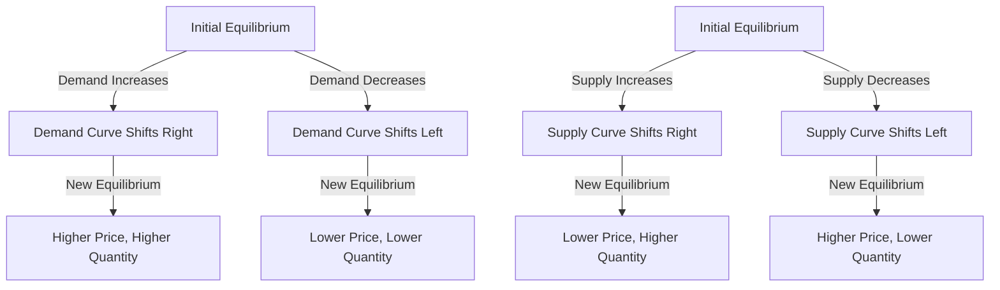

---

title: Effects_Of_Shift_In_Demand_And_Supply
course: Economics
unit: '2'
semester: Winter 2026
mode: ECON-MICRO
type: atomic_note
hub: '[[2_Basics_Of_Economics_Hub]]'
source: '[[5-Pdf Store/note generated/Winter 2026/Economics/Chapter_2.pdf]]'
date: '2026-05-08'
prerequisites:
- '[[Demand_Curve]]'
- '[[Demand_Function]]'
- '[[Law_Of_Demand]]'
- '[[Ceteris_Paribus]]'
- '[[Demand_Schedule]]'
source_pages:
- 58
- 59
- 60
generated: true

---


## 1. Mental Model

Imagine you're at a school bake sale, and you're selling yummy cupcakes. The number of cupcakes you have to sell (supply) stays the same, let's say 20 cupcakes. But, suddenly, everyone in school gets really excited about cupcakes because it's almost your birthday and you promised a party. More and more kids want to buy cupcakes (demand increases), but you still only have 20 cupcakes. This means the price of cupcakes goes up, up, up! You can now sell each cupcake for a higher price, let's say $2 instead of $1, because so many kids are willing to pay more to get one. This is what happens when demand increases and supply stays the same - the price goes up!

## 2. Micro Theory

The effects of a shift in demand and supply are fundamental concepts in microeconomics, which examine how changes in market conditions influence the equilibrium price and quantity of a good or service. When demand changes and supply remains constant, the impact on market equilibrium can be analyzed through the lens of the demand and supply curves.

The [[Demand_Curve]], which represents the [[Demand_Function]], illustrates the relationship between the price of a good and the quantity demanded by consumers, adhering to the [[Law_Of_Demand]]. This law posits that, ceteris paribus (all else being equal, as per [[Ceteris_Paribus]]), as the price of a good increases, the quantity demanded decreases, and vice versa. The [[Demand_Schedule]] provides a tabular representation of this relationship, while the [[Market_Demand_Curve]] aggregates individual demand curves to represent the total market demand.

When the demand for a good increases, the demand curve shifts to the right, indicating that consumers are willing to buy more of the good at every price level. Conversely, a decrease in demand shifts the demand curve to the left, signifying that consumers are willing to buy less of the good at every price level. This shift can be influenced by various factors, including changes in consumer preferences, income, and prices of related goods, such as [[Substitute_Goods]] and [[Complementary_Goods]]. For instance, an increase in the price of a substitute good can increase demand for the good in question, while an increase in the price of a complementary good can decrease demand.

The [[Law_Of_Supply]] states that, ceteris paribus, as the price of a good increases, the quantity supplied also increases. The supply curve represents this positive relationship between price and quantity supplied. When supply remains constant, the supply curve does not shift, and the quantity supplied at any given price remains the same.

If demand increases while supply remains constant, the rightward shift of the demand curve creates a shortage at the initial market equilibrium price, as consumers now demand more of the good than suppliers are willing to supply at that price. This shortage exerts upward pressure on the market price. As the price rises, the quantity supplied increases, but the quantity demanded decreases, eventually leading to a new market equilibrium. This process illustrates how changes in demand can affect market outcomes.

The magnitude of the change in equilibrium price and quantity depends on the [[Price_Elasticity_Of_Demand]] and the [[Elasticity_Of_Supply]]. If demand is [[Price_Elasticity_Of_Demand]] elastic, a small price increase leads to a large decrease in quantity demanded. Conversely, if supply is elastic, a small price increase leads to a large increase in quantity supplied. The [[Point_And_Arc_Method]] can be used to calculate these elasticities.

The impact of a shift in demand on market equilibrium can also depend on whether the good is a Normal Goods|normal Good or an Inferior Goods|inferior Good. For normal goods, an increase in consumer income increases demand, while for inferior goods, an increase in income decreases demand.

Similarly, when demand decreases and supply remains constant, the demand curve shifts to the left, creating a surplus at the initial market equilibrium price. This surplus puts downward pressure on the market price. As the price falls, the quantity demanded increases, and the quantity supplied decreases, leading to a new market equilibrium.

The analysis of the effects of shifts in demand and supply on market equilibrium is crucial for understanding how markets respond to changes in economic conditions. [[Market_Equilibrium]] is achieved when the quantity demanded equals the quantity supplied. A [[Surplus_And_Shortage]] occurs when the market is not in equilibrium.

The [[Effects_Of_Shift_In_Demand_And_Supply]] can be summarized as follows: an increase in demand, with supply remaining constant, leads to a higher equilibrium price and a greater equilibrium quantity. A decrease in demand, with supply remaining constant, leads to a lower equilibrium price and a smaller equilibrium quantity.

The supply side can also be influenced by factors such as [[Technological_Advancement]] and [[Change_In_Production_Costs]], which can affect the [[Elasticity_Of_Supply]]. The [[Price_Elasticity_Of_Supply_Formula]] and [[Types_Of_Elasticity_Of_Supply]], including the [[Length_And_Complexity_Of_Production]], [[Mobility_And_Availability_Of_Factors]], and [[Time_To_Respond]], can help explain how suppliers respond to changes in market conditions.

In conclusion, the effects of shifts in demand and supply on market equilibrium are complex and multifaceted. Understanding these effects requires a thorough analysis of the demand and supply curves, as well as the various factors that influence market outcomes. A [[Market_Equilibrium_Example]] can help illustrate these concepts in practice.

## 3. Limitations & Edge Cases

The analysis of the effects of a shift in demand and supply assumes that the other factors remain constant, which may not always be the case in reality; for instance, when demand increases and supply remains constant, the model assumes that suppliers do not adjust their production in response to the change in demand, which might not hold if suppliers have the flexibility to change production levels; additionally, the model also assumes that the increase in demand is not driven by changes in consumer preferences that might also affect supply, such as a shift towards sustainability which could simultaneously increase demand for eco-friendly products and alter supply chains; furthermore, in cases where demand and supply intersect at the vertical intercept of the demand curve or the horizontal intercept of the supply curve, small shifts can lead to large price or quantity changes which might not be representative of real-world market dynamics; and lastly, the model does not account for information asymmetry, market power or government interventions which could significantly influence the outcome of shifts in demand and supply.

## 4. Market Graph



The provided Mermaid flowchart illustrates the effects of shifts in demand and supply on market equilibrium, demonstrating how changes in demand or supply lead to new equilibrium prices and quantities. The diagram shows that an increase in demand or a decrease in supply leads to a higher price and a change in quantity, while a decrease in demand or an increase in supply results in a lower price and a change in quantity.

## 5. Walkthrough

## Step 1: Initial Market Equilibrium Establishment

Establish the initial market equilibrium with a given demand curve and supply curve. Assume the initial demand curve is \(Q_d = 10 - P\) and the supply curve is \(Q_s = P - 2\), where \(Q_d\) and \(Q_s\) are the quantities demanded and supplied, and \(P\) is the price.

## Step 2: Determine Initial Equilibrium Price and Quantity

To find the initial equilibrium price and quantity, set \(Q_d = Q_s\) and solve for \(P\).
\[10 - P = P - 2\]
\[10 + 2 = P + P\]
\[12 = 2P\]
\[P = 6\]
Substitute \(P = 6\) into either \(Q_d\) or \(Q_s\) to find \(Q\):
\[Q_d = 10 - 6 = 4\]
So, the initial equilibrium price (\(P\)) is $6, and the initial equilibrium quantity (\(Q\)) is 4 units.

## 3: Shift in Demand

Assume the demand increases, causing the demand curve to shift to the right. The new demand curve becomes \(Q_d = 12 - P\), while the supply curve remains \(Q_s = P - 2\).

## 4: Determine New Equilibrium Price and Quantity

Set the new \(Q_d = Q_s\) and solve for \(P\):
\[12 - P = P - 2\]
\[12 + 2 = P + P\]
\[14 = 2P\]
\[P = 7\]
Substitute \(P = 7\) into either \(Q_d\) or \(Q_s\) to find the new \(Q\):
\[Q_d = 12 - 7 = 5\]
So, the new equilibrium price (\(P\)) is $7, and the new equilibrium quantity (\(Q\)) is 5 units.

## 5: Analyze the Effects of the Shift

- The equilibrium price increased from $6 to $7.
- The equilibrium quantity increased from 4 units to 5 units.
This walkthrough demonstrates how an increase in demand, with supply remaining constant, leads to a higher equilibrium price and quantity.

---

## Review & Practice

```interactive-quiz

[
  {
    "type": "mcq",
    "difficulty": "L1",
    "question": "If demand for a good increases while supply remains constant, what is the immediate effect on the market equilibrium?",
    "options": {
      "A": "The market equilibrium price decreases and the quantity supplied increases.",
      "B": "A shortage occurs at the initial market equilibrium price, exerting upward pressure on the price.",
      "C": "The supply curve shifts to the left, leading to a decrease in the equilibrium quantity.",
      "D": "The demand curve shifts to the left, resulting in a decrease in the equilibrium price."
    },
    "answer": "B",
    "explanation": "When demand increases while supply remains constant, the demand curve shifts to the right. This shift creates a shortage at the initial market equilibrium price because consumers now demand more of the good than suppliers are willing to supply at that price. This shortage exerts upward pressure on the market price. As the price rises, the quantity supplied increases, and the quantity demanded decreases, eventually leading to a new market equilibrium."
  },
  {
    "type": "fill_in",
    "difficulty": "L2",
    "question": "Fill in the blank.",
    "textWithBlanks": "The Blank is a concept that examines how changes in market conditions influence the equilibrium price and quantity of a good or service.",
    "answer": [
      "Effects Of Shift In Demand And Supply"
    ],
    "explanation": "The effects of a shift in demand and supply are fundamental concepts in microeconomics, which examine how changes in market conditions influence the equilibrium price and quantity of a good or service."
  },
  {
    "type": "debug",
    "difficulty": "L1",
    "question": "Find the bug in the following scenario: If demand increases while supply remains constant, the rightward shift of the demand curve creates a shortage at the initial market equilibrium price, as consumers now demand more of the good than suppliers are willing to supply at that price. However, the scenario mistakenly assumes that the [[Elasticity_Of_Supply]] is always Unit Elastic.",
    "content": "The effects of a shift in demand and supply are fundamental concepts in microeconomics, which examine how changes in market conditions influence the equilibrium price and quantity of a good or service. When demand changes and supply remains constant, the impact on market equilibrium can be analyzed through the lens of the demand and supply curves.",
    "answer": "The bug is that the scenario mistakenly assumes that the Elasticity_Of_Supply is always Unit Elastic. In reality, the Elasticity_Of_Supply can vary, and its value determines the magnitude of the change in equilibrium price and quantity.",
    "required_keywords": [
      "Price Elasticity Of Demand",
      "Elasticity_Of_Supply",
      "Unit Elastic"
    ],
    "explanation": "The correct analysis should consider the actual elasticity of supply, which can be elastic, inelastic, or unit elastic, rather than assuming it is always unit elastic. This affects how the equilibrium price and quantity adjust to changes in demand."
  }
]

```