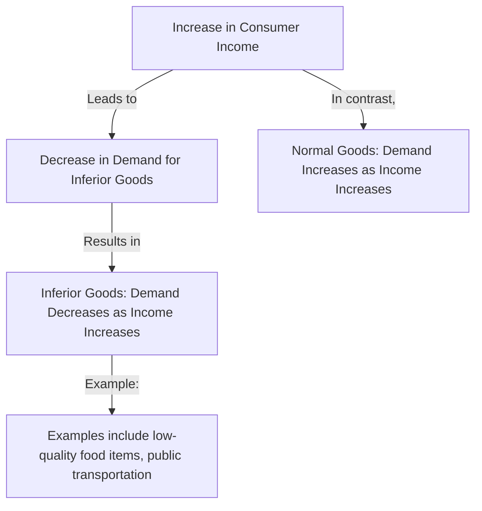

---

title: Inferior_Goods
course: Economics
unit: '2'
semester: Winter 2026
mode: ECON-MICRO
type: atomic_note
hub: '[[2_Basics_Of_Economics_Hub]]'
source: '[[5-Pdf Store/note generated/Winter 2026/Economics/Chapter_2.pdf]]'
date: '2026-05-08'
prerequisites:
- '[[Law_Of_Demand]]'
- '[[Ceteris_Paribus]]'
- '[[Market_Demand_Curve]]'
- '[[Normal_Goods]]'
- '[[Substitute_Goods]]'
source_pages:
- 17
generated: true

---


## 1. Mental Model

Imagine you love eating ramen noodles, a simple and yummy instant noodle soup. When you were younger, your parents didn't have much money, and ramen noodles were a staple in your house. You ate it for lunch almost every day. But now, let's say your parents got a big raise and can afford to buy you more expensive and fancier foods like sushi or pizza. Suddenly, you start to prefer those fancier foods and don't eat ramen noodles as much. That's because ramen noodles are like an "inferior good" - when your "income" (or your parents' money) goes up, you don't want to buy as much of it. It's not that ramen noodles are bad, it's just that you can afford better options now!

## 2. Micro Theory

In microeconomics, inferior goods are a type of good whose demand exhibits an inverse relationship with the consumer's income, contrary to the conventional expectation that demand for goods increases with rising income. This phenomenon can be rigorously examined through the lens of the demand function and the concept of income elasticity of demand.

The demand function, which represents the relationship between the quantity demanded of a good and its determinants, can be expressed as \(Q_d = f(P, I, P_s, P_c, T)\), where \(Q_d\) is the quantity demanded, \(P\) is the price of the good, \(I\) is the consumer's income, \(P_s\) and \(P_c\) are the prices of substitute and complementary goods, respectively, and \(T\) represents tastes and preferences. For inferior goods, the focus is on the relationship between \(Q_d\) and \(I\).

Formally, the income elasticity of demand, which measures the responsiveness of the quantity demanded of a good to a change in consumers' income, is defined as \(\epsilon_I = \frac{\partial Q_d / Q_d}{\partial I / I}\). For inferior goods, \(\epsilon_I < 0\), indicating that as income increases, the quantity demanded of the inferior good decreases, and vice versa. This characteristic distinguishes inferior goods from normal goods, for which \(\epsilon_I > 0\), implying a direct relationship between demand and income.

The concept of inferior goods can also be understood in the context of the [[Law_Of_Demand]], which states that, ceteris paribus (all else being equal), as the price of a good increases, the quantity demanded decreases. However, the defining feature of inferior goods relates to changes in income rather than price. When analyzing inferior goods, it's crucial to maintain the [[Ceteris_Paribus]] assumption to isolate the effect of income changes on demand.

The demand schedule and demand curve for inferior goods illustrate this inverse relationship between income and demand. Unlike normal goods, which have a demand curve that shifts to the right with an increase in income, the demand curve for inferior goods shifts to the left as income increases. This shift reflects the decrease in quantity demanded at any given price level.

In a market demand context, the [[Market_Demand_Curve]] for inferior goods also shifts in response to changes in income, among other factors. Understanding these dynamics is essential for businesses and policymakers, especially when assessing the impact of economic changes on the demand for specific goods.

The distinction between inferior goods and other types of goods, such as [[Normal_Goods]], [[Substitute_Goods]], and [[Complementary_Goods]], hinges on their respective demand elasticities, including [[Income_Elasticity_Of_Demand]] and [[Cross_Price_Elasticity]]. For instance, while the demand for substitute goods increases with the price of the good they substitute, the defining characteristic of inferior goods is their negative income elasticity.

In conclusion, the concept of inferior goods provides insight into consumer behavior under changing income conditions, highlighting a scenario where the [[Law_Of_Demand]]'s implications extend beyond price effects to include income considerations. Through the analytical tools of demand functions, income elasticity of demand, and shifts in demand curves, economists can rigorously examine and predict the market behavior of inferior goods in response to economic fluctuations.

## 3. Limitations & Edge Cases

The concept of inferior goods has several limitations and edge cases. For instance, the definition of an inferior good is based on the assumption that the demand for the good decreases when income increases, but this relationship may not hold across all income levels or over an extended period. Additionally, the identification of an inferior good can be sensitive to the specific definition of the good, as a broader definition may mask the inferiority of a more narrowly defined subset of the good. Furthermore, the Giffen paradox presents an edge case, where a good can be both inferior and have a positively sloped demand curve, violating the law of demand, although this phenomenon is rare and typically requires specific conditions, such as a lack of substitutes and a significant portion of income spent on the good.

## 4. Market Graph



Inferior goods are a type of good whose demand decreases as consumer income increases, exhibiting a negative income elasticity of demand. This means that as consumers' income rises, they tend to purchase fewer units of inferior goods, often substituting them with higher-quality alternatives.

## 5. Walkthrough

## Step 1: Define Inferior Goods and Their Demand Relationship

Inferior goods are defined as goods whose demand decreases as consumer income increases. This relationship is inverse, meaning as income rises, demand for inferior goods falls.

## Step 2: Establish the Demand Function for Inferior Goods

The demand function is given by \(Q_d = f(P, I, P_s, P_c, T)\), where \(Q_d\) is the quantity demanded, \(P\) is the price of the good, \(I\) is the consumer's income, \(P_s\) and \(P_c\) are the prices of substitute and complementary goods, respectively, and \(T\) represents tastes and preferences. For inferior goods, the critical relationship is between \(Q_d\) and \(I\), where \(\frac{\partial Q_d}{\partial I} < 0\).

## 3: Define Income Elasticity of Demand for Inferior Goods

The income elasticity of demand (\(E_I\)) is defined as \(E_I = \frac{\% \Delta Q_d}{\% \Delta I}\). For inferior goods, \(E_I < 0\), indicating that as income increases, the quantity demanded of the inferior good decreases.

## 4: Provide a Technical Example

Consider a specific inferior good, such as ground beef. Suppose that when consumer income (\(I\)) is $50,000, the quantity demanded (\(Q_d\)) of ground beef is 100 pounds, and when income increases to $60,000, \(Q_d\) decreases to 90 pounds. The percentage change in income (\(\% \Delta I\)) is \(\frac{60,000 - 50,000}{50,000} \times 100\% = 20\%\), and the percentage change in quantity demanded (\(\% \Delta Q_d\)) is \(\frac{90 - 100}{100} \times 100\% = -10\%\). The income elasticity of demand (\(E_I\)) for ground beef is \(\frac{-10\%}{20\%} = -0.5\).

## 5: Interpret the Income Elasticity of Demand

The income elasticity of demand for ground beef is -0.5, which is less than 0, confirming that ground beef is an inferior good. This means that for every 1% increase in consumer income, the quantity demanded of ground beef decreases by 0.5%.

---

## Review & Practice

```interactive-quiz

[
  {
    "type": "mcq",
    "difficulty": "L1",
    "question": "What is the defining characteristic of an inferior good in terms of income elasticity of demand?",
    "options": {
      "A": "Income elasticity of demand is equal to 1",
      "B": "Income elasticity of demand is less than 0",
      "C": "Income elasticity of demand is greater than 1",
      "D": "Income elasticity of demand is equal to 0"
    },
    "answer": "B",
    "explanation": "The defining characteristic of an inferior good is that its demand decreases as consumer income increases. This is represented by a negative income elasticity of demand, which means \\(\\epsilon_I < 0\\)."
  },
  {
    "type": "fill_in",
    "difficulty": "L2",
    "question": "Fill in the blank.",
    "textWithBlanks": "For inferior goods, the focus is on the relationship between \\(Q_d\\) and \\(I\\). Formally, the Blank, which measures the responsiveness of the quantity demanded of a good to a change in consumers' income, is defined as \\(\\epsilon_I = \\frac{\\partial Q_d / Q_d}{\\partial I / I}\\).",
    "answer": [
      "income elasticity of demand"
    ],
    "explanation": "The income elasticity of demand is a critical concept in microeconomics that measures how the quantity demanded of a good responds to a change in consumers' income. For inferior goods, this elasticity is negative, indicating that as income increases, the quantity demanded of the inferior good decreases."
  },
  {
    "type": "debug",
    "difficulty": "L1",
    "question": "Find the bug in the income elasticity of demand formula for inferior goods.",
    "content": "The income elasticity of demand for inferior goods is given by \\(\\epsilon_I = \frac{\\partial Q_d / Q_d}{\\partial I / I}\\). However, in the context of inferior goods, the correct formula should actually reflect that as income increases, demand decreases. The provided formula seems correct but let's assume a technical error in the interpretation of \\(\\partial I / I\\).",
    "answer": "The bug is in the interpretation of the change in income \\(\\partial I\\). For inferior goods, \\(\\epsilon_I < 0\\), but the formula provided \\(\\epsilon_I = \frac{\\partial Q_d / Q_d}{\\partial I / I}\\) assumes \\(\\partial I\\) is always positive. A subtle error could be in not accounting for the direction of change correctly in all contexts.",
    "required_keywords": [
      "Income_Elasticity_Of_Demand",
      "Inferior_Goods",
      "Ceteris_Paribus"
    ],
    "explanation": "The income elasticity of demand formula \\(\\epsilon_I = \frac{\\partial Q_d / Q_d}{\\partial I / I}\\) indeed characterizes inferior goods with \\(\\epsilon_I < 0\\). However, a technical error might arise from misinterpreting how changes in income (\\(\\partial I\\)) affect demand. The correct application requires acknowledging that for inferior goods, an increase in income leads to a decrease in demand, and the formula should be applied with this understanding."
  }
]

```