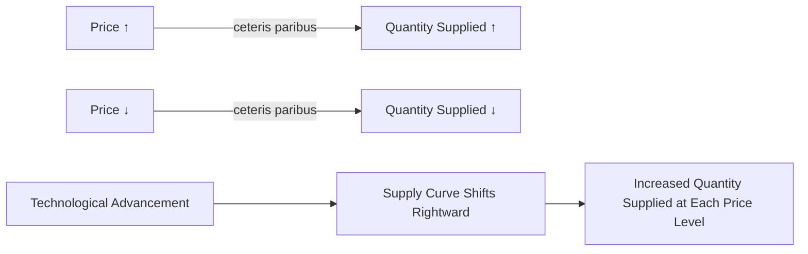

---

title: Law_Of_Supply
course: Economics
unit: '2'
semester: Winter 2026
mode: ECON-MICRO
type: atomic_note
hub: '[[2_Basics_Of_Economics_Hub]]'
source: '[[5-Pdf Store/note generated/Winter 2026/Economics/Chapter_2.pdf]]'
date: '2026-05-08'
prerequisites:
- '[[Ceteris_Paribus]]'
- '[[Market_Demand_Curve]]'
- '[[Demand_Function]]'
- '[[Surplus_And_Shortage]]'
source_pages:
- 46
generated: true

---


## 1. Mental Model

Imagine you have a lemonade stand and you've just gotten a super cool new machine that can squeeze lemons way faster than you could by hand! Before, you could only make 10 cups of lemonade per hour, but now you can make 20 cups per hour. Because it's easier and faster to make lemonade, you're willing to sell more cups to your friends and neighbors. You might even lower your prices a bit to attract more customers. This means you can supply more lemonade to the market, just like how the new machine helped you supply more lemonade. In economics, we say that your "supply" of lemonade has increased, and that's similar to what happens when a company gets new technology that helps them produce more goods or services - they can supply more to the market, and that's called a shift in the supply curve!

## 2. Micro Theory

The **Law of Supply** is a fundamental concept in microeconomics that describes the positive relationship between the price of a good and the quantity supplied, ceteris paribus [[Ceteris_Paribus]]. It states that, assuming all other factors remain constant, an increase in the price of a good will lead to an increase in the quantity supplied, while a decrease in price will result in a decrease in the quantity supplied.

The **Law of Supply** can be represented by a **supply schedule**, which is a table that shows the quantity supplied of a good at different price levels. When graphed, the supply schedule becomes a **supply curve**, which typically slopes upward from left to right, indicating a positive relationship between price and quantity supplied.

Technological advancements can significantly impact the **Law of Supply**. For instance, when a firm experiences a technological advancement, it can produce more efficiently, leading to an increase in productivity. This increase in productivity enables the firm to supply more goods at the same price, or the same quantity at a lower price. Consequently, the **supply curve** shifts outward, or to the right, indicating that at each price level, the firm is now willing to supply a greater quantity of the good.

The **shift in the supply curve** due to technological advancements can be understood by analyzing the **determinants of elasticity of supply**. The **elasticity of supply** measures the responsiveness of the quantity supplied to changes in the price of the good. When a firm experiences a technological advancement, its **elasticity of supply** increases, making it more responsive to price changes. This increased responsiveness leads to a greater quantity supplied at each price level, resulting in an outward shift of the **supply curve**.

The **Price Elasticity of Supply Formula** can be used to quantify the responsiveness of the quantity supplied to changes in price. The formula is: **Price Elasticity of Supply = (Percentage Change in Quantity Supplied) / (Percentage Change in Price)**. A technological advancement can increase the **price elasticity of supply**, making the supply curve more elastic.

The **Point and Arc Method** can be used to calculate the **price elasticity of supply**. This method involves calculating the percentage change in quantity supplied and the percentage change in price between two points on the **supply curve**. A technological advancement can lead to a greater change in quantity supplied in response to a price change, resulting in a higher **price elasticity of supply**.

The **types of elasticity of supply** include **elastic supply**, **unit elastic supply**, and **inelastic supply**. A technological advancement can lead to an **elastic supply**, where the quantity supplied is highly responsive to price changes.

The **length and complexity of production**, **mobility and availability of factors**, and **time to respond** are all factors that influence the **elasticity of supply**. A technological advancement can reduce the **length and complexity of production**, making it easier for firms to respond to price changes. Additionally, an increase in the **mobility and availability of factors** can make it easier for firms to adjust their production levels in response to price changes.

The **Market Equilibrium** is also affected by a technological advancement. The outward shift of the **supply curve** leads to a new **market equilibrium**, where the quantity supplied and quantity demanded are equal. This new equilibrium is characterized by a lower price and a higher quantity traded.

In conclusion, the **Law of Supply** is a fundamental concept in microeconomics that describes the positive relationship between the price of a good and the quantity supplied. A technological advancement can lead to an outward shift of the **supply curve**, resulting in a greater quantity supplied at each price level. This shift is due to an increase in productivity, which enables firms to produce more efficiently. The **elasticity of supply** increases, making the supply curve more elastic, and the **market equilibrium** is affected, leading to a new equilibrium with a lower price and a higher quantity traded. This concept is closely related to [[Market_Demand_Curve]], [[Demand_Function]], and [[Surplus_And_Shortage]], which are essential in understanding the dynamics of markets.

## 3. Limitations & Edge Cases

The Law of Supply assumes that technological conditions remain constant, but in reality, advancements in technology can significantly impact production capabilities, allowing firms to supply more at every price level, thus shifting the supply curve outward. Additionally, the law also assumes that firms have no control over market prices and are price-takers, which may not hold in cases where firms have some degree of market power. Furthermore, the law does not account for cases where production is subject to diminishing returns or where firms face capacity constraints, such as limited factory space or equipment, which can limit their ability to increase supply in response to rising prices. Moreover, in situations where there are externalities, such as environmental concerns, the law of supply may not accurately capture the social costs of production, leading to overproduction. Lastly, the law assumes that firms are rational and have perfect knowledge, which is not always the case, and that they can easily adjust production levels in response to price changes, which may not be feasible in industries with long production lead times or where factors of production are not easily substitutable.

## 4. Market Graph



The provided Mermaid flowchart illustrates the Law of Supply, demonstrating the positive relationship between price and quantity supplied, as well as the impact of technological advancements on the supply curve. The chart shows that an increase in price leads to an increase in quantity supplied, while a decrease in price results in a decrease in quantity supplied, and that technological advancements can shift the supply curve rightward, leading to an increase in the quantity supplied at each price level.

## 5. Walkthrough

### 5-Step Technical Walkthrough of the Law of Supply

#### Step 1: Define the Law of Supply
The **Law of Supply** states that, ceteris paribus, an increase in the price of a good leads to an increase in the quantity supplied, while a decrease in price results in a decrease in the quantity supplied.

#### Step 2: Represent the Law of Supply with a Supply Schedule
Assume a supply schedule for Wheat as follows:

| Price of Wheat ($/bushel) | Quantity Supplied (bushels) |
|---------------------------|-----------------------------|
| $5                          | 100                         |
| $10                         | 150                         |
| $15                         | 200                         |

#### Step 3: Graph the Supply Curve
When graphed, the supply schedule becomes a **supply curve** that typically slopes upward from left to right, indicating a positive relationship between price and quantity supplied.

#### Step 4: Analyze the Impact of Technological Advancements
Technological advancements enable a firm (e.g., **Ford**) to produce more efficiently. For instance, if Ford experiences a technological advancement in its manufacturing process, it can produce more cars.

#### Step 5: Determine the Effect on the Supply Curve
This technological advancement shifts the **supply curve** outward. For example, using the previous supply schedule for Wheat, the new supply schedule after the technological advancement could be:

| Price of Wheat ($/bushel) | Quantity Supplied (bushels) |
|---------------------------|-----------------------------|
| $5                          | 150                         |
| $10                         | 200                         |
| $15                         | 250                         |

The supply curve shifts outward, indicating that at each price level, the quantity supplied of Wheat increases due to the technological advancement.

---

## Review & Practice

```interactive-quiz

[
  {
    "type": "mcq",
    "difficulty": "L1",
    "question": "According to the Law of Supply, what happens to the quantity supplied of a good when its price increases, assuming all other factors remain constant [[Ceteris_Paribus]]?",
    "options": {
      "A": "The quantity supplied decreases.",
      "B": "The quantity supplied increases.",
      "C": "The quantity supplied remains the same.",
      "D": "The quantity supplied becomes unpredictable."
    },
    "answer": "B",
    "explanation": "The Law of Supply states that there is a positive relationship between the price of a good and the quantity supplied, ceteris paribus. This means that as the price of a good increases, the quantity supplied also increases, assuming all other factors remain constant."
  },
  {
    "type": "fill_in",
    "difficulty": "L2",
    "question": "Fill in the blank.",
    "textWithBlanks": "The Blank is a fundamental concept in microeconomics that describes the positive relationship between the price of a good and the quantity supplied, ceteris paribus.",
    "answer": [
      "Law of Supply"
    ],
    "explanation": "The Law of Supply is a fundamental concept in microeconomics that describes the positive relationship between the price of a good and the quantity supplied, ceteris paribus."
  },
  {
    "type": "debug",
    "difficulty": "L1",
    "question": "Find the bug in the following formula for Price Elasticity of Supply: Price Elasticity Of Supply = (Percentage Change in Blank1) / (Percentage Change in Blank2)",
    "content": "The Price Elasticity of Supply formula is used to quantify the responsiveness of the quantity supplied to changes in price.",
    "answer": "The correct formula for Price Elasticity of Supply is: Price Elasticity of Supply = (Percentage Change in Quantity Supplied) / (Percentage Change in Price). The bug is that Blank1 should be 'Quantity Supplied' and Blank2 should be 'Price'.",
    "required_keywords": [
      "Price Elasticity of Supply",
      "Quantity Supplied",
      "Percentage Change"
    ],
    "explanation": "The correct formula is essential for accurately calculating the price elasticity of supply, which measures how responsive the quantity supplied is to changes in price. A technological advancement can increase the price elasticity of supply, making the supply curve more elastic."
  }
]

```