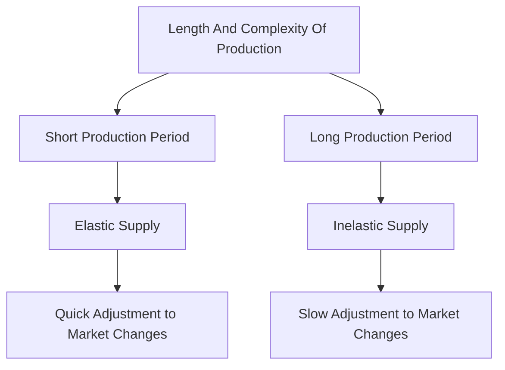

---

title: Length_And_Complexity_Of_Production
course: Economics
unit: '2'
semester: Winter 2026
mode: ECON-MICRO
type: atomic_note
hub: '[[2_Basics_Of_Economics_Hub]]'
source: '[[5-Pdf Store/note generated/Winter 2026/Economics/Chapter_2.pdf]]'
date: '2026-05-08'
prerequisites:
- '[[Elasticity_Of_Supply]]'
- '[[Price_Elasticity_Of_Supply_Formula]]'
- '[[Law_Of_Supply]]'
- '[[Shift_In_Supply_Curve]]'
- '[[Technological_Advancement]]'
source_pages:
- 48
- 49
generated: true

---


## 1. Mental Model

Imagine you're craving your favorite chocolate chip cookies! If a baker can quickly and easily whip up a batch using just a few simple ingredients like flour, sugar, and chocolate chips, she can rapidly increase production if lots of people suddenly want cookies. But, if making a special kind of cookie requires lots of hard-to-find ingredients, like super-rare nuts and a super-long baking process, the baker can't quickly make more cookies even if lots of people want them. That's because the production process is longer and more complex. In economics, we say that cookies with a shorter and simpler production process (like the first kind) have a more "elastic" supply, meaning the baker can easily make more or less of them depending on demand.

## 2. Micro Theory

The concept of Length And Complexity Of Production refers to the time and intricacy involved in producing a good or service. From a microeconomic perspective, this concept plays a crucial role in determining the elasticity of supply. The length and complexity of production are intricately linked to the responsiveness of suppliers to changes in market conditions.

When the production process is relatively simple and short, suppliers can quickly adjust their output in response to changes in demand or market prices. This is because shorter production periods allow firms to more easily modify their production levels, making their supply more elastic. Conversely, when the production process is complex and lengthy, suppliers may struggle to rapidly adjust their output, resulting in a less elastic supply.

The relationship between Length And Complexity Of Production and elasticity of supply can be understood through the lens of [[Elasticity_Of_Supply]]. The elasticity of supply is typically measured using the [[Price_Elasticity_Of_Supply_Formula]], which calculates the percentage change in quantity supplied in response to a percentage change in price. When production is relatively straightforward and brief, firms can more easily adapt to changes in market prices, leading to a higher elasticity of supply.

The [[Law_Of_Supply]] states that, ceteris paribus, an increase in the price of a good will lead to an increase in the quantity supplied. However, the [[Shift_In_Supply_Curve]] caused by changes in production costs, technological advancements, or other factors can influence the elasticity of supply. For instance, a [[Technological_Advancement]] that simplifies the production process can increase the elasticity of supply by reducing the time and complexity involved in producing a good.

The [[Mobility_And_Availability_Of_Factors]] of production also play a crucial role in determining the length and complexity of production. When factors of production are readily available and mobile, firms can more easily adjust their production levels, leading to a more elastic supply. Conversely, when factors are scarce or immobile, production may be more complex and lengthy, resulting in a less elastic supply.

The [[Time_To_Respond]] to changes in market conditions is also an essential aspect of Length And Complexity Of Production. The longer it takes for firms to respond to changes in demand or market prices, the less elastic will be their supply. This is because firms require time to adjust their production levels, and longer production periods can limit their ability to respond quickly to market changes.

In conclusion, the Length And Complexity Of Production significantly impact the elasticity of supply. When production is relatively simple and short, suppliers can more easily adjust their output, leading to a more elastic supply. Conversely, complex and lengthy production processes result in a less elastic supply. Understanding this concept is essential for analyzing [[Market_Equilibrium]], [[Surplus_And_Shortage]], and the [[Effects_Of_Shift_In_Demand_And_Supply]], ultimately providing valuable insights into the behavior of suppliers and the functioning of markets. 

Moreover, this concept can also be related to [[Change_In_Production_Costs]], as an increase in production costs may make production more complex, and therefore less elastic. Similarly, [[Types_Of_Elasticity_Of_Supply]] and [[Point_And_Arc_Method]] can be used to further analyze and quantify the elasticity of supply. A real-world example of this concept can be seen in a [[Market_Equilibrium_Example]], where changes in production costs and technology can impact the elasticity of supply and market equilibrium.

## 3. Limitations & Edge Cases

The concept of length and complexity of production has limitations, particularly in cases where production processes exhibit non-linear relationships between complexity and supply elasticity. For instance, extremely complex production processes may have limited substitutes or be subject to significant indivisibilities, rendering supply relatively inelastic despite complexity. Additionally, lengthy production processes may involve significant lead times or lumpy investments, which can create non-convexities in production functions, making it difficult to accurately capture the relationship between production duration and supply elasticity. Furthermore, industries with high levels of research and development, regulatory approvals, or customization may exhibit long and complex production processes, but with highly specialized and dedicated assets, limiting the applicability of the concept.

## 4. Market Graph



The flowchart illustrates the relationship between the length and complexity of production and the elasticity of supply, showing that shorter and less complex production processes lead to more elastic supply, while longer and more complex processes result in less elastic supply. This, in turn, affects the ability of suppliers to adjust their output in response to changes in market conditions.

## 5. Walkthrough

Here is the 5-step technical walkthrough of how 'Length And Complexity Of Production' operates:

**Step 1: Define the Production Process**
The production process has a certain **length** (time) and **complexity** (intricacy). 

**Step 2: Determine the Elasticity of Supply Formula**
The elasticity of supply (Es) is calculated as: Es = (Percentage Change in Quantity Supplied) / (Percentage Change in Price).

**Step 3: Analyze the Relationship Between Length, Complexity, and Elasticity of Supply**
When production is **simple** and **short**, suppliers can quickly adjust output in response to changes in demand or market prices. This results in a **more elastic supply**. Conversely, when production is **complex** and **lengthy**, suppliers struggle to rapidly adjust output, resulting in a **less elastic supply**.

**Step 4: Apply the Concept to Real-World Scenarios**
For example, consider the production of **Wheat** versus **Automobiles**. Wheat has a relatively **short** production period (e.g., several months) and a **simple** production process. In contrast, Automobiles have a **lengthy** production period (e.g., several months to a year) and a **complex** production process. As a result, the supply of Wheat is expected to be **more elastic** than the supply of Automobiles.

**Step 5: Conclusion on Elasticity of Supply**
The less complex and the shorter the production process, the **more elastic** will be the supply of a good. This implies that suppliers of goods with simple and short production processes can more easily adjust their output in response to changes in market conditions, resulting in a more elastic supply.

---

## Review & Practice

```interactive-quiz

[
  {
    "type": "mcq",
    "difficulty": "L1",
    "question": "What is the effect of a decrease in the length and complexity of production on the elasticity of supply?",
    "options": {
      "A": "Decrease in elasticity of supply",
      "B": "Increase in elasticity of supply",
      "C": "No change in elasticity of supply",
      "D": "Variable impact on elasticity of supply"
    },
    "answer": "B",
    "explanation": "A decrease in the length and complexity of production allows suppliers to more easily adjust their output in response to changes in market conditions, leading to an increase in the elasticity of supply."
  },
  {
    "type": "fill_in",
    "difficulty": "L2",
    "question": "Fill in the blank.",
    "textWithBlanks": "The Blank is a crucial aspect of Length And Complexity Of Production.",
    "answer": [
      "Time_To_Respond"
    ],
    "explanation": "The time to respond to changes in market conditions is a critical aspect of Length And Complexity Of Production, as it directly affects the elasticity of supply."
  },
  {
    "type": "debug",
    "difficulty": "L1",
    "question": "Find the bug in the following formula for calculating the Price Elasticity Of Supply: [[PES = (\u0394Q/Q) / (\u0394P/P)]]",
    "content": "The formula for Price Elasticity Of Supply is [[PES = (\u0394Q/Q) / (\u0394P/P)]]. However, this formula does not account for [[Time_To_Respond]] to changes in market conditions, which is a critical factor in determining the elasticity of supply.",
    "answer": "The correct formula should incorporate the [[Time_To_Respond]] to changes in market conditions. A more accurate representation would be [[PES = (\u0394Q/Q) / (\u0394P/P) * (1 / (1 + Time_To_Respond))]].",
    "required_keywords": [
      "Price_Elasticity_Of_Supply_Formula",
      "Time_To_Respond",
      "Elasticity_Of_Supply"
    ],
    "explanation": "The original formula for Price Elasticity Of Supply, [[PES = (\u0394Q/Q) / (\u0394P/P)]], does not account for the time it takes for suppliers to respond to changes in market conditions. This is a critical factor in determining the elasticity of supply, as longer production periods can limit a firm's ability to adjust their output in response to market changes. By incorporating [[Time_To_Respond]] into the formula, we can better capture the dynamics of supply elasticity."
  }
]

```