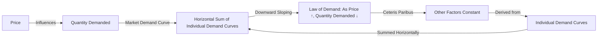

---

title: Market_Demand_Curve
course: "Economics"
unit: '2'
semester: "Winter 2026"
mode: ECON-MICRO
type: atomic_note
hub: "[[2_Basics_Of_Economics_Hub]]"
source: "[[5-Pdf Store/note generated/Winter 2026/Economics/Chapter_2.pdf]]"
date: '2026-05-08'
prerequisites:
- "[[Market_Demand]]"
source_pages:
- 10
generated: true

---

## 1. Mental Model

Imagine you're at a school ice cream shop, and they sell yummy cones for $3 each. You and your friends really love ice cream, and if it's $3, you might buy 2 cones. Your friend Emma might buy 3 cones at that price, and your friend Max might buy 1 cone. If we add all those up, the shop sells 2 + 3 + 1 = 4 cones. Now, if the price goes up to $4, you might only buy 1 cone, Emma might buy 2, and Max might not buy any. So, the shop sells 1 + 2 + 0 = 2 cones. The market demand curve shows how many cones the whole school (all the customers) will buy at different prices. When the price is low, like $3, people buy more cones (6 cones), and when the price is high, like $4, people buy fewer cones (3 cones). The curve slopes downward, meaning as the price goes up, the number of cones people want to buy goes down!

## 2. Micro Theory

The Market Demand Curve is a fundamental concept in microeconomics that represents the total quantity of a good or service that all consumers are willing and able to buy at various price levels, ceteris paribus [[Ceteris_Paribus]]. It is derived by horizontally summing the individual demand curves of all consumers in the market. The market demand curve is a graphical representation of the [[Demand_Schedule]], which is a table that shows the quantity demanded of a good at different price levels.

The market demand curve is typically downward sloping, illustrating the [[Law_Of_Demand]], which states that as the price of a good increases, the quantity demanded decreases, ceteris paribus [[Law_Of_Demand]]. This relationship is based on the [[Demand_Function]], which expresses the quantity demanded as a function of the price of the good, consumers' income, and other factors.

The market demand curve can be expressed as:

Qd = f(P, I, T, Ps)

Where:

* Qd is the quantity demanded
* P is the price of the good
* I is consumers' income
* T is consumers' tastes and preferences
* Ps is the price of related goods (substitutes or complements)

The market demand curve is also influenced by factors such as [[Price_Elasticity_Of_Demand]], [[Income_Elasticity_Of_Demand]], and [[Cross_Price_Elasticity]], which measure the responsiveness of quantity demanded to changes in price, income, and the price of related goods, respectively.

For example, if the price of a good increases, the quantity demanded will decrease, but the magnitude of this decrease depends on the [[Price_Elasticity_Of_Demand]]. If the good is a [[Normal_Goods]], an increase in consumers' income will lead to an increase in quantity demanded. On the other hand, if the good is an [[Inferior_Goods]], an increase in consumers' income will lead to a decrease in quantity demanded.

The market demand curve is also affected by the presence of [[Substitute_Goods]] and [[Complementary_Goods]]. If a good has close substitutes, an increase in its price will lead to a larger decrease in quantity demanded, as consumers can easily switch to alternative products.

To illustrate, consider a market with two consumers, A and B, with individual demand curves:

Consumer A: Qd = 10 - 2P
Consumer B: Qd = 8 - 3P

At a price of 3, the quantity demanded by each consumer is:

Consumer A: Qd = 10 - 2(3) = 4
Consumer B: Qd = 8 - 3(3) = -1 (or 0, as quantity cannot be negative)

The market demand at a price of 3 is the sum of the individual quantities demanded: 4 + 0 = 4.

By varying the price and summing the individual quantities demanded, we can derive the [[Market_Demand_Curve]], which represents the total quantity of the good that all consumers are willing and able to buy at different price levels.

The market demand curve plays a crucial role in determining the [[Market_Equilibrium]], where the quantity demanded equals the quantity supplied. Changes in the market demand curve, such as a shift to the right or left, can lead to changes in the market equilibrium price and quantity.

In conclusion, the Market Demand Curve is a graphical representation of the total quantity of a good or service that all consumers are willing and able to buy at various price levels, ceteris paribus. It is derived by horizontally summing the individual demand curves of all consumers in the market and is influenced by factors such as [[Price_Elasticity_Of_Demand]], [[Income_Elasticity_Of_Demand]], and [[Cross_Price_Elasticity]]. Understanding the market demand curve is essential for analyzing market equilibrium and the effects of changes in demand and supply on market outcomes.

## 3. Limitations & Edge Cases

The market demand curve, a graphical representation of the total quantity of a good or service demanded by all consumers at various price levels, has specific limitations. For instance, when analyzing individual and market demand curves at a price equal to 3, it becomes apparent that the curve assumes a linear relationship between price and quantity demanded, which may not hold true in cases of non-linear demand or when consumers exhibit heterogeneous preferences. Moreover, the market demand curve also assumes that consumers' purchasing decisions are independent of one another, which may not account for social influences, bandwagon effects, or snob effects that can significantly impact demand; furthermore, it relies on the ceteris paribus assumption, which may not accurately reflect real-world scenarios where multiple factors influencing demand, such as changes in consumer income or prices of related goods, may be present simultaneously.

## 4. Market Graph

### Market Demand Curve



The market demand curve represents the total quantity of a good or service that all consumers are willing and able to buy at various price levels, assuming all other factors remain constant (ceteris paribus). It is derived by horizontally summing the individual demand curves of all consumers in the market, illustrating the law of demand where as the price increases, the quantity demanded decreases.

## 5. Walkthrough

## Step 1: Define the Market Demand Curve Equation

The market demand curve can be expressed as: Qd = f(P, I, T, Ps), where Qd is the quantity demanded, P is the price of the good, I is consumers' income, T represents tastes and preferences, and Ps represents the prices of substitutes.

## Step 2: Understand the Given Scenario

The problem provides a scenario where the price (P) equals 3. However, it does not provide specific values for Qd, I, T, or Ps. We will assume that we are working with a general form of the demand function and that specific numerical values for other variables are not provided.

## 3: Apply the Law of Demand

According to the Law of Demand, as the price of a good increases, the quantity demanded decreases, ceteris paribus. This implies that the market demand curve is downward sloping. At a price of 3, we are looking for the quantity demanded.

## 4: Horizontal Summation of Individual Demand Curves

The market demand curve is derived by horizontally summing the individual demand curves of all consumers in the market. Without specific individual demand curves or quantities demanded at a price of 3, we cannot calculate an exact quantity but understand that this process aggregates individual demands.

## 5: Graphical Representation

The market demand curve graphically represents the Demand Schedule, which shows the quantity demanded of a good at different price levels. At a price of 3, a specific point on the market demand curve represents the total quantity demanded by all consumers.

Since specific numbers or a demand schedule are not provided, let's consider a hypothetical example based on a common demand function for illustration: If Qd = 10 - 2P, then at P = 3, Qd = 10 - 2*3 = 10 - 6 = 4. This step illustrates how to use a demand function to find quantity demanded at a given price, but note that the actual demand function or specific data is not provided in the source text.

---

## Review & Practice

```interactive-quiz

[
  {
    "type": "mcq",
    "difficulty": "L1",
    "question": "What is the primary reason why the market demand curve is typically downward sloping?",
    "options": {
      "A": "As the price of a good increases, the quantity supplied also increases.",
      "B": "As the price of a good increases, the quantity demanded decreases, ceteris paribus.",
      "C": "As the price of a good decreases, the quantity demanded remains constant.",
      "D": "As the price of a good decreases, the quantity supplied decreases."
    },
    "answer": "B",
    "explanation": "The market demand curve is downward sloping because of the Law of Demand, which states that as the price of a good increases, the quantity demanded decreases, ceteris paribus. This is a fundamental concept in microeconomics and is based on the demand function, which expresses the quantity demanded as a function of the price of the good, consumers' income, and other factors."
  },
  {
    "type": "fill_in",
    "difficulty": "L2",
    "question": "Fill in the blank.",
    "textWithBlanks": "The Blank is a table that shows the quantity demanded of a good at different price levels.",
    "answer": [
      "Demand_Schedule"
    ],
    "explanation": "The market demand curve is a graphical representation of the Demand Schedule, which is a table that shows the quantity demanded of a good at different price levels."
  },
  {
    "type": "debug",
    "difficulty": "L1",
    "question": "Find the bug in the market demand curve calculation for two consumers, A and B, with individual demand curves: Consumer A: Qd = 10 - 2P and Consumer B: Qd = 8 - 3P.",
    "content": "The market demand curve is derived by horizontally summing the individual demand curves of all consumers in the market. At a price of 3, the quantity demanded by each consumer is calculated as follows:\n\nConsumer A: Qd = 10 - 2(3) = Blank1\nConsumer B: Qd = 8 - 3(3) = Blank2\n\nThe market demand at a price of 3 is the sum of the individual quantities demanded: Blank1 + Blank2.",
    "answer": "4 + (-1) = 4 + 0 = 4",
    "required_keywords": [
      "Market_Demand_Curve",
      "individual_demand_curves",
      "quantity_demanded"
    ],
    "explanation": "The bug in the calculation is in Consumer B's quantity demanded at a price of 3. The correct calculation is Qd = 8 - 3(3) = 8 - 9 = -1. However, quantity cannot be negative, so it should be set to 0. The correct market demand at a price of 3 is 4 + 0 = 4."
  }
]

```