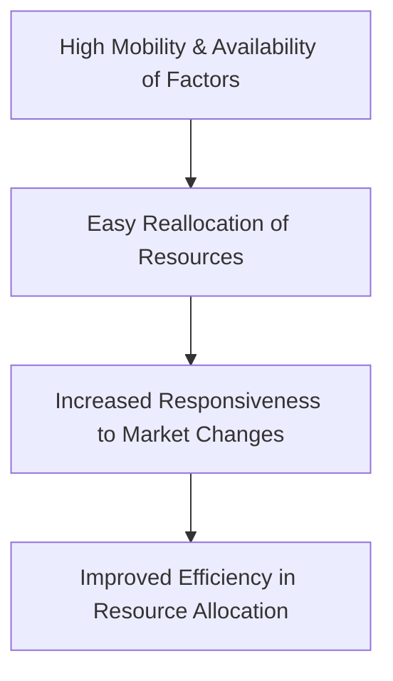

---

title: Mobility_And_Availability_Of_Factors
course: Economics
unit: '2'
semester: Winter 2026
mode: ECON-MICRO
type: atomic_note
hub: '[[2_Basics_Of_Economics_Hub]]'
source: '[[5-Pdf Store/note generated/Winter 2026/Economics/Chapter_2.pdf]]'
date: '2026-05-08'
prerequisites:
- '[[Elasticity_Of_Supply]]'
- '[[Ceteris_Paribus]]'
- '[[Length_And_Complexity_Of_Production]]'
- '[[Time_To_Respond]]'
- '[[Determinants_Of_Elasticity_Of_Supply]]'
source_pages:
- 49
generated: true

---


## 1. Mental Model

Imagine you have a lemonade stand and a friend has a cookie stand nearby. If you and your friend can easily borrow or switch cups, sugar, and lemons to make each other's products, that's like having mobile and available factors! You can quickly get the resources you need to make cookies or lemonade without any hassle. But, if it's hard to find those resources or if they're stuck with one person, it's like having stuck and scarce factors. For example, if t

## 2. Micro Theory

The concept of mobility and availability of factors is a crucial determinant of the supply of goods and services in a market economy. It refers to the ease with which factors of production, such as labor, capital, and raw materials, can be mobilized or reallocated from one production process to another. In essence, it assesses how quickly and easily these factors can be shifted between different uses.

When factors of production are highly mobile and readily available, producers can respond more effectively to changes in market conditions. For instance, if a producer is faced with an increase in demand for their product, they can easily acquire additional factors of production to expand output. Conversely, if demand declines, they can quickly reallocate their resources to alternative uses, minimizing losses. This flexibility is vital for the efficient allocation of resources in an economy.

The mobility and availability of factors are closely related to the concept of [[Elasticity_Of_Supply]], which measures the responsiveness of the quantity supplied of a good to changes in its price, while [[Ceteris_Paribus]] assumptions are maintained. When factors are highly mobile and available, the supply of a good tends to be more elastic, as producers can easily adjust production levels in response to price changes.

The degree of mobility and availability of factors depends on several factors, including the [[Length_And_Complexity_Of_Production]], the [[Time_To_Respond]] to changes in market conditions, and the [[Determinants_Of_Elasticity_Of_Supply]]. For example, in industries with short production cycles and simple production processes, factors of production tend to be more mobile, allowing for quicker responses to changes in demand.

The [[Law_Of_Supply]] states that, ceteris paribus, an increase in the price of a good leads to an increase in the quantity supplied. However, the mobility and availability of factors influence the extent to which this occurs. If factors are highly mobile, a small price increase may lead to a significant increase in supply, as producers can easily reallocate resources. On the other hand, if factors are immobile or scarce, supply may be less responsive to price changes.

Furthermore, the [[Market_Equilibrium]] is affected by the mobility and availability of factors. In a market with highly mobile factors, the [[Surplus_And_Shortage]] that arise from shifts in demand or supply can be quickly eliminated as producers adjust production levels.

The concept of mobility and availability of factors also interacts with [[Technological_Advancement]] and [[Change_In_Production_Costs]]. For instance, technological advancements can increase the mobility of factors by making it easier to reallocate resources, while changes in production costs can affect the availability of factors.

In conclusion, the mobility and availability of factors play a crucial role in determining the supply of goods and services in a market economy. Understanding this concept is essential for analyzing the behavior of firms and markets, and for evaluating the impact of various economic shocks and policy interventions.

The [[Price_Elasticity_Of_Supply_Formula]] can be used to quantify the responsiveness of supply to changes in price, which is influenced by the mobility and availability of factors. Additionally, the [[Point_And_Arc_Method]] can be employed to measure the elasticity of supply over different ranges of the supply curve.

The significance of mobility and availability of factors can be illustrated using a [[Market_Equilibrium_Example]], where changes in demand or supply lead to adjustments in production levels and market prices. Overall, the mobility and availability of factors are critical components of a well-functioning market economy, enabling efficient resource allocation and facilitating economic growth.

## 3. Limitations & Edge Cases

The assumption of mobility and availability of factors of production is often limited in reality, as factors such as labor, capital, and land may not be easily transferable between industries or locations, due to factors like specialized skills, geographical immobility, or sunk costs, and in cases where there are bottlenecks or shortages of specific factors, leading to frictions that impede the smooth reallocation of resources, ultimately affecting production possibilities and market equilibrium.

## 4. Market Graph



This flowchart illustrates the relationship between the mobility and availability of factors, the ease of reallocating resources, and the resulting improvements in responsiveness to market changes and efficiency in resource allocation. The diagram shows that high mobility and availability of factors lead to easy reallocation of resources, which in turn enables producers to respond more effectively to market changes, ultimately resulting in improved efficiency in resource allocation.

## 5. Walkthrough

Here is the 5-step technical walkthrough of how 'Mobility And Availability Of Factors' operates:

**Step 1: Identification of Factors of Production**
The factors of production include labor, capital, and raw materials. For example, in the production of wheat, labor (farmers), capital (tractors), and raw materials (seeds, fertilizers) are required.

**Step 2: Assessment of Mobility of Factors**
The mobility of factors refers to the ease with which these factors can be reallocated from one production process to another. For instance, in the US economy, the labor market has a relatively high mobility, as workers can switch jobs across industries. According to the Bureau of Labor Statistics (BLS), the average tenure of employees in the US was 4.1 years in January 2022.

**Step 3: Evaluation of Availability of Factors**
The availability of factors refers to the ease with which producers can acquire additional factors of production. For example, if a producer of wheat faces an increase in demand, they can easily acquire additional labor, capital, and raw materials to expand output. In 2022, the US inflation rate was 3.4% (BLS), which may affect the availability and cost of factors of production.

**Step 4: Responsiveness to Changes in Market Conditions**
When factors of production are highly mobile and readily available, producers can respond more effectively to changes in market conditions. For example, if a producer of smartphones, such as Apple, faces an increase in demand, they can quickly reallocate resources to expand production. Conversely, if demand declines, they can reallocate resources to alternative products, such as iPads.

**Step 5: Efficient Allocation of Resources**
The mobility and availability of factors enable the efficient allocation of resources in an economy. With highly mobile and readily available factors, resources can be quickly reallocated to their most valuable uses, minimizing losses and maximizing economic efficiency. For instance, in the US economy, the free movement of labor and capital across industries enables resources to be allocated efficiently, promoting economic growth and development.

---

## Review & Practice

```interactive-quiz

[
  {
    "type": "mcq",
    "difficulty": "L1",
    "question": "What is the primary effect of high mobility and availability of factors of production on the supply of a good?",
    "options": {
      "A": "It makes the supply of a good more inelastic.",
      "B": "It makes the supply of a good more elastic.",
      "C": "It has no impact on the elasticity of supply.",
      "D": "It only affects the demand for a good."
    },
    "answer": "B",
    "explanation": "When factors of production are highly mobile and readily available, producers can respond more effectively to changes in market conditions, making the supply of a good more elastic. This is because they can easily acquire additional factors of production to expand output or reallocate resources to alternative uses, minimizing losses."
  },
  {
    "type": "fill_in",
    "difficulty": "L2",
    "question": "Fill in the blank.",
    "textWithBlanks": "The Blank is a crucial determinant of the supply of goods and services in a market economy.",
    "answer": [
      "mobility and availability of factors"
    ],
    "explanation": "The concept of mobility and availability of factors refers to the ease with which factors of production can be mobilized or reallocated from one production process to another."
  },
  {
    "type": "debug",
    "difficulty": "L1",
    "question": "Find the bug in the following formula for calculating the elasticity of supply, which is influenced by the mobility and availability of factors: $E_s = \\frac{Blank1}{Blank2} \\times \\frac{\\Delta P}{P}$",
    "content": "The formula provided seems to be missing a critical component related to the change in quantity supplied and the initial price. Typically, the elasticity of supply is calculated as $E_s = \\frac{\\Delta Q/Q}{\\Delta P/P}$. However, in the context of mobility and availability of factors, an adjustment might be necessary to accurately reflect the responsiveness of supply to price changes.",
    "answer": "The correct formula should be $E_s = \\frac{\\Delta Q/Q}{\\Delta P/P}$. The bug in the provided formula is the incorrect specification of $\\frac{Blank1}{Blank2}$, which should actually represent $\\frac{\\Delta Q/Q}{\\Delta P/P}$. Therefore, Blank1 should be $\\Delta Q/Q$ and Blank2 should be $\\Delta P/P$.",
    "required_keywords": [
      "Elasticity_Of_Supply",
      "Mobility_And_Availability_Of_Factors",
      "Law_Of_Supply"
    ],
    "explanation": "The elasticity of supply is a measure of how responsive the quantity supplied of a good is to changes in its price, holding all other factors constant (ceteris paribus). It is calculated as the percentage change in quantity supplied divided by the percentage change in price. The mobility and availability of factors influence this elasticity by affecting how easily producers can adjust their production levels in response to price changes. If factors are highly mobile and readily available, producers can more easily increase or decrease production, making the supply more elastic."
  }
]

```