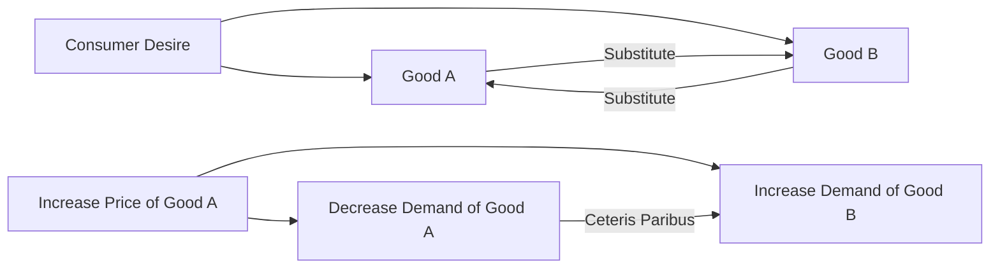

---

title: Substitute_Goods
course: Economics
unit: '2'
semester: Winter 2026
mode: BIZ-MARKETING
type: atomic_note
hub: '[[2_Basics_Of_Economics_Hub]]'
source: '[[5-Pdf Store/note generated/Winter 2026/Economics/Chapter_2.pdf]]'
date: '2026-05-08'
prerequisites:
- '[[Law_Of_Demand]]'
- '[[Ceteris_Paribus]]'
- '[[Demand_Schedule]]'
- '[[Demand_Curve]]'
- '[[Demand_Function]]'
source_pages:
- 15
generated: true

---


## 1. Mental Model

Imagine you're super thirsty on a hot summer day and you want a cold drink. You can either have a glass of lemonade or a glass of iced tea. Both drinks will quench your thirst and make you feel cool and refreshed. They're like two friends who can do the same job for you! If lemonade is expensive or not available, you can easily ask your friend iced tea to step in and satisfy your thirst. That's basically what substitute goods are - they're different products that can replace each other and satisfy the same need or want, like lemonade and iced tea being substitutes for each other.

## 2. Market Principle

In the context of microeconomics, substitute goods refer to products or services that can satisfy the same consumer desire or need as another product or service. This concept is intricately linked with the [[Law_Of_Demand]], which states that, ceteris paribus, as the price of a good increases, the quantity demanded decreases. The presence of substitute goods significantly influences this relationship, as an increase in the price of one good can lead to an increase in the demand for its substitute, assuming [[Ceteris_Paribus]] conditions.

The existence of substitute goods affects the [[Demand_Schedule]] and [[Demand_Curve]] of a product. When substitutes are available, the demand curve for a particular good tends to be more elastic. This is because consumers can easily switch to a substitute if the price of the original good increases. The [[Demand_Function]] also reflects this relationship, as it often includes variables such as the prices of related goods (substitutes and complements).

The concept of substitute goods is quantitatively analyzed through [[Cross_Price_Elasticity]], which measures the responsiveness of the demand for one good to changes in the price of another good. For substitute goods, the cross-price elasticity is positive, indicating that an increase in the price of one good leads to an increase in the demand for its substitute.

In a market with substitute goods, the [[Market_Demand]] and [[Market_Demand_Curve]] are influenced by the availability and prices of these substitutes. The [[Price_Elasticity_Of_Demand]] for a good with close substitutes tends to be higher, reflecting the ease with which consumers can substitute one good for another.

The distinction between substitute goods and other types of goods, such as [[Complementary_Goods]], [[Normal_Goods]], and [[Inferior_Goods]], is crucial. Unlike complementary goods, which are consumed together, substitute goods can replace each other in satisfying a consumer's need. Normal goods and inferior goods are classifications based on the income elasticity of demand, which is a different concept from substitution.

The supply side of the market also plays a role in the context of substitute goods. The [[Law_Of_Supply]] and shifts in the Supply Curve can affect market equilibrium. For instance, a technological advancement or a [[Change_In_Production_Costs]] can make producing a substitute good more economical, potentially shifting its supply curve and affecting market prices.

The interaction between demand and supply in markets with substitute goods leads to [[Market_Equilibrium]], where the quantity demanded equals the quantity supplied. However, changes in consumer preferences, prices of substitutes, or production costs can lead to [[Surplus_And_Shortage]], necessitating adjustments in market prices to restore equilibrium.

Understanding substitute goods and their market dynamics, including the effects of shifts in demand and supply, is essential for businesses and policymakers. It helps in predicting market trends, making informed production and pricing decisions, and assessing the impact of external factors on market equilibrium, much like illustrated in a [[Market_Equilibrium_Example]]. 

The analysis of substitute goods ultimately underscores the complexity of consumer behavior and market interactions, highlighting the need for a comprehensive approach to understanding market dynamics.

## 3. Limitations & Edge Cases

The concept of substitute goods has several limitations, particularly in assuming that all substitute goods are perfect substitutes for each other, which is often not the case. For instance, different brands of coffee may satisfy the same desire for a consumer, but they may not be identical in terms of taste, quality, or price, leading to varying degrees of substitutability. Furthermore, the availability and proximity of substitute goods can also impact their effectiveness as substitutes, with consumers being more likely to choose substitutes that are easily accessible. Additionally, consumer preferences and loyalty can also limit the substitutability of goods, as some consumers may prefer a particular brand or product due to perceived differences in quality, status, or other factors, even if cheaper or similar alternatives are available.

## 4. Campaign Funnel



This flowchart illustrates the concept of substitute goods, where Good A and Good B satisfy the same consumer desire, and an increase in the price of one good leads to an increase in demand for its substitute. The presence of substitute goods makes the demand curve for a particular good more elastic, as consumers can easily switch to a substitute if the price increases.

## 5. Walkthrough

### 5-Step Technical Walkthrough of Substitute Goods

#### Step 1: Identification of Substitute Goods
Identify products or services that satisfy the same consumer desire or need. For example, if we consider Coca-Cola and Pepsi as substitute goods, they both satisfy the consumer's desire for a cola beverage.

#### Step 2: Understanding the Law of Demand
Apply the Law of Demand, which states that, ceteris paribus, as the price of a good increases, the quantity demanded decreases. For instance, if the price of Coca-Cola increases, the quantity demanded for Coca-Cola decreases.

#### Step 3: Impact on Demand Schedule and Curve
Recognize that the presence of substitute goods (like Pepsi for Coca-Cola) makes the demand curve for a particular good (Coca-Cola) more elastic. This means if Coca-Cola's price increases, consumers can easily switch to Pepsi, increasing the demand for Pepsi.

#### Step 4: Analyzing Demand Function
The demand function for a good includes variables such as the prices of related goods (substitutes and complements). For Coca-Cola, the demand function might look like: Qd = f(Pc, Pp, I), where Qd is the quantity demanded of Coca-Cola, Pc is the price of Coca-Cola, Pp is the price of Pepsi (a substitute), and I is consumer income.

#### Step 5: Ceteris Paribus Condition
Assume ceteris paribus (all else being equal) when analyzing the effect of substitute goods. For example, if the price of Coca-Cola increases from $5 to $6, and assuming ceteris paribus, the quantity demanded of Coca-Cola decreases. Simultaneously, the demand for its substitute, Pepsi, may increase, assuming the price of Pepsi remains constant at $5.

---

## Review & Practice

```interactive-quiz

[
  {
    "type": "mcq",
    "difficulty": "L1",
    "question": "What is the effect of an increase in the price of one good on the demand for its substitute good, assuming [[Ceteris_Paribus]] conditions?",
    "options": {
      "A": "The demand for the substitute good decreases.",
      "B": "The demand for the substitute good increases.",
      "C": "The demand for the substitute good remains unchanged.",
      "D": "The demand for the substitute good becomes perfectly inelastic."
    },
    "answer": "B",
    "explanation": "The presence of substitute goods significantly influences the relationship between the price of a good and its quantity demanded. An increase in the price of one good can lead to an increase in the demand for its substitute, assuming [[Ceteris_Paribus]] conditions. This is quantitatively analyzed through [[Cross_Price_Elasticity]], which measures the responsiveness of the demand for one good to changes in the price of another good. For substitute goods, the cross-price elasticity is positive."
  },
  {
    "type": "synthesis",
    "difficulty": "L2",
    "question": "A critical failure in the ad serving system of a digital advertising platform has caused a sudden inability to deliver ads to a specific segment of users. The failure is attributed to a high demand for ad space, leading to a shortage of available ad slots. To prevent a complete system failure, the platform must quickly find substitute ad slots that can satisfy the demand. Given the urgency, the platform's operators must apply their understanding of substitute goods in microeconomics to resolve the crisis. They need to identify a substitute ad slot that has a high [[Cross_Price_Elasticity]] with the original ad slot, meaning that an increase in the price of the original ad slot leads to an increase in the demand for this substitute slot. The goal is to minimize disruption and maintain the [[Market_Demand]] for ad space.",
    "answer": "To address the emergency scenario, the digital advertising platform should first identify ad slots with similar characteristics to the original slots, such as targeting demographics, ad format, and website placement. These similar ad slots are likely to have a high [[Cross_Price_Elasticity]] with the original slots, making them suitable substitutes. The platform should then adjust the [[Demand_Function]] to reflect the increased price of the original ad slots and the corresponding increase in demand for the substitute slots. By doing so, the platform can maintain the overall [[Market_Demand]] for ad space and prevent a complete system failure. Additionally, the platform should consider factors such as [[Price_Elasticity_Of_Demand]] and [[Ceteris_Paribus]] conditions to ensure a smooth transition to the substitute ad slots.",
    "required_keywords": [
      "Cross_Price_Elasticity",
      "Demand_Function",
      "Market_Demand",
      "Substitute Goods",
      "Ceteris_Paribus"
    ],
    "explanation": "The solution involves applying the concept of substitute goods in microeconomics to a critical failure in the ad serving system of a digital advertising platform. By identifying ad slots with high [[Cross_Price_Elasticity]] and adjusting the [[Demand_Function]], the platform can maintain [[Market_Demand]] and prevent a complete system failure. The approach requires a deep understanding of microeconomic principles, including the [[Law_Of_Demand]] and [[Ceteris_Paribus]] conditions."
  },
  {
    "type": "writing",
    "difficulty": "L1",
    "question": "Explain how the concept of substitute goods affects the demand curve and market dynamics in the context of Consumer Analytics.",
    "answer": "The presence of substitute goods significantly influences the demand curve and market dynamics. When substitutes are available, the demand curve for a particular good tends to be more elastic, as consumers can easily switch to a substitute if the price of the original good increases. This relationship is quantitatively analyzed through [[Cross_Price_Elasticity]], which measures the responsiveness of the demand for one good to changes in the price of another good. For substitute goods, the cross-price elasticity is positive, indicating that an increase in the price of one good leads to an increase in the demand for its substitute. The [[Demand_Function]] also reflects this relationship, as it often includes variables such as the prices of related goods (substitutes and complements).",
    "required_keywords": [
      "Substitute Goods",
      "Demand Curve",
      "Cross_Price_Elasticity",
      "Demand Function"
    ],
    "explanation": "The concept of substitute goods is crucial in Consumer Analytics as it affects how consumers respond to changes in prices and how businesses strategize. The existence of substitutes makes the demand curve more elastic, meaning consumers are more sensitive to price changes. This elasticity is meaUnderstanding these dynamics is essential for pricing strategies, market positioning, and predicting consumer behavior."
  }
]

```