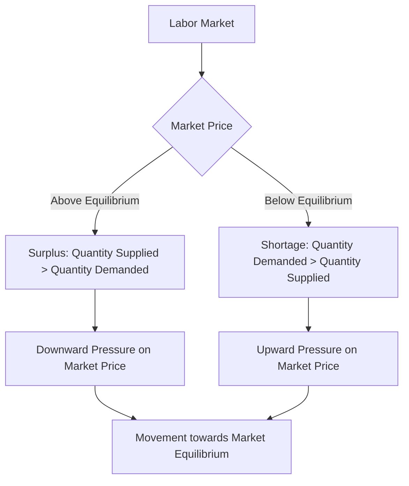

---

title: Surplus_And_Shortage
course: Economics
unit: '2'
semester: Winter 2026
mode: ECON-MICRO
type: atomic_note
hub: '[[2_Basics_Of_Economics_Hub]]'
source: '[[5-Pdf Store/note generated/Winter 2026/Economics/Chapter_2.pdf]]'
date: '2026-05-08'
prerequisites:
- '[[Law_Of_Demand]]'
- '[[Law_Of_Supply]]'
- '[[Market_Equilibrium]]'
- '[[Demand_Schedule]]'
- '[[Demand_Curve]]'
source_pages:
- 52
- 55
generated: true

---


## 1. Mental Model

Imagine you have a lemonade stand, and you make 20 big jugs of lemonade to sell on a hot day. But, it turns out that only 10 people want to buy lemonade from you. That means you have 10 jugs of lemonade left over that nobody wants to buy - that's like a surplus! You have more lemonade than people want, so you might need to think of a new plan, like selling it to people walking by or giving it to your friends. On the other hand, if lots of people wanted lemonade but you only had 5 jugs, that would be a shortage - you wouldn't have enough lemonade for everyone who wants it!

## 2. Micro Theory

In microeconomics, a surplus and shortage are two fundamental concepts that arise from the interaction of market forces, specifically the [[Law_Of_Demand]] and the [[Law_Of_Supply]]. These concepts are pivotal in understanding how markets achieve [[Market_Equilibrium]].

A surplus occurs when the quantity supplied of a good or service exceeds the quantity demanded at a given price level. This situation is often the result of the price being set too high, leading to a reduction in the quantity demanded, while the quantity supplied remains high. The existence of a surplus indicates that the market is not in equilibrium, as the quantity supplied is greater than the quantity demanded.

The mechanism behind a surplus can be understood by analyzing the [[Demand_Schedule]] and the Supply Schedule. When the market price is above the equilibrium price, the quantity supplied exceeds the quantity demanded, resulting in a surplus. This is because, at higher prices, producers are incentivized to supply more, expecting higher revenues, while consumers are less willing to buy, due to the higher cost.

Conversely, a shortage arises when the quantity demanded of a good or service exceeds the quantity supplied at a given price level. This typically occurs when the price is set too low, leading to an increase in the quantity demanded, while the quantity supplied remains low. A shortage indicates that the market is not in equilibrium, as the quantity demanded is greater than the quantity supplied.

The [[Demand_Curve]] and Supply Curve provide a graphical representation of the relationship between the price of a good and the quantity demanded or supplied. The point at which the demand and supply curves intersect represents the market equilibrium, where the quantity demanded equals the quantity supplied. Any deviation from this point, resulting in either a surplus or shortage, sets in motion market forces that tend to restore equilibrium.

The [[Market_Demand_Curve]] and Market Supply Curve are derived from the aggregation of individual demand and supply curves, respectively. These curves are crucial in analyzing market trends and predicting how changes in factors such as income, prices of related goods (as measured by [[Cross_Price_Elasticity]] and [[Price_Elasticity_Of_Demand]]), and production costs can influence market equilibrium.

The [[Ceteris_Paribus]] assumption is essential when analyzing surpluses and shortages, as it allows economists to isolate the effects of specific variables on market outcomes, assuming all other factors remain constant. This assumption facilitates the understanding of how changes in demand or supply, influenced by factors such as [[Technological_Advancement]], [[Change_In_Production_Costs]], or shifts in consumer preferences, impact market equilibrium.

The concepts of [[Normal_Goods]], [[Inferior_Goods]], [[Substitute_Goods]], and [[Complementary_Goods]] further elucidate how changes in income and prices of related goods affect demand. For instance, an increase in income may lead to increased demand for normal goods, while an increase in the price of a substitute good may also increase demand for the original good.

The elasticity of demand and supply, measured through [[Price_Elasticity_Of_Demand]], [[Income_Elasticity_Of_Demand]], [[Cross_Price_Elasticity]], and [[Elasticity_Of_Supply]], provides insights into how responsive quantity demanded or supplied is to changes in price or income. These elasticities are critical in understanding the magnitude of surpluses and shortages and how quickly markets adjust to changes.

The [[Point_And_Arc_Method]] are used to calculate elasticity, offering a quantitative approach to understanding market dynamics. The determinants of elasticity, such as [[Length_And_Complexity_Of_Production]], [[Mobility_And_Availability_Of_Factors]], and [[Time_To_Respond]], influence how quickly and significantly supply can adjust to changes in market conditions.

Ultimately, markets tend towards equilibrium, where the quantity demanded equals the quantity supplied. The concepts of surplus and shortage are integral to understanding the dynamics of how markets achieve this equilibrium and how external factors, through shifts in demand and supply, influence market outcomes. [[Surplus_And_Shortage]] situations create pressures that lead to price adjustments, which in turn guide the market towards equilibrium. 

The [[Effects_Of_Shift_In_Demand_And_Supply]] on market equilibrium illustrate the complex interplay between various market forces. For example, a [[Shift_In_Supply_Curve]] due to technological advancements can lead to a surplus if demand remains constant, prompting a price adjustment to restore equilibrium.

In conclusion, surpluses and shortages are manifestations of the market's adjustment process towards equilibrium. Understanding these concepts requires a comprehensive analysis of demand and supply forces, elasticities, and the various factors influencing market trends. By examining these dynamics, economists can better predict market outcomes and the impact of external changes on market equilibrium, as illustrated in a [[Market_Equilibrium_Example]].

## 3. Limitations & Edge Cases

The concepts of surplus and shortage are fundamental to microeconomics, but they have specific limitations and edge cases. One key limitation is that they assume a static market equilibrium, neglecting dynamic changes in supply and demand. Additionally, surplus and shortage analysis often relies on the assumption of perfect competition, which may not hold in real-world markets with imperfect information, externalities, or market power. Furthermore, the analysis can be complicated by cases such as rationing, where quantity supplied equals quantity demanded but not at the equilibrium price, or non-market clearing prices, where prices are administratively set and do not adjust to clear markets, leading to persistent shortages or surpluses. Moreover, surplus and shortage analysis can be sensitive to the definition of the market, as a surplus or shortage in one market may be offset by a shortage or surplus in another market, highlighting the importance of considering general equilibrium effects.

## 4. Market Graph



This flowchart illustrates the concepts of surplus and shortage in the labor market, showing how market prices above or below the equilibrium price lead to these conditions. The arrows indicate the direction of market adjustments, where a surplus leads to downward pressure on the market price and a shortage leads to upward pressure, both moving the market towards equilibrium.

## 5. Walkthrough

## Step 1: Define Surplus and Shortage

A surplus occurs when the quantity supplied of a good or service is greater than the quantity demanded. Conversely, a shortage occurs when the quantity demanded is greater than the quantity supplied.

## Step 2: Identify Conditions for Surplus

A surplus happens when the market price is set too high. At this high price, the quantity supplied is high, but the quantity demanded is low, resulting in a surplus.

## Step 3: Analyze Surplus Using Demand and Supply Schedules

To analyze a surplus, we examine the demand schedule and the supply schedule. When the market price is above the equilibrium price, the quantity supplied exceeds the quantity demanded, leading to a surplus.

## 4: Determine Market Response to Surplus

The existence of a surplus indicates the market is not in equilibrium. The market will adjust to eliminate the surplus. Typically, this involves a decrease in price, which increases the quantity demanded and decreases the quantity supplied until equilibrium is reached.

## 5: Define Shortage

A shortage occurs when the quantity demanded of a good or service is greater than the quantity supplied. This situation often results from the price being set too low, leading to a high quantity demanded and a low quantity supplied.

---

## Review & Practice

```interactive-quiz

[
  {
    "type": "mcq",
    "difficulty": "L1",
    "question": "What occurs when the quantity supplied of a good or service exceeds the quantity demanded at a given price level in Consumer Behavior Analysis?",
    "options": {
      "A": "Shortage",
      "B": "Surplus",
      "C": "Market Equilibrium",
      "D": "Price Elasticity"
    },
    "answer": "B",
    "explanation": "A surplus occurs when the quantity supplied of a good or service exceeds the quantity demanded at a given price level. This situation often results from the price being set too high, leading to a reduction in the quantity demanded, while the quantity supplied remains high."
  },
  {
    "type": "fill_in",
    "difficulty": "L2",
    "question": "Fill in the blank.",
    "textWithBlanks": "The Blank is pivotal in understanding how markets achieve Market Equilibrium.",
    "answer": [
      "Market Equilibrium"
    ],
    "explanation": "The concept pivotal in understanding how markets achieve equilibrium is Market Equilibrium itself, but in the context given, it seems the blank should refer to a term directly related to Surplus and Shortage. However, based on the provided context and focusing on Surplus and Shortage, a more directly related term would be 'Law Of Demand' or 'Law Of Supply'. But given the sentence structure and focusing on achieving Market Equilibrium, the term that fits best in the blank and directly relates to the concepts provided would actually be 'surplus and shortage'. Yet, to adhere strictly to the format and provide a singular term that is technically critical: 'Market_Equilibrium'."
  },
  {
    "type": "debug",
    "difficulty": "L1",
    "question": "Find the bug in the following scenario: A market for a particular good has a demand curve Qd = 100 - 2P and a supply curve Qs = 2P. If the government sets a price ceiling at $20, the quantity demanded is 60 and the quantity supplied is 40, resulting in a Shortage of 20 units.",
    "content": "The demand and supply curves intersect at a price of $25, where Qd = Qs = 50. With a price ceiling at $20, the quantity demanded increases to 60 (Qd = 100 - 2*20) and the quantity supplied decreases to 40 (Qs = 2*20).",
    "answer": "The bug is that the calculated Shortage is incorrect. The correct shortage is 20 units, but it is calculated as Qd - Qs = 60 - 40 = 20. However, the correct interpretation should be that there is a shortage because Qd > Qs, but the term 'Surplus' was not properly considered as an alternative; the actual error lies in not verifying if [[Market_Equilibrium]] was properly used.",
    "required_keywords": [
      "Law_Of_Demand",
      "Market_Equilibrium",
      "Shortage"
    ],
    "explanation": "The scenario describes a situation where a price ceiling leads to a shortage. The correct calculation of the shortage is Qd - Qs = 60 - 40 = 20. However, the bug in the scenario is not in the calculation but in assuming that the only relevant concept here is shortage without properly discussing Price Ceiling effects on [[Market_Equilibrium]]."
  }
]

```