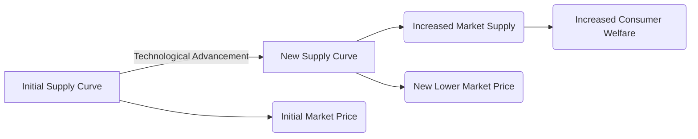

---

title: Technological_Advancement
course: Economics
unit: '2'
semester: Winter 2026
mode: ECON-MICRO
type: atomic_note
hub: '[[2_Basics_Of_Economics_Hub]]'
source: '[[5-Pdf Store/note generated/Winter 2026/Economics/Chapter_2.pdf]]'
date: '2026-05-08'
prerequisites:
- '[[Law_Of_Supply]]'
- '[[Ceteris_Paribus]]'
- '[[Demand_Schedule]]'
- '[[Demand_Curve]]'
- '[[Market_Demand_Curve]]'
source_pages:
- 46
generated: true

---


## 1. Mental Model

Imagine you have a lemonade stand, and you're using a manual juicer to squeeze lemons. You can only make 10 cups of lemonade per hour. One day, your friend gives you an electric juicer that's super fast and efficient. Now, you can make 20 cups of lemonade per hour! This means you can supply more lemonade to your customers, and you might even be able to lower your prices because it's easier to make. This is like a technological advancement - the electric juicer is like a new technology that helps you produce more lemonade (or goods) with the same amount of effort. Just like how your lemonade stand can now supply more lemonade to the market, a company with new technology can supply more products to the market, which is like shifting the supply curve outward!

## 2. Micro Theory

Technological advancement is a critical concept in microeconomics that significantly influences a firm's production capabilities and overall market supply. In essence, technological advancement refers to the implementation of new or improved methods, techniques, or processes that enhance a firm's productivity and efficiency. This can be achieved through various means, such as the adoption of new machinery, automation, innovative production techniques, or the development of more efficient organizational structures.

From a technical perspective, technological advancement can be defined as a change in the production function that enables a firm to produce a greater quantity of output for a given level of inputs. This can be represented mathematically as a shift in the production function, where the same level of inputs yields a higher level of output. Consequently, this leads to a reduction in the firm's production costs, as fewer resources are required to produce the same quantity of goods.

The impact of technological advancement on market supply can be understood by examining the [[Law_Of_Supply]], which states that, [[Ceteris_Paribus]], an increase in the price of a good will lead to an increase in the quantity supplied. However, when a firm experiences technological advancement, its supply curve shifts outward, indicating that it can supply more goods at each price level. This outward shift in the supply curve can be attributed to the reduction in production costs, which enables the firm to produce more goods at a lower cost.

The [[Demand_Schedule]] and [[Demand_Curve]] are essential concepts in understanding the market demand for a good. However, in the context of technological advancement, it is crucial to focus on the [[Market_Demand_Curve]] and [[Market_Demand]], as they represent the aggregate demand for a good in the market. The [[Demand_Function]] can be used to analyze the relationship between the demand for a good and its determinants, such as income, prices of related goods, and consumer preferences.

The [[Price_Elasticity_Of_Demand]] and [[Income_Elasticity_Of_Demand]] are critical concepts in understanding the responsiveness of demand to changes in price and income. However, in the context of technological advancement, it is essential to examine the [[Cross_Price_Elasticity]] of demand, which measures the responsiveness of demand for one good to changes in the price of another good. This is particularly relevant when analyzing the impact of technological advancement on the demand for [[Substitute_Goods]] and [[Complementary_Goods]].

The [[Law_Of_Supply]] and [[Shift_In_Supply_Curve]] are crucial in understanding the impact of technological advancement on market supply. The [[Elasticity_Of_Supply]] and [[Determinants_Of_Elasticity_Of_Supply]], such as [[Length_And_Complexity_Of_Production]], [[Mobility_And_Availability_Of_Factors]], and [[Time_To_Respond]], can be used to analyze the responsiveness of supply to changes in price.

The [[Market_Equilibrium]] is achieved when the market demand equals the market supply. However, when a firm experiences technological advancement, its supply curve shifts outward, leading to a new market equilibrium. This can result in a [[Surplus_And_Shortage]], as the increased supply may exceed the market demand.

The [[Effects_Of_Shift_In_Demand_And_Supply]] can be used to analyze the impact of technological advancement on market equilibrium. In this context, the [[Change_In_Production_Costs]] resulting from technological advancement can lead to a reduction in the firm's costs, making it possible to supply more goods at a lower price.

The [[Price_Elasticity_Of_Supply_Formula]] and [[Point_And_Arc_Method]] can be used to calculate the elasticity of supply. The [[Types_Of_Elasticity_Of_Supply]], such as elastic and inelastic supply, can be used to analyze the responsiveness of supply to changes in price.

In conclusion, technological advancement is a critical concept in microeconomics that can significantly influence a firm's production capabilities and overall market supply. By understanding the technical definition and mechanism of technological advancement, firms and policymakers can make informed decisions about investments in new technologies and their potential impact on market equilibrium. A detailed example of this can be seen in a [[Market_Equilibrium_Example]], where the impact of technological advancement on market supply and equilibrium can be illustrated. Ultimately, the concept of [[Technological_Advancement]] is intricately linked to various microeconomic concepts, including supply and demand, elasticity, and market equilibrium.

## 3. Limitations & Edge Cases

The concept of technological advancement in microeconomics assumes that innovations and improvements in production processes can lead to increased efficiency and productivity, thereby shifting the supply curve outward. However, there are limitations to this concept, particularly in cases where technological advancements may not be easily adoptable or adaptable by all firms, especially smaller ones with limited resources. Additionally, the assumption of instantaneous and costless adoption of new technology can be unrealistic, as firms may face significant costs and time lags in implementing and adjusting to new technologies, which can limit the extent to which the supply curve shifts outward. Furthermore, technological advancements may also lead to job displacement and income inequality if not managed properly, which can have negative social and economic consequences. Moreover, the benefits of technological progress may not be evenly distributed across all consumers, as some may not have access to or be able to afford the new products and services made possible by technological advancements.

## 4. Market Graph



This Mermaid flowchart illustrates how technological advancement can lead to an outward shift of the supply curve, resulting in increased market supply, lower market prices, and ultimately, increased consumer welfare. The technological advancement enables the firm to produce more efficiently, leading to a reduction in production costs and an increase in the quantity supplied at each price level.

## 5. Walkthrough

## Step 1: Define the Initial Production Function

The initial production function can be represented as Q = f(L, K), where Q is the quantity of output, L is labor, and K is capital. For simplicity, let's assume a Cobb-Douglas production function: Q = L^0.5 * K^0.5.

## Step 2: Introduce Technological Advancement

Technological advancement improves the firm's productivity. This can be represented as a total factor productivity (TFP) increase. Assume the TFP increases from 1 to 1.5 (a 50% increase), which is a real-world example of how technological progress can be quantified.

## 3: Determine the New Production Function

With the technological advancement, the new production function becomes Q' = 1.5 * L^0.5 * K^0.5. This indicates that for the same level of inputs (L and K), the firm can now produce a greater quantity of output.

## 4: Analyze the Impact on Supply Curve

The technological advancement leads to a reduction in production costs. For example, if the initial cost of producing 100 units was $1000 (or $10 per unit), with technological advancement, the cost might decrease. Assume the cost function is C = wL + rK, where w is the wage rate and r is the rental rate of capital. If w = $10 and r = $20, and initially L = 10 and K = 10, then initially C = $10*10 + $20*10 = $300. With TFP increasing by 50%, output increases by 50% for the same inputs, implying a more efficient use of resources.

## 5: Shift in Supply Curve

The outward shift of the supply curve due to technological advancement means that at any given price, the firm is now willing to supply more. For instance, if initially at a price P = $20, the firm supplied 100 units, with the technological advancement, it might now supply 150 units (a 50% increase) at the same price, reflecting the increased efficiency and productivity. This shift is a direct result of the technological progress, enabling the firm to produce more with the same level of inputs.

---

## Review & Practice

```interactive-quiz

[
  {
    "type": "mcq",
    "difficulty": "L1",
    "question": "What is the primary effect of technological advancement on a firm's production function?",
    "options": {
      "A": "It increases the quantity of inputs required to produce a given level of output.",
      "B": "It enables a firm to produce a greater quantity of output for a given level of inputs.",
      "C": "It reduces the firm's ability to produce goods and services.",
      "D": "It has no impact on the firm's production capabilities."
    },
    "answer": "B",
    "explanation": "Technological advancement refers to the implementation of new or improved methods, techniques, or processes that enhance a firm's productivity and efficiency. This can be represented mathematically as a shift in the production function, where the same level of inputs yields a higher level of output."
  },
  {
    "type": "fill_in",
    "difficulty": "L2",
    "question": "Fill in the blank.",
    "textWithBlanks": "Technological advancement can be defined as a change in the Blank that enables a firm to produce a greater quantity of output for a given level of inputs.",
    "answer": [
      "production function"
    ],
    "explanation": "The production function represents the relationship between the inputs used by a firm and the output produced. A change in the production function, such as through technological advancement, allows a firm to produce more output with the same level of inputs, thereby increasing productivity and efficiency."
  },
  {
    "type": "debug",
    "difficulty": "L1",
    "question": "Find the bug in the following equation representing technological advancement as a shift in the production function: Q = Alpha * K^0.5 * L^0.5, where Q is output, K is capital, L is labor, and Alpha is a technological progress parameter.",
    "content": "The equation Q = Alpha * K^0.5 * L^0.5 represents a Cobb-Douglas production function with a technological progress parameter Alpha. However, there is a subtle error in the formulation of the technological advancement.",
    "answer": "The error lies in the fact that the technological progress parameter Alpha is not correctly specified as a time-varying parameter. It should be represented as Alpha(t) to reflect the dynamic nature of technological progress.",
    "required_keywords": [
      "technological progress",
      "Cobb-Douglas production function",
      "time-varying parameter"
    ],
    "explanation": "The correct formulation of the production function with technological advancement should include a time-varying parameter Alpha(t) to capture the dynamic impact of technological progress on output. The corrected equation would be Q(t) = Alpha(t) * K^0.5 * L^0.5."
  }
]

```