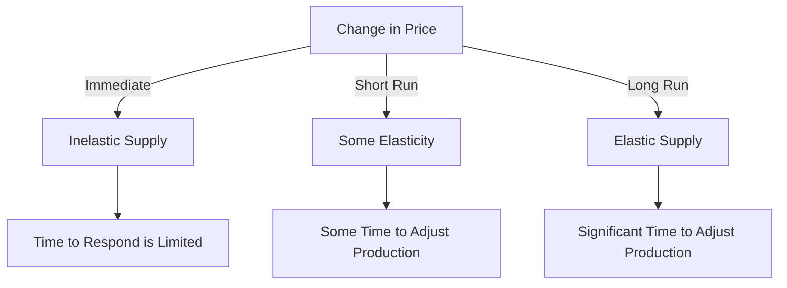

---

title: Time_To_Respond
course: Economics
unit: '2'
semester: Winter 2026
mode: ECON-MICRO
type: atomic_note
hub: '[[2_Basics_Of_Economics_Hub]]'
source: '[[5-Pdf Store/note generated/Winter 2026/Economics/Chapter_2.pdf]]'
date: '2026-05-08'
prerequisites:
- '[[Ceteris_Paribus]]'
- '[[Law_Of_Supply]]'
- '[[Demand_Schedule]]'
- '[[Demand_Curve]]'
- '[[Point_And_Arc_Method]]'
source_pages:
- 49
generated: true

---


## 1. Mental Model

Imagine you're a lemonade stand owner on a super hot summer day. If I told you right now that I want to pay double for your lemonade, but I only want it for 5 minutes, you might not have time to make more lemonade, so you can't sell more even if you want to. But, if I told you that I want to pay double for your lemonade and I want it for the whole day, you can quickly run home, tell your mom to make more lemons and sugar, and bring it back to sell. The more time you have to get ready and make more lemonade, the more lemonade you can sell. It's like that for producers too! When they have more time to respond to a higher price, they can make more of what they're selling, so they can supply more. That's why we say that the more time a producer has to respond to price changes, the more elastic their supply is, meaning they can change how much they're selling more easily.

## 2. Micro Theory

The concept of Time To Respond is intricately linked with the elasticity of supply, which is a fundamental principle in microeconomics. The elasticity of supply measures the responsiveness of the quantity supplied of a good to changes in its price, while holding all other factors constant, as per the [[Ceteris_Paribus]] assumption. When analyzing the supply side of a market, it is crucial to understand that producers require time to adjust their production levels in response to price changes.

The [[Law_Of_Supply]] posits that, ceteris paribus, an increase in the price of a good leads to an increase in the quantity supplied. However, the extent to which producers can adjust their production in response to price changes depends on the time they have available. The longer the time period, the more opportunity producers have to modify their production levels. This relationship underscores the concept of Time To Respond, which directly influences the elasticity of supply.

The [[Demand_Schedule]] and [[Demand_Curve]] provide insights into how quantity demanded changes with price, but they do not directly inform us about the supply side's responsiveness. Conversely, the Supply Curve and Supply Function illustrate how the quantity supplied changes with price, and they are pivotal in understanding the elasticity of supply. A key determinant of the elasticity of supply is the Price Elasticity Of Supply, which measures the percentage change in quantity supplied in response to a 1% change in price.

The Price Elasticity Of Supply formula, often expressed as the percentage change in quantity supplied divided by the percentage change in price, provides a quantitative measure of supply elasticity. The [[Point_And_Arc_Method]] are techniques used to calculate this elasticity. A critical aspect of supply elasticity is the [[Time_To_Respond]], as it allows producers to adjust their production. The longer the time to respond, the more elastic the supply tends to be, because producers can more easily increase or decrease production in response to price changes.

Producers of [[Normal_Goods]] and [[Inferior_Goods]] face different market dynamics, but their ability to respond to price changes is similarly influenced by the time available. For [[Substitute_Goods]] and [[Complementary_Goods]], the cross-price elasticity and the [[Cross_Price_Elasticity]] provide insights into how changes in the price of one good affect the demand for another. However, on the supply side, the focus is on how producers adjust production in response to price signals, influenced by their [[Time_To_Respond]].

The [[Law_Of_Demand]] and [[Market_Demand_Curve]] are essential for understanding demand-side dynamics, but they do not directly address the supply-side's adjustment to price changes. The [[Market_Equilibrium]] is achieved where the demand and supply curves intersect, and changes in either demand or supply can disrupt this equilibrium, leading to [[Surplus_And_Shortage]]. The [[Effects_Of_Shift_In_Demand_And_Supply]] on market equilibrium are profound, and the ability of producers to respond to these shifts is contingent on their [[Time_To_Respond]].

Technological advancements and [[Change_In_Production_Costs]] can significantly impact the supply curve by altering production capabilities and costs. A [[Shift_In_Supply_Curve]] can result from such changes, and the elasticity of supply can be influenced by the [[Determinants_Of_Elasticity_Of_Supply]], including the [[Length_And_Complexity_Of_Production]] and the [[Mobility_And_Availability_Of_Factors]]. These factors, along with the [[Time_To_Respond]], play a crucial role in determining how quickly and effectively producers can adjust their production levels.

In conclusion, the [[Time_To_Respond]] is a critical factor in the elasticity of supply, as it directly affects the ability of producers to adjust their production in response to price changes. Understanding this concept, along with the related principles of microeconomics such as the [[Market_Demand]], [[Market_Equilibrium_Example]], and various elasticities, provides valuable insights into the dynamics of markets and the behavior of producers and consumers.

## 3. Limitations & Edge Cases

The concept of Time To Respond has limitations, particularly in cases where producers face constraints that hinder their ability to adjust production in response to price changes, such as perishable goods with extremely short production cycles or firms operating at full capacity with limited ability to scale up production; moreover, in extremely short time frames, supply may be completely inelastic as producers are unable to respond at all, while in longer time frames, producers may be able to respond more significantly, but may also face changing expectations, technological constraints, or input availability limitations that affect their ability to adjust production, thus influencing the elasticity of supply.

## 4. Market Graph



The flowchart illustrates how the time available to respond to price changes affects the elasticity of supply. As the time to respond increases from immediate to short run to long run, the supply becomes more elastic, indicating that producers can adjust their production levels more significantly in response to price changes.

## 5. Walkthrough

Here is the 5-step technical walkthrough of how 'Time To Respond' operates:

**Step 1: Understand the Law of Supply**
The Law of Supply states that, ceteris paribus, an increase in the price of a good leads to an increase in the quantity supplied. This implies a positive relationship between price and quantity supplied.

**Step 2: Define Elasticity of Supply**
Elasticity of supply measures the responsiveness of the quantity supplied of a good to changes in its price, while holding all other factors constant (ceteris paribus). It is calculated as the percentage change in quantity supplied in response to a 1% change in price.

**Step 3: Analyze Time to Respond**
The concept of Time To Respond suggests that the more time a producer has to respond to price changes, the more elastic the supply. This means that with more time, producers can adjust their production levels more significantly in response to price changes.

**Step 4: Determine the Impact of Time on Elasticity**
As producers have more time to respond to price changes, they can make adjustments to their production levels, such as investing in new equipment, hiring more labor, or changing their production processes. This increased responsiveness leads to a more elastic supply.

**Step 5: Relate Time to Respond to Elasticity of Supply**
Given that the elasticity of supply measures the responsiveness of quantity supplied to price changes, Time To Respond directly influences the elasticity of supply. The longer the time period producers have to respond, the more elastic the supply will be, as producers can make more significant adjustments to their production levels.

---

## Review & Practice

```interactive-quiz

[
  {
    "type": "mcq",
    "difficulty": "L1",
    "question": "What is the primary factor influencing the elasticity of supply in the context of Time To Respond within Consumer Behavior Analysis?",
    "options": {
      "A": "Ceteris Paribus assumption",
      "B": "Time To Respond",
      "C": "Price Elasticity Of Demand",
      "D": "Market Equilibrium"
    },
    "answer": "B",
    "explanation": "The concept of Time To Respond is intricately linked with the elasticity of supply, which measures the responsiveness of the quantity supplied of a good to changes in its price. The longer the time period producers have to adjust their production levels, the more elastic the supply tends to be. Therefore, Time To Respond is the primary factor influencing the elasticity of supply."
  },
  {
    "type": "fill_in",
    "difficulty": "L2",
    "question": "Fill in the blank.",
    "textWithBlanks": "A critical aspect of supply elasticity is the Blank, as it allows producers to adjust their production.",
    "answer": [
      "Time_To_Respond"
    ],
    "explanation": "The concept of Time To Respond is crucial in understanding the elasticity of supply, as it directly influences the ability of producers to adjust their production levels in response to price changes."
  },
  {
    "type": "debug",
    "difficulty": "L1",
    "question": "Find the bug in the formula for calculating the Price Elasticity of Supply: (\u0394Qs / \u0394P) * (P / Qs).",
    "content": "The formula for Price Elasticity of Supply is given as (\u0394Qs / \u0394P) * (P / Qs). However, the correct formula should be ((\u0394Qs / Qs) / (\u0394P / P)).",
    "answer": "The correct formula for Price Elasticity of Supply is ((\u0394Qs / Qs) / (\u0394P / P)). The given formula (\u0394Qs / \u0394P) * (P / Qs) incorrectly calculates the percentage change in quantity supplied over the change in price, rather than the percentage changes.",
    "required_keywords": [
      "Price_Elasticity_Of_Supply",
      "Ceteris_Paribus",
      "Law_Of_Supply",
      "Time_To_Respond"
    ],
    "explanation": "The bug in the given formula is that it does not accurately represent the concept of elasticity, which is a measure of responsiveness to price changes. The correct formula for Price Elasticity of Supply is ((\u0394Qs / Qs) / (\u0394P / P)), reflecting the percentage change in quantity supplied in response to a 1% change in price."
  }
]

```