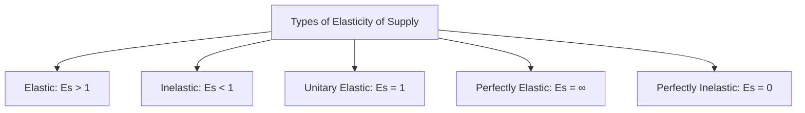

---

title: Types_Of_Elasticity_Of_Supply
course: Economics
unit: '2'
semester: Winter 2026
mode: ECON-MICRO
type: atomic_note
hub: '[[2_Basics_Of_Economics_Hub]]'
source: '[[5-Pdf Store/note generated/Winter 2026/Economics/Chapter_2.pdf]]'
date: '2026-05-08'
prerequisites:
- '[[Ceteris_Paribus]]'
- '[[Law_Of_Supply]]'
- '[[Price_Elasticity_Of_Supply_Formula]]'
- '[[Length_And_Complexity_Of_Production]]'
- '[[Mobility_And_Availability_Of_Factors]]'
source_pages:
- 48
generated: true

---


## 1. Mental Model

Imagine you have a lemonade stand. The types of elasticity of supply are like how quickly you can make more lemonade when people want to buy it. If you can easily make a lot more lemonade (elastic), like having a big pitcher and a friend to help, then a small price increase will make you make a lot more lemonade. If you can't make much more lemonade (inelastic), like having a small pitcher and no helper, then even if people offer to pay more, you can't make much more. If you can make exactly the right amount of lemonade (unitary elastic), then the price increase matches the amount you make. If you can make lemonade at the same cost, no matter what (perfectly elastic), then you'll make lemonade all day! And if you can't make lemonade at all (perfectly inelastic), then no matter how much people offer, you're out of luck!

## 2. Micro Theory

The concept of Types Of Elasticity Of Supply is a crucial aspect of microeconomics, which examines the responsiveness of the quantity supplied of a good to changes in its price, while maintaining [[Ceteris_Paribus]] conditions. This concept is intricately linked to the [[Law_Of_Supply]], which states that as the price of a good increases, the quantity supplied also increases, ceteris paribus.

The [[Price_Elasticity_Of_Supply_Formula]] is used to measure the degree of responsiveness of the quantity supplied to changes in the price of a good. It is calculated as the percentage change in quantity supplied in response to a 1% change in price. Based on this formula, the types of elasticity of supply can be categorized into five main classifications: elastic, inelastic, unitary elastic, perfectly elastic, and perfectly inelastic.

When the elasticity of supply is elastic, it implies that a small price change leads to a relatively large change in the quantity supplied. This situation often arises when [[Length_And_Complexity_Of_Production]] is short, and firms can quickly adjust their production levels in response to price changes. Additionally, [[Mobility_And_Availability_Of_Factors]] and [[Time_To_Respond]] also play a crucial role in determining the elasticity of supply.

On the other hand, when the elasticity of supply is inelastic, a large price change results in a relatively small change in the quantity supplied. This scenario typically occurs when [[Length_And_Complexity_Of_Production]] is long, and firms face significant constraints in adjusting their production levels.

The unitary elastic supply occurs when the percentage change in quantity supplied equals the percentage change in price, resulting in an elasticity value of 1. This situation can arise when firms have a moderate ability to adjust their production levels in response to price changes.

Perfectly elastic supply occurs when a small price change leads to an infinite change in the quantity supplied. This scenario is often associated with firms operating under conditions of constant returns to scale, where they can easily increase or decrease production without incurring significant costs.

Lastly, perfectly inelastic supply occurs when a price change does not lead to any change in the quantity supplied. This situation can arise when firms face significant constraints, such as limited availability of factors of production or technological constraints.

Understanding the [[Determinants_Of_Elasticity_Of_Supply]], such as [[Length_And_Complexity_Of_Production]], [[Mobility_And_Availability_Of_Factors]], and [[Time_To_Respond]], is essential in analyzing the types of elasticity of supply. These determinants influence the responsiveness of firms to changes in market conditions, ultimately affecting the [[Market_Equilibrium]] and leading to either a [[Surplus_And_Shortage]] or an equilibrium situation.

The [[Point_And_Arc_Method]] can be employed to measure the elasticity of supply. Moreover, changes in production costs, [[Technological_Advancement]], and [[Change_In_Production_Costs]] can significantly impact the elasticity of supply.

The analysis of Types Of Elasticity Of Supply has significant implications for businesses, policymakers, and economists. For instance, understanding the elasticity of supply can help firms make informed decisions about production and pricing strategies. Policymakers can also use this knowledge to design effective policies, such as [[Market_Equilibrium_Example]], that take into account the responsiveness of firms to changes in market conditions.

The interrelationship between the [[Demand_Schedule]], [[Demand_Curve]], [[Demand_Function]], and [[Market_Demand]] and the types of elasticity of supply can provide valuable insights into the behavior of firms and consumers in different market structures. Moreover, understanding the [[Price_Elasticity_Of_Demand]], [[Income_Elasticity_Of_Demand]], and [[Cross_Price_Elasticity]] can help businesses and policymakers make informed decisions about pricing and output strategies.

The concepts of [[Normal_Goods]], [[Inferior_Goods]], [[Substitute_Goods]], and [[Complementary_Goods]] are also closely related to the types of elasticity of supply, as changes in consumer preferences and income can impact the demand for these goods and, subsequently, the elasticity of supply.

In conclusion, the Types Of Elasticity Of Supply is a critical concept in microeconomics that examines the responsiveness of the quantity supplied to changes in the price of a good. Understanding the different types of elasticity of supply, including elastic, inelastic, unitary elastic, perfectly elastic, and perfectly inelastic, is essential for businesses, policymakers, and economists to make informed decisions about production, pricing, and policy strategies.

## 3. Limitations & Edge Cases

The types of elasticity of supply have specific limitations and edge cases, particularly when considering extreme scenarios. For instance, perfectly elastic supply assumes that even a slight price change leads to an infinite change in quantity supplied, which rarely occurs in reality as suppliers usually have some flexibility in their production levels. Conversely, perfectly inelastic supply implies that quantity supplied remains constant regardless of price changes, which is also uncommon as suppliers often adjust production in response to price incentives. Moreover, unitary elastic supply, where the percentage change in quantity supplied equals the percentage change in price, is a special case that may not hold consistently over time due to changes in production costs, technology, or expectations. Furthermore, when elasticity is elastic or inelastic, the degree of responsiveness can vary significantly across different goods and time periods, making it challenging to generalize elasticity values. These limitations highlight the need for nuanced analysis when applying elasticity concepts to real-world markets.

## 4. Market Graph



The provided Mermaid flowchart illustrates the five main types of elasticity of supply, which are defined based on the price elasticity of supply formula. Understanding these classifications is essential in industrial organization, as they help firms and policymakers analyze the responsiveness of suppliers to changes in market prices.

## 5. Walkthrough

## Step 1: Define the Price Elasticity of Supply Formula

The Price Elasticity of Supply (PES) is calculated as the percentage change in quantity supplied in response to a 1% change in price. The formula for PES is: PES = (% change in quantity supplied) / (% change in price).

## Step 2: Identify the Types of Elasticity of Supply

There are five main classifications of elasticity of supply: 
1. Elastic
2. Inelastic
3. Unitary elastic
4. Perfectly elastic
5. Perfectly inelastic

## Step 3: Characterize Elastic Supply

An elastic supply implies that a small price change leads to a relatively large change in the quantity supplied. This means the PES value is greater than 1.

## 4: Characterize Inelastic, Unitary Elastic, Perfectly Elastic, and Perfectly Inelastic Supply

- Inelastic supply: PES value is less than 1, indicating a small change in quantity supplied in response to a price change.
- Unitary elastic supply: PES value equals 1, indicating a proportional change in quantity supplied in response to a price change.
- Perfectly elastic supply: PES value is infinity, indicating that any price change leads to an infinite change in quantity supplied.
- Perfectly inelastic supply: PES value is 0, indicating no change in quantity supplied regardless of the price change.

## 5: Apply Ceteris Paribus Condition

All analyses are conducted under the ceteris paribus condition, meaning all other factors are held constant except for the price of the good and its quantity supplied.

---

## Review & Practice

```interactive-quiz

[
  {
    "type": "mcq",
    "difficulty": "L1",
    "question": "What type of elasticity of supply occurs when a small price change leads to a relatively large change in the quantity supplied?",
    "options": {
      "A": "Inelastic",
      "B": "Elastic",
      "C": "Unitary Elastic",
      "D": "Perfectly Inelastic"
    },
    "answer": "B",
    "explanation": "The correct answer is Elastic. This type of elasticity of supply is characterized by a situation where a small price change leads to a relatively large change in the quantity supplied. This often occurs when the length and complexity of production is short, and firms can quickly adjust their production levels in response to price changes."
  },
  {
    "type": "fill_in",
    "difficulty": "L2",
    "question": "Fill in the blank.",
    "textWithBlanks": "The Blank is used to measure the degree of responsiveness of the quantity supplied to changes in the price of a good.",
    "answer": [
      "Price_Elasticity_Of_Supply_Formula"
    ],
    "explanation": "The Price Elasticity Of Supply Formula is a critical concept in microeconomics that measures how responsive the quantity supplied of a good is to changes in its price, while maintaining Ceteris Paribus conditions."
  },
  {
    "type": "debug",
    "difficulty": "L1",
    "question": "Find the bug in the following formula for Price Elasticity Of Supply: [[PES = (\u0394Q/Q) / (\u0394P/P)]]",
    "content": "The formula for Price Elasticity Of Supply is [[PES = (\u0394Q/Q) / (\u0394P/P)]]. However, this formula seems to be missing a crucial component. Identify the subtle error.",
    "answer": "The formula [[PES = (\u0394Q/Q) / (\u0394P/P)]] is actually correct, but it does not specify that the elasticity is usually expressed as a positive value. The correct representation should be [[PES = |(\u0394Q/Q) / (\u0394P/P)|]]. The error is the omission of the absolute value symbol.",
    "required_keywords": [
      "Price_Elasticity_Of_Supply_Formula",
      "absolute value",
      "PES"
    ],
    "explanation": "The Price Elasticity Of Supply (PES) formula measures the responsiveness of the quantity supplied to changes in the price of a good. The correct formula should include the absolute value to ensure a positive elasticity value, as elasticity is typically expressed in a positive form."
  }
]

```