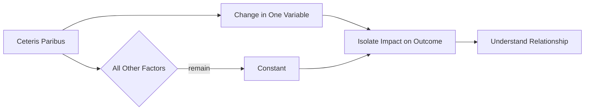

---

title: Ceteris_Paribus
course: Economics
unit: '2'
semester: Winter 2026
mode: ECON-MICRO
type: atomic_note
hub: '[[2_Theory_Of_Demand_And_Supply_Hub]]'
source: '[[5-Pdf Store/note generated/Winter 2026/Economics/Chapter_2.pdf]]'
date: '2026-05-08'
prerequisites:
- '[[Theory_Of_Demand]]'
- '[[Law_Of_Demand]]'
- '[[Demand_Curve]]'
- '[[Demand_Schedule]]'
- '[[Demand_Function]]'
source_pages:
- 5
generated: true

---


## 1. Mental Model

Imagine you're at a lemonade stand, and you want to see how a price increase affects how many cups of lemonade you buy. Ceteris paribus is like saying, "Let's pretend that nothing else changes - it's still a sunny day, you're still thirsty, and your mom still has the same amount of money to spend." This way, if the lemonade stand owner raises the price from 50 cents to 75 cents, you can see how that one change affects your buying decision, without other things like the weather or your mom's wallet getting in the way. It's like holding everything else constant, so you can focus on just the impact of the price change!

## 2. Micro Theory

The concept of Ceteris Paribus, which translates to "all things being equal" or "other things being equal," is a fundamental assumption in microeconomic analysis. It enables economists to isolate the impact of a specific variable or change in circumstances on a particular economic phenomenon, while assuming that all other relevant factors remain constant. This assumption is crucial in the development of economic theories, models, and analyses, as it allows researchers to abstract from the complexity of real-world situations and focus on the essential relationships between variables.

In the context of [[Theory_Of_Demand]], the [[Law_Of_Demand]] states that, ceteris paribus, an increase in the price of a good leads to a decrease in the quantity demanded, and vice versa. This inverse relationship between price and quantity demanded is typically represented by a [[Demand_Curve]], which is a graphical representation of the [[Demand_Schedule]]. The [[Demand_Function]], which expresses the relationship between the quantity demanded and its determinants, is also based on the ceteris paribus assumption.

The ceteris paribus assumption is essential when analyzing the [[Determinants_Of_Demand]], such as changes in [[Taste_And_Preference]], [[Income_Elasticity_Of_Demand]], [[Price_Elasticity_Of_Demand]], [[Substitutes_And_Complements]], [[Normal_And_Inferior_Goods]], [[Consumer_Expectations]], and [[Number_Of_Buyers]]. For instance, when examining the effect of a change in consumer income on the demand for a good, economists assume that all other factors, such as prices, tastes, and preferences, remain constant.

Similarly, in the analysis of [[Market_Demand]] and the [[Market_Demand_Curve]], the ceteris paribus assumption is used to isolate the impact of changes in market conditions, such as changes in the number of buyers, on the overall demand for a good. The [[Market_Equilibrium]] concept, which represents the point at which the demand and supply curves intersect, is also based on the ceteris paribus assumption.

The ceteris paribus assumption is not limited to demand analysis; it is also applied in the study of supply. For example, when analyzing the [[Elasticity_Of_Supply]], economists assume that all other factors, such as technology and production costs, remain constant. The [[Price_Elasticity_Of_Supply_Formula]] and the [[Determinants_Of_Elasticity_Of_Supply]] are also based on this assumption.

The importance of the ceteris paribus assumption becomes apparent when considering the effects of shifts in demand and supply curves. A [[Shift_In_Supply_Curve]], for instance, can lead to changes in market equilibrium, resulting in a [[Surplus_And_Shortage]]. By assuming that all other factors remain constant, economists can isolate the impact of the shift in the supply curve on market equilibrium.

In conclusion, the ceteris paribus assumption is a crucial component of microeconomic analysis, enabling economists to simplify complex situations and focus on the essential relationships between variables. By assuming that all other factors remain constant, researchers can isolate the impact of a specific change in circumstances on a particular economic phenomenon, leading to a deeper understanding of economic theories and models.

## 3. Limitations & Edge Cases

The assumption of ceteris paribus, or "all else being equal," is a crucial tool in microeconomic analysis, but it has significant limitations. In reality, it is often difficult to isolate a single change in circumstances, as multiple factors tend to change simultaneously, making it challenging to hold all else constant. Furthermore, the ceteris paribus assumption can lead to oversimplification of complex relationships, neglecting potential interactions and feedback effects between variables. Additionally, the assumption may not hold in situations where there are significant external shocks, structural changes, or non-linear relationships, rendering the analysis less reliable. As a result, economists must be cautious when interpreting results derived from ceteris paribus assumptions, recognizing that real-world outcomes may diverge from predicted outcomes due to the inevitable changes in other factors.

## 4. Market Graph



Ceteris Paribus is a crucial assumption in Industrial Organization that allows economists to isolate the impact of a specific change in circumstances on an economic phenomenon by assuming all other relevant factors remain constant. By doing so, researchers can develop and analyze economic theories and models that provide insights into the essential relationships between variables.

## 5. Walkthrough

Here is the 5-step technical walkthrough of how 'Ceteris Paribus' operates:

1. **Identify the specific variable or change in circumstances**: The economist identifies a specific change in circumstances that they want to analyze, such as an increase in the price of a good.

2. **Assume all other relevant factors remain constant**: The economist assumes that all other relevant factors, apart from the identified change in circumstances, remain unchanged. This is the core of the Ceteris Paribus assumption.

3. **Isolate the impact of the specific variable or change in circumstances**: By holding all other factors constant, the economist can isolate the impact of the specific variable or change in circumstances on the economic phenomenon being studied.

4. **Analyze the relationship between variables**: For example, in the context of the Law of Demand, the economist analyzes the relationship between the price of a good and the quantity demanded, assuming that all other factors remain constant.

5. **Simplify the situation using Ceteris Paribus**: By assuming that everything else is unchanged apart from the single change in circumstances, the economist can simplify the situation and focus on the essential relationship between the variables, such as the inverse relationship between price and quantity demanded.

---

## Review & Practice

```interactive-quiz

[
  {
    "type": "mcq",
    "difficulty": "L1",
    "question": "What is the primary purpose of the ceteris paribus assumption in microeconomic analysis?",
    "options": {
      "A": "To account for all possible variables in a market",
      "B": "To isolate the impact of a specific variable while assuming all other relevant factors remain constant",
      "C": "To predict market trends with certainty",
      "D": "To simplify complex mathematical calculations"
    },
    "answer": "B",
    "explanation": "The ceteris paribus assumption, which translates to \"all things being equal\" or \"other things being equal,\" enables economists to isolate the impact of a specific variable or change in circumstances on a particular economic phenomenon, while assuming that all other relevant factors remain constant. This assumption is crucial in the development of economic theories, models, and analyses, as it allows researchers to abstract from the complexity of real-world situations and focus on the essential relationships between variables."
  },
  {
    "type": "fill_in",
    "difficulty": "L2",
    "question": "Fill in the blank.",
    "textWithBlanks": "The assumption that allows economists to isolate the impact of a specific variable or change in circumstances on a particular economic phenomenon, while assuming that all other relevant factors remain constant, is known as Blank.",
    "answer": [
      "Ceteris Paribus"
    ],
    "explanation": "The ceteris paribus assumption is a fundamental concept in microeconomic analysis, enabling economists to abstract from the complexity of real-world situations and focus on the essential relationships between variables. It translates to \"all things being equal\" or \"other things being equal,\" and is crucial in the development of economic theories, models, and analyses. By assuming that all other relevant factors remain constant, economists can isolate the impact of a specific variable or change in circumstances on a particular economic phenomenon."
  },
  {
    "type": "debug",
    "difficulty": "L2",
    "question": "Find the bug in the following ceteris paribus scenario: A researcher analyzes the effect of a 10% increase in the price of coffee on the quantity demanded, assuming that all other factors, including the price of tea, remain constant.",
    "content": "The researcher uses the following demand function: Qd = 100 - 2P + 0.5I + 0.2Pt, where Qd is the quantity demanded of coffee, P is the price of coffee, I is the consumer's income, and Pt is the price of tea. However, the researcher incorrectly assumes that the price of tea (Pt) remains constant at $2, when in fact, the price of tea increases by 5% due to a shortage in the tea market.",
    "answer": "The bug is that the researcher failed to account for the 5% increase in the price of tea (Pt) when analyzing the effect of the 10% increase in the price of coffee on the quantity demanded.",
    "required_keywords": [
      "ceteris_paribus",
      "demand_function"
    ],
    "explanation": "The ceteris paribus assumption requires that all other factors remain constant when analyzing the effect of a specific variable or change in circumstances. In this scenario, the researcher incorrectly assumes that the price of tea (Pt) remains constant, when in fact, it increases by 5%. This error can be represented mathematically as: $\\Delta Qd = \\frac{\\partial Qd}{\\partial P} \\Delta P + \\frac{\\partial Qd}{\\partial Pt} \\Delta Pt$. By failing to account for the change in Pt, the researcher omits the term $\\frac{\\partial Qd}{\\partial Pt} \\Delta Pt = 0.2 \\cdot 5\\% = 0.1$ from the calculation, leading to an incorrect estimate of the effect of the price increase on the quantity demanded."
  },
  {
    "type": "trace",
    "difficulty": "L2",
    "question": "What is the exact output of the ceteris paribus assumption on the demand curve when there is a change in consumer income, assuming all other factors such as prices, tastes, and preferences remain constant?",
    "content": "The ceteris paribus assumption is used to isolate the impact of a change in consumer income on the demand curve. When consumer income increases, ceteris paribus, the demand curve for a normal good shifts to the right, indicating an increase in the quantity demanded at each price level. Conversely, when consumer income decreases, ceteris paribus, the demand curve for a normal good shifts to the left, indicating a decrease in the quantity demanded at each price level.",
    "answer": "A rightward or leftward shift in the demand curve",
    "explanation": "The ceteris paribus assumption allows us to analyze the effect of a change in consumer income on the demand curve, while assuming that all other factors remain constant. Using the demand function $Q_d = f(P, I, T, P_s, P_c)$, where $Q_d$ is the quantity demanded, $P$ is the price of the good, $I$ is consumer income, $T$ is tastes and preferences, $P_s$ is the price of substitutes, and $P_c$ is the price of complements, we can isolate the impact of a change in consumer income on the demand curve. When consumer income increases, the demand function shifts to $Q_d' = f(P, I', T, P_s, P_c)$, where $I' > I$, resulting in a rightward shift in the demand curve. Conversely, when consumer income decreases, the demand function shifts to $Q_d'' = f(P, I'', T, P_s, P_c)$, where $I'' < I$, resulting in a leftward shift in the demand curve. This can be represented graphically as $\\Delta Q_d = \frac{\\partial Q_d}{\\partial I} \\Delta I$, which shows the change in quantity demanded resulting from a change in consumer income, ceteris paribus."
  }
]

```