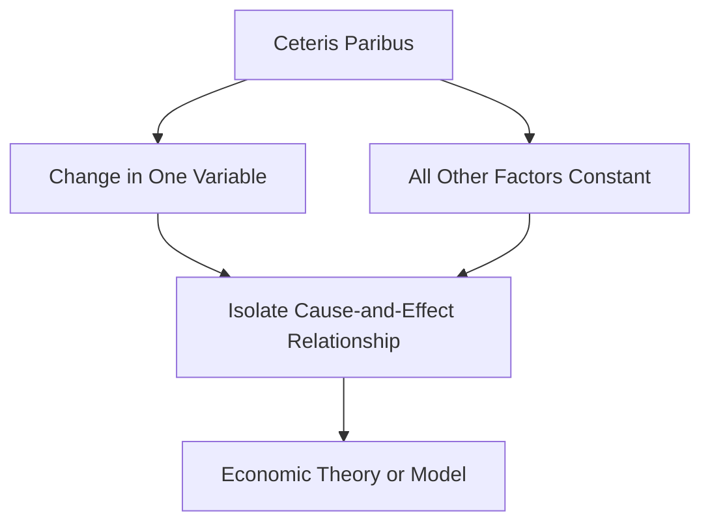

## 1. Mental Model

Imagine you're at a lemonade stand, and you want to see how a price increase affects how many cups of lemonade you buy. Ceteris paribus is like saying, "Let's pretend that nothing else changes - it's still a sunny day, you're still thirsty, and your mom still has the same amount of money to spend." This way, if the lemonade stand owner raises the price from 50 cents to 75 cents, you can see how that one change affects your buying decision, without other things like the weather or your mom's wallet getting in the way. It's like holding everything else constant, so you can focus on just the impact of the price change!

## 2. Micro Theory

The concept of Ceteris Paribus, which translates to "all things being equal" or "other things being equal," is a fundamental assumption in microeconomics that enables economists to isolate the impact of a single variable on a particular economic phenomenon. This assumption is crucial in the development of economic theories, including the [[Theory_Of_Demand]], which examines how consumers respond to changes in market conditions.

In essence, Ceteris Paribus is a methodological device that allows researchers to abstract away from the complexities of real-world situations and focus on the relationship between two variables, while assuming that all other factors remain constant. This assumption is essential in the construction of economic models, such as the [[Demand_Function]], which expresses the quantity demanded of a good as a function of its price, income, and other factors.

For instance, when analyzing the [[Law_Of_Demand]], economists assume that the [[Demand_Schedule]] and [[Demand_Curve]] are downward-sloping, indicating that as the price of a good increases, the quantity demanded decreases, Ceteris Paribus. This assumption enables researchers to isolate the effect of price changes on quantity demanded, without considering the impact of other factors, such as changes in consumer [[Taste_And_Preference]], [[Income_Elasticity_Of_Demand]], or [[Number_Of_Buyers]].

The Ceteris Paribus assumption is also critical in understanding the [[Determinants_Of_Demand]], which include factors such as consumer expectations, income, prices of [[Substitutes_And_Complements]], and [[Normal_And_Inferior_Goods]]. By assuming that these factors remain constant, economists can examine the impact of a single change, such as an increase in consumer income, on the demand for a particular good.

Furthermore, Ceteris Paribus is essential in analyzing the [[Market_Demand]] and [[Market_Demand_Curve]], which represent the aggregate demand of all consumers in a market. By assuming that all other factors remain constant, researchers can examine the impact of changes in market conditions, such as an increase in the price of a good, on the overall demand for that good.

The assumption of Ceteris Paribus also underlies the concept of [[Price_Elasticity_Of_Demand]], which measures the responsiveness of quantity demanded to changes in price. By assuming that all other factors remain constant, economists can isolate the effect of price changes on quantity demanded and calculate the elasticity of demand.

In addition, Ceteris Paribus is crucial in understanding the [[Market_Equilibrium]], which occurs when the quantity supplied equals the quantity demanded. By assuming that all other factors remain constant, researchers can examine the impact of changes in market conditions, such as an increase in consumer income or a change in [[Consumer_Expectations]], on the equilibrium price and quantity.

In conclusion, the Ceteris Paribus assumption is a fundamental concept in microeconomics that enables researchers to isolate the impact of a single variable on a particular economic phenomenon. By assuming that all other factors remain constant, economists can develop and test economic theories, such as the [[Theory_Of_Demand]], and analyze the behavior of economic agents in various market situations, including [[Surplus_And_Shortage]] and [[Effects_Of_Shift_In_Demand_And_Supply]].

## 3. Limitations & Edge Cases

The assumption of ceteris paribus, or "all else being equal," is a crucial tool in microeconomic analysis, but it has significant limitations. In reality, it is often difficult to isolate a single change in circumstances, as multiple factors tend to change simultaneously, making it challenging to hold all else constant. Furthermore, the ceteris paribus assumption can lead to oversimplification of complex relationships, neglecting potential interactions and feedback effects between variables. Additionally, the assumption may not hold in situations where there are significant external shocks, structural changes, or non-linear relationships, rendering the analysis less reliable. As a result, economists must be cautious when interpreting results derived from ceteris paribus assumptions, recognizing that real-world outcomes may diverge from predicted outcomes due to the inevitable changes in other factors.

## 4. Market Graph



This flowchart illustrates the concept of Ceteris Paribus, which allows economists to isolate the impact of a single variable on an economic phenomenon by assuming all other factors remain constant. By using Ceteris Paribus, researchers can develop and test economic theories and models, such as the Theory of Demand, while controlling for the effects of other variables.

## 5. Walkthrough

Here is a 5-step technical walkthrough of how 'Ceteris Paribus' operates in Industrial Organization:

**Step 1: Specify the Economic Model**
Identify the specific economic model being analyzed, such as the demand function or the production function. For example, let's consider a simple demand function: Q = f(P, I, P_s), where Q is the quantity demanded, P is the price of the good, I is consumer income, and P_s is the price of a substitute good.

**Step 2: Identify the Variable of Interest**
Determine the variable of interest that is to be analyzed, such as the effect of a price change on quantity demanded. Suppose we want to examine how a change in the price of the good (P) affects the quantity demanded (Q).

**Step3: Apply Ceteris Paribus Assumption**
Assume that all other variables, except the variable of interest, remain constant. In this case, we assume that consumer income (I) and the price of the substitute good (P_s) remain constant. This allows us to isolate the effect of the price change (P) on quantity demanded (Q).

**Step 4: Analyze the Relationship**
Analyze the relationship between the variable of interest and the outcome variable, while holding all other variables constant. For example, we may find that a 10% increase in the price of the good (P) leads to a 5% decrease in quantity demanded (Q), ceteris paribus.

**Step 5: Interpret Results and Relax Assumptions**
Interpret the results of the analysis, taking into account the ceteris paribus assumption. Recognize that in reality, other variables may not remain constant, and adjust the analysis accordingly. For instance, if consumer income (I) were to increase, the demand curve may shift, affecting the relationship between price (P) and quantity demanded (Q).

---

## Review & Practice

```interactive-quiz

[
  {
    "id": "Q1_Ceteris_Paribus",
    "type": "mcq",
    "difficulty": "L1",
    "question": "What is the primary purpose of assuming Ceteris Paribus in the Law of Demand within Industrial Organization?",
    "options": {
      "A": "To demonstrate that demand curves are positively sloped",
      "B": "To isolate the impact of a single variable on quantity demanded",
      "C": "To show that price elasticity of demand is always unitary",
      "D": "To prove that demand is always perfectly inelastic"
    },
    "answer": "B",
    "explanation": "The Ceteris Paribus assumption allows economists to abstract away from the complexities of real-world situations and focus on the relationship between two variables, while assuming that all other factors remain constant. In the context of the Law of Demand, Ceteris Paribus enables researchers to isolate the effect of price changes on quantity demanded, without considering the impact of other factors. This is mathematically represented as $Q_d = f(P, I, P_s, P_c, T, ...)$ where $Q_d$ is the quantity demanded, $P$ is the price of the good, $I$ is income, $P_s$ and $P_c$ are prices of substitutes and complements, $T$ represents taste and preferences, and other factors are held constant. By assuming Ceteris Paribus, economists can examine the impact of a single change, such as $\\Delta P$, on $Q_d$, which is essential in understanding the downward-sloping demand curve."
  },
  {
    "id": "Q1234",
    "type": "fill_in",
    "difficulty": "L2",
    "question": "Fill in the blank.",
    "textWithBlanks": "The assumption of Blank is a fundamental concept in microeconomics that enables economists to isolate the impact of a single variable on a particular economic phenomenon.",
    "answer": [
      "Ceteris Paribus"
    ],
    "explanation": "The Ceteris Paribus assumption, which translates to \"all things being equal\" or \"other things being equal,\" is a methodological device that allows researchers to abstract away from the complexities of real-world situations and focus on the relationship between two variables, while assuming that all other factors remain constant. This assumption is essential in the construction of economic models, such as the demand function, which expresses the quantity demanded of a good as a function of its price, income, and other factors. In essence, $Y = f(X) \\implies \\frac{\\partial Y}{\\partial X} = \\frac{\\Delta Y}{\\Delta X}$ , Ceteris Paribus."
  },
  {
    "id": "Q1234",
    "type": "debug",
    "difficulty": "L2",
    "question": "Find the bug in the following Ceteris Paribus scenario: A researcher analyzes the effect of a price increase on the quantity demanded of a good, assuming that all other factors remain constant, but fails to account for the potential impact of a simultaneous increase in consumer income on the demand for the good.",
    "content": "The Ceteris Paribus assumption is used to isolate the effect of a price increase on the quantity demanded of a good. However, if consumer income also increases, the demand for the good may change due to the increase in income, not just the price. The correct formula for the change in quantity demanded should be: $\\Delta Q_d = \\frac{\\partial Q_d}{\\partial P} \\Delta P + \\frac{\\partial Q_d}{\\partial I} \\Delta I$. But in the given scenario, the researcher only considers the effect of the price increase: $\\Delta Q_d = \\frac{\\partial Q_d}{\\partial P} \\Delta P$.",
    "answer": "The bug is that the researcher fails to account for the potential impact of the simultaneous increase in consumer income on the demand for the good.",
    "required_keywords": [
      "Ceteris Paribus",
      "Demand Function",
      "Price Elasticity"
    ],
    "explanation": "The Ceteris Paribus assumption is a fundamental concept in microeconomics that enables researchers to isolate the impact of a single variable on a particular economic phenomenon. In this scenario, the researcher assumes that all other factors remain constant, but fails to account for the potential impact of a simultaneous increase in consumer income on the demand for the good. The correct formula for the change in quantity demanded should include the effect of both the price increase and the income increase: $\\Delta Q_d = \\frac{\\partial Q_d}{\\partial P} \\Delta P + \\frac{\\partial Q_d}{\\partial I} \\Delta I$. The bug can be fixed by including the income effect in the analysis."
  },
  {
    "id": "IO_TRACE_1",
    "type": "trace",
    "difficulty": "L2",
    "question": "What is the exact output on total revenue when a cost increase, such as higher wages, occurs in the production of widgets, assuming a competitive market with a supply curve of $Q_s = 2P - 4$ and a demand curve of $Q_d = 20 - 2P$, where initially the equilibrium price is $6 and the equilibrium quantity is 8?",
    "content": "Consider a competitive market for widgets with the following supply and demand curves: $Q_s = 2P - 4$ and $Q_d = 20 - 2P$. Initially, the market is in equilibrium at a price of $6 and a quantity of 8. A cost increase, such as higher wages, shifts the supply curve to $Q_s = 2P - 8$. We need to trace the impact of this cost increase through the supply curve to the equilibrium price and total revenue.",
    "answer": "$48",
    "explanation": "The initial equilibrium is given by $Q_s = Q_d$, which yields $2P - 4 = 20 - 2P$. Solving for $P$ results in $P = 6$. Substituting $P = 6$ into either the supply or demand curve gives $Q = 8$. The total revenue is $TR = P \\cdot Q = 6 \\cdot 8 = 48$. After the cost increase, the new supply curve is $Q_s = 2P - 8$. Setting $Q_s = Q_d$ yields $2P - 8 = 20 - 2P$. Solving for $P$ results in $4P = 28$, so $P = 7$. Substituting $P = 7$ into either curve gives $Q = 6$. The new total revenue is $TR = 7 \\cdot 6 = 42$. Therefore, the exact output on total revenue after the cost increase is $42."
  }
]

```