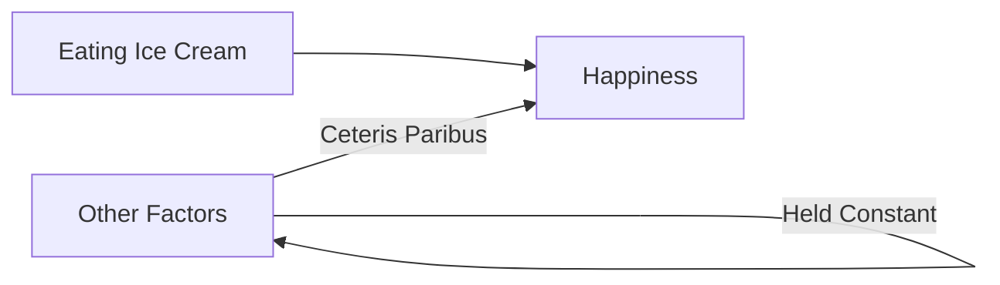

---

title: Ceteris_Paribus
type: Atomic Note
course: Economics
semester: Winter 2026
unit: '2'
hub: '[[2_Theory_Of_Demand_And_Supply_Hub]]'
source: '[[5-Pdf Store/note generated/Winter 2026/Economics/Chapter_2.pdf]]'
source_pages:
- 5
mode: ECON-MACRO
read: false
generated: true
prerequisites:
- '[[Law_Of_Demand]]'
- '[[Law_Of_Supply]]'

---


# 1. Mental Model

Imagine you're trying to figure out how eating ice cream affects your happiness. You want to know if eating more ice cream makes you happier. To make it simple, let's assume everything else that could affect your happiness, like your friends, family, and favorite TV shows, stays the same. This way, you can focus only on the ice cream and happiness connection.

# 2. Economic Theory

[[Ceteris_Paribus]] is an assumption used in economics to isolate the effect of a single variable by holding all other factors constant. This allows economists to analyze the relationship between variables without the complexity of multiple changing factors. It is often used in conjunction with other economic concepts, such as [[Law_Of_Demand]] and [[Law_Of_Supply]], to understand market behavior under the assumption that [[Ceteris_Paribus]] conditions are met.

## 3. Economic Model



## 4. Walkthrough

* The model starts with "Eating Ice Cream" (A) as the variable of interest.
* The assumption of Ceteris Paribus is applied by holding "Other Factors" (C) constant.
* This allows us to isolate the effect of eating ice cream on "Happiness" (B).
* By assuming all other factors remain the same, we can focus solely on the relationship between eating ice cream and happiness.

## 5. Market Failures

The Ceteris Paribus assumption can fail when other factors are not held constant, leading to incorrect conclusions about the relationship between variables. Common pitfalls include omitting important variables or assuming they have no effect when they actually do. Additionally, real-world scenarios often involve complex interactions between variables, making it difficult to accurately hold all other factors constant.

---

## 6. The Proving Grounds

```interactive-quiz

[
  {
    "id": "q1",
    "type": "true_false",
    "difficulty": "L1",
    "question": "The assumption of Ceteris Paribus in economics allows for the simultaneous change of multiple variables to analyze their combined effect on a specific outcome.",
    "answer": false,
    "explanation": "The assumption of Ceteris Paribus, which translates to 'all things being equal,' is used in economics to hold all variables constant except for the one being studied. This means that only one variable is changed at a time, while all other factors remain constant. This approach enables economists to isolate and analyze the effect of a single variable on a specific outcome, without the influence of other variables. Therefore, the statement that Ceteris Paribus allows for the simultaneous change of multiple variables is false."
  },
  {
    "id": "q2",
    "type": "synthesis",
    "difficulty": "L2",
    "question": "A researcher wants to study the impact of daily commute time on worker productivity. Using the concept of Ceteris Paribus, design an experiment to isolate the effect of commute time on productivity, considering factors like work environment, job satisfaction, and work-life balance.",
    "answer": "A grading rubric: \n- Isolate commute time variable (1 point)\n- Control for work environment factors (1 point)\n- Account for job satisfaction levels (1 point)\n- Consider work-life balance (1 point)\n- Analyze productivity metrics (1 point)\n- Ceteris Paribus assumption clearly stated (1 point)\n- Conclusion based on data analysis (1 point)\n",
    "explanation": "The concept of Ceteris Paribus, or 'all else being equal,' is crucial in designing experiments to study the relationship between variables. In this scenario, the researcher aims to understand how daily commute time affects worker productivity. To isolate the effect of commute time, the researcher must hold all other factors constant. This involves controlling for work environment factors, such as office space and equipment, and accounting for job satisfaction levels and work-life balance. By assuming Ceteris Paribus, the researcher can focus solely on the relationship between commute time and productivity, analyzing metrics such as task completion rates and quality of work. A clear statement of the Ceteris Paribus assumption and a conclusion based on data analysis are essential components of a valid experiment."
  },
  {
    "id": "q3",
    "type": "writing",
    "difficulty": "L3",
    "question": "Explain the concept of Ceteris Paribus and its significance in economic analysis.",
    "answer": "Ceteris Paribus is an economic assumption that holds all other factors constant to isolate the effect of a single variable, allowing for the analysis of the relationship between variables.",
    "explanation": "The underlying mechanism of Ceteris Paribus involves controlling for extraneous variables to establish a causal relationship between two variables. By assuming that all other factors remain constant, economists can focus on the specific effect of one variable on another, providing a clearer understanding of their relationship. This assumption enables the development of theoretical models and the testing of hypotheses in economics."
  }
]

```