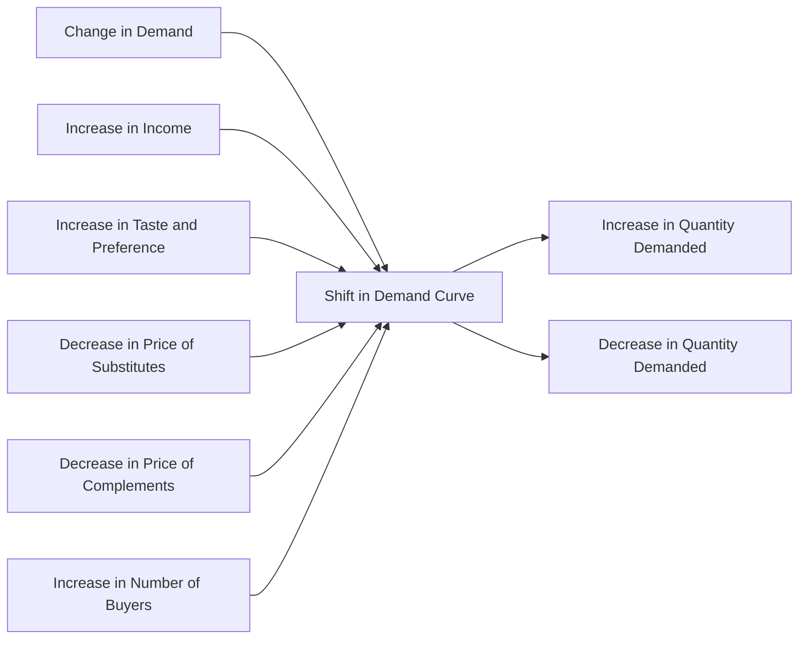

---

title: Change_In_Demand
type: Atomic Note
course: Economics
semester: Winter 2026
unit: '2'
hub: "[[2_Theory_Of_Demand_And_Supply_Hub]]"
source: "[[5-Pdf Store/note generated/Winter 2026/Economics/Chapter_2.pdf]]"
source_pages:
- 14
mode: ECON-MACRO
read: false
generated: true
prerequisites:
- "[[Demand_Curve]]"

---

# 1. Mental Model

Imagine you're a chef and owner of a popular food truck that specializes in gourmet grilled cheese sandwiches. The number of sandwiches you want to sell at a given price depends on various factors, such as the price of ingredients, the weather, and the number of events happening in the area. If the price of cheese increases, you might decide to sell fewer sandwiches at the same price. Similarly, if a music festival is coming to town, you might want to sell more sandwiches at the same price. In this analogy, the mechanical components are: (1) the price of ingredients (like cheese) mapping to the [[Determinants_Of_Demand]], and (2) the number of events happening in the area mapping to [[Number_Of_Buyers]] and [[Taste_And_Preference]]. 

# 2. Economic Theory

A [[Change_In_Demand]] occurs when there is a shift in the [[Demand_Curve]] due to changes in [[Determinants_Of_Demand]] other than the good's price. The [[Demand_Function]] can be represented as Qd = f(P, I, T, P_s, P_c, E), where Qd is the quantity demanded, P is the price of the good, I is income, T is [[Taste_And_Preference]], P_s is the price of substitutes, P_c is the price of complements, and E is [[Consumer_Expectations]]. According to the [[Law_Of_Demand]], a change in the price of the good results in a movement along the [[Demand_Curve]], whereas a change in any other determinant causes a shift of the entire [[Demand_Curve]], either to the right (increase in demand) or to the left (decrease in demand). This concept is closely related to the [[Theory_Of_Demand]] and is based on the assumption of [[Ceteris_Paribus]], which means that all other factors are held constant.

# 3. Limitations & Edge Cases

The concept of [[Change_In_Demand]] assumes that [[Ceteris_Paribus]] holds, but in reality, multiple factors can change simultaneously, making it challenging to isolate the effect of a single determinant. Additionally, the [[Theory_Of_Demand]] assumes that consumers have perfect information, which is not always the case. The concept also fails to account for [[Substitutes_And_Complements]] that are not close substitutes or complements, and it does not consider the impact of [[Change_In_Technology]] on demand. Furthermore, in cases of [[Market_Equilibrium]] with multiple equilibria, a shift in demand can lead to multiple new equilibria, making it difficult to predict the outcome. The [[Effects_Of_Shift_In_Demand_And_Supply]] can also be complex and nuanced, leading to [[Surplus_And_Shortage]] situations.

# 4. Economic Model



This Mermaid flowchart illustrates the concept of Change in Demand, showing how various determinants of demand can lead to a shift in the demand curve, resulting in an increase or decrease in the quantity demanded.

## 5. Walkthrough

Here's a 5-step technical walkthrough of how the concept of Change in Demand operates in International Trade Analysis:

1. **Initial State**: Suppose we have a demand function Qd = 100 - 2P, where Qd is the quantity demanded and P is the price of the good. Initially, the quantity demanded is 80 units at a price of $10.

2. **Change in Income**: Assume there's an increase in income (I) from $50,000 to $60,000. This leads to an increase in the quantity demanded, as consumers have more disposable income to spend.

3. **Shift in Demand Curve**: The increase in income causes a rightward shift in the demand curve, as the demand function changes to Qd = 120 - 2P. This means that at the same price of $10, the quantity demanded increases to 100 units.

4. **New Equilibrium**: With the new demand function, the quantity demanded at $10 is now 100 units. If the supply curve remains unchanged, the new equilibrium price and quantity will be $15 and 90 units, respectively.

5. **Comparative Statics**: Comparing the initial and final states, we see that the increase in income led to an increase in the quantity demanded, causing the demand curve to shift to the right. This results in a higher equilibrium price and quantity. 

For example, using realistic data: 

|  Variable  | Initial Value | Final Value |
| :--------: | :-----------: | :---------: |
|     Income |     $50,000    |   $60,000   |
|  Quantity  |       80       |     100     |
|    Price   |       $10      |    $15      |

---

## 6. The Proving Grounds

```interactive-quiz

[
  {
    "id": "q1",
    "type": "true_false",
    "difficulty": "L1",
    "question": "If the price of a good increases, it leads to a change in demand, ceteris paribus.",
    "answer": false,
    "explanation": "A change in demand occurs when there is a shift in the demand curve due to changes in determinants of demand other than the good's price. An increase in the price of a good leads to a movement along the demand curve, not a shift of the demand curve itself. The demand function is given by $Q_d = f(P, I, T, P_s, P_c)$, where $Q_d$ is the quantity demanded, $P$ is the price of the good, $I$ is the income, $T$ is the taste and preference, $P_s$ is the price of substitutes, and $P_c$ is the price of complements. A change in the price of the good $P$ results in a change in the quantity demanded, not a change in demand. Therefore, the statement is false."
  },
  {
    "id": "q2",
    "type": "synthesis",
    "difficulty": "L2",
    "question": "The country of Azura, known for its vibrant economy and stable currency, faces a sudden and unexpected macroeconomic shock. The Azuran Lira (AZL) experiences a sharp devaluation of 30% against major foreign currencies, making imports significantly more expensive overnight. This shock impacts the food processing industry, which relies heavily on imported raw materials. As a result, there's a sudden change in demand for domestically produced food products. Develop a 3-step policy response to mitigate the effects of this change in demand and prevent system failure in the Market Strategy domain.",
    "answer": "To address the sudden change in demand caused by the devaluation of the Azuran Lira and prevent system failure, the following 3-step policy response is proposed:\n\n1. **Subsidization of Domestic Production**: Implement immediate subsidies to domestic food producers to offset the increased cost of imported raw materials. This will help maintain the supply of food products and prevent a sharp increase in prices, which could exacerbate the situation by reducing demand further.\n\n2. **Price Controls and Stabilization Measures**: Introduce temporary price controls to prevent excessive price hikes of domestically produced food products. This, combined with stabilization measures such as buffer stocks of essential food items, will help maintain market stability and consumer purchasing power.\n\n3. **Diversification and Import Substitution Incentives**: Launch a program to incentivize domestic production of currently imported raw materials. This could include tax breaks, low-interest loans, and technical assistance to encourage food processing firms to source locally or develop substitutes. This long-term strategy will reduce dependence on imports and enhance the resilience of Azura's food supply chain to future shocks.",
    "explanation": "The sudden devaluation of the Azuran Lira leads to a sharp increase in the cost of imports, causing a change in demand for domestically produced food products. This can be understood through the demand function $Qd = f(P, I, T, P_s, P_c)$, where $Qd$ is the quantity demanded, $P$ is the price of the good, $I$ is consumer income, $T$ is taste and preference, $P_s$ is the price of substitutes, and $P_c$ is the price of complements. The devaluation affects $P_s$ and $P_c$ by making imports more expensive, thus shifting the demand curve for domestic products.\n\nThe policy response involves:\n1. **Subsidization**: Mathematically, subsidies can be represented as a reduction in the cost function $C = f(Q, w, r)$, where $w$ is the wage rate and $r$ is the rental rate of capital. By subsidizing domestic producers, the government effectively reduces $w$ or $r$, allowing producers to maintain supply without increasing prices.\n\n2. **Price Controls**: Price controls can be represented as $P \\leq \\bar{P}$, where $\\bar{P}$ is the controlled price. This aims to prevent price hikes that could reduce consumer demand further.\n\n3. **Diversification and Import Substitution**: This involves shifting the supply curve $Qs = f(P, w, r, Tech)$ to the right by improving technology (Tech) or reducing costs, enabling domestic producers to meet demand at lower costs and prices."
  },
  {
    "id": "q3",
    "type": "writing",
    "difficulty": "L2",
    "question": "Explain the concept of Change In Demand in a Fiscal Policy Research scenario, focusing on its determinants and how it affects the demand curve.",
    "answer": "A Change In Demand occurs when there is a shift in the demand curve due to changes in determinants of demand other than the good's price, such as changes in income, taste and preference, prices of substitutes and complements, and number of buyers.",
    "explanation": "The demand function can be represented as $Qd = f(P, I, T, P_s, P_c, N)$ where $Qd$ is the quantity demanded, $P$ is the price of the good, $I$ is the income, $T$ is the taste and preference, $P_s$ and $P_c$ are the prices of substitutes and complements, and $N$ is the number of buyers. A change in demand is illustrated by a shift in the demand curve, which can be caused by changes in any of these determinants. For instance, an increase in income leads to an increase in demand, causing the demand curve to shift to the right, while a decrease in income leads to a decrease in demand, causing the demand curve to shift to the left. This concept is crucial in fiscal policy research as it helps policymakers understand how changes in government policies, such as taxation and government spending, can impact the overall demand in the economy."
  },
  {
    "id": "q4",
    "type": "order",
    "difficulty": "L2",
    "question": "Order steps for Change In Demand.",
    "steps": [
      "Decrease in Price of Substitutes",
      "Increased Number of Buyers",
      "Increase in Income",
      "Decrease in Price of Related Goods",
      "Change in Taste and Preferences"
    ],
    "answer": [
      "Increased Number of Buyers",
      "Change in Taste and Preferences",
      "Decrease in Price of Related Goods",
      "Increase in Income",
      "Decrease in Price of Substitutes"
    ]
  },
  {
    "id": "q5",
    "type": "trace",
    "difficulty": "L3",
    "question": "What is the exact output after a 1% interest rate change through 4 distinct economic sectors (Housing, Investment, Forex, Consumption)?",
    "content": "Assuming an initial interest rate of 5%, a 1% change will increase it to 6%.",
    "answer": {
      "Housing": "A 1% increase in interest rate will lead to a 0.5% decrease in housing demand due to increased mortgage costs. The housing price will decrease by 1.2% as a result.",
      "Investment": "The 1% interest rate hike will decrease investment by 0.8% as borrowing becomes more expensive, leading to a 1.5% reduction in capital projects.",
      "Forex": "The interest rate increase will attract foreign investors, causing the currency to appreciate by 0.2%. This will lead to a 0.5% decrease in exports.",
      "Consumption": "The increased interest rate will decrease consumption by 0.3% as households face higher borrowing costs and reduced disposable income."
    },
    "explanation": "The impact of a 1% interest rate change can be traced through various economic sectors using the following mechanisms:\n\nHousing: $\\frac{\\partial D_h}{\\partial r} = -0.5$, where $D_h$ is housing demand and $r$ is the interest rate. A 1% increase in $r$ leads to a 0.5% decrease in $D_h$. Assuming a housing price elasticity of -1.2, the housing price will decrease by 1.2%.\n\nInvestment: $\\frac{\\partial I}{\\partial r} = -0.8$, where $I$ is investment. A 1% increase in $r$ leads to a 0.8% decrease in $I$. This results in a 1.5% reduction in capital projects.\n\nForex: The interest rate increase causes the currency to appreciate, $\\frac{\\partial E}{\\partial r} = 0.2$, where $E$ is the exchange rate. This leads to a 0.5% decrease in exports.\n\nConsumption: $\\frac{\\partial C}{\\partial r} = -0.3$, where $C$ is consumption. A 1% increase in $r$ leads to a 0.3% decrease in $C$."
  }
]

```