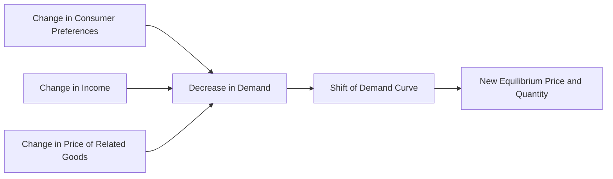

---

title: Change_In_Demand
type: Atomic Note
course: Economics
semester: Winter 2026
unit: '2'
hub: "[[2_Basics_Of_Economics_Hub]]"
source: "[[Chapter_2.pdf]]"
source_pages:
- 14
mode: ECON-MACRO
read: false
generated: true
prerequisites:
- "[[Demand_Curve]]"

---

# 1. Mental Model

Imagine you love eating ice cream, but one day, a new health trend starts and people begin to think ice cream is unhealthy. Suddenly, even though the price of ice cream hasn't changed, you're not as interested in buying it as you used to be. This change in your preference is like a shift in how much ice cream you want to buy at any given price, which is what we call a change in demand.

# 2. Economic Theory

A [[Change_In_Demand]] refers to a shift in the entire [[Demand_Curve]] due to changes in [[Determinants_Of_Demand]] such as consumer preferences, income, or prices of related goods, assuming [[Ceteris_Paribus]]. This change causes the quantity demanded to increase or decrease at any given price. It is often represented graphically as a shift of the [[Demand_Curve]] to the left or right.

# 3. Economic Model



## 4. Walkthrough

* The demand curve shifts when there's a change in consumer preferences, income, or prices of related goods.
* For example, if consumer preferences shift against ice cream, the demand curve shifts to the left, indicating a decrease in demand.
* This shift in demand leads to a new equilibrium price and quantity in the market.
* The change in demand can be illustrated by a movement of the entire demand curve, rather than a movement along the curve.

## 5. Market Failures

The concept of change in demand can fail when there are external factors that affect the market, such as government interventions or unexpected events. Common pitfalls include ignoring the impact of related goods or services on demand and assuming that consumer preferences remain constant. Additionally, changes in demand can be difficult to predict, and businesses may struggle to adjust to sudden shifts in demand.

---

## 6. The Proving Grounds

```interactive-quiz

[
  {
    "id": "q1",
    "type": "true_false",
    "difficulty": "L1",
    "question": "A change in demand refers to a movement along the demand curve in response to a change in price.",
    "answer": false,
    "explanation": "A change in demand actually refers to a shift in the entire demand curve due to changes in determinants of demand such as consumer preferences, income, or prices of related goods, not a movement along the curve in response to a price change. A movement along the demand curve is referred to as a change in quantity demanded."
  },
  {
    "id": "q2",
    "type": "synthesis",
    "difficulty": "L2",
    "question": "The local ice cream shop, Sweet Treats, has been a favorite among residents for years. However, with the rising awareness of health and wellness, a new trend emerges where people start to prefer low-calorie and organic food options. As a result, the shop owner notices that even though the price of ice cream hasn't changed, fewer customers are coming in to buy ice cream. Meanwhile, the price of milk, a key ingredient in ice cream production, increases due to a shortage. Considering these changes, how should Sweet Treats adjust its strategy to maintain sales and profitability?",
    "answer": "Sweet Treats should consider diversifying its product line to include low-calorie and organic ice cream options to adapt to the changing consumer preferences. Additionally, to offset the increased cost of milk, the shop could explore alternative suppliers or negotiate better deals. They might also consider implementing cost-saving measures in their production process. Furthermore, Sweet Treats could focus on marketing the unique qualities of their traditional ice cream, emphasizing the value of their product to customers who still prefer the classic taste and are willing to pay a premium for it.",
    "explanation": "The scenario presents a classic example of a change in demand due to a shift in consumer preferences towards healthier options, which is a determinant of demand. This shift results in a decrease in demand for traditional ice cream. The increase in milk price, a key ingredient, further complicates the situation by increasing production costs. To maintain sales and profitability, Sweet Treats needs to adapt to these changes. Diversifying into low-calorie and organic options can help attract health-conscious consumers, thereby potentially increasing demand. Exploring alternative suppliers or negotiating better deals for milk can help mitigate the increased costs. Implementing cost-saving measures can also help protect profit margins. Lastly, emphasizing the unique value of their traditional ice cream can help retain customers who prefer the classic product, allowing the shop to maintain a niche market."
  },
  {
    "id": "q3",
    "type": "writing",
    "difficulty": "L3",
    "question": "Explain the concept of a change in demand and its underlying mechanism.",
    "answer": "A change in demand refers to a shift in the entire demand curve due to changes in determinants of demand, such as consumer preferences, income, or prices of related goods. This shift implies that at any given price, consumers are willing to buy a different quantity of the good than before. For instance, if a health trend leads consumers to perceive ice cream as unhealthy, their desire to buy ice cream decreases at any given price, causing a leftward shift in the demand curve. Conversely, if consumer preferences shift in favor of a good, the demand curve shifts rightward.",
    "explanation": "The underlying mechanism of a change in demand involves a revision in consumer willingness to pay for a good at every price level, not just due to a change in the good's own price. This revision can stem from various factors such as changes in consumer tastes, income levels, or prices of complementary or substitute goods. When one of these determinants changes, it alters the quantity demanded at each price point, effectively shifting the demand curve. For example, an increase in consumer income can lead to an increase in demand for a normal good, as consumers are willing to buy more of it at any given price, thereby shifting the demand curve to the right."
  }
]

```