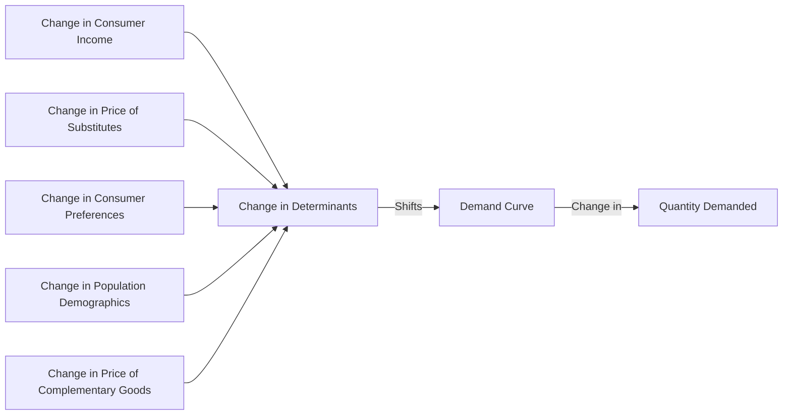

---

title: Change_In_Demand
type: Atomic Note
course: Economics
semester: Winter 2026
unit: '2'
hub: "[[2_Theory_Of_Demand_And_Supply_Hub]]"
source: "[[5-Pdf Store/note generated/Winter 2026/Economics/Chapter_2.pdf]]"
source_pages:
- 14
mode: ECON-MACRO
read: false
generated: true
prerequisites:
- "[[Determinants_Of_Demand]]"

---

# 1. Mental Model

Imagine you're a manager of a popular skate park. The number of skateboarders who visit the park depends on their favorite skateboarding gear, which is often influenced by what's trendy or newly released. If a new, highly sought-after skateboard brand becomes popular among skateboarders, more skateboarders will come to the park, even if the park's admission price doesn't change. This is similar to how demand changes when people's preferences or incomes change, causing more or fewer people to buy a product at the same price. The mechanical components that map to the concept are: the popularity of the skateboard brand (preference) and the number of skateboarders visiting the park (demand).

# 2. Economic Theory

A [[Change_In_Demand]] occurs when there is a shift in the [[Demand_Curve]] due to changes in [[Determinants_Of_Demand]], which include factors such as consumers' income, prices of [[Substitutes_Goods]] and [[Complementary_Goods]], population demographics, and consumer preferences, all assumed to be constant under the [[Ceteris_Paribus]] condition. This concept is rooted in the [[Theory_Of_Demand]] and is graphically represented by a shift of the [[Demand_Schedule]] to the right or left, indicating an increase or decrease in demand, respectively. The [[Demand_Function]] illustrates how these determinants interact to influence demand. For instance, an increase in consumers' income can lead to an increase in demand for [[Normal_Goods]], while a decrease in income might increase demand for [[Inferior_Goods]]. 

# 3. Limitations & Edge Cases

The concept of [[Change_In_Demand]] operates under the assumption that the only change is in the determinants of demand, not in the price of the good itself, which would result in a movement along the demand curve rather than a shift. However, in real-world scenarios, this assumption of [[Ceteris_Paribus]] often breaks down as multiple factors change simultaneously. For example, during economic downturns, the [[Income_Elasticity_Of_Demand]] for certain goods may reveal that demand is more sensitive to income changes than previously thought, challenging the static models of demand shifts. Additionally, the presence of [[Substitutes_Goods]] and [[Complementary_Goods]] can complicate the prediction of demand changes, as their prices and availability can suddenly shift demand in unexpected ways. Understanding these dynamics requires a nuanced view that incorporates insights from [[Market_Demand]] and [[Market_Equilibrium]] analyses.

# 4. Economic Model



This Mermaid flowchart illustrates how changes in determinants of demand, such as consumer income, prices of substitutes and complementary goods, population demographics, and consumer preferences, shift the demand curve, ultimately leading to a change in the quantity demanded.

## 5. Walkthrough

Here's a 5-step technical walkthrough of how the concept of Change in Demand operates:

1. **Initial State**: Suppose the demand curve for skateboarders visiting the skate park is given by $Q_d = 100 - 2P$, where $Q_d$ is the quantity demanded and $P$ is the admission price. Initially, the admission price is $P = 10$, and the quantity demanded is $Q_d = 80$.

2. **Change in Determinants**: A new, highly sought-after skateboard brand becomes popular among skateboarders, increasing their willingness to pay for admission. This represents a change in consumer preferences, which is a determinant of demand.

3. **Shift in Demand Curve**: As a result of the change in consumer preferences, the demand curve shifts to the right, representing an increase in demand. The new demand curve is given by $Q_d = 120 - 2P$.

4. **Intermediate State**: At the same admission price $P = 10$, the quantity demanded increases to $Q_d = 100$. This represents an increase in demand, as more skateboarders are willing to visit the park at the same price.

5. **Final State**: The skate park manager observes an increase in demand and decides to increase the admission price to $P = 15$. At this price, the quantity demanded decreases to $Q_d = 90$, but it is still higher than the initial quantity demanded at the same price. The final state represents a new equilibrium, where the quantity demanded is higher than the initial quantity demanded at the same price, due to the change in demand.

---

## 6. The Proving Grounds

```interactive-quiz

[
  {
    "id": "q1",
    "type": "true_false",
    "difficulty": "L1",
    "question": "If the price of a complementary good decreases while the price of the good in question remains constant, there will be no change in demand for the good in question.",
    "answer": false,
    "explanation": "The statement is false because a decrease in the price of a complementary good will increase the demand for the good in question. This can be understood through the demand function: $Q_d = f(P, P_s, P_c, I, T)$, where $Q_d$ is the quantity demanded, $P$ is the price of the good, $P_s$ is the price of substitutes, $P_c$ is the price of complementary goods, $I$ is income, and $T$ represents tastes or preferences. A decrease in $P_c$ (price of complementary goods) leads to an increase in $Q_d$, shifting the demand curve to the right, which signifies an increase in demand. Therefore, assuming ceteris paribus (all else being equal), a change in the price of complementary goods does indeed change the demand for the good in question."
  },
  {
    "id": "q2",
    "type": "synthesis",
    "difficulty": "L2",
    "question": "The country of Azuria, a significant exporter of electronic components, faces a sudden and severe macroeconomic shock: a 30% devaluation of its currency, the Azurian Peso (AP), against major trading currencies. This devaluation makes Azurian exports cheaper for foreign buyers but also increases the cost of imports. As a result, there's a surge in demand for Azurian electronic components from foreign markets, but the Azurian government must act swiftly to prevent overheating of the economy and ensure that this surge benefits the domestic economy. However, the increased demand for imported goods, especially raw materials necessary for producing electronic components, poses a challenge. The government needs to implement a 3-step policy response to manage this situation effectively, considering the change in demand and ensuring that the growth in exports translates into sustainable economic benefits for Azuria.",
    "answer": "1. **Imposing Export Tariffs**: The government could impose a moderate tariff on electronic components to ensure that the benefits of the devaluation are not entirely captured by foreign buyers. This would increase the revenue for Azurian producers, allowing them to invest in expanding production capacity and improving product quality. \n2. **Subsidizing Raw Materials for Domestic Producers**: To mitigate the impact of increased import costs on Azurian producers, the government could offer subsidies on raw materials necessary for producing electronic components. This would help maintain profit margins for producers, encourage continued production, and ensure a stable supply of essential components.\n3. **Investing in Infrastructure and Technology**: The government should invest in infrastructure (e.g., transportation, logistics) and technology (e.g., renewable energy, advanced manufacturing technologies) to enhance the competitiveness of Azurian producers. This investment would improve efficiency, reduce long-term production costs, and make Azurian electronic components more competitive in the global market.",
    "explanation": "The devaluation of the Azurian Peso (AP) leads to a change in demand for Azurian electronic components. The surge in foreign demand can be represented by a rightward shift in the demand curve, as more foreign buyers are willing to purchase Azurian components at the same price due to the reduced cost in their currencies. However, to ensure that this surge benefits the domestic economy, the government must intervene. \n\nMathematically, the change in demand can be represented as a shift in the demand function: $Q_d = f(P, I, P_s, P_c, T)$, where $Q_d$ is the quantity demanded, $P$ is the price of the good, $I$ is consumer income, $P_s$ is the price of substitutes, $P_c$ is the price of complements, and $T$ represents consumer tastes or preferences. The devaluation affects $P$ (making exports cheaper) and $I$ (as exporters' revenues increase), leading to an increase in $Q_d$. \n\nThe policy responses aim to optimize this change in demand. The export tariff ensures that Azurian producers capture some of the increased value, which can be represented as an increase in the price received by producers, $P_p = P - T$, where $T$ is the tariff. The subsidy on raw materials reduces the cost of production, $C = C_0 - S$, where $C_0$ is the initial cost and $S$ is the subsidy. Finally, investing in infrastructure and technology shifts the production function, $Q_p = f(L, K, T)$, to the right, increasing potential output and reducing costs."
  },
  {
    "id": "q3",
    "type": "writing",
    "difficulty": "L2",
    "question": "Explain the concept of Change In Demand in the context of International Trade Analysis, and provide a detailed explanation of its underlying mechanisms using relevant economic theories and technical applications.",
    "answer": "A Change In Demand occurs when there is a shift in the demand curve due to changes in determinants of demand, such as consumers' income, prices of substitutes and complementary goods, population demographics, and consumer preferences. In International Trade Analysis, this concept is crucial as it helps in understanding how changes in these determinants can affect the demand for imported and exported goods. For instance, an increase in consumers' income can lead to an increase in demand for normal goods, including those imported from other countries. The demand function illustrates how these determinants interact to influence demand, and it is graphically represented by a shift of the demand schedule to the right or left, indicating an increase or decrease in demand, respectively.",
    "explanation": "The concept of Change In Demand can be mathematically represented using the demand function: $Q_d = f(P, I, P_s, P_c, T)$, where $Q_d$ is the quantity demanded, $P$ is the price of the good, $I$ is the consumers' income, $P_s$ is the price of substitutes, $P_c$ is the price of complementary goods, and $T$ represents consumer tastes and preferences. A change in any of these determinants, except the price of the good itself, will result in a shift of the demand curve. For example, an increase in income $I$ can lead to an increase in demand for normal goods, which can be represented as $\frac{\\partial Q_d}{\\partial I} > 0$. In International Trade Analysis, this means that changes in income levels in importing countries can significantly affect the demand for exported goods."
  },
  {
    "id": "q4",
    "type": "order",
    "difficulty": "L2",
    "question": "Order steps for Change In Demand.",
    "steps": [
      "An increase in consumers' income",
      "A movement along the demand curve",
      "A shift of the Demand Schedule to the right",
      "Change in consumer preferences",
      "Increase in demand for Normal Goods"
    ],
    "answer": [
      "An increase in consumers' income",
      "A shift of the Demand Schedule to the right",
      "Increase in demand for Normal Goods",
      "Change in consumer preferences",
      "A movement along the demand curve"
    ]
  },
  {
    "id": "q5",
    "type": "trace",
    "difficulty": "L3",
    "question": "What is the exact output?",
    "content": "Suppose we are analyzing the impact of a change in demand for skateboards due to a new, highly sought-after brand becoming popular. We will trace the effect through four distinct interconnected economic sectors: Skateboard Manufacturing, Retail Sales, Skate Park Admissions, and Skateboarding Gear Rentals.",
    "answer": "Assuming the initial demand for skateboards is 1000 units, and the new brand increases demand by 20%. The intermediate states are as follows:\n\n1. Skateboard Manufacturing: Initial production = 1000 units. With a 20% increase in demand, new production = 1000 * 1.20 = 1200 units.\n2. Retail Sales: Initial sales = 1000 units. With the increased production, new sales = 1200 units. Assuming a 10% increase in sales price due to higher demand, new revenue = 1200 * 1.10 = $1320.\n3. Skate Park Admissions: Initial admissions = 500. Assuming a 15% increase in admissions due to more skateboarders (new trend), new admissions = 500 * 1.15 = 575.\n4. Skateboarding Gear Rentals: Initial rentals = 200. Assuming a 10% increase in rentals due to more visitors, new rentals = 200 * 1.10 = 220.\n\nThe exact output is the final state of these sectors after the change in demand.",
    "explanation": "The change in demand for skateboards due to a new brand can be represented by a shift in the demand curve. Let's denote the initial demand function as $Q_d = f(P, I, P_s, P_c, T, P)$ where $Q_d$ is the quantity demanded, $P$ is the price of the skateboard, $I$ is the consumer's income, $P_s$ and $P_c$ are the prices of substitutes and complements, $T$ is the taste or preference, and $P$ represents other factors. The increase in demand due to the new brand can be seen as a shift in $T$, leading to $Q_d' = f(P, I, P_s, P_c, T', P)$. Graphically, this is represented as a rightward shift of the demand curve. Using LaTeX, the demand curve shift can be expressed as: $Q_d = \\alpha - \\beta P + \\gamma I + \\delta P_s - \\epsilon P_c + \\zeta T$. With the new brand, $T'$ increases, leading to $Q_d' = \\alpha - \\beta P + \\gamma I + \\delta P_s - \\epsilon P_c + \\zeta T'$. The exact output will reflect the new equilibrium quantity and price after this shift."
  }
]

```