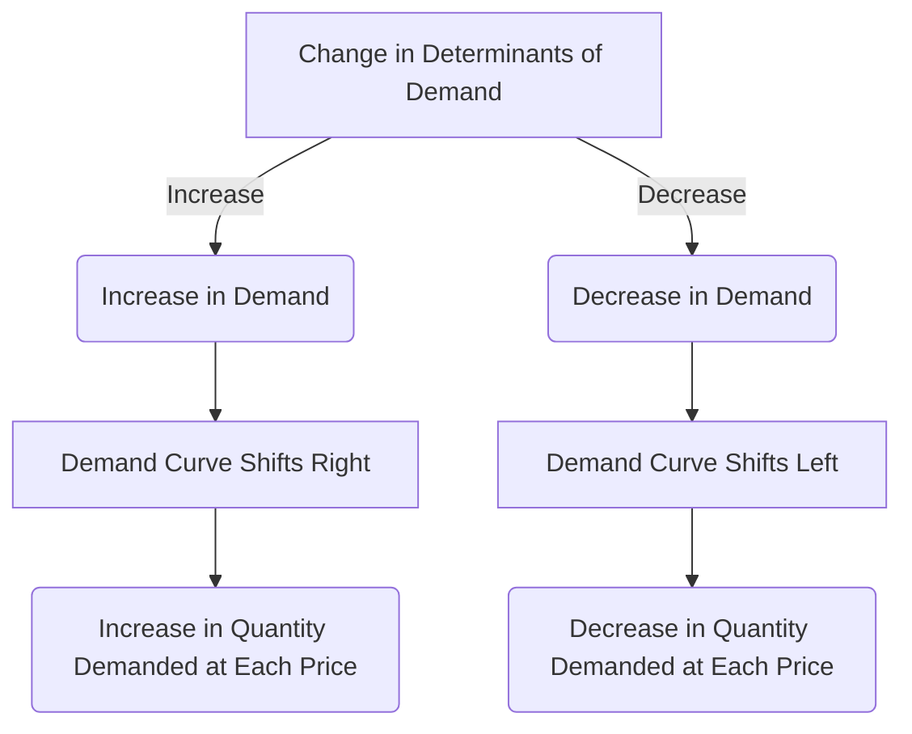

## 1. Mental Model

Imagine you're at a school bake sale, and you love buying cupcakes. Usually, you and your friends buy a lot of cupcakes, but one day, your mom tells you that you're having a big dinner party at home and she wants you to save room for dessert. Suddenly, you and your friends aren't as interested in buying cupcakes anymore. This is like a "change in demand" - it's not that the cupcakes got more expensive or cheaper, it's just that something else changed (you're having a dinner party). The bake sale is still selling cupcakes at the same price, but now you're not buying as many. This means the whole demand for cupcakes "shifts" - it's like the line of kids waiting to buy cupcakes gets shorter. The price of cupcakes didn't change, but the number of cupcakes people want to buy did, and that's a change in demand!

## 2. Micro Theory

The concept of 'Change In Demand' is a fundamental notion in microeconomics, intricately linked to the [[Theory_Of_Demand]]. A change in demand occurs when there is a shift in the demand curve, which is a graphical representation of the relationship between the price of a good and the quantity demanded, as outlined in the [[Demand_Schedule]] and visualized in the [[Demand_Curve]]. This shift is precipitated by a change in any of the determinants of demand, with the notable exception of the good's price itself.

The [[Law_Of_Demand]] posits that, ceteris paribus [[Ceteris_Paribus]], an increase in the price of a good leads to a decrease in the quantity demanded. However, when we consider a change in demand, we are examining situations where the demand curve itself shifts, either to the right (indicating an increase in demand) or to the left (indicating a decrease in demand). This shift is not in response to a change in the good's price but rather due to alterations in other influential factors.

The [[Demand_Function]] provides a mathematical representation of demand, illustrating how the quantity demanded of a good is influenced by various factors, including the good's price, consumer income, prices of related goods (substitutes and complements, as discussed under [[Substitutes_And_Complements]]), consumer tastes and preferences [[Taste_And_Preference]], and the number of buyers [[Number_Of_Buyers]], among others.

A change in demand, therefore, can result from several factors, including changes in consumer income (especially for [[Normal_And_Inferior_Goods]]), changes in the prices of substitutes or complements, shifts in consumer expectations [[Consumer_Expectations]], alterations in the population or demographic structure of the market, changes in consumer tastes or preferences, and advancements in technology [[Change_In_Technology]] that may affect the production or consumption of the good.

The [[Market_Demand]] and [[Market_Demand_Curve]] represent the total quantity demanded of a good by all potential buyers in a market at various price levels. A change in demand at the market level can significantly impact [[Market_Equilibrium]], potentially leading to a surplus or shortage [[Surplus_And_Shortage]] unless the market adjusts to a new equilibrium.

The magnitude of the change in demand can be assessed using the [[Price_Elasticity_Of_Demand]] and [[Income_Elasticity_Of_Demand]], which provide measures of how responsive the quantity demanded is to changes in the good's price and consumer income, respectively.

In conclusion, a change in demand refers to a shift in the demand curve due to changes in determinants of demand other than the good's price. Understanding the mechanisms behind these shifts, including the role of substitutes, complements, consumer expectations, and other factors, is crucial for analyzing market dynamics and the effects on market equilibrium, as detailed in discussions on [[Effects_Of_Shift_In_Demand_And_Supply]] and illustrated in [[Market_Equilibrium_Example]].

## 3. Limitations & Edge Cases

The concept of change in demand, which refers to a shift in the demand curve, has specific limitations and edge cases. A key limitation is that it assumes all other factors remain constant, which is rarely the case in reality. For instance, a change in consumer income may not only affect demand for a good but also influence the demand for related goods, making it challenging to isolate the effect of a single determinant. Additionally, the concept of change in demand may not accurately capture the complexities of consumer behavior, such as the presence of inferior goods, Veblen goods, or Giffen goods, which can exhibit unusual demand patterns. Furthermore, the assumption of ceteris paribus, or "all else equal," can be problematic in situations where multiple determinants of demand change simultaneously, making it difficult to accurately predict the resulting shift in the demand curve.

## 4. Market Graph



The provided Mermaid flowchart illustrates how changes in the determinants of demand (excluding the price of the good itself) lead to shifts in the demand curve, either to the right (increase in demand) or to the left (decrease in demand). This, in turn, results in an increase or decrease in the quantity demanded at each price point, effectively capturing the concept of a change in demand.

## 5. Walkthrough

**Step 1: Identify the Initial Demand Curve**
The initial demand curve is represented by the equation Qd = f(P, Y, T, A, P_s), where Qd is the quantity demanded, P is the price of the good, Y is consumer income, T is consumer tastes and preferences, A is advertising and other marketing efforts, and P_s is the price of substitutes and complements. Graphically, this is represented as a downward-sloping curve.

**Step 2: Determine the Change in a Non-Price Determinant**
A change occurs in one of the non-price determinants of demand, such as an increase in consumer income (Y), a shift in consumer tastes and preferences (T) towards the good, an increase in advertising and marketing efforts (A), or a change in the price of substitutes or complements (P_s).

**Step 3: Analyze the Direction of the Shift**
- If the change in the determinant leads to an increase in demand (e.g., an increase in consumer income for a normal good, a favorable shift in consumer tastes), the demand curve shifts to the right. This means that at any given price, consumers are willing to buy more of the good.
- Conversely, if the change leads to a decrease in demand (e.g., a decrease in consumer income for a normal good, an unfavorable shift in consumer tastes), the demand curve shifts to the left. This means that at any given price, consumers are willing to buy less of the good.

**Step 4: Calculate the New Equilibrium**
After the shift in the demand curve, a new equilibrium is established where the shifted demand curve intersects the supply curve. This new equilibrium will have a different price and quantity compared to the initial equilibrium. The direction and magnitude of the change in price and quantity depend on the slope of the supply curve and the extent of the shift in the demand curve.

**Step 5: Interpret the Change in Demand**
- A rightward shift in the demand curve indicates an increase in demand, leading to a higher equilibrium price and quantity, assuming a standard upward-sloping supply curve.
- A leftward shift indicates a decrease in demand, leading to a lower equilibrium price and quantity.
The analysis of the change in demand is crucial for businesses and policymakers to understand how external factors influence market outcomes and to make informed decisions regarding production, pricing, and investment.

---

## Review & Practice

```interactive-quiz

[
  {
    "id": "Q1_Industrial_Organization_Change_In_Demand",
    "type": "mcq",
    "difficulty": "L1",
    "question": "What is the primary effect of an increase in consumer income on the demand for a normal good, assuming all else remains constant?",
    "options": {
      "A": "The demand curve shifts to the left, and the price elasticity of demand increases.",
      "B": "The demand curve shifts to the right, and the income elasticity of demand is positive.",
      "C": "The demand curve remains unchanged, but the quantity demanded increases due to the income effect.",
      "D": "The demand curve shifts to the left, and the income elasticity of demand is negative."
    },
    "answer": "B",
    "explanation": "An increase in consumer income leads to an increase in the demand for a normal good, causing the demand curve to shift to the right. This is because, for normal goods, an increase in income results in a higher quantity demanded at each price level. The income elasticity of demand, which measures the responsiveness of the quantity demanded to a change in consumer income, is positive for normal goods. This relationship can be expressed as $E_I = \\frac{\\% \\Delta Q_d}{\\% \\Delta I} > 0$, where $E_I$ is the income elasticity of demand, $\\% \\Delta Q_d$ is the percentage change in quantity demanded, and $\\% \\Delta I$ is the percentage change in income."
  },
  {
    "id": "demand_shift_due_to_external_factors",
    "type": "fill_in",
    "difficulty": "L2",
    "question": "Fill in the blank.",
    "textWithBlanks": "A change in demand occurs when there is a shift in the demand curve due to a change in any of the determinants of demand, with the notable exception of the good's Blank.",
    "answer": [
      "price"
    ],
    "explanation": "The concept of a change in demand is rooted in microeconomics, where the demand curve is a graphical representation of the relationship between the price of a good and the quantity demanded. A shift in this curve, either to the right (increase in demand) or to the left (decrease in demand), is caused by changes in factors other than the good's price. These factors include consumer income, prices of related goods (substitutes and complements), consumer tastes and preferences, and the number of buyers. The \\textit{law of demand} posits that an increase in price leads to a decrease in quantity demanded, but a change in demand refers to shifts in the demand curve itself, not movements along it due to price changes."
  },
  {
    "id": "Q1234",
    "type": "debug",
    "difficulty": "L2",
    "question": "Find the bug in the formula for the change in demand due to a change in consumer income: $\\Delta Q_d = \\beta_1 \\Delta P + \\beta_2 \\Delta I$, where $\\Delta Q_d$ is the change in quantity demanded, $\\Delta P$ is the change in price, $\\Delta I$ is the change in consumer income, and $\\beta_1$ and $\\beta_2$ are constants.",
    "content": "The formula for the change in demand due to a change in consumer income is given by $\\Delta Q_d = \\beta_1 \\Delta P + \\beta_2 \\Delta I$. However, this formula seems to be incorrect as it includes the change in price ($\\Delta P$) which is not a determinant of a change in demand, but rather a movement along the demand curve.",
    "answer": "The bug is the inclusion of $\\Delta P$ in the formula. The correct formula should be $\\Delta Q_d = \\beta_2 \\Delta I$, assuming $\\beta_2$ is the income elasticity of demand.",
    "required_keywords": [
      "fix_syntax"
    ],
    "explanation": "The change in demand due to a change in consumer income can be represented by the income elasticity of demand. The income elasticity of demand is a measure of how responsive the quantity demanded is to a change in consumer income. It is calculated as $\\frac{\\% \\Delta Q_d}{\\% \\Delta I}$. Using the point elasticity formula, we can express the change in quantity demanded as $\\Delta Q_d = \\beta_2 \\Delta I \\frac{Q_d}{I}$. However, in a linearized form and assuming a simple model, $\\Delta Q_d = \\beta_2 \\Delta I$ can be considered. The original formula incorrectly includes $\\Delta P$, which would represent a change in quantity demanded due to a change in price, not a change in demand due to a change in income."
  },
  {
    "id": "generate_unique_id",
    "type": "trace",
    "difficulty": "L2",
    "question": "What is the exact output on total revenue when a cost increase, such as higher wages, impacts the supply curve, leading to a new equilibrium price and quantity in the market for a specific good, assuming an initial demand curve of $Q_d = 100 - 2P$ and an initial supply curve of $Q_s = 2P - 20$, with the cost increase causing the supply curve to shift to $Q_s = 2P - 40$?",
    "content": "The initial demand and supply curves are given by $Q_d = 100 - 2P$ and $Q_s = 2P - 20$. To find the initial equilibrium price and quantity, we equate $Q_d$ and $Q_s$: $100 - 2P = 2P - 20$. Solving for $P$, we get $4P = 120$, which yields $P = 30$. Substituting $P = 30$ into either $Q_d$ or $Q_s$, we find $Q = 40$. The total revenue at this equilibrium is $TR = P \\cdot Q = 30 \\cdot 40 = 1200$. With the cost increase, the new supply curve becomes $Q_s = 2P - 40$. Equating this to $Q_d$, we have $100 - 2P = 2P - 40$. Solving for $P$, we get $4P = 140$, which yields $P = 35$. Substituting $P = 35$ into either $Q_d$ or $Q_s$, we find $Q = 30$. The new total revenue is $TR = P \\cdot Q = 35 \\cdot 30 = 1050$.",
    "answer": "1050",
    "explanation": "The mechanism behind the change in total revenue due to a shift in the supply curve can be understood through the lens of the LaTeX representation of the demand and supply functions: $Q_d = 100 - 2P$ and $Q_s = 2P - 20$ initially, shifting to $Q_s = 2P - 40$ after the cost increase. The equilibrium conditions are given by $Q_d = Q_s$. Initially, solving $100 - 2P = 2P - 20$ yields $P = 30$ and $Q = 40$. After the shift, solving $100 - 2P = 2P - 40$ yields $P = 35$ and $Q = 30$. The change in total revenue, $\\Delta TR = P_{new}Q_{new} - P_{old}Q_{old}$, can be calculated directly, illustrating the impact of the supply shift on market outcomes."
  }
]

```