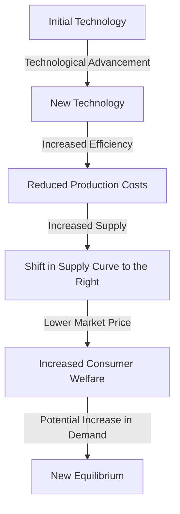

## 1. Mental Model

Imagine you have a lemonade stand, and you're using a manual juicer to squeeze lemons. You can only make 10 cups of lemonade per hour. One day, your friend gives you an electric juicer that's super fast and efficient. Now, you can make 20 cups of lemonade per hour! With this new electric juicer, you can supply more lemonade to your customers, and you might even start selling to more people who live nearby. This is like a "change in technology" - the electric juicer is like a new tool that helps you make more lemonade (or produce more goods) with the same amount of effort. This means you can supply more lemonade to the market, and that's like shifting your supply curve outward, making more lemonade available to everyone!

## 2. Micro Theory

In the context of microeconomics, a **Change In Technology** refers to an improvement or advancement in the production process that enables firms to produce goods and services more efficiently, leading to an increase in supply. This concept is intricately linked with the [[Theory_Of_Demand]] and [[Law_Of_Demand]], as changes in technology can have a ripple effect on the demand side of the market.

A change in technology can be defined as a shift in the production function, which represents the technical relationship between inputs and outputs. When a firm experiences a technological advancement, its production function changes, allowing it to produce more output with the same quantity of inputs or the same output with fewer inputs. This increased efficiency leads to a reduction in production costs, making it possible for the firm to supply more goods and services at a lower price.

The [[Ceteris_Paribus]] assumption, which holds that all other factors remain constant, is crucial in analyzing the impact of a change in technology on the supply curve. When a technological advancement occurs, the [[Demand_Schedule]] and [[Demand_Curve]] remain unchanged, as the change in technology affects the supply side of the market. The [[Demand_Function]], which represents the relationship between the quantity demanded and the price of a good, also remains unaffected.

However, the [[Market_Demand]] and [[Market_Demand_Curve]] may be indirectly affected by a change in technology, as increased supply can lead to a decrease in market price, which in turn can influence the quantity demanded. The [[Price_Elasticity_Of_Demand]] and [[Income_Elasticity_Of_Demand]] may also be impacted, as changes in market price and consumer income can affect the responsiveness of consumers to changes in price and income.

The [[Determinants_Of_Demand]], such as [[Substitutes_And_Complements]], [[Normal_And_Inferior_Goods]], [[Consumer_Expectations]], [[Number_Of_Buyers]], and [[Taste_And_Preference]], remain unchanged, as a change in technology does not directly affect these factors. However, a change in technology can lead to a [[Change_In_Demand]], as increased supply and lower prices can influence consumer behavior.

The impact of a change in technology on the supply side of the market is more direct. A technological advancement leads to a [[Shift_In_Supply_Curve]], where the supply curve shifts outward, indicating that firms are willing to supply more goods and services at each price level. This shift is associated with an increase in the [[Elasticity_Of_Supply]], as firms become more responsive to changes in price.

The [[Price_Elasticity_Of_Supply_Formula]] and [[Determinants_Of_Elasticity_Of_Supply]] can be used to analyze the impact of a change in technology on the elasticity of supply. A technological advancement can lead to an increase in the elasticity of supply, as firms become more responsive to changes in price.

The [[Market_Equilibrium]] is also affected by a change in technology, as the shift in the supply curve leads to a new equilibrium price and quantity. The [[Surplus_And_Shortage]] that may arise due to the change in technology will be resolved through market forces, leading to a new [[Market_Equilibrium_Example]].

In conclusion, a change in technology h

## 3. Limitations & Edge Cases

The concept of Change in Technology assumes that technological advancements lead to increased productivity and a subsequent outward shift of the supply curve. However, this notion has limitations, particularly in cases where technological changes may not necessarily lead to increased output, such as when a firm adopts a technology that primarily improves product quality rather than quantity. Additionally, the assumption of cost-reducing technological advancements may not hold in cases where the new technology requires significant upfront investments, rendering it inaccessible to firms with limited resources. Furthermore, the pace of technological progress can be slow in certain industries, and the benefits of technological change may not be immediately realized, potentially limiting its impact on supply. Moreover, the presence of diminishing returns to scale may also limit the extent to which technological advancements can increase output, as the marginal productivity of additional inputs may decline. Overall, these edge cases highlight the need for a nuanced understanding of the relationship between technological change and supply.

## 4. Market Graph



A change in technology leads to increased efficiency, reduced production costs, and a shift in the supply curve to the right, resulting in a lower market price and potentially increased consumer welfare. The overall effect of a technological advancement in the labor market is an increase in the supply of goods and services, which can lead to a new equilibrium.

## 5. Walkthrough

**Step 1: Initial Equilibrium and Production Function**
The production function of a firm is represented as Q = f(L, K), where Q is the quantity of output, L is labor, and K is capital. Initially, the firm's production function is Q1 = f(L, K). The labor market is in equilibrium, where the labor supply curve (Ls) intersects the labor demand curve (Ld), determining the equilibrium wage (W1) and quantity of labor employed (L1).

**Step 2: Technological Advancement and Shift in Production Function**
A change in technology occurs, allowing the firm to produce more output with the same inputs. The production function shifts to Q2 = f(L, K), where Q2 > Q1 for the same L and K. This technological advancement can be represented as a decrease in the marginal rate of technical substitution (MRTS) between labor and capital, making labor more productive.

**Step 3: Impact on Labor Demand**
With the new production function Q2 = f(L, K), the firm's labor demand curve shifts to the right, from Ld to Ld'. This is because the firm can now produce more output with the same quantity of labor, making labor more valuable. At the initial wage W1, the firm now demands more labor, L2, which is greater than L1.

**Step 4: Adjustment in Labor Market**
The increase in labor demand causes the labor market to move out of equilibrium. The labor supply curve (Ls) remains unchanged, but the labor demand curve has shifted to Ld'. The new equilibrium is established where Ls intersects Ld', determining a new equilibrium wage (W2) and quantity of labor employed (L3). The new equilibrium wage W2 may be higher or lower than W1, depending on the elasticity of the labor supply and demand curves.

**Step 5: Comparative Statics and Welfare Analysis**
Comparing the initial and final equilibria, we can see that the technological advancement has led to an increase in the quantity of labor employed (from L1 to L3) and a change in the equilibrium wage (from W1 to W2). The impact on welfare can be analyzed by examining the changes in consumer and producer surplus. The reduction in production costs due to technological advancement can lead to lower prices, increasing consumer surplus. The firm's profit may increase due to the increased efficiency, which can lead to an increase in producer surplus.

---

## Review & Practice

```interactive-quiz

[
  {
    "id": "Q1",
    "type": "mcq",
    "difficulty": "L1",
    "question": "A technological advancement in the production of a good leads to a decrease in its market price. What is the effect on the price elasticity of demand for the good, assuming the demand curve remains unchanged?",
    "options": {
      "A": "The price elasticity of demand increases.",
      "B": "The price elasticity of demand decreases.",
      "C": "The price elasticity of demand remains unchanged.",
      "D": "The price elasticity of demand becomes perfectly elastic."
    },
    "answer": "C",
    "explanation": "A technological advancement leads to a decrease in production costs, allowing firms to supply more goods at a lower price. This results in a movement along the demand curve. The price elasticity of demand measures how responsive the quantity demanded is to a change in price. It is calculated using the formula: $E_d = \\frac{\\% \\Delta Q_d}{\\% \\Delta P}$. Since the demand curve remains unchanged, the responsiveness of consumers to a change in price does not change. Therefore, the price elasticity of demand remains unchanged."
  },
  {
    "id": "tech_change_1",
    "type": "fill_in",
    "difficulty": "L2",
    "question": "Fill in the blank.",
    "textWithBlanks": "A change in technology can be defined as a shift in the Blank, which represents the technical relationship between inputs and outputs.",
    "answer": [
      "production function"
    ],
    "explanation": "In the context of microeconomics, a change in technology refers to an improvement or advancement in the production process. This change can be represented as a shift in the production function, which is a mathematical expression that describes the technical relationship between inputs (such as labor and capital) and outputs (such as goods and services). The production function is often represented as $Q = f(L, K)$, where $Q$ is the quantity of output, $L$ is the quantity of labor, and $K$ is the quantity of capital. When a firm experiences a technological advancement, its production function changes, allowing it to produce more output with the same quantity of inputs or the same output with fewer inputs. This can be represented as a new production function $Q' = f'(L, K)$, where $f'$ represents the new technology. The change in technology leads to an increase in efficiency, which in turn leads to a reduction in production costs and an increase in supply."
  },
  {
    "id": "tech_change_bug",
    "type": "debug",
    "difficulty": "L2",
    "question": "Find the bug in the formula for the change in supply due to a technological advancement: $\\Delta Q_s = \\beta \\cdot Q_s \\cdot (P - MC)$",
    "content": "The formula for the change in supply due to a technological advancement is given by $\\Delta Q_s = \\beta \\cdot Q_s \\cdot (P - MC)$. However, this formula seems to be incorrect. Identify the bug.",
    "answer": "The bug is that the formula should be $\\Delta Q_s = \\beta \\cdot Q_s \\cdot (P - MC) / P$ or more accurately $\\Delta Q_s = \\frac{\\partial Q_s}{\\partial \\beta} \\cdot \\Delta \\beta$",
    "required_keywords": [
      "fix_syntax"
    ],
    "explanation": "The correct formula for the change in supply due to a technological advancement involves the derivative of the supply function with respect to the technological parameter. Assuming a supply function $Q_s = f(P, \\beta)$, where $\\beta$ represents the technological parameter, the change in supply can be represented as $\\Delta Q_s = \\frac{\\partial Q_s}{\\partial \\beta} \\cdot \\Delta \\beta$. The given formula $\\Delta Q_s = \\beta \\cdot Q_s \\cdot (P - MC)$ seems to incorrectly relate the change in supply to the price, marginal cost, and a technological parameter $\\beta$. A more accurate representation would involve the specific functional form of $Q_s = f(P, \\beta)$."
  },
  {
    "id": "generate_unique_id",
    "type": "trace",
    "difficulty": "L2",
    "question": "What is the exact output of the change in technology on the labor market equilibrium, given a cost increase of 10% in wages, through the supply curve to equilibrium price and total revenue, assuming an initial supply curve of Qs = 100 + 5P and an initial demand curve of Qd = 200 - 3P?",
    "content": "The change in technology in the labor market can be represented by a shift in the supply curve. Given a cost increase of 10% in wages, we first need to understand how this affects the supply curve. Assuming the initial supply curve is Qs = 100 + 5P, a 10% increase in wages would increase the costs of production. This would lead to a decrease in the quantity supplied at each price level, causing the supply curve to shift leftward. The new supply curve can be represented as Qs' = 90 + 5P (assuming the 10% increase in wages reduces the quantity supplied by 10 units at each price level). The demand curve remains unchanged at Qd = 200 - 3P. To find the new equilibrium price and quantity, we equate Qs' and Qd: 90 + 5P = 200 - 3P. Solving for P, we get 8P = 110, so P = 13.75. Substituting P back into the demand curve to find Q: Q = 200 - 3(13.75) = 200 - 41.25 = 158.75. The total revenue (TR) is given by TR = P * Q = 13.75 * 158.75 = 2180.3125.",
    "answer": "The exact output is a new equilibrium price of 13.75 and a new equilibrium quantity of 158.75, with a total revenue of 2180.3125.",
    "explanation": "The change in technology, represented by a 10% increase in wages, leads to a leftward shift in the supply curve from Qs = 100 + 5P to Qs' = 90 + 5P. The demand curve remains Qd = 200 - 3P. Equating Qs' and Qd to find the new equilibrium: $90 + 5P = 200 - 3P$. Solving for $P$: $8P = 110$, so $P = 13.75$. Substituting $P$ into $Qd$: $Q = 200 - 3(13.75) = 158.75$. The total revenue $TR = P \\cdot Q = 13.75 \\cdot 158.75 = 2180.3125$. The LaTeX representation of the equilibrium condition is: $Q_s' = Q_d \\Rightarrow 90 + 5P = 200 - 3P$. Solving for $P$: $5P + 3P = 200 - 90 \\Rightarrow 8P = 110 \\Rightarrow P = \\frac{110}{8} = 13.75$. Therefore, $TR = P \\cdot Q = 13.75 \\cdot (200 - 3 \\cdot 13.75) = 13.75 \\cdot 158.75 = 2180.3125$."
  }
]

```