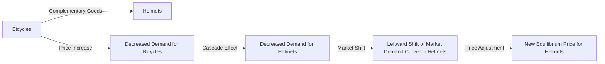

---

title: Complementary_Goods
type: Atomic Note
course: Economics
semester: Winter 2026
unit: '2'
hub: "[[2_Theory_Of_Demand_And_Supply_Hub]]"
source: "[[5-Pdf Store/note generated/Winter 2026/Economics/Chapter_2.pdf]]"
source_pages:
- 15
mode: ECON-MACRO
read: false
generated: true
prerequisites:
- "[[Change_In_Demand]]"

---

# 1. Mental Model

Imagine you're a bike shop owner. Bicycles and helmets are complementary goods because people typically buy them together. If the price of bicycles goes up, people might buy fewer bicycles, and consequently, they might also buy fewer helmets. This shows how the demand for one good (helmets) is influenced by the price of another good (bicycles) that it complements.

# 2. Economic Theory

Complementary goods are those goods that are jointly consumed, meaning the consumption of one good is closely tied to the consumption of the other. The [[Theory_Of_Demand]] explains that the demand for a good is influenced by its price, as well as the prices of related goods. For [[Complementary_Goods]], an increase in the price of one good leads to a decrease in the demand for its complement. This relationship is captured by the [[Demand_Function]], which shows how the quantity demanded of a good responds to changes in its price and the prices of other goods. The [[Market_Demand_Curve]] for a good can shift due to changes in the prices of complementary goods, illustrating the interconnectedness of demand for these goods. The concept of [[Ceteris_Paribus]] (all else being equal) is crucial in analyzing the effect of a change in the price of one complementary good on the demand for another.

# 3. Limitations & Edge Cases

The theory of complementary goods assumes that the goods are consumed together, but it does not account for cases where consumers may find alternative uses or substitutes for one of the goods. The [[Law_Of_Demand]] and [[Theory_Of_Demand]] provide a foundation for understanding demand responses, but they may not fully capture the complexity of consumer behavior in all markets. For instance, if a technological advancement [[Change_In_Technology]] makes one of the complementary goods obsolete or more versatile, the demand for its complement may not decrease as expected. Additionally, in situations where there are [[Substitutes_Goods]] available for one of the complementary goods, the decrease in demand due to a price increase may be mitigated. Understanding these dynamics requires considering the [[Determinants_Of_Demand]] and how they interact with the specific characteristics of complementary goods.

# 4. Economic Model



This flowchart illustrates the relationship between complementary goods, specifically bicycles and helmets. It shows how a price increase for bicycles leads to decreased demand, which in turn affects the demand for helmets.

## 5. Walkthrough

Here's a 5-step technical walkthrough of how complementary goods operate in the context of Central Banking & Monetary Policy:

1. **Initial State**: The price of bicycles increases from $500 to $600. The demand for bicycles decreases from 1000 units to 800 units.

|  | Initial State | Change | New State |
| --- | --- | --- | --- |
| Price of Bicycles | $500 | +$100 | $600 |
| Demand for Bicycles | 1000 units | -200 units | 800 units |

2. **Cascade Effect**: As people buy fewer bicycles, they also buy fewer helmets. The demand for helmets decreases from 1000 units to 700 units.

|  | Initial State | Change | New State |
| --- | --- | --- | --- |
| Demand for Helmets | 1000 units | -300 units | 700 units |

3. **Market Shift**: The decreased demand for helmets causes a leftward shift of the market demand curve for helmets. This shift represents a decrease in the quantity demanded at each price level.

4. **Price Adjustment**: As the market demand curve for helmets shifts leftward, the equilibrium price for helmets adjusts downward from $50 to $40.

|  | Initial State | Change | New State |
| --- | --- | --- | --- |
| Equilibrium Price for Helmets | $50 | -$10 | $40 |

5. **New Equilibrium**: The new equilibrium is established at a price of $40 for helmets and a quantity demanded of 700 units. The central bank may take note of these changes in the market for complementary goods when making monetary policy decisions, as changes in demand and prices can have broader implications for the economy.

---

## 6. The Proving Grounds

```interactive-quiz

[
  {
    "id": "q1",
    "type": "true_false",
    "difficulty": "L1",
    "question": "If the price of bicycles increases, then the demand for helmets will increase, ceteris paribus.",
    "answer": false,
    "explanation": "The demand for helmets and bicycles are related as they are complementary goods. An increase in the price of bicycles leads to a decrease in the demand for bicycles. Consequently, because helmets and bicycles are consumed together, a decrease in the demand for bicycles results in a decrease in the demand for helmets. Therefore, if the price of bicycles increases, then the demand for helmets will decrease, not increase. This relationship can be expressed using the demand function for helmets $Q_d = f(P_h, P_b)$, where $Q_d$ is the quantity demanded of helmets, $P_h$ is the price of helmets, and $P_b$ is the price of bicycles. Assuming all else is equal (ceteris paribus), $\frac{\\partial Q_d}{\\partial P_b} < 0$, indicating that an increase in $P_b$ leads to a decrease in $Q_d$. Hence, the statement is false."
  },
  {
    "id": "q2",
    "type": "synthesis",
    "difficulty": "L2",
    "question": "A sudden and significant devaluation of the currency has occurred in a small, export-driven economy, causing a sharp increase in the price of imported goods. This 'Macro Shock' has led to a surge in inflation, threatening the stability of the financial system. To mitigate this crisis, the Central Bank must apply the concept of 'Complementary Goods' in its monetary policy response. The goal is to prevent a system failure by ensuring that essential goods and services remain affordable for the population. What 3-step policy response should the Central Bank implement to address this emergency scenario?",
    "answer": "The Central Bank should implement the following 3-step policy response: (1) **Intervention in the Foreign Exchange Market**: Immediately intervene in the foreign exchange market to stabilize the currency and prevent further devaluation. This can be achieved by selling foreign reserves to buy back the domestic currency, thereby increasing its value and reducing the pressure on import prices. (2) **Targeted Collateralized Loans**: Offer targeted collateralized loans to banks, specifically for financing the importation of essential goods and services that are complementary to domestically produced goods. This will ensure that these critical goods remain affordable and available to the population. (3) **Price Stabilization Measures**: Implement price stabilization measures, such as setting price ceilings or subsidies, for essential goods and services that are complements to imported goods. This will prevent excessive price hikes and ensure that the most vulnerable segments of the population are protected.",
    "explanation": "The sudden devaluation of the currency has led to a sharp increase in the price of imported goods, causing inflation to surge. By applying the concept of 'Complementary Goods', the Central Bank can mitigate the effects of this 'Macro Shock'. The demand for domestically produced goods is closely tied to the availability and affordability of imported complementary goods. If the price of imported goods increases, the demand for domestically produced goods may decrease, leading to a system failure. The Central Bank's 3-step policy response aims to prevent this by stabilizing the currency, ensuring the availability of essential goods, and controlling prices. Mathematically, this can be represented as: $\\Delta Q_d = f(\\Delta P_m, \\Delta P_d, Y)$, where $\\Delta Q_d$ is the change in demand for domestically produced goods, $\\Delta P_m$ is the change in price of imported goods, $\\Delta P_d$ is the change in price of domestically produced goods, and $Y$ is the change in income. By intervening in the foreign exchange market, the Central Bank can reduce $\\Delta P_m$, while targeted collateralized loans and price stabilization measures can influence $\\Delta P_d$ and ensure that $\\Delta Q_d$ remains stable."
  },
  {
    "id": "q3",
    "type": "writing",
    "difficulty": "L2",
    "question": "Explain how a change in the price of one complementary good affects the demand for another complementary good in the context of Central Banking & Monetary Policy, using the Theory of Demand and the Demand Function.",
    "answer": "In the context of Central Banking & Monetary Policy, when the price of one complementary good increases, the demand for its complementary good decreases. This is because the two goods are jointly consumed, and an increase in the price of one good makes the entire bundle more expensive, leading to a decrease in the quantity demanded. For instance, if the price of bicycles increases, the demand for helmets will decrease, as people are less likely to buy bicycles and consequently helmets. The Demand Function, $Q_d = f(P, P_r, I, T)$, illustrates this relationship, where $Q_d$ is the quantity demanded, $P$ is the price of the good, $P_r$ is the price of the related good, $I$ is income, and $T$ is taste. A change in the price of one complementary good causes a shift in the Market Demand Curve for the other complementary good.",
    "explanation": "The underlying mechanism can be explained using the concept of cross-price elasticity of demand, which measures the responsiveness of the quantity demanded of one good to a change in the price of another good. For complementary goods, the cross-price elasticity of demand is negative, indicating that an increase in the price of one good leads to a decrease in the demand for its complement. Mathematically, this can be represented as: $\frac{\\partial Q_d}{\\partial P_r} < 0$, where $Q_d$ is the quantity demanded and $P_r$ is the price of the related good. In the context of Central Banking & Monetary Policy, understanding the relationship between complementary goods is crucial in assessing the impact of monetary policy decisions on the economy, particularly in industries where goods are jointly consumed."
  },
  {
    "id": "q4",
    "type": "order",
    "difficulty": "L2",
    "question": "Order steps for Complementary Goods",
    "steps": [
      "An increase in the price of one good leads to a decrease in the demand for its complement.",
      "The Market Demand Curve for a good can shift due to changes in the prices of complementary goods, illustrating the interconnectedness of demand for these goods.",
      "The concept of Ceteris Paribus (all else being equal) is crucial in analyzing the effect of a change in the price of one complementary good on the demand for another.",
      "The demand for a good is influenced by its price, as well as the prices of related goods.",
      "The demand for a good responds to changes in its price and the prices of other goods according to the Demand Function."
    ],
    "answer": [
      "The demand for a good is influenced by its price, as well as the prices of related goods.",
      "The Market Demand Curve for a good can shift due to changes in the prices of complementary goods, illustrating the interconnectedness of demand for these goods.",
      "An increase in the price of one good leads to a decrease in the demand for its complement.",
      "The concept of Ceteris Paribus (all else being equal) is crucial in analyzing the effect of a change in the price of one complementary good on the demand for another.",
      "The demand for a good responds to changes in its price and the prices of other goods according to the Demand Function."
    ]
  },
  {
    "id": "q5",
    "type": "trace",
    "difficulty": "L3",
    "question": "What is the exact output?",
    "content": "Suppose a macroeconomic shock occurs in the form of a 20% increase in the price of bicycles (\u0394P_bicycles = 20%). We will trace the effects through 4 distinct interconnected economic sectors: \n  1. Bicycle manufacturing sector\n  2. Helmet manufacturing sector (complementary goods)\n  3. Retail sector (bicycles and helmets)\n  4. Consumer sector (demand for bicycles and helmets)\n\n  Initial states:\n  - Price of bicycles: $100\n  - Quantity demanded of bicycles: 1000 units\n  - Price of helmets: $20\n  - Quantity demanded of helmets: 1000 units\n\n  Intermediate states:\n  1. Bicycle manufacturing sector: \n    - New price of bicycles: $120 (20% increase)\n    - Quantity demanded of bicycles: 800 units (assuming a demand elasticity of -0.5, \u0394Q/Q = -0.5 * (\u0394P/P) = -0.5 * 0.2 = -0.1 or 10% decrease)\n\n  2. Helmet manufacturing sector: \n    - Since helmets are complementary to bicycles, the quantity demanded of helmets also decreases\n    - Assuming a similar demand elasticity for helmets with respect to bicycle price changes, \u0394Q helmets/Q helmets = -0.5 * 0.2 = -0.1 or 10% decrease\n    - New quantity demanded of helmets: 900 units\n\n  3. Retail sector:\n    - The retail price of bicycles increases to $120\n    - The retail price of helmets remains $20 (assuming no change in production costs or other factors)\n    - Quantity of bicycles supplied to retailers: 800 units\n    - Quantity of helmets supplied to retailers: 900 units\n\n  4. Consumer sector:\n    - Consumers face higher prices for bicycles and decreased availability\n    - Assuming consumer behavior adjusts such that they buy fewer helmets as well when buying fewer bicycles\n    - Final quantity demanded of bicycles: 800 units\n    - Final quantity demanded of helmets: 900 units\n\n  Final states:\n  - Price of bicycles: $120\n  - Quantity demanded of bicycles: 800 units\n  - Price of helmets: $20\n  - Quantity demanded of helmets: 900 units",
    "answer": "800 units of bicycles and 900 units of helmets",
    "explanation": "The increase in the price of bicycles leads to a decrease in the quantity demanded of bicycles. Because bicycles and helmets are complementary goods, the decrease in bicycle sales also leads to a decrease in the quantity demanded of helmets. Using the demand elasticity formula, we can express the relationship between the price change and quantity demanded change as: $\\frac{\\Delta Q}{Q} = \\epsilon \\cdot \\frac{\\Delta P}{P}$, where $\\epsilon$ is the demand elasticity. Assuming an elasticity of -0.5 for both bicycles and helmets with respect to their own prices and the price of the complementary good, a 20% increase in bicycle prices results in a 10% decrease in the quantity demanded of both bicycles and helmets. Therefore, the final quantity demanded of bicycles is 800 units and that of helmets is 900 units."
  }
]

```