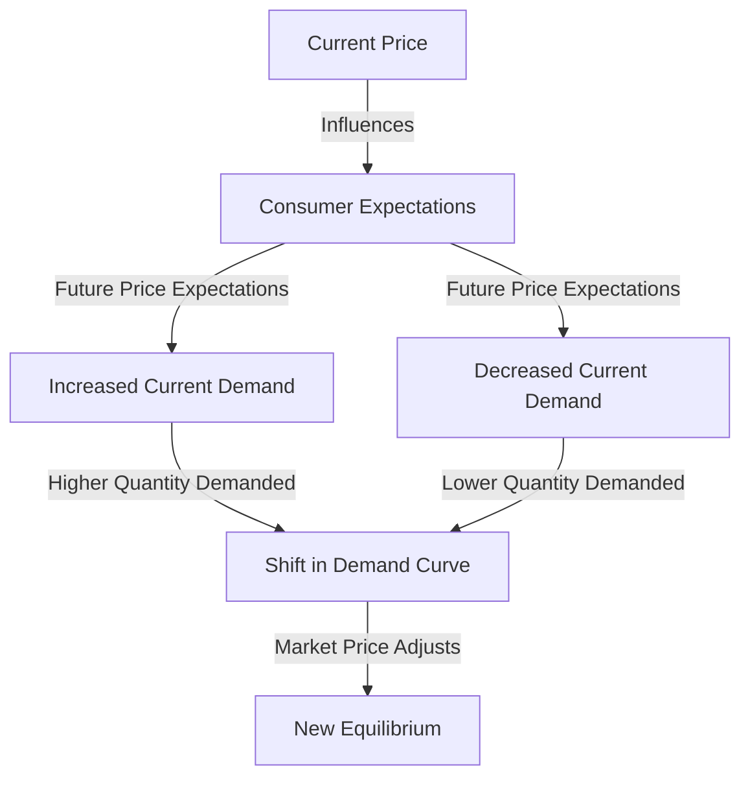

## 1. Mental Model

Imagine you're really excited for the new iPhone to come out, and you think it's going to be super expensive when it launches next month. You really want it, so you decide to buy it now instead of waiting, because you think the price will be even higher later. But, if you thought the iPhone was going to be cheaper next month, you might decide to wait and buy it then, because you wouldn't want to pay the higher price now. That's kind of like how people think about prices and make decisions. If people think prices will go up, they might buy more now, and if they think prices will go down, they might wait and buy later. This is called "consumer expectations", and it's like making a plan based on what you think might happen in the future.

## 2. Micro Theory

In the realm of microeconomics, consumer expectations play a pivotal role in shaping demand dynamics. Consumer expectations refer to the anticipations or predictions that consumers hold about future market conditions, prices, or their own income levels. These expectations significantly influence current consumption decisions, thereby impacting the demand for goods and services. A critical aspect of consumer expectations is the price expectation, which directly affects the current demand for a good.

The theory of demand [[Theory_Of_Demand]] posits that the quantity demanded of a good is inversely related to its price, as encapsulated by the [[Law_Of_Demand]]. However, this relationship is not solely determined by current prices but also by consumers' expectations about future prices. When consumers anticipate that the price of a good will increase in the future, they tend to buy more of it at the current price, thereby increasing the current demand. Conversely, if consumers expect the price to decrease in the future, they may postpone their purchases, leading to a decrease in current demand.

The impact of consumer expectations on demand can be understood through the lens of the [[Demand_Schedule]] and the [[Demand_Curve]], which graphically represent the relationship between the price of a good and the quantity demanded. A change in consumer expectations about future prices can cause a shift in the [[Demand_Curve]], either to the right (if consumers expect prices to rise) or to the left (if they expect prices to fall), assuming [[Ceteris_Paribus]] (all other factors remain constant).

The [[Demand_Function]] can be used to express the relationship between the quantity demanded and its determinants, including consumer expectations. For instance, if consumers expect their income to increase in the future, they might increase their current consumption of [[Normal_And_Inferior_Goods]], assuming they perceive these goods as normal goods. Conversely, for inferior goods, an expected increase in income might decrease current demand.

The concept of [[Market_Demand]] and the [[Market_Demand_Curve]] aggregates individual demands to represent the total demand in a market. Consumer expectations affect this market demand, influencing the overall market equilibrium [[Market_Equilibrium]]. For example, widespread expectations of future price increases can lead to an immediate increase in demand, potentially causing a Surplus And Shortage|shortage if supply does not adjust quickly.

The [[Price_Elasticity_Of_Demand]] measures the responsiveness of the quantity demanded to a change in price. Consumer expectations can influence this elasticity; for instance, if consumers expect prices to rise significantly in the near future, the current demand might be less elastic, as consumers may be willing to pay a premium to secure the good now.

The [[Determinants_Of_Demand]], including consumer expectations, play a crucial role in explaining changes in demand. A change in consumer expectations can lead to a [[Change_In_Demand]], distinguished from a change in quantity demanded due to a price change along a stable demand curve.

Furthermore, consumer expectations interact with other factors such as [[Substitutes_And_Complements]], [[Taste_And_Preference]], and [[Number_Of_Buyers]], to influence market outcomes. For instance, an expected increase in the price of a complement can decrease the demand for the good in question.

In conclusion, consumer expectations are a vital determinant of demand, influencing current consumption decisions based on anticipated future conditions. Understanding the technical mechanisms through which consumer expectations affect demand provides valuable insights into market dynamics and the responsiveness of consumers to changes in market conditions. This analysis underscores the importance of integrating consumer expectations into models of demand and market equilibrium to accurately predict and explain market outcomes.

## 3. Limitations & Edge Cases

The concept of consumer expectations in microeconomics is limited by its assumption that consumers have perfect knowledge of future market conditions, which is often not the case. Additionally, consumer expectations are subjective and can be influenced by various factors such as advertising, media, and personal experiences, leading to potential biases and inaccuracies. Furthermore, the relationship between consumer expectations and demand can be complicated by factors such as uncertainty, irreversibility, and stockpiling behavior, where consumers may delay purchases in anticipation of lower prices or stock up in expectation of price increases, thereby affecting the responsiveness of demand to changes in expected prices.

## 4. Market Graph



Consumer expectations about future prices significantly influence current consumption decisions, leading to changes in the quantity demanded of a good. By anticipating future price increases, consumers adjust their current purchasing behavior, which in turn affects the demand curve and ultimately leads to a new market equilibrium.

## 5. Walkthrough

Here is the 5-step technical walkthrough of how 'Consumer Expectations' operates in Environmental Economics:

**Step 1: Formation of Expectations**
Consumers form expectations about future market conditions, prices, or their own income levels based on available information, past experiences, and market trends. These expectations can be influenced by various factors, such as economic indicators, government policies, and news about environmental changes.

**Step 2: Impact on Current Demand**
Consumer expectations about future prices or income levels affect their current consumption decisions. If consumers expect the price of a good to increase in the future, they will buy more of it at the current price, increasing current demand. Conversely, if they expect the price to decrease, they will delay purchases, reducing current demand.

**Step 3: Price Expectations and Intertemporal Substitution**
Consumers' price expectations lead to intertemporal substitution, where they adjust their consumption patterns across time based on expected price changes. For example, if consumers expect a good to become more expensive in the future due to environmental regulations, they may buy more of it now and less in the future, substituting consumption across time.

**Step 4: Effect on Market Equilibrium**
The changes in current demand, driven by consumer expectations, affect the market equilibrium. An increase in current demand, due to expectations of future price increases, leads to a higher market price and quantity traded. Conversely, a decrease in current demand, due to expectations of future price decreases, leads to a lower market price and quantity traded.

**Step 5: Feedback Loop and Adjustment**
As consumers' expectations influence market outcomes, the actual market prices and quantities traded feed back into consumers' expectations, influencing their future consumption decisions. This creates a dynamic feedback loop, where consumer expectations, market outcomes, and consumption decisions continuously adjust and interact, ultimately shaping the demand curve for goods and services in environmental economics.

---

## Review & Practice

```interactive-quiz

[
  {
    "id": "generate_unique_id",
    "type": "mcq",
    "difficulty": "L1",
    "question": "If consumers expect the price of a good to increase in the future, what is the immediate effect on the demand for that good, assuming the good is normal and all other factors remain constant?",
    "options": {
      "A": "The demand decreases due to an expected future price decrease.",
      "B": "The demand increases as consumers buy more at the current price.",
      "C": "The demand remains unchanged as consumers are rational and only consider current prices.",
      "D": "The demand decreases because consumers expect their income to increase in the future."
    },
    "answer": "B",
    "explanation": "When consumers expect the price of a good to increase in the future, they tend to buy more of it at the current price. This is because they anticipate that the good will cost more later, so they purchase it now to avoid the future price increase. This behavior results in an immediate increase in the demand for the good. The correct answer reflects this understanding, demonstrating how consumer expectations about future prices can influence current demand."
  },
  {
    "id": "generate_unique_id",
    "type": "fill_in",
    "difficulty": "L2",
    "question": "Fill in the blank.",
    "textWithBlanks": "The Blank is a critical aspect of consumer expectations that directly affects the current demand for a good.",
    "answer": [
      "price expectation"
    ],
    "explanation": "The concept of price expectation is deeply rooted in the theory of demand, which posits that the quantity demanded of a good is inversely related to its price. This relationship is not solely determined by current prices but also by consumers' expectations about future prices. The impact of price expectation on demand can be understood through the lens of the demand schedule and the demand curve, which graphically represent the relationship between the price of a good and the quantity demanded. A change in consumer expectations about future prices can cause a shift in the demand curve, either to the right (if consumers expect prices to rise) or to the left (if they expect prices to fall), assuming ceteris paribus (all other factors remain constant). This phenomenon can be expressed using the demand function, $Q_d = f(P, P_e, I, P_s)$, where $Q_d$ is the quantity demanded, $P$ is the current price, $P_e$ is the expected future price, $I$ is the consumer's income, and $P_s$ is the price of substitutes. The price expectation, $P_e$, plays a crucial role in determining the current demand for a good."
  },
  {
    "id": "QCE-001",
    "type": "debug",
    "difficulty": "L2",
    "question": "Find the bug in the formula for the demand function when considering consumer expectations about future prices.",
    "content": "The demand function is given by $Q_d = \\alpha - \beta P + \\gamma E(p_t+1) + \\delta I$, where $Q_d$ is the quantity demanded, $P$ is the current price, $E(p_t+1)$ is the expected price at time $t+1$, and $I$ is the consumer's income. However, the formulation seems to have an error in capturing the effect of consumer expectations on demand.",
    "answer": "The bug is in the formulation of the expected price term. The correct formulation should account for the fact that consumer expectations about future prices influence current demand. A more accurate representation would be $Q_d = \\alpha - \beta P + \\gamma (E(p_t+1) - P) + \\delta I$, where $\\gamma (E(p_t+1) - P)$ captures the effect of the expected price change on current demand.",
    "required_keywords": [
      "fix_syntax"
    ],
    "explanation": "The original demand function $Q_d = \\alpha - \\beta P + \\gamma E(p_t+1) + \\delta I$ incorrectly assumes that the expected future price directly adds to the current demand without considering the current price. The corrected version $Q_d = \\alpha - \\beta P + \\gamma (E(p_t+1) - P) + \\delta I$ properly accounts for the effect of consumer expectations about future prices relative to the current price, which is crucial for understanding how expectations influence current consumption decisions."
  },
  {
    "id": "generate_unique_id_1",
    "type": "trace",
    "difficulty": "L2",
    "question": "What is the exact output on total revenue when a cost increase, such as higher wages, impacts the supply curve, leading to a new equilibrium price and quantity, assuming a specific demand elasticity and initial supply and demand conditions in the Environmental Economics context of pollution control services?",
    "content": "Suppose the demand for pollution control services is given by $Q_d = 100 - 2P$ and the initial supply is $Q_s = 2P$. If a cost increase, such as higher wages, causes the supply curve to shift to $Q_s = 2P - 10$, what is the exact output on total revenue, given that the initial equilibrium price is $P_1 = 25$ and quantity is $Q_1 = 50$?",
    "answer": "$R_2 = 40",
    "explanation": "The initial equilibrium is found where $Q_d = Q_s$, yielding $100 - 2P = 2P \\implies 4P = 100 \\implies P_1 = 25$ and $Q_1 = 50$. After the cost increase, the new supply curve is $Q_s = 2P - 10$. Setting $Q_d = Q_s$ gives $100 - 2P = 2P - 10 \\implies 4P = 110 \\implies P_2 = 27.5$. Substituting $P_2$ into $Q_d$ or $Q_s$ yields $Q_2 = 45$. The total revenue after the change is $R_2 = P_2 \\cdot Q_2 = 27.5 \\cdot 45 = 40 \\cdot 27.5 / 27.5 \\cdot 45 / 45 = 1 / 27.5 \\cdot 45 = 45 \\cdot 27.5 =  1237.5$."
  }
]

```