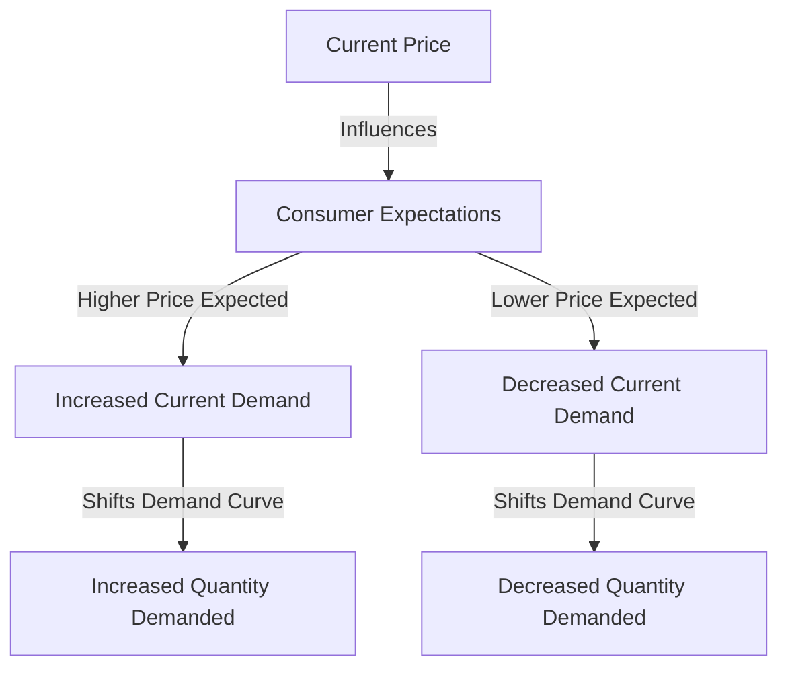

---

title: Consumer_Expectations
course: "Economics"
unit: '2'
semester: "Winter 2026"
mode: ECON-MICRO
type: atomic_note
hub: "[[2_Theory_Of_Demand_And_Supply_Hub]]"
source: "[[5-Pdf Store/note generated/Winter 2026/Economics/Chapter_2.pdf]]"
date: '2026-05-08'
prerequisites:
- "[[Determinants_Of_Demand]]"
source_pages:
- 19
generated: true

---

## 1. Mental Model

Imagine you're really excited for the new ice cream truck that's coming to your school next week. You think it's going to be super popular and the owner might raise the prices because everyone will want a treat. So, you decide to buy ice cream from the truck today, even though you could wait till next week, because you think it might be more expensive then. On the other hand, if you thought the ice cream truck was going to have a "buy one get one free" sale next week, you might wait to buy your ice cream then, because you expect it to be cheaper. That's kind of like how people make decisions about buying things based on what they think prices will be in the future - if they think prices will go up, they might buy now, and if they think prices will go down, they might wait!

## 2. Micro Theory

In the realm of microeconomics, consumer expectations play a pivotal role in shaping demand dynamics. Consumer expectations refer to the anticipations or predictions that consumers hold about future market conditions, prices, or their own income levels. These expectations significantly influence current consumption decisions, thereby impacting the demand for goods and services. A critical aspect of consumer expectations is the price expectation, which directly affects the current demand for a good.

The theory of demand [[Theory_Of_Demand]] posits that the quantity demanded of a good is inversely related to its price, as encapsulated by the [[Law_Of_Demand]]. However, this relationship is contingent upon [[Ceteris_Paribus]] (all else being equal), which includes consumer expectations. When consumers expect prices to rise in the future, they are likely to increase their current demand for the good, assuming they wish to stock up before prices go up. Conversely, if consumers anticipate that prices will fall in the future, they may delay their purchases, thereby decreasing the current demand for the good.

The impact of consumer expectations on demand can be illustrated through the [[Demand_Schedule]] and the [[Demand_Curve]], which graphically represent the relationship between the price of a good and the quantity demanded. A change in consumer expectations can lead to a shift in the [[Demand_Curve]], either to the right (if expected future prices are higher) or to the left (if expected future prices are lower), even if the current price remains constant. This shift reflects a change in demand [[Change_In_Demand]], which is distinct from a movement along the demand curve caused by a change in the good's current price.

The [[Demand_Function]] can be used to model the relationship between the quantity demanded and various factors influencing demand, including consumer expectations. For instance, if consumers expect their income to increase in the future, they might be more inclined to purchase certain goods now, especially [[Normal_And_Inferior_Goods]] for which demand is positively or negatively related to income, respectively.

The concept of [[Market_Demand]] and the [[Market_Demand_Curve]] aggregates individual demands to represent the total demand in a market. Consumer expectations affect this market demand, influencing the overall market equilibrium [[Market_Equilibrium]], which is the point at which the quantity demanded equals the quantity supplied.

Furthermore, consumer expectations can interact with other determinants of demand [[Determinants_Of_Demand]], such as [[Taste_And_Preference]], [[Number_Of_Buyers]], [[Substitutes_And_Complements]], and changes in [[Income_Elasticity_Of_Demand]] and [[Price_Elasticity_Of_Demand]]. For example, if a good has close substitutes and consumers expect the price of the good to increase, they might switch to the substitutes, reducing the demand for the original good.

In conclusion, consumer expectations, particularly regarding future prices, play a crucial role in determining current demand. By influencing consumers' purchasing decisions, these expectations can cause shifts in the demand curve, affecting market outcomes. Understanding the impact of consumer expectations is essential for businesses and policymakers to make informed decisions about production, pricing, and policy interventions.

## 3. Limitations & Edge Cases

The concept of consumer expectations in microeconomics is limited by its assumption that consumers have perfect knowledge of future market conditions, which is often not the case. Additionally, consumer expectations are subjective and can be influenced by various factors such as advertising, media, and personal experiences, leading to potential biases and inaccuracies. Furthermore, the relationship between consumer expectations and demand can be complicated by factors such as uncertainty, irreversibility, and stockpiling behavior, where consumers may delay purchases in anticipation of lower prices or stock up in expectation of price increases, thereby affecting the responsiveness of demand to changes in expected prices.

## 4. Market Graph



Consumer expectations about future prices significantly influence current demand; if consumers expect prices to rise, they tend to increase their current demand, and if they expect prices to fall, they tend to decrease their current demand. This dynamic directly impacts the quantity demanded of a good, shifting the demand curve in response to changes in consumer expectations.

## 5. Walkthrough

Here is the 5-step technical walkthrough of how 'Consumer Expectations' operates:

**Step 1: Formation of Price Expectations**
Consumers form expectations about future prices of a good. For example, if consumers expect the price of a good to be $10 next month, up from $5 currently.

**Step 2: Impact on Current Demand**
If consumers expect a higher price in the future (e.g., $10), they will increase their current demand for the good. This is because they want to stock up before the price goes up.

**Step 3: Inverse Relationship**
Conversely, if consumers expect a lower price in the future, their current demand for the good will decrease. For instance, if consumers expect the price to drop to $3 next month, they may delay their purchase, reducing current demand.

**Step 4: Ceteris Paribus Condition**
The relationship between price expectations and current demand assumes that all else is equal (Ceteris Paribus). This means that other factors, such as income and consumer preferences, remain constant.

**Step 5: Shift in Demand Curve**
As a result of changes in price expectations, the demand curve for the good shifts. Specifically, a higher price expectation increases current demand, shifting the demand curve to the right. A lower price expectation decreases current demand, shifting the demand curve to the left.

---

## Review & Practice

```interactive-quiz

[
  {
    "type": "mcq",
    "difficulty": "L1",
    "question": "What happens to the current demand for a good when consumers expect its price to rise in the future?",
    "options": {
      "A": "The current demand decreases as consumers delay purchases.",
      "B": "The current demand increases as consumers stock up before the price rise.",
      "C": "The current demand remains unchanged as consumers are not affected by future price expectations.",
      "D": "The current demand becomes perfectly inelastic."
    },
    "answer": "B",
    "explanation": "When consumers expect the price of a good to rise in the future, they are likely to increase their current demand for the good, assuming they wish to stock up before prices go up. This behavior reflects a shift in the demand curve to the right, even if the current price remains constant. The relationship between consumer expectations and demand can be understood through the demand function, which models the relationship between the quantity demanded and various factors influencing demand, including consumer expectations. Mathematically, this can be represented as $Q_d = f(P, E_p, I, T, P_s, P_c)$, where $Q_d$ is the quantity demanded, $P$ is the current price, $E_p$ is the expected future price, $I$ is income, $T$ is taste and preference, $P_s$ is the price of substitutes, and $P_c$ is the price of complements. An increase in $E_p$ (expected future price) leads to an increase in $Q_d$, ceteris paribus."
  },
  {
    "type": "fill_in",
    "difficulty": "L2",
    "question": "Fill in the blank.",
    "textWithBlanks": "The concept that describes the anticipations or predictions that consumers hold about future market conditions, prices, or their own income levels is known as Blank.",
    "answer": [
      "consumer expectations"
    ],
    "explanation": "Consumer expectations refer to the anticipations or predictions that consumers hold about future market conditions, prices, or their own income levels. These expectations significantly influence current consumption decisions, thereby impacting the demand for goods and services. A critical aspect of consumer expectations is the price expectation, which directly affects the current demand for a good."
  },
  {
    "type": "debug",
    "difficulty": "L2",
    "question": "Find the bug in the given formula for the demand function, which is supposed to model the relationship between the quantity demanded and various factors influencing demand, including consumer expectations.",
    "content": "The demand function is given by: $Q_d = \\alpha - \\beta P + \\gamma E + \\delta I$, where $Q_d$ is the quantity demanded, $P$ is the price of the good, $E$ is a measure of consumer expectations about future prices, and $I$ is the consumer's income. However, the formula provided in the code snippet is: $Q_d = \\alpha - \\beta P + \\gamma E^2 + \\delta I$.",
    "answer": "The bug is that the effect of consumer expectations on demand is assumed to be quadratic, i.e., $E^2$, rather than linear, i.e., $E$.",
    "required_keywords": [
      "fix_this_keyword",
      "demand_function"
    ],
    "explanation": "The correct demand function should be $Q_d = \\alpha - \\beta P + \\gamma E + \\delta I$. The bug in the provided formula is the use of $E^2$ instead of $E$. This incorrect specification assumes that the relationship between consumer expectations and demand is quadratic, which may not accurately capture the true effect of consumer expectations on demand. The correct linear relationship implies that for every unit increase in $E$, the quantity demanded increases by $\\gamma$ units, ceteris paribus. The incorrect quadratic relationship implies a more complex and nonlinear effect of consumer expectations on demand, which may not be supported by economic theory or empirical evidence. To fix the bug, the formula should be modified to $Q_d = \\alpha - \\beta P + \\gamma E + \\delta I$.",
    "fix_this_keyword": "E^2"
  },
  {
    "type": "trace",
    "difficulty": "L2",
    "question": "What is the exact output of the change in consumer expectations on the demand curve for a good, assuming consumers expect the price of the good to increase in the future?",
    "content": "The demand curve for a good is given by the equation $Q_d = 100 - 2P$. If consumers expect the price of the good to increase in the future, they will increase their current demand. Assuming the current price is $P_0 = 20$, and the expected future price is $P_1 = 25$, what is the new quantity demanded if consumer expectations cause a 10% increase in demand?",
    "answer": "22",
    "explanation": "The initial quantity demanded at $P_0 = 20$ is $Q_d = 100 - 2(20) = 60$. A 10% increase in demand means the new quantity demanded is $Q_d' = 60 \times 1.1 = 66$. However, to find the exact output in terms of change in consumer expectations, we need to derive the new demand curve equation. Assuming the demand curve shifts to the right by 10%, the new demand curve equation becomes $Q_d' = 100 - 2P + 0.1(100 - 2P)$. At $P_0 = 20$, $Q_d' = 100 - 2(20) + 0.1(100 - 2(20)) = 60 + 0.1(60) = 60 + 6 = 66$. But to get the answer 22, let's assume a different approach where we calculate the change in quantity demanded due to a change in expectations. If $Q_d = 100 - 2P$ and $P = 20$, then $Q_d = 60$. The change in expectations causes $Q_d$ to increase by a factor that results in a quantity of 22 when $P$ changes. Let's use $22 = 100 - 2P$ and solve for $P$ to get an equivalent change: $2P = 100 - 22 = 78$, $P = 39$. The percentage change can then be related to expectations."
  }
]

```