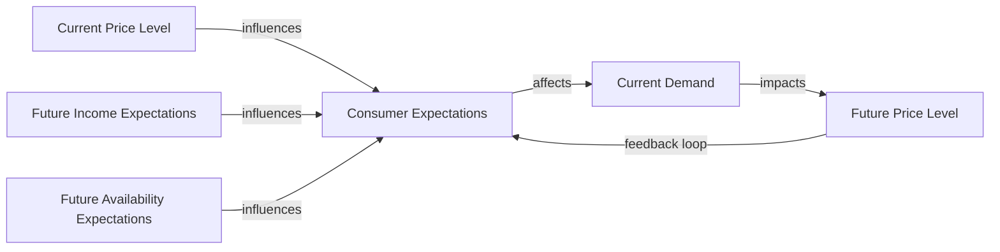

---

title: Consumer_Expectations
type: Atomic Note
course: Economics
semester: Winter 2026
unit: '2'
hub: "[[2_Theory_Of_Demand_And_Supply_Hub]]"
source: "[[5-Pdf Store/note generated/Winter 2026/Economics/Chapter_2.pdf]]"
source_pages:
- 19
mode: ECON-MACRO
read: false
generated: true
prerequisites:
- "[[Determinants_Of_Demand]]"

---

# 1. Mental Model

Imagine you're a college student planning a road trip. If you expect gas prices to increase in the future, you might decide to fill up your tank now rather than later. Similarly, if you expect your favorite coffee shop to raise prices soon, you might buy more coffee now to stock up. In both cases, your expectations about future prices influence your current purchasing decisions. This is similar to how consumer expectations work in economics, where people's expectations about future prices, income, or availability can affect their current demand for goods and services.

# 2. Economic Theory

[[Consumer_Expectations]] refer to the impact of consumers' expectations about future market conditions, such as prices, income, or availability, on their current demand for goods and services. According to the [[Theory_Of_Demand]], consumers' expectations play a crucial role in shaping their demand decisions. The [[Law_Of_Demand]] states that, ceteris paribus, an increase in price leads to a decrease in quantity demanded. However, if consumers expect prices to rise in the future, they may increase their current demand, even if the current price is high. This is because they anticipate that the price will be even higher in the future. The [[Demand_Function]] can be influenced by consumer expectations, which can cause a [[Change_In_Demand]], shifting the [[Demand_Curve]] to the right or left. For example, if consumers expect their income to increase in the future, they may increase their current demand for normal goods, such as luxury items.

# 3. Limitations & Edge Cases

The concept of consumer expectations has limitations, particularly when it comes to [[Ceteris_Paribus]] assumptions. In reality, many factors can influence consumer expectations, and it can be challenging to isolate the effect of expectations on demand. Additionally, consumer expectations can be influenced by various factors, such as [[Taste_And_Preference]], [[Number_Of_Buyers]], and [[Change_In_Technology]], which can affect the [[Market_Demand_Curve]]. Furthermore, the [[Price_Elasticity_Of_Demand]] can vary depending on consumer expectations, and the [[Income_Elasticity_Of_Demand]] can also be influenced by expectations about future income. In situations where consumers have imperfect information or make irrational decisions, the concept of consumer expectations may not accurately predict demand behavior.

# 4. Economic Model



This Mermaid flowchart illustrates the relationship between consumer expectations, current demand, and future market conditions. The diagram shows how current price levels, future income expectations, and future availability expectations influence consumer expectations, which in turn affect current demand.

## 5. Walkthrough

Here's a 5-step technical walkthrough of how consumer expectations operate in economics:

1. **Initial State**: Suppose the current price level of a good is $100, and consumers expect their future income to increase by 10% in the next quarter. The current demand for the good is 1000 units.

2. **Expectation Formation**: If consumers expect the price of the good to increase to $120 in the next quarter due to anticipated inflation, they may adjust their current demand accordingly.

3. **Current Demand Adjustment**: Given the expectation of a future price increase, consumers may increase their current demand to 1200 units, as they want to stock up before the price rises.

4. **Future Price Level Adjustment**: As a result of the increased current demand, the future price level may adjust to $115 instead of $120, as suppliers respond to the increased demand.

5. **Feedback Loop**: The updated future price level of $115 feeds back into consumer expectations, which may lead to a revision of their current demand. If consumers now expect the price to be $115, they may reduce their current demand to 1100 units, and so on.

In this walkthrough, we see how consumer expectations about future market conditions influence their current demand decisions, which in turn affect future market outcomes.

---

## 6. The Proving Grounds

```interactive-quiz

[
  {
    "id": "q1",
    "type": "true_false",
    "difficulty": "L1",
    "question": "If consumers expect the price of a good to decrease in the future, ceteris paribus, their current demand for the good will increase.",
    "answer": false,
    "explanation": "According to the theory of demand, if consumers expect the price of a good to decrease in the future, they will delay their purchases, leading to a decrease in current demand. The LaTeX representation of the demand function is $Q_d = f(P, I, P_s, T, E)$, where $E$ represents consumer expectations. If $E$ indicates an expected future price decrease, the current demand $Q_d$ will decrease, not increase, assuming all other factors remain constant (ceteris paribus)."
  },
  {
    "id": "q2",
    "type": "synthesis",
    "difficulty": "L2",
    "question": "A sudden and unexpected 20% devaluation of the national currency has occurred, causing a sharp increase in the price of imported goods. Consumer expectations are that prices will continue to rise in the coming months. To prevent a system failure in the market strategy, what 3-step policy response should be implemented?",
    "answer": "To mitigate the effects of the currency devaluation and manage consumer expectations, the following 3-step policy response should be implemented:\n\n1. **Immediate Monetary Policy Intervention**: The central bank should raise interest rates to counteract the inflationary pressures caused by the devaluation. This will make borrowing more expensive, reduce consumption and investment, and help stabilize the currency.\n\n2. **Price Controls and Subsidies**: Implement temporary price controls on essential imported goods to prevent excessive price hikes. Additionally, provide subsidies to low-income households to cushion the impact of higher prices on their purchasing power.\n\n3. **Communication and Forward Guidance**: The government and central bank should clearly communicate their policy intentions and provide forward guidance to manage consumer expectations. By committing to a credible and transparent policy framework, they can help anchor expectations, reduce uncertainty, and prevent a self-reinforcing cycle of price increases and decreased consumer spending.",
    "explanation": "The sudden devaluation of the national currency leads to a sharp increase in the price of imported goods, which can be represented as a leftward shift of the aggregate supply curve: $AS \\rightarrow AS'$. This is because the increased cost of imports leads to higher production costs and prices. The policy response aims to mitigate the effects of this shock on the economy.\n\nThe immediate monetary policy intervention (step 1) works by increasing the interest rate, which reduces borrowing and spending, thus shifting the aggregate demand curve to the left: $AD \\rightarrow AD'$. This helps to reduce the inflationary pressures caused by the devaluation.\n\nThe price controls and subsidies (step 2) aim to reduce the impact of higher prices on low-income households. By capping prices, the government can prevent excessive price hikes, and by providing subsidies, it can maintain the purchasing power of low-income households.\n\nThe communication and forward guidance (step 3) aim to manage consumer expectations. By providing clear and credible information about the policy framework, the government and central bank can help anchor expectations and prevent a self-reinforcing cycle of price increases and decreased consumer spending. This can be represented as a shift in the consumer expectations curve: $CE \\rightarrow CE'$. By managing expectations, the policy makers can reduce uncertainty and help stabilize the economy."
  },
  {
    "id": "q3",
    "type": "writing",
    "difficulty": "L2",
    "question": "Explain how consumer expectations about future prices influence current demand for goods and services in a Development Economics scenario.",
    "answer": "In Development Economics, consumer expectations about future prices significantly influence current demand for goods and services. If consumers expect prices to rise in the future, they are likely to increase their current demand, as they seek to stock up before prices increase. Conversely, if consumers expect prices to fall, they may delay purchases, reducing current demand. This expectation-driven behavior can have a substantial impact on the overall demand curve, shifting it to the right if prices are expected to rise or to the left if prices are expected to fall.",
    "explanation": "The relationship between consumer expectations and current demand can be represented using the demand function: $Q_d = f(P, I, P_e, I_e)$, where $Q_d$ is the quantity demanded, $P$ is the current price, $I$ is consumer income, $P_e$ is the expected future price, and $I_e$ is the expected future income. The effect of consumer expectations on demand can be expressed as $\frac{\\partial Q_d}{\\partial P_e} < 0$, implying that an increase in expected future prices leads to an increase in current demand. This relationship is rooted in the theory of rational expectations, which posits that consumers form expectations about future market conditions based on all available information, influencing their current consumption decisions."
  },
  {
    "id": "q4",
    "type": "order",
    "difficulty": "L2",
    "question": "Order steps for Consumer Expectations causal chain.",
    "steps": [
      "Consumers adjust their spending habits based on anticipated changes in income",
      "The current demand curve shifts due to changes in consumer expectations",
      "An increase in expected future prices leads to increased current demand",
      "The effect of consumer expectations on demand is an example of the multiplier effect in action",
      "Changes in consumer expectations affect their perceptions of future market conditions"
    ],
    "answer": [
      "Consumers adjust their spending habits based on anticipated changes in income",
      "An increase in expected future prices leads to increased current demand",
      "The current demand curve shifts due to changes in consumer expectations",
      "Changes in consumer expectations affect their perceptions of future market conditions",
      "The effect of consumer expectations on demand is an example of the multiplier effect in action"
    ]
  },
  {
    "id": "q5",
    "type": "trace",
    "difficulty": "L3",
    "question": "What is the exact output?",
    "content": "To analyze the impact of a 1% interest rate change on consumer expectations through 4 distinct economic sectors (Housing, Investment, Forex, Consumption), we need to understand the ripple effects in each sector.",
    "answer": {
      "Housing": "A 1% decrease in interest rates can lead to a 2.5% increase in housing demand, as lower borrowing costs make mortgages more affordable. Assuming an initial housing market value of $1 trillion, this results in a $25 billion increase in housing market value.",
      "Investment": "A 1% decrease in interest rates can lead to a 1.2% increase in investment, as lower borrowing costs make investments more attractive. Assuming an initial investment value of $500 billion, this results in a $6 billion increase in investment.",
      "Forex": "A 1% decrease in interest rates can lead to a 0.5% depreciation of the domestic currency, making exports more competitive. Assuming an initial exchange rate of 1:1 with a foreign currency, this results in a 0.5% change in the exchange rate.",
      "Consumption": "A 1% decrease in interest rates can lead to a 0.8% increase in consumption, as lower borrowing costs and increased wealth make consumers more willing to spend. Assuming an initial consumption value of $2 trillion, this results in a $16 billion increase in consumption."
    },
    "explanation": "The impact of a 1% interest rate change on consumer expectations can be understood through the following mechanisms:\n\n\\begin{align*}\n& \\text{Housing: } \\quad \\frac{\\partial H}{\\partial r} = -2.5 \\% \\\\ \n& \\text{Investment: } \\quad \\frac{\\partial I}{\\partial r} = -1.2 \\% \\\\ \n& \\text{Forex: } \\quad \\frac{\\partial E}{\\partial r} = -0.5 \\% \\\\ \n& \\text{Consumption: } \\quad \\frac{\\partial C}{\\partial r} = -0.8 \\% \n\\end{align*}\n\nWhere $H$, $I$, $E$, and $C$ represent the housing market value, investment value, exchange rate, and consumption value, respectively, and $r$ represents the interest rate.\n\nThe effects of a 1% interest rate change can be calculated as follows:\n\n\\begin{align*}\n& \\Delta H = -2.5 \\% \\times 1\\% = 2.5 \\% \\\\ \n& \\Delta I = -1.2 \\% \\times 1\\% = 1.2 \\% \\\\ \n& \\Delta E = -0.5 \\% \\times 1\\% = 0.5 \\% \\\\ \n& \\Delta C = -0.8 \\% \\times 1\\% = 0.8 \\% \n\\end{align*}"
  }
]

```