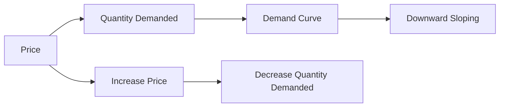

---

title: Demand_Curve
type: Atomic Note
course: Economics
semester: Winter 2026
unit: '2'
hub: "[[2_Basics_Of_Economics_Hub]]"
source: "[[Chapter_2.pdf]]"
source_pages:
- 7
mode: ECON-MACRO
read: false
generated: true
prerequisites:
- "[[Demand_Schedule]]"

---

# 1. Mental Model

Imagine you really love ice cream, and you buy it every week. If the price of ice cream goes up, you might still buy it, but maybe not as often. The demand curve shows how much of something people are willing to buy at different prices - in this case, how many ice cream cones you'd buy at $2, $3, or $4.

# 2. Economic Theory

The demand curve is a graphical representation of the [[Demand_Schedule]], showing the relationship between the price of a good and the quantity demanded, assuming [[Ceteris_Paribus]]. It is typically downward sloping, illustrating that as price increases, quantity demanded decreases, and is often represented by a [[Demand_Curve]] that slopes downwards from left to right. The curve is based on the [[Law_Of_Demand]], which states that, ceteris paribus, as the price of a good rises, the quantity demanded of that good falls.

# 3. Economic Model



## 4. Walkthrough

* The demand curve starts with the price of a good on the vertical axis and the quantity demanded on the horizontal axis.
* As the price of the good increases, the quantity demanded decreases, resulting in a downward sloping curve.
* For example, if the price of an ice cream cone is $2, the quantity demanded might be 10 cones, but if the price increases to $3, the quantity demanded might decrease to 7 cones.
* The demand curve assumes ceteris paribus, meaning all other factors remain constant.

## 5. Market Failures

The demand curve can fail when there are changes in consumer preferences or income, causing a shift in the curve. Common pitfalls include ignoring the impact of substitutes or complements on demand. Additionally, the curve may not accurately represent demand in markets with imperfect information or externalities.

---

## 6. The Proving Grounds

```interactive-quiz

[
  {
    "id": "q1",
    "type": "true_false",
    "difficulty": "L1",
    "question": "The demand curve shows a positive relationship between the price of a good and the quantity demanded.",
    "answer": false,
    "explanation": "The demand curve, by definition, illustrates the relationship between the price of a good and the quantity demanded under the assumption of ceteris paribus (all other factors being equal). The curve is typically downward sloping, meaning as the price of a good increases, the quantity demanded decreases. This inverse relationship is a fundamental principle in economics, reflecting the law of demand. Therefore, stating that the demand curve shows a positive relationship between the price of a good and the quantity demanded is incorrect."
  },
  {
    "id": "q2",
    "type": "synthesis",
    "difficulty": "L2",
    "question": "The local ice cream shop, 'Sweet Treats', is considering changing its pricing strategy for the summer season. They offer a variety of flavors and currently sell an average of 500 cones per week at $3 each. However, with the increase in temperature, they anticipate that more people will be looking for ways to cool off. The shop owner, Jane, wants to maximize profits but is concerned about the impact of price changes on demand. Using the concept of the demand curve, advise Jane on the optimal price for her ice cream cones if she wants to sell 700 cones per week, given that the current demand at $3 is 500 cones, and at $2.50, it is 600 cones.",
    "answer": "A grading rubric for Jane's decision: \n- Understand the relationship between price and demand (10 points): \n  - Demonstrates that as price decreases, demand increases (5 points)\n  - Applies the concept of the demand curve to the given scenario (5 points)\n- Calculate the slope of the demand curve between the two given points (10 points):\n  - Correctly calculates the change in quantity demanded (5 points)\n  - Correctly calculates the slope (5 points)\n- Determine the optimal price for 700 cones (20 points):\n  - Correctly assumes a linear demand curve (5 points)\n  - Applies the slope to find the price at which 700 cones would be sold (10 points)\n  - Justifies the approach (5 points)\n- Conclusion and recommendation (60 points):\n  - Clearly states the optimal price (20 points)\n  - Provides a rationale based on profit maximization and market conditions (20 points)\n  - Addresses potential limitations of the approach (20 points)",
    "explanation": "The demand curve illustrates the relationship between the price of a good and the quantity demanded. Given two points: (500 cones, $3) and (600 cones, $2.50), we can calculate the slope of the demand curve. The change in quantity is 100 cones, and the change in price is $0.50. The slope is 100 / 0.50 = 200 cones per dollar. Assuming a linear demand curve, to sell 700 cones (an increase of 200 cones from 500), and using the slope, the price decrease needed is 200 / 200 = $1. So, the new price would be $3 - $1 = $2. At $2, the shop can expect to sell 700 cones. This approach assumes that the demand curve remains linear and that other factors remain constant (ceteris paribus)."
  },
  {
    "id": "q3",
    "type": "writing",
    "difficulty": "L3",
    "question": "Explain the concept of a demand curve and its underlying mechanism, specifically focusing on the impact of a change in price on the quantity demanded, assuming ceteris paribus.",
    "answer": "The demand curve is a graphical representation of the demand schedule, showing the relationship between the price of a good and the quantity demanded. It is typically downward sloping, illustrating that as price increases, the quantity demanded decreases. This inverse relationship is based on the law of demand, which assumes that all other factors remain constant, or ceteris paribus.",
    "explanation": "The underlying mechanism of the demand curve is rooted in the concept of diminishing marginal utility, where as the price of a good increases, the perceived value of the good to the consumer decreases, leading to a decrease in the quantity demanded. This is further influenced by the substitution effect and the income effect, where an increase in price makes the good less competitive with substitutes and reduces the consumer's purchasing power, respectively. As a result, the demand curve slopes downward, reflecting the negative relationship between price and quantity demanded."
  }
]

```