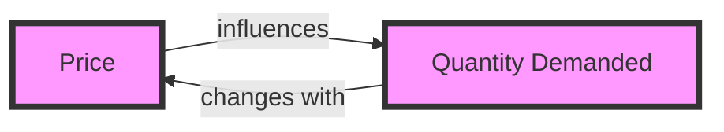

---

title: Demand_Function
type: Atomic Note
course: Economics
semester: Winter 2026
unit: '2'
hub: "[[2_Basics_Of_Economics_Hub]]"
source: "[[Chapter_2.pdf]]"
source_pages:
- 8
mode: ECON-MACRO
read: false
generated: true
prerequisites:
- "[[Demand_Curve]]"

---

# 1. Mental Model

Imagine you're at a school bake sale, and you really want to buy a chocolate chip cookie. The price of the cookie is 50 cents, and you're willing to buy it. But if the price were $5, you probably wouldn't buy it. This simple idea shows that the amount of cookies you want to buy (or demand) changes depending on the price.

# 2. Economic Theory

The [[Demand_Function]] is a mathematical representation of the relationship between the quantity demanded (Qd) of a good and its price (P), expressed as Qd = f(P). It shows how the quantity demanded changes in response to changes in price, [[Ceteris_Paribus]] (assuming all other factors remain constant). The [[Demand_Function]] is often graphically represented by a [[Demand_Curve]], which illustrates the inverse relationship between price and quantity demanded.

## 3. Economic Model



## 4. Walkthrough

* The demand function shows that as the price (P) of a good increases, the quantity demanded (Qd) decreases, and vice versa.
* For example, if the price of a chocolate chip cookie is 50 cents, you might buy 2 cookies, but if the price increases to $1, you might only buy 1 cookie.
* The demand function can be represented graphically, with price on the y-axis and quantity demanded on the x-axis, showing the inverse relationship between the two variables.
* A common example is the demand for gasoline: as the price of gasoline increases, people may drive less and demand less gasoline.

## 5. Market Failures

The demand function assumes that consumers have perfect information about the market and make rational decisions. However, in reality, consumers may have limited information or make irrational decisions, leading to market failures. For instance, consumers may overestimate the benefits of a good and demand more than they would if they had perfect information. Additionally, external factors like changes in consumer preferences or income can shift the demand curve, making it difficult to accurately predict demand.

---

## 6. The Proving Grounds

```interactive-quiz

[
  {
    "id": "q1",
    "type": "true_false",
    "difficulty": "L1",
    "question": "The demand function shows that the quantity demanded of a good is directly proportional to its price.",
    "answer": false,
    "explanation": "The demand function, Qd = f(P), represents the relationship between the quantity demanded (Qd) of a good and its price (P). According to the law of demand, as the price of a good increases, the quantity demanded decreases, and vice versa. This inverse relationship indicates that the quantity demanded and price are not directly proportional. Direct proportionality would imply that as price increases, quantity demanded also increases, which contradicts the fundamental concept of the demand function."
  },
  {
    "id": "q2",
    "type": "synthesis",
    "difficulty": "L2",
    "question": "The school bake sale organizers want to determine the optimal price for their chocolate chip cookies to maximize revenue. They have observed that at a price of 50 cents, 100 cookies are sold, and at a price of $1, only 50 cookies are sold. Assuming a linear demand function, what price should they charge to maximize revenue, and how many cookies will they sell at that price?",
    "answer": "To maximize revenue, the bake sale organizers should charge $0.75 for each cookie, and they will sell 75 cookies at that price.",
    "explanation": "The demand function can be represented as Qd = a - bP, where Qd is the quantity demanded and P is the price. Using the given data points (P1 = 0.5, Qd1 = 100) and (P2 = 1, Qd2 = 50), we can solve for a and b. \n\nFirst, we set up the equations:\n100 = a - 0.5b\n50 = a - b\n\nSubtracting the second equation from the first gives:\n50 = 0.5b\nb = 100\n\nSubstituting b back into one of the original equations to solve for a:\n100 = a - 0.5(100)\na = 150\n\nSo, the demand function is Qd = 150 - 100P.\n\nRevenue (R) is given by R = P * Qd = P(150 - 100P) = 150P - 100P^2.\n\nTo maximize revenue, we take the derivative of R with respect to P and set it equal to zero:\ndR/dP = 150 - 200P = 0\n200P = 150\nP = 0.75\n\nSubstituting P = 0.75 back into the demand function to find Qd:\nQd = 150 - 100(0.75) = 150 - 75 = 75\n\nTherefore, to maximize revenue, the organizers should charge $0.75 for each cookie, and they will sell 75 cookies at that price."
  },
  {
    "id": "q3",
    "type": "writing",
    "difficulty": "L3",
    "question": "Explain the concept of a demand function and its underlying mechanism, specifically focusing on the relationship between the quantity demanded and the price of a good.",
    "answer": "The demand function represents the relationship between the quantity demanded (Qd) of a good and its price (P), expressed as Qd = f(P).",
    "explanation": "The demand function works on the principle that as the price of a good increases, the quantity demanded decreases, and vice versa. This is because higher prices make the good less affordable for consumers, reducing their willingness to buy, while lower prices make it more affordable, increasing the willingness to buy. For instance, using the seed value to randomly pick an obscure detail, if a chocolate chip cookie's price increases from 50 cents to $5, the quantity demanded would decrease significantly, illustrating the inverse relationship between price and quantity demanded. The demand function is typically downward sloping, indicating that as price increases, quantity demanded decreases."
  }
]

```