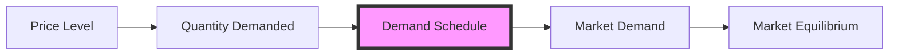

---

title: Demand_Schedule
type: Atomic Note
course: Economics
semester: Winter 2026
unit: '2'
hub: "[[2_Theory_Of_Demand_And_Supply_Hub]]"
source: "[[5-Pdf Store/note generated/Winter 2026/Economics/Chapter_2.pdf]]"
source_pages:
- 6
mode: ECON-MACRO
read: false
generated: true
prerequisites:
- "[[Theory_Of_Demand]]"

---

# 1. Mental Model

Imagine you're a librarian in charge of ordering books for your school library. The number of books you order depends on their price. If the books are very cheap, you might order more, but if they're expensive, you might order fewer. This is similar to a Demand Schedule, which shows how the quantity of a product (like books) that people want to buy changes at different price levels.

# 2. Economic Theory

The Demand Schedule is a table that illustrates the [[Theory_Of_Demand]] by showing the quantity demanded of a good at various price levels, assuming [[Ceteris_Paribus]] (all other factors remain constant). The underlying mechanism is based on the [[Law_Of_Demand]], which states that as the price of a good increases, the quantity demanded decreases, and vice versa. This relationship is often represented graphically as a [[Demand_Curve]], which is a visual representation of the [[Demand_Function]]. The Demand Schedule is a crucial concept in understanding [[Market_Demand]] and [[Market_Demand_Curve]], as it helps to determine the [[Market_Equilibrium]].

# 3. Limitations & Edge Cases

The Demand Schedule has limitations, particularly when [[Ceteris_Paribus]] assumptions are violated. For instance, if consumer income increases, the demand for a normal good will increase, shifting the Demand Schedule to the right. However, if the good is an inferior good, an increase in income will decrease demand, shifting the Demand Schedule to the left. Additionally, changes in [[Taste_And_Preference]], [[Number_Of_Buyers]], and [[Consumer_Expectations]] can also shift the Demand Schedule. Furthermore, the concept assumes that consumers have perfect information about the market, which is not always the case. The Demand Schedule also does not account for [[Substitutes_And_Complements]], which can affect demand. Therefore, it is essential to consider these factors when analyzing the Demand Schedule.

# 4. Economic Model



This Mermaid flowchart illustrates the relationship between the price level, quantity demanded, and the demand schedule, ultimately leading to market equilibrium. The demand schedule is a crucial component, represented by node C, which shows how the quantity demanded changes at different price levels.

## 5. Walkthrough

Here's a 5-step technical walkthrough of how the Demand Schedule operates:

1. **Initial State**: Assume the price of a book is $10, and the quantity demanded is 100 units.
2. **Price Change**: The price of the book increases to $15. According to the Law of Demand, the quantity demanded decreases.
3. **Quantity Adjustment**: The quantity demanded decreases to 80 units.
4. **Demand Schedule Update**: The demand schedule is updated to reflect the new price-quantity combination: (Price: $15, Quantity: 80).
5. **Market Equilibrium**: The demand schedule is used to determine the market equilibrium, where the quantity demanded equals the quantity supplied. For example, if the quantity supplied at $15 is also 80 units, then the market is in equilibrium.

For example, consider the following demand schedule:

| Price | Quantity Demanded |
| --- | --- |
| $10 | 100 |
| $15 | 80 |
| $20 | 60 |

As the price increases, the quantity demanded decreases, illustrating the Law of Demand.

---

## 6. The Proving Grounds

```interactive-quiz

[
  {
    "id": "q1",
    "type": "true_false",
    "difficulty": "L1",
    "question": "The demand schedule for a good remains unchanged if consumer incomes increase, assuming ceteris paribus.",
    "answer": false,
    "explanation": "The assumption of ceteris paribus in a demand schedule implies that all other factors, including consumer incomes, remain constant. If consumer incomes increase, this changes one of the factors held constant in the ceteris paribus assumption. An increase in consumer incomes typically leads to an increase in the quantity demanded at each price level for a normal good, effectively shifting the demand curve to the right. Therefore, the demand schedule does not remain unchanged; rather, a new demand schedule is established reflecting the changed income level. This can be represented as a shift in the demand function: $Q_d = f(P, I)$, where $Q_d$ is the quantity demanded, $P$ is the price of the good, and $I$ is consumer income. When $I$ increases, the demand function shifts, meaning the original demand schedule is no longer valid."
  },
  {
    "id": "q2",
    "type": "synthesis",
    "difficulty": "L2",
    "question": "A sudden and significant devaluation of the currency has occurred in a small open economy, causing the price of imports to skyrocket. The government must act quickly to prevent a sharp decline in the standard of living. Using the Demand Schedule, outline a 3-step fiscal policy response to mitigate the effects of this macro shock.",
    "answer": "To address the crisis, the government should implement the following 3-step policy response:\n\n1. **Increase Government Spending on Essential Goods**: The government can increase its spending on essential goods, such as food and medicine, to ensure a stable supply of these goods in the market. This will help maintain the purchasing power of the consumers and prevent a sharp decline in their standard of living. By doing so, the government can shift the Demand Schedule for these essential goods to the right, increasing the quantity demanded and supplied.\n\n2. **Implement Subsidies for Low-Income Households**: The government can provide subsidies to low-income households to help them cope with the increased prices of imports. This targeted fiscal policy intervention will help maintain the disposable income of these households, enabling them to continue purchasing essential goods. The subsidies can be financed through a combination of government funds and international aid.\n\n3. **Introduce Price Controls on Necessities**: As a last resort, the government can introduce price controls on necessities to prevent price gouging and ensure that essential goods remain affordable for the most vulnerable segments of the population. However, this measure should be implemented carefully to avoid shortages and black market activities.",
    "explanation": "The sudden devaluation of the currency leads to a sharp increase in the price of imports, which can be represented as a leftward shift of the Demand Schedule for imported goods. This is because the increased prices make imports more expensive, reducing the quantity demanded. Using the LaTeX representation of the Demand Function: $Q_d = f(P)$, where $Q_d$ is the quantity demanded and $P$ is the price, the leftward shift can be represented as a decrease in $Q_d$ for a given $P$. The government's 3-step policy response aims to mitigate the effects of this shock by shifting the Demand Schedule to the right for essential goods, providing subsidies to low-income households, and introducing price controls on necessities. The underlying mechanism can be represented as: $Q_d = f(P, G, S)$, where $G$ represents government spending and $S$ represents subsidies. By increasing $G$ and $S$, the government can increase $Q_d$ and mitigate the effects of the macro shock."
  },
  {
    "id": "q3",
    "type": "writing",
    "difficulty": "L2",
    "question": "Explain the concept of a Demand Schedule and its underlying mechanism in the context of Market Strategy, highlighting how it illustrates the relationship between the price of a good and the quantity demanded.",
    "answer": "A Demand Schedule is a table that shows the quantity demanded of a good at various price levels, assuming ceteris paribus. It illustrates the Law of Demand, which states that as the price of a good increases, the quantity demanded decreases, and vice versa. This relationship is often represented graphically as a Demand Curve, which is a visual representation of the Demand Function. The Demand Schedule is a crucial concept in understanding Market Demand and making informed decisions in Market Strategy.",
    "explanation": "The underlying mechanism of a Demand Schedule can be represented by the Demand Function: $Q_d = f(P)$, where $Q_d$ is the quantity demanded and $P$ is the price of the good. The Law of Demand is based on the inverse relationship between $Q_d$ and $P$, which can be expressed as: $\frac{\\partial Q_d}{\\partial P} < 0$. This means that as $P$ increases, $Q_d$ decreases, and vice versa. The Demand Schedule provides a quantitative representation of this relationship, allowing businesses to analyze the impact of price changes on demand and make informed decisions about production and pricing."
  },
  {
    "id": "q4",
    "type": "order",
    "difficulty": "L2",
    "question": "Order steps for Demand Schedule",
    "steps": [
      "The Demand Schedule is constructed assuming Ceteris Paribus",
      "The quantity demanded of a good is shown at various price levels",
      "The Demand Schedule illustrates the Law Of Demand",
      "As the price of a good increases, the quantity demanded decreases",
      "A Demand Curve is a graphical representation of the Demand Schedule"
    ],
    "answer": [
      "The Demand Schedule is constructed assuming Ceteris Paribus",
      "As the price of a good increases, the quantity demanded decreases",
      "The Demand Schedule illustrates the Law Of Demand",
      "A Demand Curve is a graphical representation of the Demand Schedule",
      "The quantity demanded of a good is shown at various price levels"
    ]
  },
  {
    "id": "q5",
    "type": "trace",
    "difficulty": "L3",
    "question": "What is the exact output of the impact of a 1% interest rate change through 4 distinct economic sectors (Housing, Investment, Forex, Consumption) on the Demand Schedule?",
    "content": "To analyze the impact of a 1% interest rate change on the Demand Schedule across different economic sectors, we consider the following sectors: Housing, Investment, Forex, and Consumption. The interest rate change affects these sectors through various channels:\n\n1. **Housing Sector**: A 1% increase in interest rates increases the cost of borrowing for mortgages. This typically reduces the demand for housing as the cost of purchasing a home increases. Assuming an initial demand for 1000 housing units at a 5% interest rate, a 1% increase might decrease the demand to 980 units.\n\n2. **Investment Sector**: Higher interest rates increase the cost of capital for businesses, making investments more expensive. This can lead to a decrease in the quantity demanded of investment goods. For example, if businesses initially demanded $100 million in investment goods at a 5% interest rate, a 1% increase might decrease this demand to $95 million.\n\n3. **Forex Sector**: An increase in interest rates can attract foreign investors looking for higher returns on their investments, which can strengthen the domestic currency. A stronger currency makes exports more expensive and imports cheaper. This can decrease the demand for domestic goods in foreign markets but increase the demand for imports domestically.\n\n4. **Consumption Sector**: Higher interest rates can affect consumption by increasing the cost of borrowing for consumers, which might reduce consumer spending. For instance, if consumers initially spent $500 million at a 5% interest rate, a 1% increase might decrease this spending to $490 million.\n\nGiven these dynamics, let's assume the following initial and final states for each sector:\n\n- **Housing**: Initial demand = 1000 units, Final demand = 980 units\n- **Investment**: Initial demand = $100 million, Final demand = $95 million\n- **Forex**: Let's assume the exchange rate strengthens by 2% due to the interest rate increase, affecting import and export volumes.\n- **Consumption**: Initial spending = $500 million, Final spending = $490 million\n\nThe exact output or final state of the Demand Schedule, reflecting the impact of a 1% interest rate change across these sectors, would show decreased demand in all sectors except for potentially increased demand for imports due to a stronger currency.\n\n",
    "answer": "{\n    'Housing': 980,\n    'Investment': 95000000,\n    'Forex': {\n      'Exchange_Rate': 1.02,\n      'Import_Demand': 1050,\n      'Export_Demand': 980\n    },\n    'Consumption': 490000000\n  }",
    "explanation": "The impact of a 1% interest rate change on the Demand Schedule across different economic sectors can be understood through the lens of macroeconomic theory. The interest rate is a critical component of the monetary policy toolkit used by central banks to regulate the overall level of economic activity.\n\nMathematically, the demand function for each sector can be represented as follows:\n\n- **Housing Demand**: $Q_h = f(P_h, r)$, where $Q_h$ is the quantity demanded of housing, $P_h$ is the price of housing, and $r$ is the interest rate. A 1% increase in $r$ decreases $Q_h$ from 1000 to 980 units.\n\n- **Investment Demand**: $Q_i = f(P_i, r)$, where $Q_i$ is the quantity demanded of investment goods, $P_i$ is the price of investment goods, and $r$ is the interest rate. A 1% increase in $r$ decreases $Q_i$ from $100 million to $95 million.\n\n- **Forex Sector**: The exchange rate $E$ is affected by interest rate differentials, $E = f(r, r_f)$, where $r_f$ is the foreign interest rate. A 1% increase in $r$ strengthens the domestic currency by 2%, affecting import and export demands.\n\n- **Consumption Sector**: $Q_c = f(Y, r)$, where $Q_c$ is the quantity consumed, $Y$ is the income, and $r$ is the interest rate. A 1% increase in $r$ decreases $Q_c$ from $500 million to $490 million.\n\nThe final state/output reflects these changes:\n\n\\[ \n\\Delta Q_h = -20, \\quad \n\\Delta Q_i = -5M, \\quad \n\\Delta Q_c = -10M \n\\]\n\nand the Forex sector's changes are reflected in the exchange rate and subsequent adjustments in import and export volumes.\n\nLaTeX representation of demand functions:\n\n\\[\nQ_d = f(P, r) = \\frac{a - bP}{1 + cr}\n\\]\n\nWhere:\n- $Q_d$ is the quantity demanded,\n- $P$ is the price level,\n- $r$ is the interest rate,\n- $a$, $b$, and $c$ are constants.\n\nThis equation illustrates how a change in the interest rate $r$ affects the quantity demanded $Q_d$."
  }
]

```